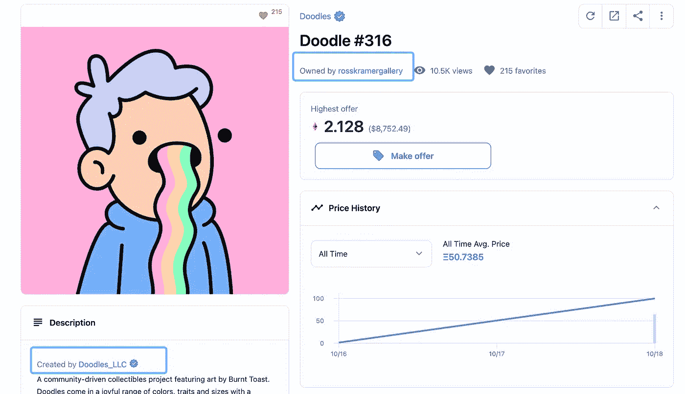
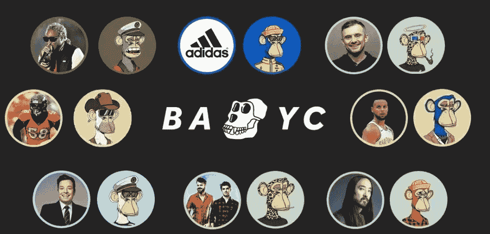

# 什么是 NFT？

> 原文：<https://medium.com/coinmonks/%E7%AC%AC%E4%B8%80%E6%9C%9F%E5%88%86%E4%BA%AB-%E4%BB%80%E4%B9%88%E6%98%AFnft-6e1041a27591?source=collection_archive---------14----------------------->

[https://mymodernmet.com/what-is-nft-crypto-art/](https://mymodernmet.com/what-is-nft-crypto-art/)

声明:我在这个行业还是比较精干的。我提出的概念和文章是基于我自己的理解，不应被视为任何形式的财务建议。

# 简介—什么是“不可替代”？

要了解 NFT，我们首先需要了解它的名字。NFT 的全称是“不可替代的令牌”这是什么意思？什么是可替代的或不可替代的？

为了回答什么是可替代的，让我们举个例子。人民币和美元之间有一个汇率。目前，汇率是 6.38，这意味着如果我有一美元，我就相当于有 6.38 元人民币，或者我可以根据这个比率交换我的美元。这种以相互可互换为特征，**可以与其他资产交换的项目或商品，**称为可替代性。

那么，什么是**不可替代的**？如果我有一个中国杯子和一个美国勺子，我能确定它们的交换比例或者说多少个这些杯子等价于多少个这些勺子吗？大概不会。此外，杯子和勺子的价格会随着市场需求和供应而波动。这个概念的特点是**一个不可替代或细分的唯一标识符**被称为不可替代。

# 第一部分:艺术——版权保护和所有权

当不可替代的概念与艺术混合时，它有助于艺术成为唯一的标识符。将艺术转化为非传统艺术对创作者和购买者都有好处。有人可能会问，数字艺术怎么会比实物艺术更有效率？我只需右键单击图像，保存它，并制作版权？

这正是数字艺术面临的问题，但区块链完美地解决了这个问题。借助区块链技术，每个 NFT 都有一个唯一的令牌 ID。当制作人创建 NFT 时，他们的 NFT 与他们的钱包地址相关联。创建者钱包地址通常是透明的，可以在二级 NFT 市场或 Ether-scan 等分析网站上查看。以这种方式，每个 NFT 可以从他们相关的创造者钱包地址中被验证，并且他们的模仿者将不能从创造者那里窃取人才。因此，NFT 的概念有助于创作者减少对盗版作品的担忧。

从 NFT 买家的角度来看，除了能够购买经过验证的艺术品，买家还可以直接与创作者互动，并获得一件艺术品的所有权。所有权的概念是一个非常非传统的想法，尤其是对艺术而言。

通过拥有所有权，

1.  买家现在拥有一件直接由他们喜欢的艺术家制作的作品，现在他们的钱包地址在链上显示为这幅 NFT 的当前所有者。这代表了艺术家和买家之间的直接联系。
2.  买家能够公开展示他们拥有的艺术品。因为它既可以在区块链(搜索地址)上公开查看，也可以从二级市场页面查看。

[https://opensea.io/assets/0x8a90cab2b38dba80c64b7734e58ee1db38b8992e/316](https://opensea.io/assets/0x8a90cab2b38dba80c64b7734e58ee1db38b8992e/316)

> 如果有人下载我的图片，放在他们的个人资料图片上，并声称他们拥有该图片，该怎么办？
> 
> 这根本不应该是一个问题。我相信这个人纯粹是为你的项目做广告，因为你是这件作品的真正主人，所有记录都可以在 chain 上跟踪。

# 第二部分:效用——获得专属会员资格的门票

大多数人将 NFT 定义为艺术，并认为它的价值主要来自图像的外观或图像背后的艺术家。然而，随着行业的发展和人们变得越来越有创造力，并不是所有的项目都以它们的美学价值为标准。看看下面的例子:

[https://opensea.io/collection/veefriends](https://opensea.io/collection/veefriends)

这是由[加里维](https://twitter.com/garyvee)制作的系列。艺术是可以的，但我们不能说它是惊人的。然而，这一系列受到人们的喜爱，价格下限保持在高点(8 ETH)。这个项目的独特之处在于这张照片背后的实用程序。通过拥有一些 NFT，你可以成为[veefriends](https://opensea.io/collection/veefriends)社区的一员，有机会与 Garyvee 通话，参加 Gary 主持的一些真实活动，等等。因此，我认为，非艺术电影不应该被定义为艺术，而应该被定义为独家会员资格的门票。这种成员资格的好处之一是可以进入社区，通常是通过一个不和谐的渠道。

***社群***
**社群**是 NFT 世界非常重要的一个方面。作为一名投资者，你总是希望身边围绕着行事冷静、有远见的长期思考者，而不是带着情绪解读市场的短期投机者。除了投资建议，在一个社区里，你还可以交流生活经验，开玩笑，谈论任何事情，并与他人成为亲密的朋友。Garyvee 本人也将随机进入不和谐频道，与 NFT 持有者聊天。所有这些关系都是由拥有同一个 NFT 和同一个社区的从属关系引发的。

***代币***
抛开文化方面，有些 NFTs 项目可以帮你产生被动收入，也就是说你可以通过持有一些 NFTs 来赚取代币。

*由于 Opensea 的政策，下面的所有令牌将被声明为没有财务价值，只能在项目的生态系统中使用。

一个例子是一个名为 [CyberKongz](https://opensea.io/collection/cyberkongz) 的项目，拥有一个 genesis Kongz 的持有者每天可以获得 10 美元的香蕉代币。$香蕉代币可以在它的生态系统中用于繁殖小金刚，并作为治理代币。

[https://www.cyberkongz.com/banana](https://www.cyberkongz.com/banana)

美元香蕉的价格目前为 38 美元，10 月份曾达到 118 美元的峰值。令牌可以在 Sushiswap 或 Uniswap 上交换为其他令牌。如果我们计算正确，通过持有一个每天生产 10 个香蕉的 genesis Kongz，这个人可以获得大约 13.8 万英镑/年的被动收入，而在 10 月，这个数字是 42.7 万英镑/年。很疯狂吧？

[https://www.coingecko.com/en/coins/banana](https://www.coingecko.com/en/coins/banana)

***Launchpad***
抛开代币方面，项目越来越有创意。我最喜欢的一个项目叫做[狗镑](https://opensea.io/collection/the-doge-pound)。该团队的卖点之一是允许持有者通过他们的 launchpad 提前访问项目。Launchpad 在白名单中为人们提供了一个位置，通过加入白名单，持有者可以在 NFTs 进入二级市场之前购买它。通常，当项目进入二级市场时，其价格通常会升值，有时会达到铸造价格的 3-5 倍。这时候你要么选择持有，要么选择卖出。如果你有特权以白名单的价格铸造三套，通常你可以卖一套来支付造币价格和汽油。在这种情况下，您相当于免费获得了另外两套，并且可以对它们做任何您想做的事情。

[https://discord.com/invite/6xEq5wxR6M](https://discord.com/invite/6xEq5wxR6M)

通过加入 launchpad 并尽早进入其他项目，它可以将进入糟糕项目的风险降至最低，同时将您可以获得的利润最大化。这种策略可以帮助你产生稳定的回报，并承诺被动收入。

# 第三部分:趋势——大量采用

如果你最近在推特上，你肯定知道一些令人尴尬的消息。大量名人和大品牌开始进入 NFT 空间。最明显的例子就是[无聊猿游艇俱乐部](https://opensea.io/collection/boredapeyachtclub)。

自 8 月份以来，斯蒂芬·库里、吉米·法伦、马克·库班、探听狗、烟鬼等等名人都购买了一只无聊的猩猩，并加入了这个俱乐部。最近阿迪达斯也加入了这个社区，并将他们的 Twitter 个人资料图片改成了一只无聊的猿。天伯伦推出为无聊猿 NFTs 业主和通用形式元宇宙乐队基于无聊猿游艇俱乐部 NFTs 的生产公司。

今天，在纽约时代广场，各种 NFT 项目也展示在许多广告牌上，每天有数百万人看到这些广告牌。

Left: Cool Cats NFT; Right: Galatic Gecko

# 结语:变革的新时代

随着元宇宙概念和 Web 3.0 的快速发展，相信在不久的将来，人们将逐渐开始并习惯于使用他们的虚拟 3D 身份进行在线社交。NFT 为 Web 3 的应用场景开辟了一个充满无限遐想的空间。

在经济方面，随着美国政府不断放水，美元贬值导致越来越多的人寻找另一种资产保值方式。NFT 热逐渐开始，人们开始逐渐将他们的菲亚特转换成“jpegs”。这种行为给 NFT 市场的发展带来了高速的推动，并引起了难以想象的关注。

2022 年将是充满遐想的一年。随着各大交易所推出 NFT 市场，美国最大的交易所比特币基地将在 12 月底推出他们的 NFT 市场，Robinhood 和 Reddit 也将在明年加入这场革命，推动 Web 3 应用的启动。

最后，让我们把决定权交给时间，耐心等待，拥抱这个新的变革时代。

感谢您的阅读！

> 嗨！我的名字是霍华德。自 2020 年以来，我已经在 Bybit exchange 实习了一年多，并在他的实习期间对 Web 3 空间产生了兴趣。本人目前是美国鲍登学院大三学生，主修数学和经济学。
> 
> 爱交流思想，互相学习！
> 
> 我的联系信息:
> 
> 领英:[https://www.linkedin.com/in/howard-l-a5359b140/](https://www.linkedin.com/in/howard-l-a5359b140/)
> 
> 推特:[https://twitter.com/Howard27836449](https://twitter.com/Howard27836449)
> 
> 微信:HawardLi0204

> 加入 Coinmonks [电报频道](https://t.me/coincodecap)和 [Youtube 频道](https://www.youtube.com/c/coinmonks/videos)了解加密交易和投资

# 另外，阅读

*   [Bookmap 评论](https://coincodecap.com/bookmap-review-2021-best-trading-software) | [美国 5 大最佳加密交易所](https://coincodecap.com/crypto-exchange-usa)
*   最佳加密[硬件钱包](/coinmonks/hardware-wallets-dfa1211730c6) | [Bitbns 评论](/coinmonks/bitbns-review-38256a07e161)
*   [新加坡十大最佳加密交易所](https://coincodecap.com/crypto-exchange-in-singapore) | [购买 AXS](https://coincodecap.com/buy-axs-token)
*   [红狗赌场评论](https://coincodecap.com/red-dog-casino-review) | [Swyftx 评论](https://coincodecap.com/swyftx-review) | [造币厂评论](https://coincodecap.com/coingate-review)
*   [投资印度的最佳密码](https://coincodecap.com/best-crypto-to-invest-in-india-in-2021)|[WazirX P2P](https://coincodecap.com/wazirx-p2p)|[Hi Dollar Review](https://coincodecap.com/hi-dollar-review)