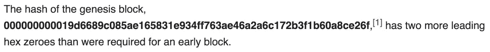
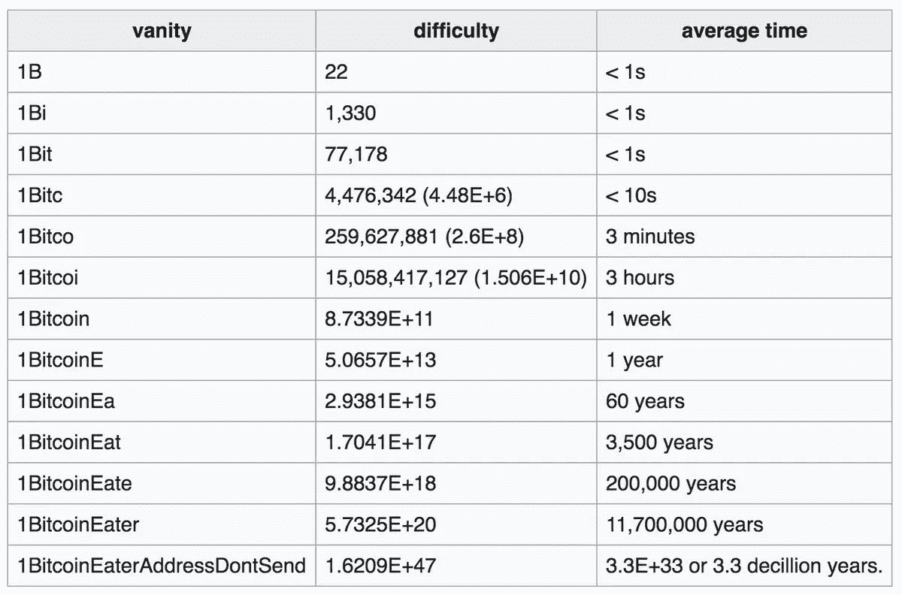

# # 00000000000000000021 e 800 C1 E8 df 51 b 22 c 1588 E5 a 624 bea 17 e 9 FAA 34 b 2 DC 4a

> 原文：<https://medium.com/coinmonks/00000000000000000021e800c1e8df51b22c1588e5a624bea17e9faa34b2dc4a-cd4b67d446be?source=collection_archive---------0----------------------->

几天前，我偶然发现了安德鲁·德桑蒂斯的推特，它让我掉进了另一个兔子洞，这个洞和我第一次发现#比特币时一样有趣。他的推特上的一切都很神秘，很难理解。从中，我发现了一些其他有趣的 twitter 账户，比如[马克·威尔库克斯](https://medium.com/u/e1abd71539b1?source=post_page-----cd4b67d446be--------------------------------)的账户。昨天他给[发了这条](https://twitter.com/mwilcox/status/1009160832398262273)包含区块哈希的推文:[# 0000000000000021 e 800 C1 E8 df 51 b 22 c 1588 e5a 624 bea 17 e 9 FAA 34 b 2 DC 4a](https://twitter.com/hashtag/00000000000000000021e800c1e8df51b22c1588e5a624bea17e9faa34b2dc4a?src=hash)。从那以后，我看到所有的#cryptotwitter 都很敬畏，没有人真正对事情做出解释。老实说，我和其他人一样困惑，这不会是一个明确的解释，但我想我会写下我的发现，也许有一个答案。

很多麻烦都与块哈希开头的前导零有关，就像仍未解决的创世纪块一样。然而，更多的焦点在于 21e800 的前 18 位数字。21e8 很重要，因为它标志着一个异常简单的万物理论。通常被称为 **E8 理论**，这是一份物理学预印本，提出了一个[统一场论](https://en.m.wikipedia.org/wiki/Unified_field_theory)的基础，该理论试图描述物理学中所有已知的[基本相互作用](https://en.m.wikipedia.org/wiki/Fundamental_interaction)，并作为一种可能的[万有理论](https://en.m.wikipedia.org/wiki/Theory_of_everything)。
“̵2̵1̵e̵8̵0̵0̵"̵̵s̵h̵o̵u̵l̵d̵̵h̵a̵p̵p̵e̵n̵̵r̵a̵n̵d̵o̵m̵l̵y̵̵e̵v̵e̵r̵y̵̵1̵6̵⁶̵̵≈̵̵1̵6̵.̵7̵̵m̵i̵l̵l̵i̵o̵n̵̵b̵l̵o̵c̵k̵s̵̵o̵r̵̵a̵b̵o̵u̵t̵̵e̵v̵e̵r̵y̵̵3̵0̵0̵̵y̵e̵a̵r̵s̵̵o̵n̵̵a̵v̵e̵r̵a̵g̵e̵.̵̵i̵n̵̵o̵r̵d̵e̵r̵̵t̵o̵̵b̵r̵u̵t̵e̵̵t̵h̵i̵s̵̵i̵n̵t̵o̵̵t̵h̵e̵̵h̵a̵s̵h̵,̵̵a̵l̵l̵̵2̵4̵̵d̵i̵g̵i̵t̵s̵̵w̵o̵u̵l̵d̵̵h̵a̵v̵e̵̵t̵o̵̵b̵e̵̵p̵r̵e̵d̵e̵t̵e̵r̵m̵i̵n̵e̵d̵.̵
这里有更多关于 Sergio_Demian_Lerner 的《神秘街区一号》的报道:

如果你进入这个名为“[一个隐藏在创世纪区块](https://bitcointalk.org/index.php?topic=172009.msg1789665#msg1789665)中的秘密”的论坛，他们会进一步解释:

 [## 藏在创世街区的神秘之处

### 藏在创世街区的神秘之处

藏在创世纪 Blockbitcointalk.org 的一个秘密](https://bitcointalk.org/index.php?topic=172009.0) 

"**创世纪块:**注意，它从 43 个 0 位开始。为什么？阻挡目标的难度要低得多(大约 32 位)，所以我们可以假设 Satoshi 是故意这样做的。
**创世纪矿工:**Satoshi 客户端源代码 0.1 版没有特殊的例程，也没有命令行开关来开采创世纪块。事实上，Genesis 块是硬编码的，这可能意味着它是由另一个源代码未知的应用程序生成的。然而，由于 BTC 在当时基本上是没有价值的，并且矿工之间没有竞争，我们可以假设他正在用他自己的(并且只有一台)个人电脑采矿。
**Satoshi PC:**2009 年，一个好的 PC CPU 每秒可以处理大约 2 次双哈希运算。
(考虑到 NUMBER_OF_PROCESSORS=2，所以两个线程一起挖掘)。Satoshi client 0.1 没有通过备份和恢复第二个哈希应用程序的中间状态来优化这些双哈希，因此我们可以假设创建 genesis 块的例程没有这样的优化。
让我们估计一下 Satoshi PC 求解具有 43 个零的 genesis 块需要多少时间:
初始 22 位(随机数测试/秒)
添加大约 16 位一整天(86400 ~= 2 ⁶)
添加大约 2.5 位使其成为 6 天
总位数:41.5
因此在 6 天后有大约 17%的变化，他可能已经找到了 genesis 块。他幸运吗？那么他是故意让矿工工作 6 天的吗？
**Satoshi 休息的那一天:**让我们检查一下 genesis block 日期/时间和 block 1 日期/时间
Block 0:2009–01–03 18:15:05
Block 1:2009–01–09 02:54:25(6 天后！)
难道聪的意图是把矿工“工作”创造创世纪区块的六天与《旧约创世纪》中上帝创造世界的时间联系起来？我不这么认为，但这种关系很有趣！
**nonce 不匹配:**现在我们将通过分析 nonce 的大小来检查所有这些推测。
块头中的随机数大小只有 32 位。太短，无法尝试 2⁴的可能性。然后，为了在块报头散列中实现 43 位 0 位，miner 应用必须溢出随机数大约 2 次，每次 32 位随机数溢出时递增 bnExtraNonce。
现在我们来看看 coinbase 中的 script SIG:
04 ff ff 00 1d(1d 00 ffff，难度或 nBits 的紧凑表示)
01 04(Extra nonce)
45 5468652054696d 6573203……
因此额外 nonce 只有 4，这意味着该块仅在 4 次溢出后才被发现，这意味着 genesis miner 仅工作了 4.2 分钟(估计的平均时间)。我一点也不知道为什么这两个值(2 和 4)相差 500 倍。关于 Satoshi 在开采 genesis 区块时确实有 500 台计算机的解释是不令人满意的，因为区块 1 中初始 0 位的数量只有 32。为什么获得这样的计算能力，然后再也不使用它？
一种可能的解释是，当 nonce 溢出时，Genesis Miner 没有增加额外的 nonce，而是更改了 coinbase 事务的目的地址。这又可能意味着目的地地址 1a 1 ZP 1 EP 5 qgefi 2 dmptftl 5 SLM V7 div FNA 不是有效地址，而是随机数。

你能解开这个谜吗？

最诚挚的问候，塞尔吉奥。"

我不完全确定上面的谜团是否已经解开，但是第一个街区和第 528249 街区之间的相似之处可能是有意义的。这个事件不太可能是偶然的，无论是谁创造了这个区块(如果是故意的)，都需要比当前 hashrate 更强大的计算能力。从下面的 tweet 来看，使用 1 exhash/sec，需要 2512 来预先确定这里的前 24 个字符。

为了所有的意图和目的，让我们假设时间旅行不存在。从我跟踪德桑蒂斯的两天中收集的信息来看，他一直在研究一台基于比特币的量子计算机，名为 [DeOS](https://www.deos.org/) 。当然，他的网站和他发布的所有内容一样神秘。所以这个块散列潜在地证实了一个想法，即无论他在做什么，都已经成功地完成了。或者是 Satoshi 给了我们一个信息？一些人假设比特币还有尚未被发现的用途，其意义太大，以至于在今天还无法实现。我一晚上都没睡好，但这件事让我明白，不管一个人对比特币了解多少，总有更多东西需要学习。

附注:这可能完全是随机的，毫无意义的。就像生活中的其他事情一样。；)

其他随机点:

*   o̵t̵h̵e̵r̵̵p̵e̵o̵p̵l̵e̵̵a̵r̵e̵̵p̵o̵i̵n̵t̵i̵n̵g̵̵o̵u̵t̵̵t̵h̵a̵t̵̵t̵h̵e̵̵2̵1̵e̵8̵̵i̵s̵̵s̵i̵g̵n̵i̵f̵i̵c̵a̵n̵t̵̵b̵e̵c̵a̵u̵s̵e̵̵o̵f̵̵t̵h̵e̵̵t̵o̵t̵a̵l̵̵s̵u̵p̵p̵l̵y̵.̵̵2̵1̵*̵1̵0̵⁸̵̵i̵s̵̵2̵.̵1̵̵b̵i̵l̵l̵i̵o̵n̵,̵̵s̵o̵̵i̵'̵m̵̵n̵o̵t̵̵s̵u̵r̵e̵̵t̵h̵a̵t̵'̵s̵̵d̵e̵l̵i̵b̵e̵r̵a̵t̵e̵,̵̵b̵u̵t̵̵i̵s̵̵i̵n̵t̵e̵r̵e̵s̵t̵i̵n̵g̵̵r̵e̵g̵a̵r̵d̵l̵e̵s̵s̵.̵
    21e 8 很重要，因为它标志着一个异常简单的万物理论。通常被称为“ **E8 理论**，这是一份物理学预印本，为[统一场论](https://en.m.wikipedia.org/wiki/Unified_field_theory)提供了基础，该理论试图描述物理学中所有已知的[基本相互作用](https://en.m.wikipedia.org/wiki/Fundamental_interaction)，并作为一种可能的[万有理论](https://en.m.wikipedia.org/wiki/Theory_of_everything)。
    结账:[http://21e8.com/](http://21e8.com/)
*   “事情变得更奇怪了。”经由[胡安 S 高尔特](https://twitter.com/JuanSGalt/status/1009637797471272960)。

“中本聪”的词源实际上是:“在源头被唤醒。”通过 [imgur](https://imgur.com/bdRRH2S)

*   有人问这个区块被生产的可能性有多大，这是安德鲁的回答，非常不可能:

我会继续更新这篇文章，提供更多我发现的信息。这比看起来要复杂得多。

增加了一个 part 2:[https://medium.com/@coop__soup/so-what-is-deos-6be84fd32648](/@coop__soup/so-what-is-deos-6be84fd32648)

在#twitter 上关注我，了解最新消息:[https://twitter.com/coop__soup](https://twitter.com/coop__soup)