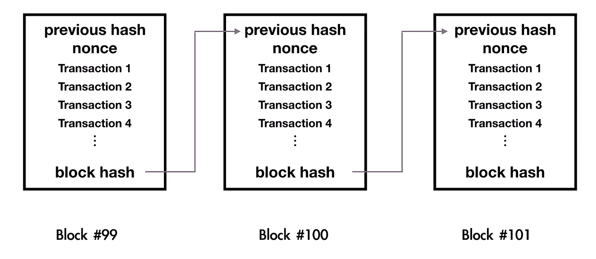

# 区块链共识的终结|程序员解释

> 原文：<https://medium.com/coinmonks/008-finality-in-blockchain-consensus-programmer-explain-81cb6b1cc16e?source=collection_archive---------6----------------------->

## 任何比特币交易都是概率性的？这意味着你看到的成功交易可能会消失。

今天，我用信用卡买了一杯咖啡，卖主很乐意给我咖啡来交换我付的钱。

卖主确信交易已经完成，以后不会再恢复。也就是说，购买是 ***敲定的。***

在比特币设定中， ***终局*** 是对你的交易在比特币网络中被写在账本上的肯定。但是，该交易可能会被 51%的攻击恢复。因此，我们可以说比特币提供了概率终结。

```
**51% attacks**A malicious actor is able to accumulate 51% of mining power, they can conduct a **51% attacks**
```

# 两种类型的终结

***概率终结*** 指的是基于链的协议(如比特币的中本聪共识)提供的终结类型，其中一个交易不会因该交易后追加更多块而被还原的概率。

这就是为什么建议将 6 个以上的块附加到包含事务的块上。



How blocks are formed / [visual demo](https://www.youtube.com/watch?v=_160oMzblY8)

***绝对终结*** 是指由基于 PBFT 的协议(例如 [DEXON](https://dexon.org/) )提供的终结类型，在这种协议中，事务一旦被包括在块中并被添加到区块链中，就立即被视为终结。

在这种情况下，领导者会提出一个区块，而验证者委员会中足够多的成员必须批准该区块才能提交。

为了在现实世界中采用，一个绝对的终结是非常重要的，因为没有人愿意冒他们的钱可能因为协议的设计而不属于他们的风险。

德克森也给了**一个*绝对终结*** *。如果你想知道更多。*免费加入 DEXON 社交群，问你具体问题。

```
「[Telegram](https://goo.gl/Q577pM)/[Gitter](https://goo.gl/zTrF7J)/[Github](https://goo.gl/rLgCJ6)/[Reddit](https://goo.gl/LgFspc)」
```

**关于我**
我是一名全栈 javascript / DApps 开发者，也是开源区块链项目 [DEXON](https://github.com/dexon-foundation/) 和 [NEO](https://github.com/neo-project) 的贡献者之一。


> [在您的收件箱中直接获得最佳软件交易](https://coincodecap.com/?utm_source=coinmonks)

[](https://coincodecap.com/?utm_source=coinmonks)