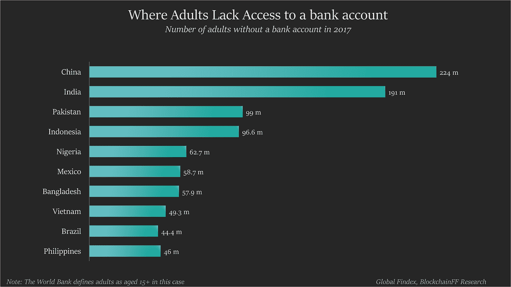
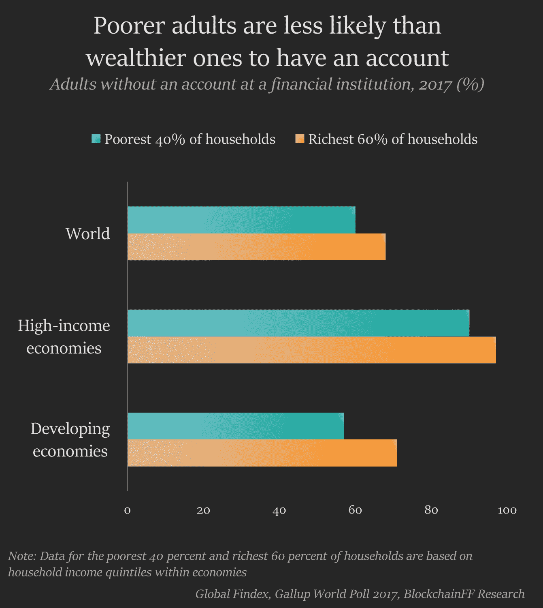
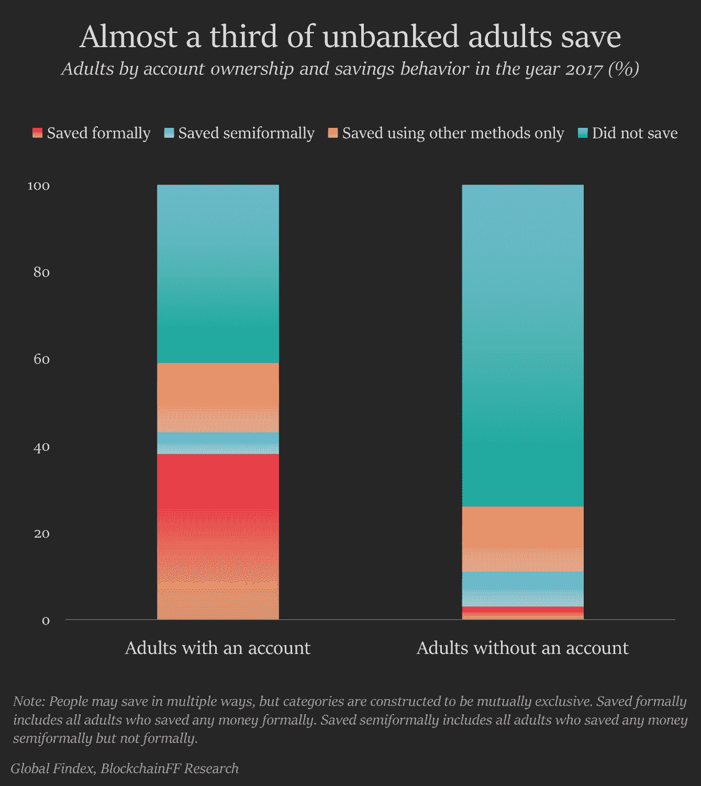
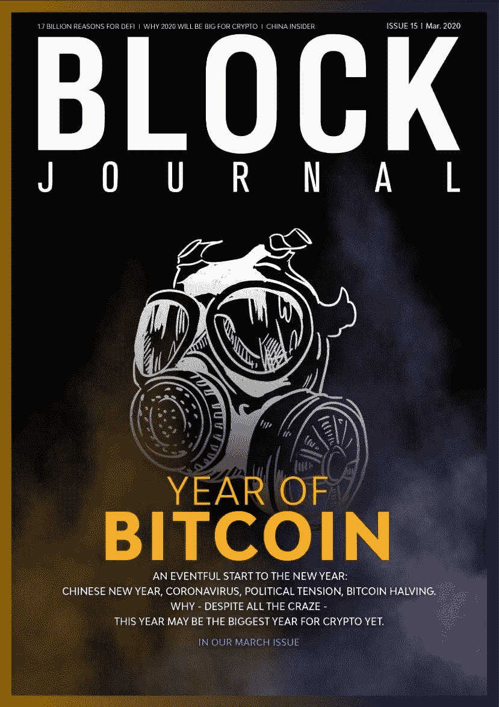
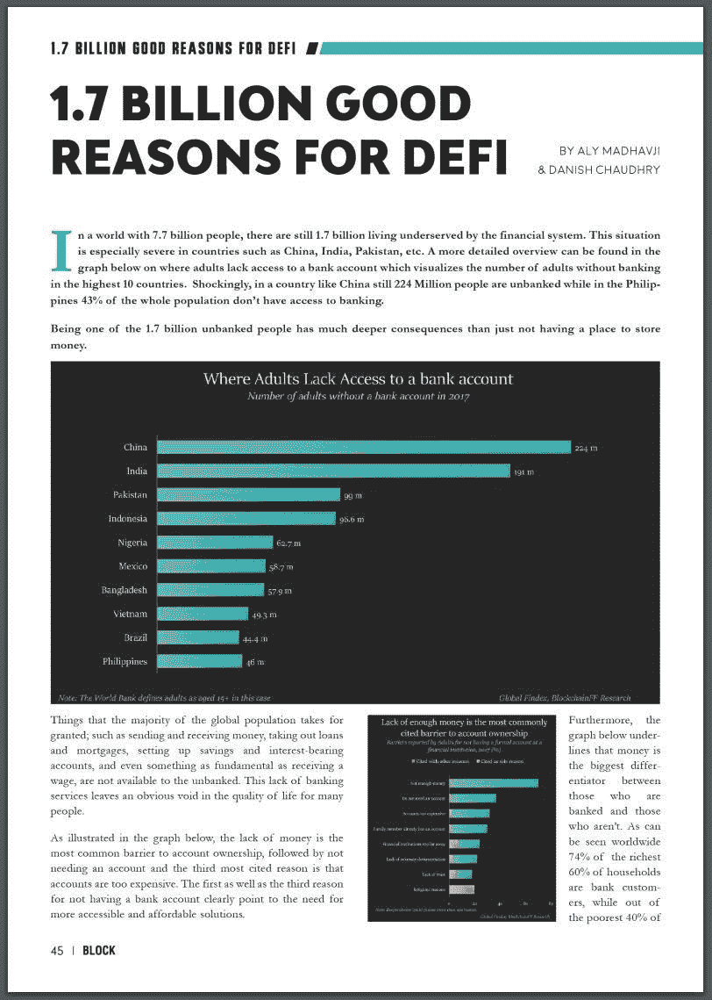
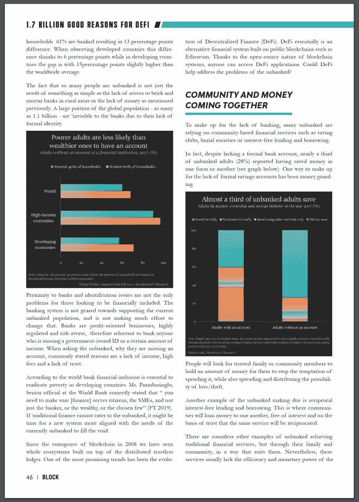
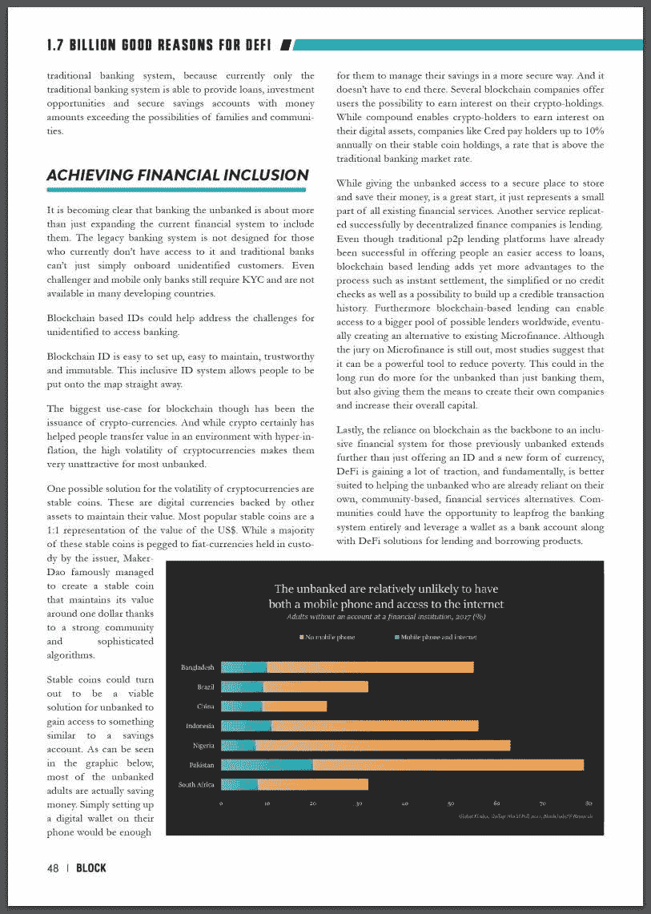
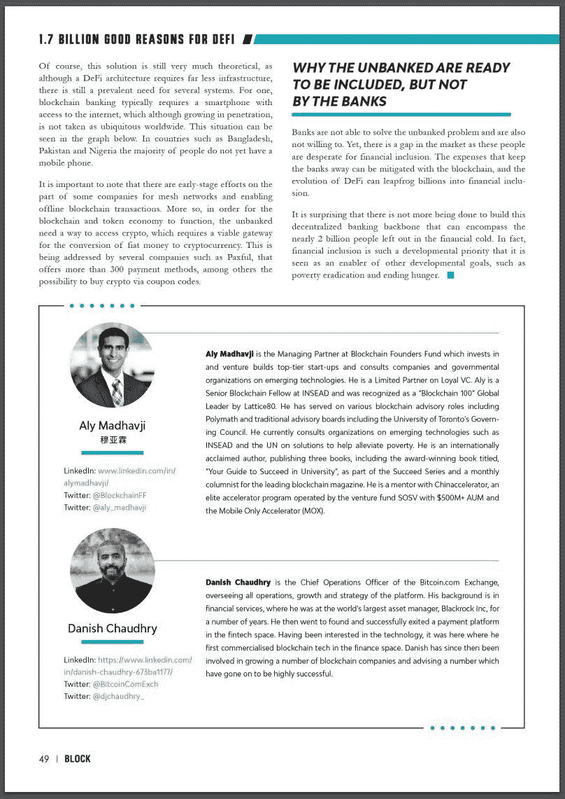

# 17 亿个 DeFi 的好理由

> 原文：<https://medium.com/coinmonks/1-7-billion-good-reasons-for-defi-945f66fb1b71?source=collection_archive---------1----------------------->

在一个拥有 77 亿人口的世界里，仍有 17 亿人得不到金融系统的服务。这种情况在中国、印度、巴基斯坦等国家尤为严重。更详细的概述可以在下图中找到，其中显示了成年人无法获得银行账户的情况，该图显示了前 10 个国家中没有银行账户的成年人的数量。令人震惊的是，在中国这样的国家，仍有 2.24 亿人没有银行账户，而在菲律宾，43%的人口没有银行账户。

成为 17 亿没有银行账户的人之一，比没有地方存钱有更深远的影响。

全球大多数人认为理所当然的事情；例如汇款和收款、办理贷款和抵押贷款、设立储蓄和计息账户，甚至连领取工资这样的基本服务，都是没有银行账户的人无法享受的。缺乏银行服务给许多人的生活质量留下了明显的空白。

如下图所示，缺钱是拥有账户最常见的障碍，其次是不需要账户，第三大原因是账户太贵。没有银行账户的第一个和第三个原因清楚地表明需要更容易获得和负担得起的解决方案。

此外，下图强调了钱是有银行存款的人和没有银行存款的人之间的最大区别。从全球范围来看，最富有的 60%的家庭中有 74%是银行客户，而最贫穷的 40%的家庭中有 61%是银行客户，两者相差 13 个百分点。在观察发达国家时，这一差距缩小到 6 个百分点，而在发展中国家，这一差距为 15 个百分点，略高于世界平均水平。

如此多的人没有银行账户，这不仅仅是因为农村地区缺少实体银行或前面提到的缺钱。全球人口中的很大一部分——多达 11 亿人——由于缺乏正式身份，对银行来说是“隐形的”。

对于那些希望获得金融服务的人来说，靠近银行和身份问题并不是唯一的问题。银行系统并没有为当前没有银行账户的人群提供支持，也没有努力去改变这种状况。银行是以利润为导向的企业，受到高度监管，厌恶风险，因此不愿意为任何缺少政府颁发的身份证或一定收入的人提供银行服务。当询问没有银行账户的人，为什么他们没有账户时，通常陈述的原因是缺乏收入、高费用和缺乏信任。

据世界银行称，金融包容性对于发展中国家消除贫困至关重要。世界银行高级官员 Pazarbasioglu 女士正确地指出，“你需要确保[金融]服务于公民、中小企业，而不仅仅是银行家、富人或少数人”( [FT 2019](https://www.ft.com/content/0fb60294-4b36-11e9-bde6-79eaea5acb64) )。

如果传统金融无法满足无银行账户者的需求，或许是时候让一种更符合当前无银行账户者需求的新体系来填补这一空白了。

自从 2008 年[区块链](https://blog.coincodecap.com/tag/blockchain/)的出现，我们已经看到整个生态系统建立在分布式不可信账本之上。最有希望的趋势之一是分散融资的发展。 [DeFi](https://blog.coincodecap.com/tag/defi/) 本质上是建立在[以太坊](https://blog.coincodecap.com/tag/ethereum/)等公共区块链上的另类金融系统。由于区块链系统的开源特性，任何人都可以访问 DeFi 应用程序。DeFi 能帮助解决没有银行账户的人的问题吗？

> [也可阅读:DeFi 初学者指南](https://blog.coincodecap.com/a-beginner-guide-to-defi-decentralized-finance/)

## **社区和金钱走到一起**

为了弥补银行业务的不足，许多没有银行账户的人依赖于基于社区的金融服务，如储蓄俱乐部、殡葬协会或无息借贷。

事实上，尽管没有正式的银行账户，但近三分之一没有银行账户的成年人(28%)报告说以这样或那样的方式存过钱(见下图)。弥补正规储蓄账户不足的一个方法是资金保护。

人们会寻找可信任的家庭或社区成员为他们持有一定数量的钱，以阻止消费的诱惑，同时也传播和分布了丢失/被盗的可能性。

无银行账户到期的另一个例子是互惠的无息借贷。在这种情况下，各社区将在相信同样的服务将得到回报的基础上，无息地相互借钱。

无银行账户者获得传统金融服务的例子数不胜数，但都是通过他们的家庭和社区，以适合他们的方式实现的。然而，这些服务通常缺乏传统银行系统的效率和资金实力，因为目前只有传统银行系统能够提供贷款、投资机会和安全的储蓄账户，其金额超过家庭和社区的可能性。

**实现金融普惠**

越来越明显的是，为没有银行账户的人提供银行服务不仅仅是扩大当前的金融体系，将他们纳入其中。传统银行系统并不是为那些目前无法使用它的人设计的，传统银行也不能简单地搭载身份不明的客户。即使是 challenger 和纯移动银行也仍然需要 KYC，并且在许多发展中国家不可用。

基于区块链的 IDs 可以帮助解决身份不明者访问银行的挑战。区块链 ID 易设置，易维护，可信任，不可修改。这种包容性的身份识别系统允许人们直接进入地图。

然而,[区块链](https://blog.coincodecap.com/tag/blockchain/)最大的用例是发行加密货币。虽然 [crypto](https://blog.coincodecap.com/tag/crypto/) 确实帮助人们在恶性通货膨胀的环境中转移了价值，但加密货币的高波动性使得它们对大多数没有银行账户的人来说非常没有吸引力。

加密货币波动性的一个可能解决方案是稳定的硬币。这些是由其他资产支持的数字货币，以保持其价值。最受欢迎的稳定硬币是美元价值的 1:1 表示。虽然这些稳定的硬币大多与发行者保管的法定货币挂钩，但由于强大的社区和复杂的算法，MakerDao 成功创造了一种稳定的硬币，其价值保持在 1 美元左右。

对于没有银行账户的人来说，稳定的硬币可能是一种可行的解决方案，可以获得类似于储蓄账户的东西。从下图可以看出，大多数没有银行账户的成年人实际上都在存钱。只要在手机上设置一个数字钱包，就足以让他们以更安全的方式管理自己的储蓄。事情不一定要就此结束。几家区块链公司为用户提供从他们持有的 T2 密码中赚取利息的可能性。虽然 compound 使加密持有者能够从他们的数字资产中赚取利息，但 Cred 等公司每年为他们稳定的硬币持有量支付高达 10%的利息，这一利率高于传统的银行市场利率。

虽然让没有银行账户的人有一个安全的地方来存储和储蓄他们的钱是一个很好的开始，但它只是所有现有金融服务的一小部分。分散金融公司成功复制的另一项服务是贷款。

尽管传统的 p2p 贷款平台已经成功地为人们提供了更容易获得贷款的机会，但区块链的贷款为这一过程增加了更多优势，如即时结算、简化或没有信用检查，以及建立可信交易历史的可能性。此外，以区块链为基地的贷款可以接触到世界各地更多的潜在贷款人，最终创造出一种替代现有小额信贷的方式。尽管小额信贷仍无定论，但大多数研究表明，它可以成为一种强有力的减贫工具。从长远来看，这不仅能为无银行账户者提供银行服务，还能让他们有机会创建自己的公司，增加总资本。

最后，依靠区块链作为以前没有银行账户的人的包容性金融系统的支柱，不仅仅是提供一个 ID 和一种新的货币形式，DeFi 正在获得很大的吸引力，从根本上说，它更适合于帮助那些已经依赖自己的基于社区的金融服务替代方案的没有银行账户的人。社区可以有机会完全跳过银行系统，利用钱包作为银行账户，并为借贷产品提供 DeFi 解决方案。

当然，这个解决方案在很大程度上仍然是理论性的，因为尽管一个 [DeFi](https://blog.coincodecap.com/tag/defi/) 架构需要的基础设施少得多，但是仍然普遍需要几个系统。首先，区块链银行业通常需要一部可以上网的智能手机，尽管智能手机的普及率在不断提高，但在全球范围内还没有普及。这种情况可以从下图中看出。在孟加拉国、巴基斯坦和尼日利亚等国家，大多数人还没有手机。

值得注意的是，一些公司正在为网状网络和支持离线区块链交易进行早期努力。更重要的是，为了让区块链和代币经济发挥作用，没有银行账户的人需要一种方法来访问[加密](https://blog.coincodecap.com/tag/crypto/)，这需要一个可行的网关来将法定货币转换为[加密货币](https://blog.coincodecap.com/tag/cryptocurrency/)。一些公司正在解决这个问题，比如 Paxful，它提供 300 多种支付方式，其中包括通过优惠券代码购买 [crypto](https://blog.coincodecap.com/tag/crypto/) 的可能性。

**为什么没有银行账户的人可以被包括在内，但银行却不行**

银行无法解决没有银行账户的问题，也不愿意这样做。然而，这个市场存在缺口，因为这些人迫切需要金融包容性。让银行远离的费用可以通过区块链来减轻，DeFi 的发展可以跨越数十亿美元进入金融包容性。

令人惊讶的是，没有采取更多措施来建立这种分散化的银行骨干，以涵盖近 20 亿被金融冷落的人。事实上，金融普惠是一个如此重要的发展优先事项，以至于它被视为其他发展目标，如消除贫穷和结束饥饿的一个使能因素。

**参考文献:**

*这是由 Aly Madhavji 和 Danish Chaudhry 在 Block Journal 第 15 期 2020 年 3 月发表的文章的转贴:*[https://Block Journal . io](https://blockjournal.io/)

> [直接在您的收件箱中获得最佳软件交易](https://coincodecap.com/?utm_source=coinmonks)

