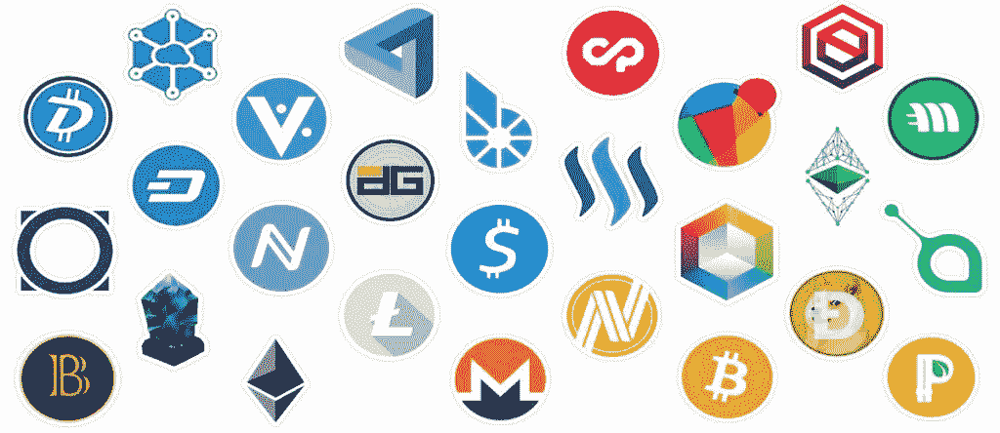

# 从长远来看，10 个替代硬币可能是值得的

> 原文：<https://medium.com/coinmonks/10-altcoins-that-could-be-worth-it-in-the-long-run-73a44d6e15e4?source=collection_archive---------1----------------------->

你可能听说过比特币(BTC)。许多可能与比特币和加密货币有关。但是什么是 altcoins，其中哪些是值得购买的呢？

根据 CoinGecko 的说法，已经有大约 9000 家这样的公司，它们的总市值超过 1 万亿美元。但是有了这么多记号，谁能看穿它们中的哪一个是…