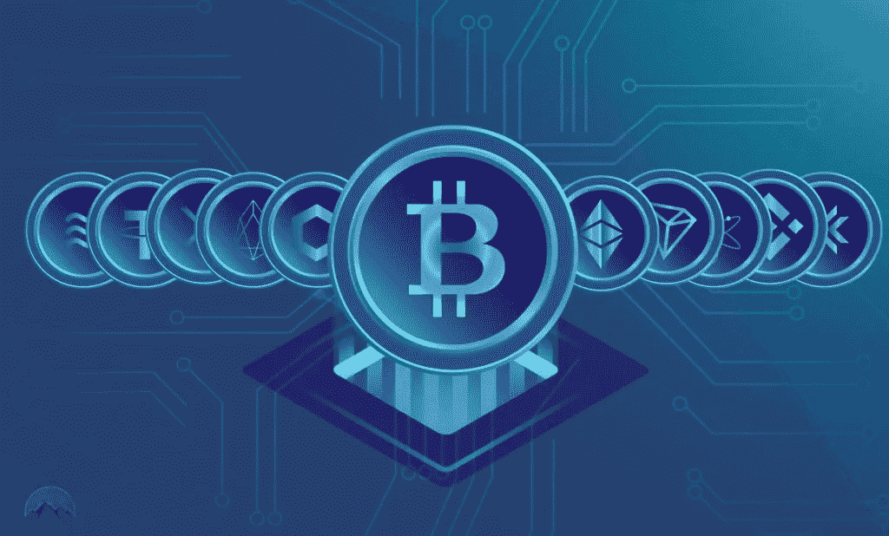

# 比特币之外的 10 种重要加密货币

> 原文：<https://medium.com/coinmonks/10-important-cryptocurrencies-other-than-bitcoin-e23ffbd4972d?source=collection_archive---------11----------------------->



比特币不仅引领了潮流，预示着一波建立在去中心化点对点网络上的加密货币浪潮，还成为了加密货币事实上的标准，催生了越来越多的追随者和衍生产品。

# 什么是加密货币？

在我们更深入地了解比特币的一些替代品之前，让我们后退一步，简单地考察一下加密货币和替代货币等术语的含义。广义的加密货币是虚拟或数字货币，采用代币或“硬币”的形式。尽管一些加密货币已经通过信用卡或其他项目进入了物理世界，但大多数加密货币完全是无形的。

加密货币中的“Crypto”是指复杂的加密技术，允许在分散系统中创建和处理数字货币及其交易。与此同时，这些货币的重要“加密”特征是对权力下放的普遍承诺；加密货币通常由团队开发为代码，内置发行机制(通常，但不总是，通过称为挖掘的过程)和其他控制。

加密货币几乎总是被设计成不受政府操纵和控制——然而，随着它们变得越来越受欢迎，该行业的这一基本方面受到了抨击。模仿比特币的加密货币统称为替代币，在某些情况下称为 shitcoins，并经常试图将自己展示为比特币的修改或改进版本。虽然这些货币中的一些可能有一些比特币没有的令人印象深刻的功能，但比特币网络的安全级别还没有得到普遍认可。

下面，我们将考察除比特币之外的一些最重要的数字货币。不过，首先要提醒的是:这样的清单不可能做到完全全面。其中一个原因是，截至 2021 年 11 月，已有超过 10，000 种加密货币存在，尽管其中许多加密货币没有追随者或交易量，但一些加密货币在专门的支持者和投资者社区中非常受欢迎。

此外，加密空间一直在扩大，下一个伟大的数字令牌可能会在明天推出。虽然比特币被广泛认为是加密货币世界的领导者，但分析师们已经采取了几种方法来评估 BTC 以外的代币。例如，对于分析师来说，在市场资本总额方面，过于重视硬币之间的相对排名是很常见的。我们已经在我们的视图中包含了这一点，但是还有其他原因要将数字令牌包含在列表中。

# 关键要点:

*   广义而言，加密货币是一种数字令牌或“硬币”，存在于一个被称为区块链的分布式和分散式分类账上。
*   此外，自十年前比特币推出以来，加密空间已经急剧扩大，下一个伟大的数字代币可能会在明天推出。
*   在市值、用户基础和受欢迎程度方面，比特币继续领先于加密货币。
*   以太坊等其他虚拟货币正被用于构建去中心化金融(DeFi)系统。
*   与比特币相比，一些替代币被认可为新功能，如每秒处理更多交易的能力，或使用不同的共识算法，如股权证明。

# 加密货币的类型

加密货币用于支付，通过分散的用户网络传输价值(类似于数字货币)。许多替代币(即不是比特币，有时也不是以太币)被归类为替代币，有时可以被称为价值代币。

也有基于区块链的代币服务于除了钱以外的目的。例如，作为首次发行硬币(ICO)的一部分发行的代币，代表区块链或分散融资(DeFi)项目的股份。如果代币与公司或项目的价值挂钩，它们可能被称为安全代币(如股票等证券，而不是证券)。

其他令牌有特殊的用例或功能。例如，Storj token 允许人们通过分散式网络共享文件，Namecoin 为互联网地址提供分散式域名系统(DNS)服务。这些被称为实用令牌。

今天，虽然许多加密用户理解并欣赏这些差异，但交易者和投资者可能不会注意到这种差异，因为所有类别的令牌在加密交易所的交易方式都是相同的。

# 1.以太坊

我们名单上的第一个比特币替代品以太坊是一个去中心化的软件平台，它使智能合约和去中心化应用程序(DApps)能够在没有任何停机时间、欺诈、控制或任何第三方干预的情况下构建和运行。以太坊背后的目标是创建一套分散的金融产品，世界上任何人都可以自由访问，无论国籍、种族或信仰如何。这一方面使得这种影响对一些国家的人来说更有吸引力，因为那些没有国家基础设施和国家身份的人可以获得银行账户、贷款、保险或任何其他金融产品。

以太坊上的应用程序运行在 Ether 上，这是一个特定于平台的加密令牌。以太网(ETH)是一种在以太坊平台上移动的工具，主要是寻求在以太坊内开发和运行应用程序的开发人员，或者现在，使用以太网购买其他数字货币的投资者。去吧。以太于 2015 年推出，目前是市值仅次于比特币的第二大数字货币，尽管它远远落后于主要的加密货币。截至 2021 年 11 月，以太网的交易价格约为每以太网 4000 美元，其市值不到比特币的一半。4

2014 年，以太坊推出以太预售，反响热烈；这帮助开创了 ICOs 时代。根据以太坊的说法，它可以用来“编纂、分散、保护和交易任何东西。”2016 年对去中心化自治组织(DAO)的攻击后，以太坊分裂为以太坊(ETH)和以太坊经典(ETC)。

2021 年，以太坊将其共识算法从工作证明(PoW)改为利害关系证明(PoS)。此举旨在让以太坊的网络以更低的能耗和更高的交易速度运行。更加通货紧缩的经济环境。PoS 允许网络参与者将他们的以太网“押入”网络。这个过程有助于保护网络和处理发生的交易。这样做的人会得到类似于一个有趣的账户的奖励。这是比特币权力机制的一种替代方案，在比特币权力机制下，矿工处理交易会获得更多 BTC。

# 2.莱特币

莱特币(LTC)于 2011 年推出，是首批追随比特币脚步的加密货币之一，通常被称为“比特币之银”。它是由麻省理工学院毕业生、前谷歌工程师查理·李创建的。

Litecoin 基于不受任何中央机构控制的开源全球支付网络，并使用脚本作为 PoW，可以在消费级中央处理器(CPU)的帮助下解码。虽然莱特币在许多方面与比特币相似，但它具有更快的块生成速率，因此提供更快的交易确认时间。

除了开发者，接受莱特币的商家也在增加。截至 2021 年 11 月，莱特币的市值为 140 亿美元，每枚代币价值约为 200 美元，是全球第 17 大加密货币。

# 3.卡尔达诺

Cardano (ADA)是一种“Ouroboros Proof-of-stage”加密货币，由工程师、数学家和密码学专家采用基于研究的方法创建。该项目由五位早期创始人之一的查尔斯·霍金森(Charles Hoskinson)共同创立。以太坊会员。在与以太坊的发展方向有些分歧后，他离开了，后来帮助建造了卡尔达诺。

Cardano 背后的团队通过广泛的实验和同行评审研究创造了自己的区块链。该项目的研究人员撰写了 90 多篇关于区块链技术的论文，涉及各种主题。10 这项研究是 Cardano 的支柱。

由于这一严格的流程，Cardano 似乎不同于其 PoS 同行以及其他大型加密货币。卡尔达诺也被称为“以太坊杀手”，因为它的区块链据说更有能力。11 也就是说，Cardano 仍处于早期阶段。虽然它已经从 PoS 共识模型超越了以太坊，但在 DeFi 应用方面还有很长的路要走。

Cardano 的目标是通过建立类似以太坊的 DeFi 产品，以及为链上互操作性、选民欺诈和法律合同追踪等提供解决方案，成为世界金融操作系统。截至 2021 年 11 月，Cardano 的市值为 570 亿美元，排名第六，一份 ADA 的交易价格约为 1.79 美元。

# 4.波尔卡多(点)

Polkadot (DOT)是一种独特的 POS 加密货币，旨在提供其他区块链之间的互操作性。其协议旨在连接许可和非许可区块链，以及一个 oracle，以允许系统在一个屋檐下一起工作。Polkadot 的主要组件是它的中继链，它允许不同网络的互操作性。对于特定的用例，它还允许使用具有自己的本机令牌的副链或平行区块链。

Polkadot 与以太坊的不同之处在于，开发人员不仅仅是在 Polkadot 上构建应用程序，他们还可以利用 Polkadot 链中已经存在的安全性来创建自己的区块链。有了以太坊，开发者可以创建新的区块链，但他们需要创建自己的安全措施，这可能会使新的较小的项目容易受到攻击，区块链越大，安全性越高。在 Polkadot 中，这个概念被称为共享安全性。

波尔卡多特是由加文·伍德(Gavin Wood)创建的，他是以太坊项目主要创始人的另一名成员，对该项目的未来有不同意见。截至 2021 年 11 月，Polkadot 的市值约为 410 亿美元，dot 的交易价格为 39 美元。

# 5.比特币现金(BCH)

比特币现金(BCH)在替代比特币的历史上占有重要地位，因为它是原始比特币最早也是最成功的硬分叉之一。在加密货币的世界里，一个分叉是由于开发者和矿工之间的争论和争论而产生的。由于数字货币的分散性质，由于共识，必须对代币或硬币的基础代码进行批量改变；这个过程的机制根据特定的加密货币而变化。

当各种派别不能达成一致时，数字货币有时会分裂，原始系列仍然忠于其原始代码，而新系列开始作为旧硬币的新版本，只是代码有所变化。

由于其中一次分裂，BCH 于 2017 年 8 月开始了它的生活。导致创建 BCH 的争论与可伸缩性问题有关；比特币网络中的块大小是有限制的:一兆字节(MB)。BCH 将块大小从 1mb 增加到 8mb，其理念是更大的块可以容纳更多的事务，因此事务速度会提高。它还做了其他更改，包括删除影响块空间的单独见证协议。

截至 2021 年 11 月，BCH 的市值约为 105 亿美元，每股面值为 555 美元。

# 6.恒星(XLM)

Stellar 是一个开放的区块链网络，旨在通过连接旨在进行大额交易的金融机构来提供企业解决方案。银行和投资公司之间的大规模交易——通常需要几天时间，涉及多个中间人，并花费大量资金——现在几乎可以在没有任何中间人和交易者的情况下立即完成。它花费很少或没有。

虽然 Stellar 将自己定位为机构交易的企业区块链，但它仍然是一个开放的区块链，任何人都可以使用。该系统允许任何货币之间的跨境交易。恒星的原生货币是流明(XLM)。网络要求用户持有流明才能在网络上进行交易。

Stellar 由 Jed McCaleb 创建，他是 Ripple Labs 的创始成员和 Ripple 协议的开发者。他最终离开了在 Ripple 的职位，与人共同创立了恒星发展基金会。Stellar Lumen 的市值为 80 亿美元，截至 2021 年 11 月的估值为 0.33 美元。

# 7.Dogecoin (DOGE)

Dogecoin (DOGE)被一些人称为最初的“Memecoin”，随着硬币价格在 2021 年飙升，它引起了轩然大波。这枚硬币以一只柴犬的形象作为其头像，被一些大公司接受作为支付方式，包括达拉斯小牛队(Dallas Mavericks)、克罗诺斯(Cronos)，或许最著名的是埃隆马斯克(Elon Musk)旗下的 SpaceX。美国航空航天制造商包括在内。

Dogecoin 是由两位软件工程师比利·马库斯和杰克逊·帕尔默在 2013 年创建的。据称，马库斯和帕尔默创造了这枚硬币，作为一个笑话，评论加密货币市场的疯狂投机。

当马斯克即将出现在《周六夜现场》中时，DOGE 的价格在本周创下了 0.71 美元的历史新高。截至 2021 年 11 月，Dogecoin 的市值为 292 亿美元，DOGE 价值约为 0.22 美元，是第十大加密货币。

```
**SHIB:** Memecoin, a memecoin inspired by the Shiba Inu (SHIB), rose to prominence in the fall of 2021, briefly surpassing Dogecoin's market capitalization.
```

# 8.币安硬币(BNB)

币安硬币(BNB)是一种公用加密货币，作为币安交易所交易相关费用的支付方式。按市值计算，它是第三大加密货币。那些使用代币作为交换支付手段的人可以打折交易。

币安钱币公司的区块链也是币安分散式交易所运作的平台。币安交易所由赵昌鹏创立，是世界上交易量最大的交易所之一。

币安硬币最初是一个 ERC-20 代币，在区块链以太坊运行。它最终推出了自己的 mainnet。该网络使用 PoS 共识模型。截至 2021 年 11 月，币安硬币的市值为 915 亿美元，一个 BNB 的价值为 545 美元。

# 9.系绳(USDT)

Tether (USDT)是第一个也是最受欢迎的所谓稳定硬币——旨在将其市值与一种货币或其他外部参考点联系起来以降低波动性的加密货币。由于大多数数字货币，甚至比特币等主要货币，都经历了频繁的剧烈波动期，因此 Tether 和其他稳定货币试图消除价格波动，以吸引这些用户。否则他们可能会警觉。系绳的价格与美元的价格直接挂钩。该系统允许用户更容易地从其他加密货币转移到美元，比实际转换到正常货币需要更长的时间。

Tether 于 2014 年推出，它将自己描述为“一个区块链支持的平台……让人们可以轻松地以数字方式访问法定货币。”实际上，这种加密货币允许个人使用区块链网络和相关技术以传统货币进行交易，同时最小化。波动性和复杂性通常与数字货币联系在一起。

截至 2021 年 11 月，Tether 是市值第五大的加密货币，市值为 737 亿美元，每枚代币价值为(你猜对了！) $1.23.

# 10.莫内罗(XMR)

Monero (XMR)是一种安全、私有且不可分割的货币。这种开源加密货币于 2014 年 4 月推出，很快在密码学社区和爱好者中引起了很大的兴趣。这种加密货币的开发完全是基于捐赠和社区驱动的。

Monero 的推出非常注重去中心化和可扩展性，它使用一种称为“环签名”的特殊技术来实现完全隐私。真实的无法区分，因为它们似乎都是有效的。

由于这种非同寻常的安全机制，Monero 已经声名狼藉——它与世界各地的犯罪活动联系在一起。虽然 Monero 是匿名进行犯罪交易的首选，但它固有的保密性也有助于世界各地专制政权的持不同政见者。

截至 2021 年 11 月，Monero 的市值为 41 亿美元，每股面值为 229 美元。

# 荣誉奖

我们只能列出上面的 10 种替代货币，但还有许多其他重要的加密货币，随着时间的推移，它们已经在用户群、市值和影响力方面占据了一席之地。其他一些重要的加密货币包括(但不限于):

# 为什么加密货币很重要？

作为去中心化的平台，总部位于区块链的加密货币允许个人从事点对点金融交易或签订合同。在任何情况下，都不需要银行、货币当局、法院或法官等可信赖的第三方中介。它有可能扰乱现有的金融体系，使金融民主化。加密货币空间的规模在过去十年中呈指数级增长，出现了新的创新，总市值超过 2.5 万亿美元。

# 为什么会有这么多加密货币？

如今，大多数加密货币都以某种形式源自比特币，比特币使用开源代码和抗审查架构。这意味着任何人都可以复制和调整代码，创造自己的新硬币。这也意味着任何人都可以自由加入它的网络或在其中进行交易。

# 其他一些重要的加密货币是什么？

许多加密货币变得越来越重要，或者已经兑现了这样做的承诺。例如，Dogecoin 是一个基于 meme 的笑话硬币，当特斯拉首席执行官埃隆·马斯克在社交媒体上推广该令牌时，它一举成名。除了 Dogecoin 和上面列出的其他人之外，还存在其他几个比特币分支，如比特币黄金和比特币 SV。其他重要的硬币包括波纹(XRP)，索拉纳，美元硬币和 Tezos。

# 为什么比特币仍然是最重要的加密货币？

尽管出现了成千上万的竞争对手，但就用途和经济价值而言，比特币——原生加密货币——仍是主要参与者。截至 2021 年 11 月，每枚硬币(BTC)价值约 6 万美元，市值超过 1 万亿美元。

# 阅读更多信息:

[了解区块链的五大书籍](https://xbmproject.com/index.php/2021/12/16/top-5-books-to-learn-about-blockchain/)

[投资者需要了解的山寨币](https://xbmproject.com/index.php/2021/12/16/what-investors-need-to-know-about-altcoins/)

[你应该在 2022 年开始投资加密货币吗？](https://xbmproject.com/index.php/2021/12/16/should-you-start-investing-in-cryptocurrency-in-2022/)

*原载于 2021 年 12 月 17 日*[*https://xbmproject.com*](https://xbmproject.com/10-important-cryptocurrencies-other-than-bitcoin/)*。*

> 加入 Coinmonks [电报频道](https://t.me/coincodecap)和 [Youtube 频道](https://www.youtube.com/c/coinmonks/videos)了解加密交易和投资

# 另外，阅读

*   [Bitget 回顾](https://coincodecap.com/bitget-review) | [双子座 vs BlockFi](https://coincodecap.com/gemini-vs-blockfi) cmd| [OKEx 期货交易](https://coincodecap.com/okex-futures-trading)
*   [AscendEx Staking](https://coincodecap.com/ascendex-staking)|[Bot Ocean Review](https://coincodecap.com/bot-ocean-review)|[最佳比特币钱包](https://coincodecap.com/bitcoin-wallets-india)
*   [霍比审核](https://coincodecap.com/huobi-review) | [OKEx 保证金交易](https://coincodecap.com/okex-margin-trading) | [期货交易](https://coincodecap.com/futures-trading)
*   [网格交易机器人](https://coincodecap.com/grid-trading) | [Cryptohopper 审查](/coinmonks/cryptohopper-review-a388ff5bae88) | [Bexplus 审查](https://coincodecap.com/bexplus-review)
*   [7 个最佳零费用加密交易平台](https://coincodecap.com/zero-fee-crypto-exchanges)
*   [氹欞侊贸易评论](https://coincodecap.com/anny-trade-review) | [霍比保证金交易](/coinmonks/huobi-margin-trading-b3b06cdc1519)