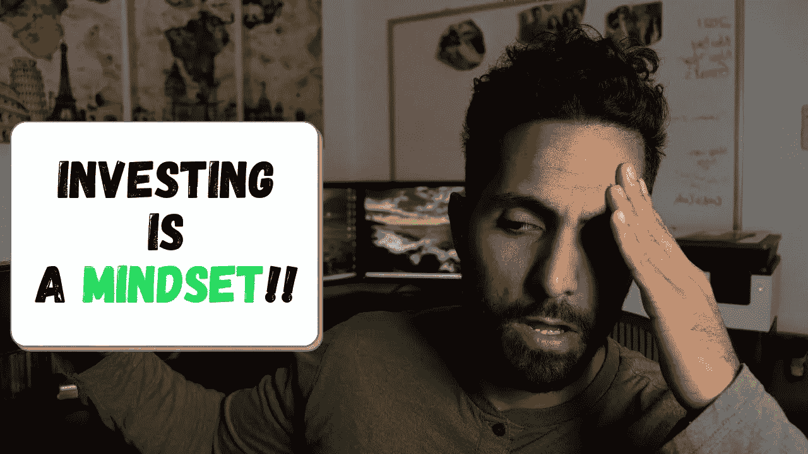
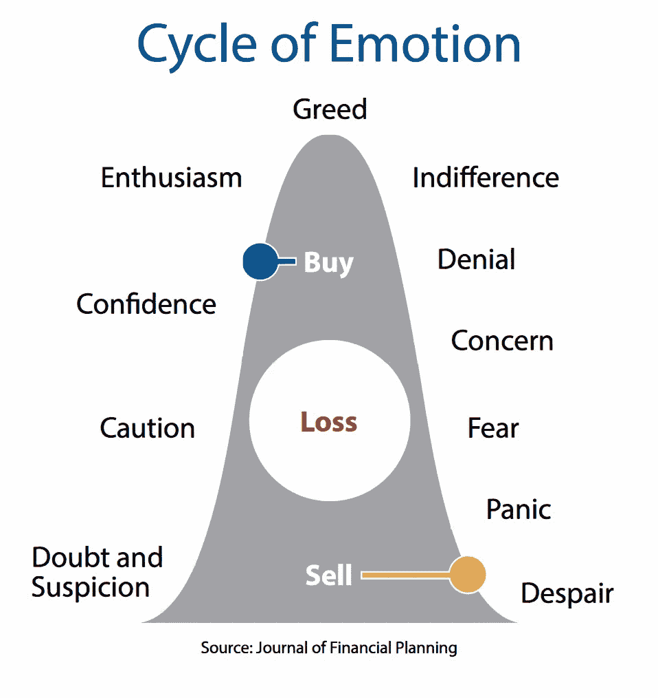
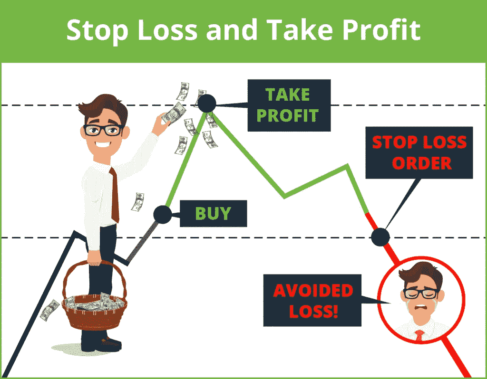
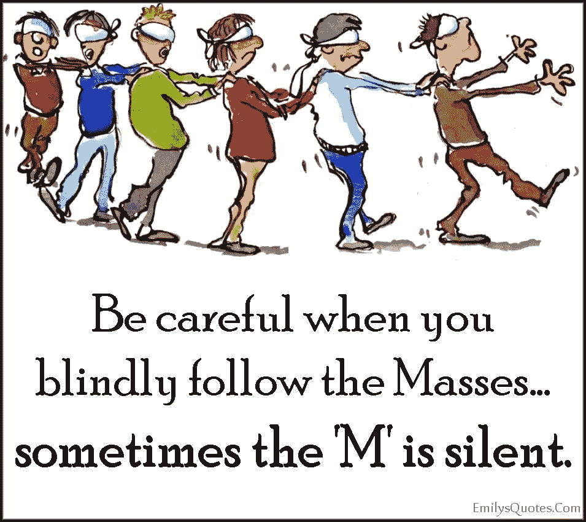
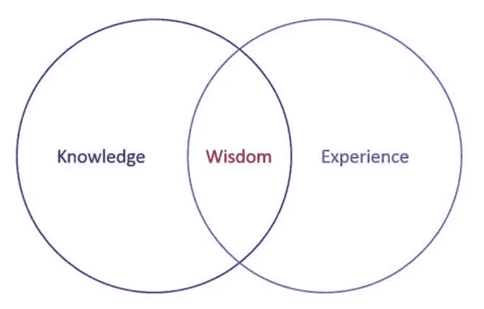

# 我学到的 10 条投资经验(第一部分)

> 原文：<https://medium.com/coinmonks/10-investing-lessons-i-learned-part-1-d2fc631fcf94?source=collection_archive---------4----------------------->

## 投资并不像看起来那么简单。我想这有点像冲浪——当我第一次看到它时，它似乎很简单，但当我第一次尝试时，它完全是另一回事。

我意识到有很多东西要分享，所以我把这篇文章分成两部分。

**大免责声明** : *让我从标准免责声明开始这篇文章。* ***这不是投资建议。我不是投资顾问。此信息旨在用于教育目的。在你决定投资你的血汗钱之前，请做好你自己的研究。如果你不确定，可以向专业理财顾问寻求帮助，他可以了解你的全部财务需求，并建议你应该做什么。***

既然我们已经忘记了。我们开始吧

不幸的是，学校里没有教个人投资，你在大学里学的大部分课程也没有涉及个人投资。即使是学专业金融课程的人，最后也可能对这个话题有更多的理论知识。投资只是人们在前进的道路上被期望去理解的事情。诚实地..太难了！！

凭借在专业领域的出色表现，你几乎想当然地认为自己会擅长投资。许多人艰难地发现这可能不是真的。一些人坚持不懈，并随着时间的推移找到了解决办法，另一些人则中途放弃，并装进了那些留下来的人的口袋。

# 那么，关于投资，我真正学到了什么

# 1.投资不应被视为一种爱好

爱好通常最终会让你花钱，而投资可以帮助你随着时间的推移让你的钱增值(至少保值)。

爱好是你应该享受的东西，而且相对来说不涉及太多经济问题。

很多人真的对自己的爱好充满热情。他们学习新的技术来改进他们所从事的运动，学习新的食谱来增加晚餐时间和钓鱼的乐趣。有些人每天都看体育频道，这样他们就有最新的信息来管理他们的梦幻板球或足球队。有很多新的想法可以尝试，而且没有什么不好的地方。

**投资不一样。你对财富投资组合做出的决定可能会产生重大影响，所以你要小心行事。**

有些人把投资当成一种爱好，每当他们听到一个新的前景时，他们很容易改变他们的方法。

听到新闻说三月份有一只新的生物科技股票，所以我们买了它。下个月，埃隆将在推特上发布关于 Doge 切换到那个的消息。Twitter 上一个新的 NFT 小组推荐了一个比 crypto kitties 更大的新网站，我们去买了一些。

> 投资需要一个可靠的计划，大量的实践，持续的耐心，坚持不懈的纪律，以及一个反馈回路来监控和改进。
> 
> 没有计划或过于频繁地改变计划是一种非常糟糕的亏损方式。

# 2.学会管理你的 FOMO(害怕错过)

对此我怎么说都不为过。我自己也经历过很多次。

当一只股票或投资飙升时，你真的想坐上火箭。感觉全世界都知道这件事，却合谋不告诉你。如果你现在不去做，你的整个投资理论就完了，你将永远不会是原来的你。你看着迄今为止 100%-200%的增长，觉得这是下一个亚马逊。您需要不惜任何代价购买它，就在今天！！

在你购买的几天内，价格会下降一点。你说服自己，这是回调的一部分，它将很快上升到新的高度。更糟糕的是，你认为这是一个买入更多的好机会(“买入下跌”)。当你看着这颗冉冉升起的新星时，这种情况会持续一段时间，当你的投资继续贬值时，你会失宠。

现在几个月(也许几年)过去了，这是你真正落魄的时候。每当你看到现在的投资价值是你投入的 50%时，你就会质疑自己作为个人的自我价值。当着你的面嘲笑你犯了大错。最终，希望让位于绝望，你决定咬紧牙关，承受损失，继续前进。所以你卖了它！！

你猜怎么着，几个月后，价格开始上涨，而你在一旁难以置信地看着。循环又开始了。

> 这就是“低买”/“高卖”的简单路径如何转化为“高买”/“低卖”..

# 3.了解你的风险偏好——当风险真实存在时，你会感到痛苦

说我可以接受我的投资组合下跌 30-40%是一回事，经历这种情况是另一回事。当你制定投资策略和投资组合时，有许多因素需要考虑。

1.  投资规模有多大？
2.  相对于你的总财富，那是多少？
3.  您近期(6-12-18 个月)需要这笔钱吗？
4.  你对波动的适应程度如何？这是很重要的一点，我已经看到随着股票从增长转向价值，投资下降了 75%。
5.  波动性对你的日常生活有什么影响？当你知道你已经失去了很多钱的时候，你的日常活动会变得困难吗？

风险和回报高度相关。更高的回报通常伴随着更高的风险。即使是经验丰富的投资者也会在最意想不到的时候遭遇挫折

[马克·库班最近在 Titan](https://www.newsweek.com/mark-cuban-regrets-not-doing-math-titan-crypto-investment-1601899) 的一项加密投资中几乎损失了 100%。

[来自原始人的追加保证金通知影响了许多股票投资者](https://en.wikipedia.org/wiki/Archegos_Capital_Management)

专业提示:如果你对你的持仓感到焦虑，并不断查看它们是否下跌，你很可能过度扩张了。减少你持有的头寸可能是可以的

# 4.记录你的收益很重要

除非你能预定，否则账面收益毫无意义。虽然我们可以希望事情只是保持上升，但通常情况并非如此。

我记得和我父亲的一次讨论，我分享了我的一项投资上涨了 70%。他的第一个问题是我是否有盈利，我的回答是没有，我是做长线的。虽然这肯定是一种策略，但当市场扩大时，记录一些利润也有好处。当市场下跌时，你希望有现金，并且有更多的买入机会可以利用。

那么我最后去了哪里？我的谈话是在股票见顶的时候。随着它继续缓慢逐渐下跌，我增加了几次(是的，这是一个非常聪明的举动)，现在我持有它大约 30%的损失。

保护和结晶你的收益和保护你的资本一样重要。

*专家提示:如果你正在和别人谈论你的投资增加了多少，这是开始记录利润的好时机。*

# 5.即使是专家也无法预测接下来会发生什么——自己做研究吧

你必须从两个不同的时间范围来看待市场——1)短期 2)中长期

即使是专家也很难预测短期内市场会发生什么。基于旅行轨迹的中长期管理更好，可能更适合临时投资者。

我绝对是吃了苦头才学会的。你读了很多文章，跟踪了很多你认为知道他们在做什么的人。他们自称是研究不同类型数据的专家。当市场朝着他们所说的方向发展时，他们似乎都是对的。出乎意料的是，市场或股票波动，做一些不同的事情。他们敦促你，这是一次轻微的震荡，事情会恢复正常(有时确实如此)。但随后他们进一步下跌，他们会催促你多一点，并说这是买入更多的最佳时机，他们现在正在全押(“买入下跌”)。

随着市场继续走低，他们中的许多人对发生的变化给出了不同的解释。他们中的许多人表示，几个月前他们卖掉了投资，获得了利润。一些聪明的人甚至改变策略，说他们已经做空市场，因为他们可以预见到它的到来。

*总之:*

*   对你听到的一切都要半信半疑。
*   自己做研究。这是你的钱，你努力工作挣来的。保护&种植它是你的责任。
*   在我的下一篇文章中，我会介绍一些关于进场和出场的技巧。

总之，你可能已经阅读了许多关于这个话题的文章和博客(像这样)，但那只是给了你该做什么和不该做什么的知识。你需要把知识和经验结合起来，才能真正获得投资的智慧。

> 只有当你把你收集的‘知识’和‘执行经验’结合起来，你才能获得‘智慧’。

所以去体验吧！从小处着手，积累市场的真实经验，让自己变得自信。

**提供您的意见和反馈吗📩**关于这篇文章或我如何改进这篇时事通讯。很想听听你的经历和你可能学到的东西。

> 加入 [Coinmonks 电报频道](https://t.me/coincodecap)，了解加密交易和投资