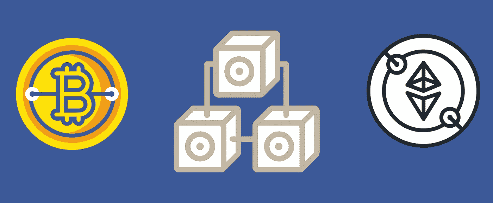

# 从区块链和加密资产开始的 100 个工具和参考(2021)

> 原文：<https://medium.com/coinmonks/100-tools-and-references-to-begin-with-blockchain-and-cryptoassets-2021-9d7efb5b4797?source=collection_archive---------4----------------------->

## 这是 2160 小时研究的结果。

Design by myself.

是的，它花了我 6 个月和 2160 个小时的研究。根据 Crypto.com 的最新报告，加密货币市场正在爆炸，比特币已经成为主流，到 2021 年 6 月，超过 2.21 亿人投资比特币。当你开始你的研究时，你会发现没有一个博客对你开始实验所需的所有工具和资源进行过统计。
这篇文章会让你的生活更轻松。

比特币于 2009 年由一个叫中本聪的人推出，此后发展迅速。当我开始我的研究时，它的价值是每比特币 3 万美元。
在撰写本文时，比特币价格为 48，000 美元，2021 年 4 月达到每比特币 65，000 美元的峰值。
这些数字具体意味着什么？
如果你在 2020 年 12 月投资了 1000 美元，那么现在(2021 年 8 月)你将得到 1600 美元，在 2021 年 4 月高峰时是 2166.67 美元。很好的投资。非常好的投资。但是，要开始投资，你必须明白你投资的是什么。这是基础。

> 许多人难以理解比特币的原因是，你首先必须了解区块链是什么。

要想从投资中获得最大收益，你必须克服一条学习曲线。
在本文的剩余部分，我将为您提供不同资源的概要，以帮助您入门。
***PS:本人不是理财顾问，投资风险自担。***

# 不到六分钟了解区块链:

[区块链 6 分钟](https://www.youtube.com/watch?v=SSo_EIwHSd4)

# 一小时看懂区块链和钱:

[区块链和货币](https://www.youtube.com/watch?v=EH6vE97qIP4)

# 了解区块链革命:

[丹塔普斯科特](https://www.youtube.com/watch?v=Pl8OlkkwRpc)，[区块链大规模简化](https://www.youtube.com/watch?v=k53LUZxUF50&t=314s)

# 了解区块链和加密货币的最佳 Youtube 频道:

[钱币局](https://www.youtube.com/c/CoinBureau)，[本杰明·考恩](https://www.youtube.com/channel/UCRvqjQPSeaWn-uEx-w0XOIg)，[鲍勃·卢卡斯](https://www.youtube.com/channel/UC0zGwzu0zzCImC1BwPuWyXQ)，[数字资产新闻](https://www.youtube.com/c/DigitalAssetNewsDAN)， [Finematics](https://www.youtube.com/c/Finematics) ，[异端金融](https://www.youtube.com/c/HeresyFinancial)，[思维密码](https://www.youtube.com/c/AnthonyEdward)，[安德里亚斯·安东诺普洛斯](https://www.youtube.com/c/aantonop)，[桀骜不驯的](https://www.youtube.com/c/TheDefiant)， [JRNY 密码](https://www.youtube.com/c/JRNYCrypto)，[庞普利亚诺](https://www.youtube.com/c/AnthonyPompliano)，

# 最佳加密货币播客:

[月亮或半身像](https://www.benzinga.com/money/podcast-show/moonorbust/)，[未被拴住的](https://linktr.ee/unchainedpodcast)，[未被证实的](https://unconfirmed.libsyn.com/)， [Crypto 101](https://crypto101podcast.com/) ， [Crypto Radio](http://cryptoradio.io/) ， [The Stephan Livera 播客](https://stephanlivera.com/)， [The Token Metrics 播客](https://tokenmetrics.com/podcast/)， [The 细目](https://nlwcrypto.libsyn.com/)

# 2 个必看的加密货币讲座:

[黄金 Vs 比特币](https://www.youtube.com/watch?v=coHC_9ApBdg&pp=ugMICgJmchABGAE%3D)，[₿**字**字](https://www.youtube.com/watch?v=Zwx_7XAJ3p0)

# 学习交易基础的最佳 Youtube 频道:

[1215 日交易](https://www.youtube.com/channel/UCJvCaDLXHvEkkQnAOT2Hp0g)

# 购买硬币的最佳交易所:

[币安](https://www.binance.com/fr)(或者 [Binance.us](http://www.binance.us) 如果你住在美国的话)[比特币基地](http://www.coinbase.com)，[北海巨妖](https://www.kraken.com/)， [FTX](https://ftx.com/fr)

# 保存硬币的最佳钱包:

## *热门钱包:*

[出埃及记](https://www.exodus.com/)，[信任钱包](https://trustwallet.com/)，[原子钱包](https://atomicwallet.io/)， [Metamask](https://metamask.io/) ， [Coinomi](https://play.google.com/store/apps/details?id=com.coinomi.wallet&hl=fr&gl=US)

## *冷钱包:*

[总帐](https://www.ledger.com/)，[特雷佐](https://trezor.io/)，[冷卡](https://coldcardwallet.com/)，[埃利帕泰坦](https://www.ellipal.com/products/ellipal-titan)，[保管钥匙](https://shapeshift.com/keepkey)

# 最佳加密货币聚合器:

[Cryptopanic](https://cryptopanic.com/) ， [Coinddit](https://coinddit.com/) ， [Coinspectator](http://www.coinspectator.com) ， [Lunarcrush](https://lunarcrush.com/markets?rpp=50)

# Twitter 上关注的加密货币玩家:

[迈克尔·塞勒](https://twitter.com/michael_saylor)、[拉亚·海尔彭](https://twitter.com/LayahHeilpern)、[亚历山大拉·胡克](https://twitter.com/HukAleksandra)、[比特币档案](https://twitter.com/BTC_Archive)、[丹·甘巴尔代洛](https://twitter.com/cryptorecruitr)、[奥特币日报](https://twitter.com/AltcoinDailyio)、 [JRNY Crypto](https://twitter.com/JRNYcrypto) 、[本杰明·考恩](https://twitter.com/intocryptoverse)、[拉克·戴维斯](https://twitter.com/TheCryptoLark)、[庞普](https://twitter.com/APompliano)、[币局](https://twitter.com/coinbureau)

# 针对不同加密货币的加密研究、数据收集和分析工具:

[梅萨里](https://messari.io/)，[桑蒂默](https://santiment.net/)，[玻璃节点](https://glassnode.com/)，[歪斜](https://www.skew.com/)

# 分散式财务仪表板和分析:

[脱纤维](https://www.defistation.io/)，[脱纤维](https://defipulse.com/)

# 想知道下一次空投吗:

[空投](http://airdrops.io)

# 要跟上 ico 的步伐:

[icodrops.com](http://icodrops.com/)

# 加密货币价格和图表，按市值和其他有用信息排序:

[Coinmarketcap](http://www.coinmarketcap.com) ， [Coingecko](http://coingecko.com) ， [Coinclarity](https://coinclarity.com/)

# 废弃硬币列表:

[死硬币](https://99bitcoins.com/deadcoins/)

# 要跟踪您的加密货币投资组合:

[Coinmarketcap 追踪器](https://coinmarketcap.com/portfolio-tracker/)， [Coinstats 追踪器](https://coinstats.app/en/portfolio/holdings/)

# 要获得最佳加密货币收益率:

[Yieldwatch](https://yieldwatch.net/)

# 要查看图形图表:

[交易视图](http://tradingview.com)

# 要将硬币从一个生态系统转移到另一个生态系统:

[大桥币安](https://www.binance.org/en/bridge)

# **币安智能链(BSC)区块链浏览器:**

[Bscscan](https://bscscan.com/)

# **区块链探索者 forEthereum :**

[以太扫描](https://etherscan.io/)

# 要了解以太坊区块链的天然气价格:

[eth asstation](https://ethgasstation.info/)

# 要获得最佳赌注表:

[赌注奖励/赌注](https://www.stakingrewards.com/staking)

# 加密货币新闻:

[硬币台](https://www.coindesk.com/)，[硬币电报](https://cointelegraph.com/)，[法国硬币杂志](https://journalducoin.com/)

# 以太坊联合创始人之一 Vitalik Butherin 的博客:

[Vitalik.ca](https://vitalik.ca/)

# 要使用 Metamask 跟踪您的气体消耗和交易成本:

[Fees.wtf](https://fees.wtf/)

# **波尔卡多特区块链的发射台:**

[波尔卡启动程序](https://www.polkastarter.com/)

# **币安区块链的发射台:**

[币安发射台](https://launchpad.binance.com/en)

# Trustswap 启动板:

[Trustswap 发射台](https://www.trustswap.org/)

# **卡达诺发射台:**

[卡达诺发射台](https://cardstarter.io/)

# 500 多个分散金融资源列表:

[简单水](https://simpleaswater.com/defi/)

# 根据 zabo 的 7 个最佳加密投资组合追踪器列表:

[最佳加密投资组合追踪器/Zabo](https://zabo.com/blog/best-crypto-portfolio-tracker/)

# 在最好的新代币在其他市场上市之前获得它们:

[造币清单](https://coinlist.co/)

# 跟踪不可替代令牌市场:

[不可行](https://nonfungible.com/)

# 分散应用的在线商店:

[Mathdapp](https://mathdapp.store/)

# 获取 BSC 区块链的天然气价格:

[BSC 上的天然气价格](https://bscscan.com/chart/gasprice)

# BSC 上唯一地址的数量:

[BSC 唯一地址](https://bscscan.com/chart/address)

# BSC 上可用的令牌:

[BSC 令牌](https://bscscan.com/tokens)

# BSC 上的验证器列表:

[BSC 上的验证器](https://bscscan.com/validators)

# 未来加密货币事件日历:

[共同市场](https://coinmarketcal.com/en/?page=2)

# 用于赌注和加密增长工具的数据提供者:

[立桩方法](https://www.stakingrewards.com/)

# 追踪加密货币季节的指数:

[指数 altcoin](https://www.blockchaincenter.net/altcoin-season-index/) 赛季

# 要跟踪公共、私人和其他组织购买比特币的情况:

[比特币国库券](https://bitcointreasuries.org/)

# 关于比特币的有趣文章:

[看好比特币的理由](https://vijayboyapati.medium.com/the-bullish-case-for-bitcoin-6ecc8bdecc1)

# 比特币分析工具:

[Bitcoinblockhalf](https://bitcoinblockhalf.com/) ， [Bitcoin.sipa.be](http://bitcoin.sipa.be/)

# 要跟上福克斯的步伐:

[叉车](https://forkdrop.io/)

# 一些加密货币的通货膨胀率:

[加密货币的通货膨胀率](https://christianott.co/inflationrates_en/)

# 以太气解释道:

[天然气价格/供应不足](https://defiprime.com/gas)

# 比特币和以太坊交易的可视化

[Txstreet](https://txstreet.com/)

# 当交易停滞时该怎么办:

[解除您的交易](https://ethgasstation.info/blog/stuck-transaction-guide/)

# 由社区管理的比特币统计和服务:

[Coin.dance](https://coin.dance/)

# 加密货币交易所的交易终端:

[Tab-trader](https://tab-trader.com/)

# 现场硬币价格:

[Livecoinwatch](https://www.livecoinwatch.com/) ， [Coinlib](https://coinlib.io/)

# 关于加密货币的有趣文章:

[如何投资加密货币，游牧资本家](https://nomadcapitalist.com/cryptocurrency/)

# 要定位加密货币自动取款机:

[Coinatmradar](https://coinatmradar.com/)

# 根据资本化对所有类别的所有资产进行分类:

[资产达什](https://assetdash.com/)

# 加密货币数据比较器:

[密码比较](https://www.cryptocompare.com/)

# 关于纳米加密货币的有趣文章:

[关于纳米的文章](https://senatus.substack.com/p/why-nano-is-the-ultimate-store-of-value-and-reserve-currency-3b0318844bc8)

# 以太坊的经济分析；

[以太坊的经济分析](https://www.lynalden.com/ethereum-analysis/)

# ERC-20 代币如何通过比特币基地平台安全指南？

[在比特币基地投放您的硬币](https://blog.coinbase.com/securing-an-erc-20-token-for-launch-on-coinbase-68313652768f)

# 比特币在新兴国家使用的文章:

[检查你的金融特权](https://bitcoinmagazine.com/culture/check-your-financial-privilege)

# 理解比特币的存量到流量模型:

[库存到流动模式](https://www.lookintobitcoin.com/charts/stock-to-flow-model/)

# 理解为什么比特币是希望的博客:

[希望](https://www.hope.com/)

# 关于以太坊的有趣文章:

[是的，我读过白皮书](https://cryptohayes.medium.com/yes-i-read-the-whitepaper-59cfa2ea9c2c)

# 关于为什么比特币是非殖民化货币的文章:

[比特币，一种非殖民化的货币](https://bitcoinmagazine.com/culture/bitcoin-a-currency-of-decolonization)

[用比特币的开源代码对抗货币殖民主义](https://www.cointribune.com/tribunes/tribune-cryptomonnaies-geopolitique/combattre-le-colonialisme-monetaire-avec-le-code-open-source-de-bitcoin-btc/)

# 关于移动数字点对点支付的文章:

[无网络移动支付，可信执行环境变化极小](https://www.tdcommons.org/cgi/viewcontent.cgi?article=5305&context=dpubs_series)

# 关注不同区块链发生的事情:

[链分析](http://www.chainanalysis.com)

# 比特币混合器:

[Mycryptomixer](http://mycryptomixer.com) ， [Bitcoinmixer](http://bitcoinmixer.org) ， [Blender](http://blender.io)

# Doc 关于欧洲联盟对区块链的计划:

[UE 和区块链](https://drive.google.com/drive/u/1/folders/1Z6BgoNqWMGZ1lnT94zF4kIDCzg1gKoho)

# 第一个全国性数字货币中国数字元解读:

[数字元说明](https://www.reuters.com/article/us-china-currency-digital-explainer-idUSKBN27411T)

# 私人交易的分散协议:

[Tornado.cash](https://tornado.cash/)

# 鼓励加密货币投资者进入的 10 个国家:

瓦努阿图、科斯塔 RICA、波多黎各、葡萄牙、马来西亚、迪拜、马耳他、瑞士、新加坡、百慕大

# 关于分权组织的资源:

[关于分权组织的说明](https://kinjal.mirror.xyz/eD3-Sgv2h50j-kwjHQCOnwqMKqSLTfnrqrtNypU-P5k)

# 根据加密货币在 Github 上的活跃程度对其进行排名:

[隐味噌](https://www.cryptomiso.com/)

# 专注于区块链的风险投资公司:

[潘迪拉资本](https://panteracapital.com/)、 [FBG 资本](https://www.crunchbase.com/organization/fbg-capital)、[阿拉米达研究](https://www.alameda-research.com/)、[比特币基地创投](https://ventures.coinbase.com/)、[多链资本](https://polychain.capital/)

# NFT 买卖网站:

[Opensea](https://opensea.io/assets) ， [Rarible](https://app.rarible.com/) ， [Bswap Market](https://market.bswap.app/market) ，[super rared](https://superrare.co/)， [Makersplace](https://makersplace.com/) ， [Nifty gateway](https://niftygateway.com/collections) ， [Async](https://async.art/) ， [Pinata](https://pinata.cloud/) ， [Foundation](https://foundation.app/artworks) ， [Metagrail](https://www.metagrail.co/auctions/91cf83fb-3477-4155-aae8-6dcb9b853397) ，[centraland](https://market.decentraland.org/)，[仿植物怪兽佐拉](https://zora.co/0x517bab7661C315C63C6465EEd1b4248e6f7FE183/145)

# 在区块链上购买域名:

[域名以太坊](https://app.ens.domains/name/ethereum.eth)，[不可停止域名](https://unstoppabledomains.com/)

# 搜索分散的应用程序:

[达普拉达](https://dappradar.com/)

# 了解什么是 NFT:

[Opensea 解说](https://opensea.io/blog/guides/non-fungible-tokens/)， [Linda.mirror.xyz](https://linda.mirror.xyz/df649d61efb92c910464a4e74ae213c4cab150b9cbcc4b7fb6090fc77881a95d)

# 最佳教育项目:

[Rocketfuelcrypto](https://www.rocketfuelcrypto.com/members/sign_in) ，[99 比特币](https://99bitcoins.com/)

# 集中借贷平台:

[摄氏网](https://celsius.network/)、 [Blockfi](https://blockfi.com/) 、 [Nexo](https://nexo.io/) 、[币安赚](https://www.binance.com/en/earn)、 [Moardefi.finance](https://moardefi.finance/) 、 [APY 财经](https://apy.finance/)、[牛肉财经](https://www.beefy.finance/)、[诺德财经](https://nordfinance.io/)

# 分散式金融借贷平台:

[AAVE](https://aave.com/) 、[大院](https://app.compound.finance/)、[制造者](https://makerdao.com/en)

# **流动性挖掘:**

[Uniswap](https://app.uniswap.org/) ，[1 英寸](https://app.1inch.io/)， [Sushiswap](https://sushi.com/) ， [Bancor](https://bancor.network/)

# **产量养殖:**

[朝思暮想金融](https://yearn.finance/)

***如有问题，我在*** [***推特***](http://www.twitter.com/themetaboy) ***和***[***insta gram***](http://www.instagram.com/themetaboy)

*额外链接:*

关于 ETF 的所有信息:

[ETFDB](https://etfdb.com/)

股票推荐由金融分析师和金融博客作者提出，然后根据准确性和表现对这些专家进行排名。

[顶级](https://www.tipranks.com)

> 加入 [Coinmonks 电报频道](https://t.me/coincodecap)，了解加密交易和投资

## 也阅读

 [## 最佳加密交易所| 2021 年十大加密货币交易所

### 加密货币交易所的加密交易需要了解市场，这可以帮助你获得利润…

blog.coincodecap.com](https://blog.coincodecap.com/crypto-exchange)  [## 2021 年 9 大最佳加密贷款平台| CoinCodeCap

### 当谈到加密货币贷款时，大量因素等同于良好的收入状况。此外，借款的一部分…

blog.coincodecap.com](https://blog.coincodecap.com/crypto-lending)  [## 2021 年最佳加密交易机器人(免费和付费)

### 2021 年币安、比特币基地、库币和其他密码交易所的最佳密码交易机器人。四进制，位间隙…

medium.com](/coinmonks/crypto-trading-bot-c2ffce8acb2a)  [## 最佳 4 个加密交易信号电报通道

### 这是乏味的找到正确的加密交易信号提供商。因此，在本文中，我们将讨论最好的…

medium.com](/coinmonks/best-crypto-signals-telegram-5785cdbc4b2b)  [## BlockFi 评论 2021:利弊和利率

### 今天，我们提出了一个全面的 BlockFi 评论，这是一个成立于 2017 年的加密贷款平台，拥有其…

blog.coincodecap.com](https://blog.coincodecap.com/blockfi-review)  [## 如何在印度购买比特币？2021 年购买比特币的 7 款最佳应用[手机版]

### 如何使用移动应用程序购买比特币印度

medium.com](/coinmonks/buy-bitcoin-in-india-feb50ddfef94)  [## 加密税务软件——五大最佳比特币税务计算器[2021]

### 不管你是刚接触加密还是已经在这个领域呆了一段时间，你都需要交税。

medium.com](/coinmonks/best-crypto-tax-tool-for-my-money-72d4b430816b)  [## Pionex 评论-被动交易者的简单交易机器人

### 在本文中，我们将回顾 Pionex，它提供了加密交易机器人自动化工具，集成了一个…

blog.coincodecap.com](https://blog.coincodecap.com/pionex-review-exchange-with-crypto-trading-bot)  [## 存储比特币的最佳加密硬件钱包[2021]

### 保管您的数字资产很容易，但找到正确的存储方式却是一项繁琐的任务。在线钱包有一个风险…

blog.coincodecap.com](https://blog.coincodecap.com/best-hardware-wallet-bitcoin)