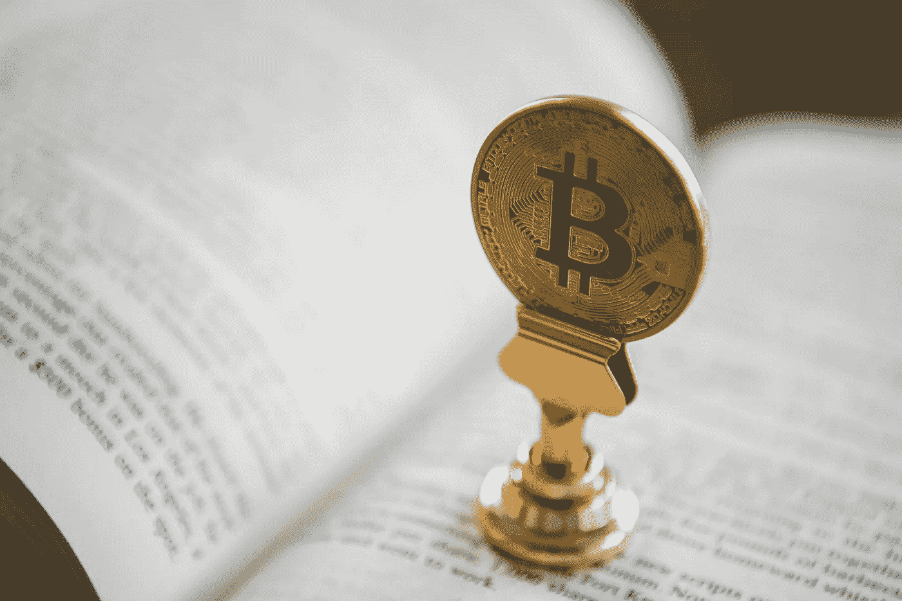

# 强烈推荐加密货币爱好者阅读的 11 本书

> 原文：<https://medium.com/coinmonks/11-highly-recommended-reads-for-cryptocurrency-enthusiasts-691f4784dfed?source=collection_archive---------1----------------------->

## *知识就是力量*

Photo by [André François McKenzie](https://unsplash.com/@silverhousehd?utm_source=unsplash&utm_medium=referral&utm_content=creditCopyText) on [Unsplash](https://unsplash.com/s/photos/bitcoin-book?utm_source=unsplash&utm_medium=referral&utm_content=creditCopyText).

在本文中，我将提供我读过的 11 本书的列表，这些书让我受益匪浅，对加密货币爱好者也非常有用。

这份清单涵盖了一系列主题，一些书籍专门关注[比特币](https://medium.com/coinmonks/bitcoin/home)和[加密货币](https://medium.com/coinmonks/tagged/cryptocurrency)，而其他书籍则不太直接相关，但如果……