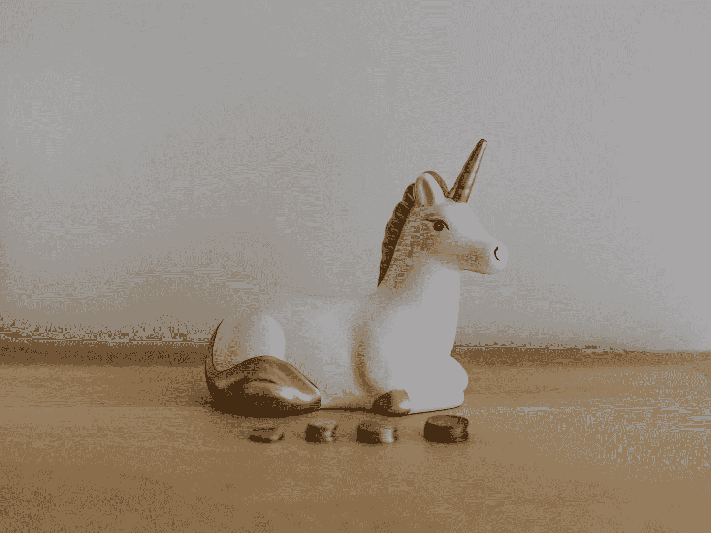

# 十年来 11 个不属于比特币的投资机会

> 原文：<https://medium.com/coinmonks/11-investment-opportunities-this-decade-that-are-not-bitcoin-eea46eb9e4dd?source=collection_archive---------2----------------------->

## 另类资产、创纪录的 APY、当地面包店和一匹赛马

[Image by Annie Spratt](https://unsplash.com/@anniespratt)

如果我今天给你 1000 美元，到 2030 年，你会把它投资到什么地方，变成 2000 美元？

这不是一个俗气的社交媒体迷因，最终会告诉你，美元代表一天中的几秒钟，所以…