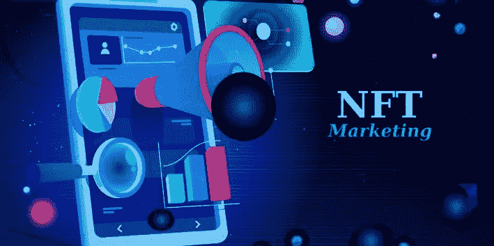
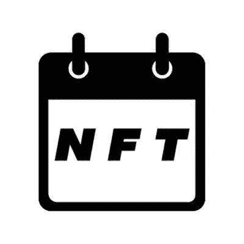
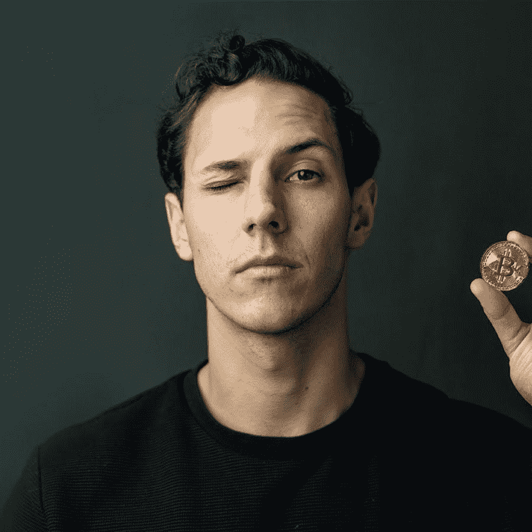

# 推销 NFT 系列的 11 种方法

> 原文：<https://medium.com/coinmonks/11-ways-to-market-your-nft-collection-79dcde22be8e?source=collection_archive---------0----------------------->

你可以拥有世界上最美丽的 NFT 收藏，但不幸的是，在当今高度竞争的环境下，仅仅这样可能不足以确保你的项目成功。营销可以成就也可以毁掉一个 NFT 项目，这个空间充斥着新系列，它们都在相互竞争，争夺买家。所以，如果你想让你的收藏引起注意，你就必须投入一些认真的工作。这里有一个策略列表，你可以用它来推销你的收藏品。

1.  **发出新闻稿(付费)**

新闻稿是故意发给记者的故事，希望他们能够发表。它们通常由公司的通信或公共关系(PR)部门编写和发出。一些受欢迎的新闻稿发布服务有:

*   [新闻专线](https://www.newswire.com/submit-a-press-release-a/?_vsrefdom=google-ppc&utm_source=google&utm_medium=cpc&utm_campaign=13369537821&utm_content=525600605494&utm_term=newswire&gclid=EAIaIQobChMIpbPn4PST9AIVrSGtBh1RFAWlEAAYAiAAEgLhKvD_BwE)
*   [缓兵之计](https://www.ereleases.com/hello-ereleases/?a=3&gclid=EAIaIQobChMIlaWoqfWT9AIVoTytBh3uYAz4EAAYASAAEgJLZfD_BwE)
*   [EIN 新闻社](https://www.einpresswire.com/?promo=4005&ga_campaignid=1598455851&ga_adgroupid=67308413024&ga_creative=318371308276&ga_keyword=newswire%20services&ga_adposition=&ga_matchtype=e&ga_network=g&gclid=EAIaIQobChMIpbPn4PST9AIVrSGtBh1RFAWlEAAYASAAEgL4QvD_BwE)
*   [公关分布](https://www.prdistribution.com/?gclid=EAIaIQobChMI4uiWvfWT9AIVeB-tBh2XEwzBEAAYAyAAEgIq1fD_BwE)
*   [美通社](https://www.prnewswire.com/account/online-membership-form/?utm_source=google&utm_medium=paidsearch&utm_campaign=prnbranded&utm_term=pr%20newswire&gclid=EAIaIQobChMIiI7hyfWT9AIVIA2tBh1Miwt8EAAYAyAAEgLCN_D_BwE)

不幸的是，这些都是付费服务，大多数都提供从几百美元到几千美元不等的套餐。但它可能是非常值得的，NFT 和加密空间充满了骗局，所以让你的项目在一个著名的报纸或杂志上发表将增加你的收藏的可信度，并将让潜在的买家放心，他们需要投资于你的美丽的艺术

**2。将您的点滴添加到 NFT 日历(免费)**

这是让您的项目出现在地图上的一种快速简便的方法。一旦你心中有了一个日期，只需要几分钟就可以将你的行程添加到 NFT 日历中。NFT 日历为所有市场的项目做广告，最棒的是它是完全免费的。

您需要提供的一些关键信息:

*   你的 NFT 掉落的市场
*   你的释放链接
*   你的 NFT 收藏或艺术品的名称
*   关于创建者的详细信息
*   描述
*   你下落的视觉
*   您投递的日期和时间

**3。合作** **(免费)**

与其他艺术家、名人或动画工作室合作将允许你通过与对方交换观众来扩大你的粉丝群。这将让你获得更多的曝光率，接触到另一批潜在投资者，否则你将没有机会与之互动。

有些人不愿意把自己放在那里，以防被拒绝，但有人能说的最糟糕的事情是“不”。坚持是关键，所以不要担心被拒绝，它们都是建立品牌的一部分。

**4。赠品** **(免费)**

赠品在某种程度上是一种不可避免的罪恶，已经成为 NFT 营销的主要内容。这是宣传你的收藏和提高品牌知名度的好方法。他们的设置方式是，每个想要参与赠品的人都必须在 Twitter/Discord 上关注艺术家，在评论中标记朋友，在 Instagram Stories 或 retweet 上分享帖子，等等。这是一种非常有效的推广你的品牌的方式。

缺点是，赠品往往会吸引一部分用户，他们很少或根本没有投资你的 NFTs 的意图，只会在 Twitter 上搜索免费交易。所以如果你的转化率非常低，也不用担心，你得好坏兼收。

**5。元宇宙事件**

[分散的土地](https://decentraland.org/)和[隐体素](https://www.cryptovoxels.com/)是元宇宙最受欢迎的两个空间。NFT 的收藏家和项目拥有虚拟的建筑，经营着可以展示他们的收藏和举办社交活动的场所。这两个平台都可以通过常规的桌面浏览器访问。分散之地有一些非常有趣的小游戏和很酷的音乐会。你可以在他们的 Twitter 页面和 Discord 服务器上找到不同的事件。

[AltspaceVR](https://altvr.com/) 和 [Mozilla 中枢](https://hubs.mozilla.com/)有许多与 NFT 相关的事件。这些活动吸引了许多小众收藏家，他们在寻找一些有点不同的东西。你必须密切关注地面，在推特上了解这些事件。

**6 .人群营销**

经典人群营销涉及到与您的目标市场互动。作为推广者，您可以参加一些相关的在线讨论，直接与您的目标受众联系。发布高质量的内容，并通过在多个平台上发布这些内容来建立联系。您也可以通过在相关平台上提问重要问题来发起讨论。

每个人都知道推特是 NFT 社区的居住地，但还有许多其他平台可以用来营销和推广你的收藏。拥有多维度的营销策略是成功的关键。

*   [比特币对话](https://bitcointalk.org/)
*   电报
*   不调和
*   商务化人际关系网
*   脸谱网
*   推特
*   照片墙
*   Reddit
*   中等
*   体育俱乐部会所；音频社交软件（网友戏称“聊斋”）

**7。会所**

如果你没听说过，Clubhouse 是唯一的音频社交媒体平台，用户大部分时间都花在宣传他们的项目和网络上。俱乐部会所是讨论密码和 NFT 的最佳场所之一。 [NFT](https://www.clubhouse.com/club/NFT) 、NFTS[。小技巧](https://www.clubhouse.com/club/NFTS.tips)是很棒的“俱乐部”，你可以在这里参与对话，倾听其他专家的意见。

**8。不和(自由)**

如果你真的想和 NFT 社区联系，很多讨论都是在不和中进行的。这是推广新项目、流式传输事件和建立连接的地方。将你的推文发送给公众是很好的，但是与微观层面的人进行一对一的接触是非常重要的，这样人们就可以了解项目背后的人，这也是你获得更忠诚的追随者的方式。所以，不要害怕跳进聊天室与人交流。这将会比到处滥发链接更进一步。

**9。内容为王**

NFT 和密码空间正在以惊人的速度扩张，因此人们对教育内容有着巨大的兴趣。成为内容创作者是让自己成为该领域专家和发展品牌的好方法。有许多方法可以做到这一点。

**10。博客(免费)**

我以前说过，现在我要再说一遍，推广你的收藏不仅仅是向人们的 twitter 发送垃圾信息，创造有价值的内容是吸引粉丝的最佳方式。

他们说一张照片胜过千言万语，但是一篇博客文章可以胜过一千张照片。twitter 算法旨在推送最有价值的内容，所以如果你想知道为什么你的推文没有得到任何印象，不如尝试从不同的角度处理事情。专注于为人们提供有用和相关的信息。

媒体是一个创造教育和信息内容的伟大平台。写博客不需要新闻学学位，只要开始写，边写边磨练技巧。

[Steemit](https://steemit.com/) 是一家总部位于区块链的博客/社交媒体平台，以其本地令牌 Steem 向内容创作者支付发布费用。虽然这个平台不是最容易使用的，但它确实有一个非常倾向于加密货币和区块链技术的用户群。

**11。YouTube(免费)**

让我们面对现实吧，2021 年，所有最好的内容都可以在 YouTube 上找到，所以开设一个频道可以很好地将你的信息传播出去。创建一个成功的 YouTube 频道不是一件容易的事，需要大量的工作，但如果做得正确，这个平台有最大的优势。

Sheldon Evan Crypto Youtuber

有些人对站在摄像机前不太感兴趣。Videoscribe 是一款制作白板动画风格视频的优秀软件。[白板加密](https://www.youtube.com/c/WhiteboardCrypto)是真正完善了这种格式的渠道的一个例子。

**结论**

重要的是你的营销策略不要单一，要确保你使用多种途径来最大化你的项目的曝光率。通过参与 Twitter 上的讨论与你的观众互动，Discord 应该优先于一般的大众营销推文。如果你利用这里列出的一些方法，你将会很好地积累一个忠诚的社区。

哪些方法对你有效，请在下面评论。

> 加入 Coinmonks [电报频道](https://t.me/coincodecap)和 [Youtube 频道](https://www.youtube.com/c/coinmonks/videos)了解加密交易和投资

## 另外，阅读

*   [MXC 交易所评论](/coinmonks/mxc-exchange-review-3af0ec1cba8c) | [Pionex vs 币安](https://blog.coincodecap.com/pionex-vs-binance) | [Pionex 套利机器人](https://blog.coincodecap.com/pionex-arbitrage-bot)
*   [我的密码交易经验](/coinmonks/my-experience-with-crypto-copy-trading-d6feb2ce3ac5) | [比特币基地评论](/coinmonks/coinbase-review-6ef4e0f56064)
*   [CoinFLEX 评论](https://blog.coincodecap.com/coinflex-review) | [AEX 交易所评论](https://blog.coincodecap.com/aex-exchange-review) | [UPbit 评论](https://blog.coincodecap.com/upbit-review)
*   [AscendEx 保证金交易](https://blog.coincodecap.com/ascendex-margin-trading) | [Bitfinex 赌注](https://blog.coincodecap.com/bitfinex-staking) | [bitFlyer 点评](https://blog.coincodecap.com/bitflyer-review)
*   [麻雀交换评论](https://blog.coincodecap.com/sparrow-exchange-review) | [纳什交换评论](https://blog.coincodecap.com/nash-exchange-review)
*   [支持卡审核](https://blog.coincodecap.com/uphold-card-review) | [信任钱包 vs 元掩码](https://blog.coincodecap.com/trust-wallet-vs-metamask)
*   [Exness 评测](https://blog.coincodecap.com/exness-review)|[moon xbt Vs bit get Vs Bingbon](https://blog.coincodecap.com/bingbon-vs-bitget-vs-moonxbt)
*   [如何开始通过加密贷款赚取被动收入](https://blog.coincodecap.com/passive-income-crypto-lending)
*   [加密货币储蓄账户](/coinmonks/cryptocurrency-savings-accounts-be3bc0feffbf) | [加密交易机器人](https://blog.coincodecap.com/best-crypto-trading-bots)
*   [BigONE 交易所评论](/coinmonks/bigone-exchange-review-64705d85a1d4) | [CEX。IO 审查](https://blog.coincodecap.com/cex-io-review) | [Swapzone 审查](/coinmonks/swapzone-review-crypto-exchange-data-aggregator-e0ad78e55ed7)
*   [最佳比特币保证金交易](/coinmonks/bitcoin-margin-trading-exchange-bcbfcbf7b8e3) | [比特币保证金交易](https://blog.coincodecap.com/bityard-margin-trading)