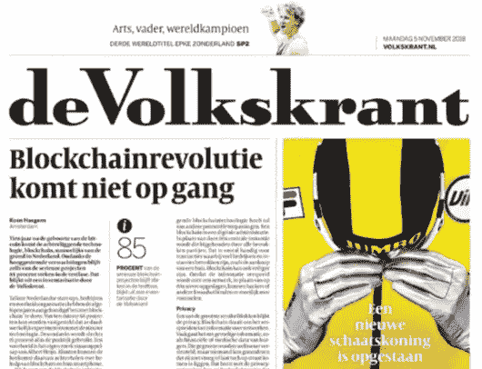

# 区块链 180 个真实用例！

> 原文：<https://medium.com/coinmonks/180-real-use-cases-of-blockchain-5e72938eaded?source=collection_archive---------1----------------------->

哇哦。我无法相信这些天媒体的怀疑态度。是的，当然，我们现在已经进入了幻灭的低谷，但是这个事实是众所周知的，全世界的记者都应该为不谈论它而感到羞耻。当然，他们将不得不投资于实际研究一个主题…当你需要一直制作东西的时候，谁有时间做这些呢？

**“Blockchain revolution does not start…” Headlines of the Volkskrant last week.**

很多文章都在谈论这种被称为“区块链”的令人惊叹的新技术，以及维护比特币网络所需的力量(T3)，但却没有丝毫意识到“媒体本身”每天都在向世界(T4)提供大量垃圾(T5)。你想知道这方面的能源成本。他们最近没有在记者学校或“在职”上经济学课吗？或者这里有不同的动机？也许他们只是不想看到硬币的另一面？*(是的，一语双关……；)*

也许我们正在进行的讨论对一些关键人物非常有利？对于大多数传统媒体来说，这可能是生存下去的唯一方法。如果这是他们唯一的出路呢？这些“人为制造的注意力市场”……一次又一次……将广告收入带到桌面上。越来越多的钱进入一些大玩家的腰包。要是我们能做点什么就好了。嗯……让我们想一想这个问题的解决办法是什么？；)当然，这意味着许多人将不得不开始改变做事方式，而这通常不会一蹴而就。

让我们多谈谈“炒作”和“制造假新闻”。那些有趣的“宣传工具”,几乎不需要来维持所有这些旧经济的工作。如果今天仍然屹立不倒的大型媒体公司不再有存在的必要，那会怎样？所有这些人每天都去所有这些办公室，主要是为了复制我们社会中流动的所有这些信息，如果有一种更好、更可持续的方式来制作内容，会怎么样？

例如，如果那些“记者”真的能做一些适当的研究，那会怎么样？如果“假新闻”和“炒作”不会存在，或者至少不会成为该死的主流，会怎么样？嗯……如果你在未来几年将“闪电网络”的进步加入到制作真实可信的内容中会怎么样？对真正对公众有价值的文章的闪电付款。这可能吗？我想知道你需要什么？

是的，幸运的是，我们所有的市场都有“去中心化”的趋势。你可以猜猜这个过程的核心是什么发展。或者，在这些正在兴起的新市场中，什么是或者将会是安全所必需的？*不用担心，我知道去中心化有多种形式。我们可以单独就此进行不同的讨论，但我认为我们在过去的 500 年里从未有过这样的机会。"

我认为，我们应该努力抓住它是什么，并尝试和试验它。哦，等等，让我们看看…这正是我们正在做的。是的，骗子们也在这么做，那些毫无头绪的人，还有很多发明家。如果有新的可能性需要探索，或者如果我们能以不同的方式做事，罪犯、发明家和“愚蠢的探险者”通常是第一个投身其中的人。此外，还有数千名聪明的开发人员正在开发产品。每天都在改进。不断地塑造它。他们通常不喜欢记者，所以你必须付出一些努力去找到他们。如果你能和他们谈谈的话。我不会低估它。他们也是非常忙碌的人。

> **..对于那些没有得到它的人来说，是的，比特币已经提供了世界各地分散化市场急需的安全性！如果有任何能源成本…*

是的，我真的说了。如果有任何能源成本！但我的意思是从更广阔的角度来看。让我们看看 10 年或 20 年后的情况。事实是，比特币已经提供了很多数字安全保障。相信我这一次。否则，我们就不会再谈论区块链的任何事情了…

不幸的是，与去年所有非常成功的融资轮相反，[一个非常有趣的平台](https://civil.co)上个月没有获得适当的资金。但不用担心，他们肯定不会是最后一个尝试的，这些新记者不会那么容易被打败。他们有能力看到市场将再次繁荣，他们可以进入下一轮。事实上。他们现在仍在开发这个产品，我敢打赌他们会很快得到所需的资金。为什么？因为经济学，当然还有区块链。如今，提供独立、包容、无广告的新闻报道是值得的。看看记者的众筹模式就知道了！

> 好吧，我会原谅记者到处写的愚蠢的文章*……好记者也会犯错！；)*

不管是不是骗局……因为区块链的技术，所有“丢失”的钱仍然在流动。这本身就是一个合适的用例，如果我们足够大，我们可能会拯救整个世界免受即将到来的危机。

那么……区块链是遵循高德纳周期的完美范例吗？是的，似乎很有可能。制造了大量的宣传，许多人投身于这项新技术，许多人交易、诈骗、编造想法、获得资助，然后重返校园，只是为了探索经济学的所有基础知识，并更好地掌握这项新发展。如果我们在几年后看到一些实际数字，我不会感到惊讶，我们会看到“区块链”已经成为有史以来最先进的全球经济学课程。人类历史上最大的知识传播浪潮。

其次。过去几年中创造的所有新的象征性经济都完全是由区块链促成的。如果没有区块链，所有这些实验都不会发生。如果你看到了，或者看不到所有这些进展，那么你应该更深入地研究这个主题。顺便说一句，不要完全专注于一个方面，因为那可能[也会产生一点狭隘的观点](/@ferdousbhai/post-bitcoin-maximalism-19f392610d67)。

因为时间效率问题*(我也必须跑步才能跟上所有真正的加密发展；我从已经存在的东西那里借用了我文章的最后一点。没有必要把任何精力放在已经做好的工作上。等等..区块链不也让这变得更有可能吗？；)*

**在区块链可以做的 10 件事** [**在网上不能做的事**](/@wmougayar/10-things-you-can-do-on-the-blockchain-that-you-cant-on-the-web-523f3ecd03d8) **。**

1.  不经过传统的中介，把钱从一个人汇给另一个人。
2.  成为数字商品、数字收藏品或真实资产的加密代理的唯一所有者。
3.  通过工作获得报酬(通过计算机或人)。
4.  做自己的银行，持有自己的加密货币。
5.  没有任何中央协调机构的买卖。
6.  共享未使用的计算或存储容量，并获得报酬。
7.  将内容存储在一个分散的网络上，永远不会宕机或受到审查。
8.  有助于在区块链上记录一些东西。
9.  使用您赢得的加密货币支付服务或商品。
10.  为您共享的数据赚取加密货币。

至于书名的‘180 个真实用例’。抱歉，那只是典型的误传。或者不是吗？在上面提到的十个论点中，你可以很容易地找到数百个项目在不同行业的不同方面工作。

我不会为你做所有的研究，但如果你想了解更多，请每周二来参加我们的 BlockDam，[Berlage 的 Beurs](http://www.meetup.com/nl-NL/Permissionless-Society/events/bwbnlqyxpbrb/)。我们正在交流知识，并致力于创造一种探索更好的合作方式的方式。这是一种新的工作方式，在这种方式下，你最终会成为负责人。我认为很多人都在寻找那个用例。这可能是下一个杀手级应用！当然是在比特币之后…😉

> "当你的大部分蔬菜还在花园里生长时，你不可能做出完美的沙拉。"

赞美诗我也从文章中引用了这句话…仅这个平台“medium”就有成千上万篇关于区块链和加密的真实发展的文章。在你对一项新技术的进步做出判断之前，请去探索一下。

> [在您的收件箱中直接获得最佳软件交易](https://coincodecap.com/?utm_source=coinmonks)

