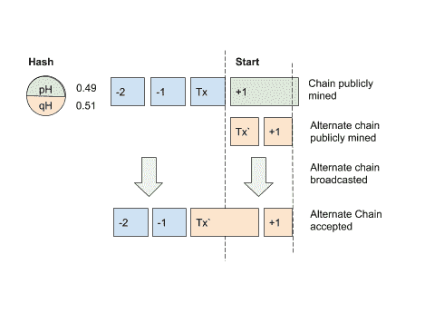

# 1 确认值—一个简单功率确认经验法则

> 原文：<https://medium.com/coinmonks/1confvalue-a-simple-pow-confirmation-rule-of-thumb-a8d9c6c483dd?source=collection_archive---------1----------------------->

## 1ConfValue 是一种推断在网络上执行双重消费活动的成本以及设置概率安全的确认阈值的通用方法。

*这篇文章属于公共领域。这篇文章的 PDF 版本是* [*这里有*](https://drive.google.com/file/d/1wcSe60sWKzSa1-uPCdY3vBkmvtIWcKqt/view?usp=sharing) *。*

# 摘要

我们提出了一个简洁的方法来确定合理的安全确认阈值的任何工作证明链的任何金额的交易。我们这样做的前提是，假设一个双重花费攻击者是一个纯粹的逐利实体，他会寻求在一次攻击中投入最少的资金，并有足够的风险阈值和投资回报。我们发现，对于一个双重花费的攻击者来说，要获得最大的资本效率，他们将租用和/或贿赂现有的 59%的现有散列能力，并招致至少是单个块价值的 2.88 倍的成本。在足够长的结算时间内，这个渐近线大约是矿块价值的 50%。我们称之为“**1 配置价值**”，并对多个链进行了分析，发现对于大多数链来说，由于费用可以忽略不计，所以块价值实质上就是块补贴。这是我们最后一条经验法则，适用于任何权力链和交易价值，包括严格意义上的本地资产。

经验法则如下:

`confirmationsRequired = (transactionValue)/1ConfValue`

`transactionValue = sum(all received transactions in block)`

`1ConfValue = blockValue/2`

`blockValue = subsidy + fees`

# 粉末采矿

工作证明(PoW)挖掘是一个[随机过程](https://en.wikipedia.org/wiki/Markov_chain)，其中每个状态转换仅取决于前一事件中达到的状态。换句话说，下一个事件的可能性每次都被“重置”。如果网络上有两个挖掘器，一个命令 51%散列，另一个命令 49%散列，那么多数挖掘器找到下一个块的可能性总是 51%。此外，寻找解所需的时间也是随机的(是一个[连续时间马尔可夫链](https://mast.queensu.ca/~stat455/lecturenotes/set5.pdf)，这样在*的任何时间*，下一个块将总是在 10 分钟之外。这两个特性意味着任何散列能力的任何挖掘者都可以在网络上进行挖掘，并参与块生产，这是 PoW 的一个非常出色的部分。

这也意味着网络上的所有矿工都受到事件的影响，这些事件只受概率及其在网络上的权重的影响。这意味着没有结果是有保证的，所有行为都是由激励和风险/回报评估驱动的。正是从这个角度出发，我们对重复消费事件进行了推理。

# 双重消费事件

以下是比特币基地接受交易的确认要求阈值:

[Coinbase Confirmation Times](https://support.coinbase.com/customer/en/portal/articles/593836-why-is-my-transaction-pending-)

交易所对 PoW 区块链设置了确认要求，以防止成为“[重复消费](https://en.wikipedia.org/wiki/Double-spending)事件”的受害者。比特币本身没有“最终”的概念，除了 100 块(约 16.6 小时)的 coinbase 限制，这是矿工可以申请 coinbase 补贴的时间段。网络用户通常要等 **6 个街区** (1 个小时)才能接受交易已经充分嵌入到链中。这似乎来自 2012 年 T4 的一篇关于双倍支出的论文，作者是梅尼·罗森菲尔德。

然而，我们认为这不是一个适合现实世界使用的方法，罗森菲尔德的结论更多的是学术性的，而不是现实性的。这项研究缺少以下内容:

*   考虑双重消费事件的动机
*   考虑到获得多数散列率的机制
*   考虑到所需投资，建立一个足够长的备用链
*   概括任何功率链功率确认阈值

罗森菲尔德只考虑了攻击者**是否能赶上并双倍消费，但没有考虑为此要投入多少资金。既然我们认为所有的网络参与者都是理性行为者，并且总是追求利润，那么我们必须考虑他们的动机。为了得到一个足够可靠的经验法则，我们提出了一个问题 ***“什么时候进行一次双重花费活动是有利可图的？”*** 而不是 ***“什么时候接受电力交易是安全？”*** 。**

*双花攻击其实既不是* ***双花*** *也不是* ***攻击*** *。比特币协议选择规范链作为累积难度最大的链。如果一个链被广播到网络上，其累积难度大于网络参与者所接受的正确难度，那么该网络参与者只是具有较差的安全性假设，并且新的链是完全有效的。*

比特币是一个道德体系，对网络参与者进行交易的意图没有任何看法。如果支付接受者释放链外资源以换取不安全的支付，而该支付被替换为替代的(但有效的)链，比特币的属性没有改变，交易也没有“好”或“坏”。

# 对双重消费事件的剖析

我们将扮演一个寻求利润的实体的角色，希望攻击一个安全性假设很差的网络参与者。我们会(向交易所或商家)进行大额存款，将其兑换成另一种货币(或产品)，然后向网络发布备用链，将原始存款返还给我们。如果这是成功的，我们将保留原始存款，加上提款/产品。

这是一个成功的努力，我们必须做一个足够大的交易，我们有足够的经济激励来完成这项活动。在网络上挖掘替代链需要资源，如果财务收益不能为我们带来投资回报，那么我们就不会完成它。

重要的是，这项活动不需要“成本”，而是需要“投资”，这就改变了计算方法。这是因为，如果我们的备用链被接受，那么大宗奖励和交易费将返还给我们。假设生产一块积木的成本总是小于或等于它的价值，那么我们的大部分费用都会得到补偿。

*由于除了我们的目标之外，我们对攻击任何人都没有兴趣(以增加我们的替代链被全球接受的可能性)，我们将保留替代链中的所有其他交易。因此，这只是一个本地事件，全局用户不受影响。从历史上看，这就是双重消费事件对市场价格没有影响的原因，因为在事件发生期间，供应链的质量没有受到影响。*

# 获得多数散列率

我们认为有两种不同的方法可以实现双重消费。第一种是积累秘密的哈希力量，但不要在主链上公开挖掘，直到释放我们的备用链的时候。第二种方法是累积公共散列，在完成目标事务后，将这个公共散列切换到另一个链，公开挖掘。我们希望找到资本效率更高的方法。

在这两种情况下，如果我们有有利的机会，我们只会进行双重支出的努力，这意味着我们的哈希( *qH* )必须超过网络的哈希( *pH* )。罗森菲尔德的发现进一步证实了这一点，即除非诚实的链条将我们的替代链条甩在身后，否则我们将很快增加不可调和的成本。

## 秘密散列

这种情况是，我们从另一个链或网络(比特币 SHA256 应用于 BitcoinCash SHA256，或者 GPU 哈希来自哈希市场，如 [nicehash](https://www.nicehash.com/) )获取秘密哈希，并开始挖掘与目标交易相同的备用链。一旦备用链长了一个块，我们就广播它。

在这种情况下，我们必须获取超过 100%的现有哈希，以便共同控制超过 51%的总哈希。

如果每个街区都有一个预期成本*1 街区成本*，那么投资将需要至少*2 * 1.1 * 1 街区成本*的资本。这还没有考虑随机过程。

## 公共散列

另一种情况是，我们在链上已经有了公共哈希，而不是从其他地方获得，只是将它导向我们的替代链(或贿赂矿工)。在这种情况下，在完成目标事务之前不切换散列是符合我们的最佳利益的。这使得公共链“缺乏”哈希并变慢，从而允许我们在备用链上快速连续地挖掘两个块。只要备用链处理有效块并包括所有非目标事务，它将被网络接受。

再次假设每个区块都有一个预期的“*1 区块成本*”导致事件发生，我们只需要*2 * 0.51 * 1 区块成本*的资金就可以完成它。这是绝对的最低资本要求。

与秘密散列方案相比，公开散列机制显然需要少 50%的投资来实现。公共散列机制的唯一缺点是双重花费事件将在整个时间内完全公开，但是我们不考虑网络不接受它作为有效链的可能性。这主要是因为备用链将包括公共链拥有的所有事务，并且在事务遵从性方面完全有效。

# 考虑概率

在公共散列场景中，我们累积至少 51%的现有散列，然后引导它连续挖掘两个块，使得我们的备用链比公共链领先一个块。由于我们必须处理随机过程，我们不能保证为原始的单个块构建两个块。我们必须权衡这样的风险:尽管我们的散列值更大，但我们无法找到两个街区，甚至无法领先一个街区。

我们可以通过评估我们的“边缘”来解决这个问题，在这种情况下，我们有 51%的哈希与现有网络的 49%哈希，那么我们的边缘是 5%。由于我们在每个数据块上有 5%的优势，并且我们的数据块快了 5%,因此我们将我们的优势进行复合，计算出我们在两个数据块之后领先一个数据块的置信度。

由于我们是一个追求利润的实体，我们必须评估每项努力的风险，并坚持安全限额。我们不认为任何低于 100%的信心水平是可行的选择，因为如果机会对我们不利，我们不能提前一个街区，我们将很快积累计划外的成本。我们选择 100%的限制，以确保我们有两倍于现有矿工的机会。这需要我们积累至少 59%的 hash。

换句话说，鉴于我们的哈希优势，在未来的多少个街区，我们会比其他矿工有两倍的信心领先一个街区吗？然后，我们可以将哈希成本乘以数据块数，计算出我们应该投资多少。对于任何低于 59%的杂碎，成本会迅速膨胀。散列值为 59%时，我们的成本倍数最低，但仍在我们的风险承受范围内。

# 需要投资

我们现在知道，最好的可能情况是积累 59%的公共散列，并在我们的目标事务完成后立即构造一个备用链。我们的成本倍数是现有网络的 1.44 倍，我们需要为最少两个街区这样做，总成本倍数为 2.88 倍。

我们假设我们可以用最少的资本支出来租用/贿赂/构建哈希功能，因此我们唯一需要的投资是运营支出。假设随着时间的推移，开采一个区块的成本接近其自由市场价值，我们对哈希函数的需求越迫切，我们愿意支付的沉没成本越低，我们需要支付的每个区块的市场价值就越接近。这是有道理的，因为这是我们贿赂/租用的现有矿工的机会成本。

因此，为了实现对目标交易的攻击，我们需要至少投资单个块的价值的 2.88 倍。

看看比特币，我们可以看到平均块价值目前约为 12.75 BTC (12.5 的补贴和 0.25 的费用)，因此这将需要我们投入至少 37 BTC 的资本(2.88 * 12.75)。

# 最低交易值

我们现在知道，我们需要投资 37 BTC，以便在我们定义的风险容限内成功地进行双倍支出目标交易。下一个问题是，多大规模的交易足以让我们投资？由于 PoW 的随机过程，这个答案并不是一成不变的。即使我们有足够的哈希，我们仍然可能遇到不利的结果，并很快积累更高的成本。我们需要开采的每一个区块都将再花费 18.5 BTC 的投资资本。假设我们有 100%的信心水平(两倍的把握，我们将比网络更快地挖掘我们的区块)，我们可以安全地攻击一个等于我们总投资(37 BTC)的交易，并使我们的钱翻倍。

我们还可以尝试攻击占我们投资三分之一(等于整体价值)的目标交易。在这种情况下，我们将冒着 37 BTC 赚 12.75 BTC 的风险，利润率为 34%。我们不认为任何更低的价格会带来足够的回报来保证我们所冒的风险。

因此，如果我们的目标交易以一次确认结算，我们将块值的数字定为我们试图攻击的最低交易值。但是，如果我们必须等待更长时间的目标交易确认结算，则每次确认的成本会降低:

随着时间的推移，每次确认的价值会减少，直到约为区块价值的 50%。这是因为第一次确认需要生产两个块，而第二次确认间隔只需要三个，所以不是线性的。绘制出 100 个确认:

# 考虑到西比尔的攻击

如果我们知道目标将监控和标记大额交易，我们将能够通过发送较小金额的交易来应对这种情况，但目的是在同一个块中确认所有交易。我们甚至可以使用不同的地址。目标将假设他们正在与不同的实体进行交易，但是收到的所有交易都来自我们。

因此，我们可以使用整个区块空间向目标发送小额交易，并在我们的备用链中重定向它们。对我们来说，所有交易的整体价值仍然值得投资。

# 动力链分析

使用这个令人惊讶的简单经验法则，我们可以计算比特币、比特币现金、比特币 SV、以太坊、莱特币、Dash 和 Dogecoin 的最低 1 配置值，以其本地资产和美元价值计算:

我们看到，除了比特币之外，所有链条中的费用都可以忽略不计。(以太坊有变化不定的大叔奖励，但这些都算在补贴里)。因此，对于一般情况，块价值=块补贴。

我们最后重新审视比特币基地的确认要求，将其与我们的方法进行比较，并计算出最高 25，000 美元的存款(比特币基地每日限额):

我们可以看到，任意 6 确认要求(很可能来自罗森菲尔德的研究)远远超过了 25，000 美元比特币存款的要求。比特币现金和以太坊经典看似合适，但以太坊、莱特币和 Zcash 显得明显不安全。

# 摘要

我们扮演了一个理性的逐利实体的角色，希望利用目标商家或交易所糟糕的安全假设。我们分析了累积秘密散列和接管大部分公共散列，并意识到累积 51%的公共散列更节省资本。我们确定了一个置信水平为 100%的风险容忍度，并计算了所需的最小散列值，即 59%。这要求我们以市场价格购买散列值时，至少要投入单个块成本的 1.44 倍，这是由每个块的自由市场价值决定的。然后，我们计算了 1 到 100 个沉降确认计数，并意识到它渐近为一个区块值的 50%。我们称之为“ **1ConfValue** ”，并对多个连锁店进行了分析，发现对于大多数连锁店来说，费用可以忽略不计，因此我们只需要考虑批量补贴。这是我们最后一条经验法则，适用于任何权力链和交易价值，包括严格意义上的本地资产。

*感谢****Nic Carter****鼓励我发表这篇文章，感谢****Anthony Lusardi****提供关于 sybil 攻击的反馈。*

> [直接在您的收件箱中获得最佳软件交易](https://coincodecap.com/?utm_source=coinmonks)

在 twitter 上关注我，我研究并撰写关于比特币的文章。

 [## 地方官

### JP 的最新推文(@jpthor__)。比特币将成为全球储备货币。特斯拉将成为世界第一…

twitter.com](https://twitter.com/jpthor__) 