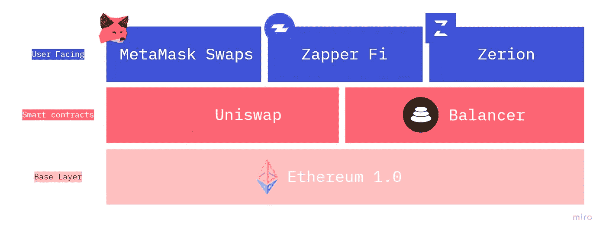

# 可组合钱包对用户和开发者的重要性

> 原文：<https://medium.com/coinmonks/1the-importance-of-composable-wallets-for-users-and-developers-accb2aadff49?source=collection_archive---------0----------------------->

## 了解以太坊钱包的历史，什么是 Access Legos，以及这两者对 dapp 开发和可用性的影响。

在之前，我已经讨论过[分散式应用程序(dapps)的产品可组合性，但是使用了一个相当简化的技术堆栈图:](/coinmonks/crypto-and-web-3-0-are-the-future-of-product-and-work-3d19e3733181)

