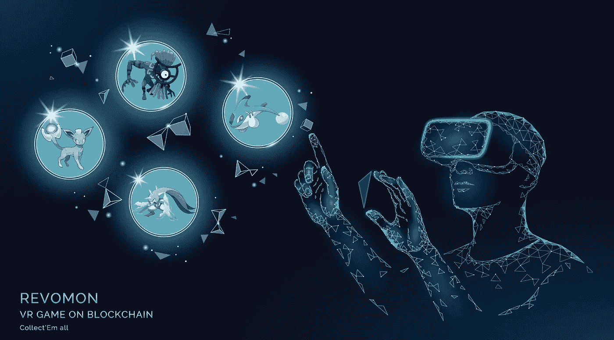

# 2 个挑战 Axie Infinity 的新游戏项目

> 原文：<https://medium.com/coinmonks/2-new-gaming-projects-which-can-challenge-axie-infinity-bef43080fc6?source=collection_archive---------0----------------------->

[https://www.trade-and-opportunity.com/revomon-revo-un-jeu-de-monstres-a-collectionner-melant-nfts-et-realite-virtuelle/](https://www.trade-and-opportunity.com/revomon-revo-un-jeu-de-monstres-a-collectionner-melant-nfts-et-realite-virtuelle/)

欢迎光临！今天 [**Fatpigsignals**](https://www.fatpigsignals.com/) 我和我将向你们介绍两个元宇宙项目和它们的加密货币，它们也是臭名昭著的加密游戏之王的潜在挑战者。当然，我们谈论的是无限轴。

他们离与 Axie Infinity 竞争还有很长的路要走。这里介绍的两个元宇宙硬币项目仍在开发中…