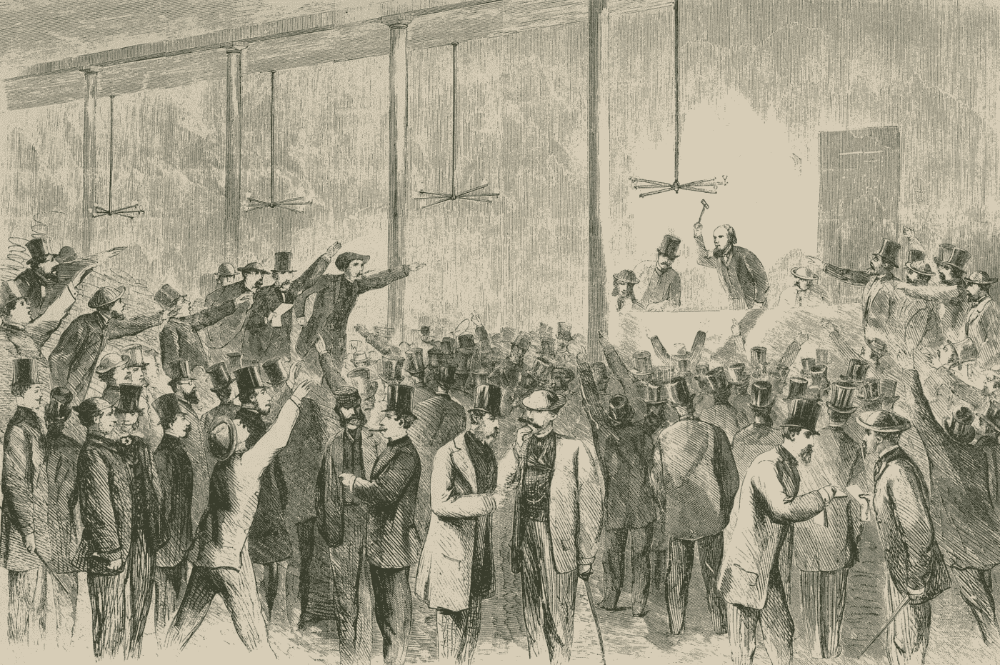

# 大玩家在以太坊上领先用户的两种方式

> 原文：<https://medium.com/coinmonks/2-ways-how-big-players-can-frontrun-users-on-ethereum-29a26eb2d4fe?source=collection_archive---------1----------------------->

## 彼得·克里斯和格莱布·乌尔瓦诺夫

一年前，我们在柏林技术大学参加一个会议，观看了一个关于以太坊现状的小组讨论。我们的 CTO gleb 问了一个困扰他一段时间的问题:

"是什么阻止了矿工用他们自己的事务替换用户事务和前端运行？"

尽管在房间里感觉像一头大象，但答案是:“没什么。我们只能希望矿工们诚实，不会那样做。”

当时，这不是一个显而易见的问题，但时代已经变了。在过去的一年里，[分散金融(DeFi)](https://blog.coincodecap.com/the-ultimate-guide-to-defi-decentralized-finance) 的加密子领域变得越来越受欢迎，并呈持续上升趋势。随着 DeFi 的增加，用户越来越依赖于分散交换、租借协议和其他应用程序。

随着这种激增，我们还注意到利用 MEV(Miner 可提取价值)的攻击越来越多。2019 年，在康乃尔大学 Arxiv 上发表的一项[研究](https://arxiv.org/abs/1904.05234)中描述了这一点，试图量化矿工的恶意行为。矿工可提取价值是指矿工通过以最有利于他们的方式重新排序块内容，在用户经济损失的情况下可预测的收益。

出于实际原因，我们将在其他类型的分布式系统中使用挖掘器可提取值术语，其中挖掘器被称为块生产者或验证者(例如，在股权证明系统中)

当与智能合约交互时，用户在区块链上公开他们的操作，这是由于其公共分类账的性质。采矿者能够通过前置运行、交易重新排序或其他机制利用这些信息。

# **潜得更深**

矿工最常通过抢先投资来利用 MEV。

在前端运行时，挖掘器监视传入的事务流，并计算哪些事务会导致。由于区块链是确定性系统，因此甚至可以在块中包含事务之前预测其影响。

**例 1** :简单朴素的场景是一个导致价格上涨的购买订单。矿工可以创建自己的购买订单，并将其放在用户订单的前面，利用价格上涨的机会。

让我们想象重新排序是不可能的。在这种情况下，挖掘者仍然可以拒绝将某个事务包含到块中。这种操作仍然可以产生与新事务执行速度比原始事务更快类似的效果。

**例 2** :智能合约中有一定数量的令牌等待任何没有特定权利或津贴的人来认领。第一个要求这些免费的钱将得到他们。此类[情况](/@danrobinson/ethereum-is-a-dark-forest-ecc5f0505dff)可能因合同代码错误、用户错误而发生，也可能是故意造成的(例如出于营销目的)。一旦要求这些令牌的事务到达共享内存池，矿工就能够识别结果，并自己执行类似的事务。一个类似的二重身交易与一个改变的受益人被发布并立即包括在块中，保证矿工将要求令牌。在复制品交易之后，原始交易是被完全拒绝还是被包括在块中并不重要——无论是哪种情况，复制品交易的发行者都将收到来自自由资金的全部收益。

因此，即使挖掘器不能控制事务的执行顺序，由于挖掘器有能力选择性地控制哪些事务要包含在块中，MEV 仍然是可能的。

# **两种类型的取值**

为了进一步研究 MEV，我们确定了两种可能的力量。这些权力导致了两种类型的价值提取:通过抢先提取价值( **VEF** )和通过拒绝提取价值( **VER** )。

值得一提的是，不仅是块生产者，每一个拥有上述权力之一的参与者都能够执行价值提取。支付更高费用的能力很可能被视为控制街区内交易秩序的有限权力。本质上，以太坊网络上的每个参与者都有这样的力量，使得抢先跑成为可能。

然而，拥有控制执行顺序的优越权力的参与者拥有最终决定权。如果有一个区块生产商决定通过领跑来提取价值，那么无论费用多少，其他领跑者都不能为自己提取价值。换句话说，如果网络上的每个矿工都进行 VEF，通过支付更高费用来抢先交易的尝试将会失败。

说到 VER，我们可以想象一个事务池收集事务，并进一步将它们传播给矿工或矿池。不参与挖掘过程的以太坊节点就是这种事务网关的好例子。这些节点检查事务的有效性，传播有效的事务，并丢弃无效的事务(无论如何，挖掘器不会将无效的事务包含在块中)。为了执行 VER，节点所有者必须修改有效性检查过程以拒绝事务。如果我们示例中的令牌声明事务到达池，它可能会被拒绝并立即被池软件替换。因此，即使池不参与块创建，拥有拒绝事务的权力也使其能够通过拒绝来提取价值。

# **这是怎么解决的？**

从根本上说，有两种方法可以消除矿商利用 MEV 的机会，让区块链变得更加公平:

1.  没有要提取的值

区块链用图灵-完全智能契约很难证明有些契约永远不能引起 MEV。因为每个人都可以自由设计他们想要的任何应用程序，所以一些应用程序可能会引入可提取的价值。

另一方面，在设计具有有限功能集的特定应用区块链时，可以考虑预防 MEV。在这种区块链的代码中不会有导致值提取的操作。因此，即使控制块内容的权力被提供给某个参与者组(例如块生产者)，通过 VEF 和 VER 提取也没有价值。

2.无法提取值

这可以通过防止任何网络参与者能够重新排序或拒绝来实现。没有这些力量，VEF 和 VER 将变得不可能。这是曼加塔团队目前正在探索的方法。

# **总结思路**

除了迄今为止确定的两种价值提取机制之外，还可能有其他类型的力量导致一种新的、未知类型的价值提取机制。

这些机制中的一些可能包括共识攻击，例如时间强盗攻击，其中矿工被激励重写历史以利用过去的块，或者分叉攻击，其中链叉由于 MEV 而更有价值。攻击的复杂性使得如何将它们包括在分类中变得不清楚——这是一项有待完成的工作。无论如何，每个攻击媒介都应被视为保护链的完整性和价值。

随着共识水平的讨论，它提出了关于 MEV 预防如何影响系统的整体安全性或活性的问题。

如果我们想让**信任**回到**不信任**区块链(双关语)，我们必须寻求解决方案，以最大限度地减少恶意攻击，增加所有区块链参与者的平等。

# **关于曼加塔:**

网址: [https://mangata.finance](https://mangata.finance)

推特:【https://twitter.com/MangataFinance 

邮箱: [hello@mangata.finance](http://hello@mangata.finance)

电报:[https://t.me/mgtfi](https://t.me/mgtfi)

不和:[https://discord.gg/H9mQEun2](https://discord.gg/X4VTaejebf)