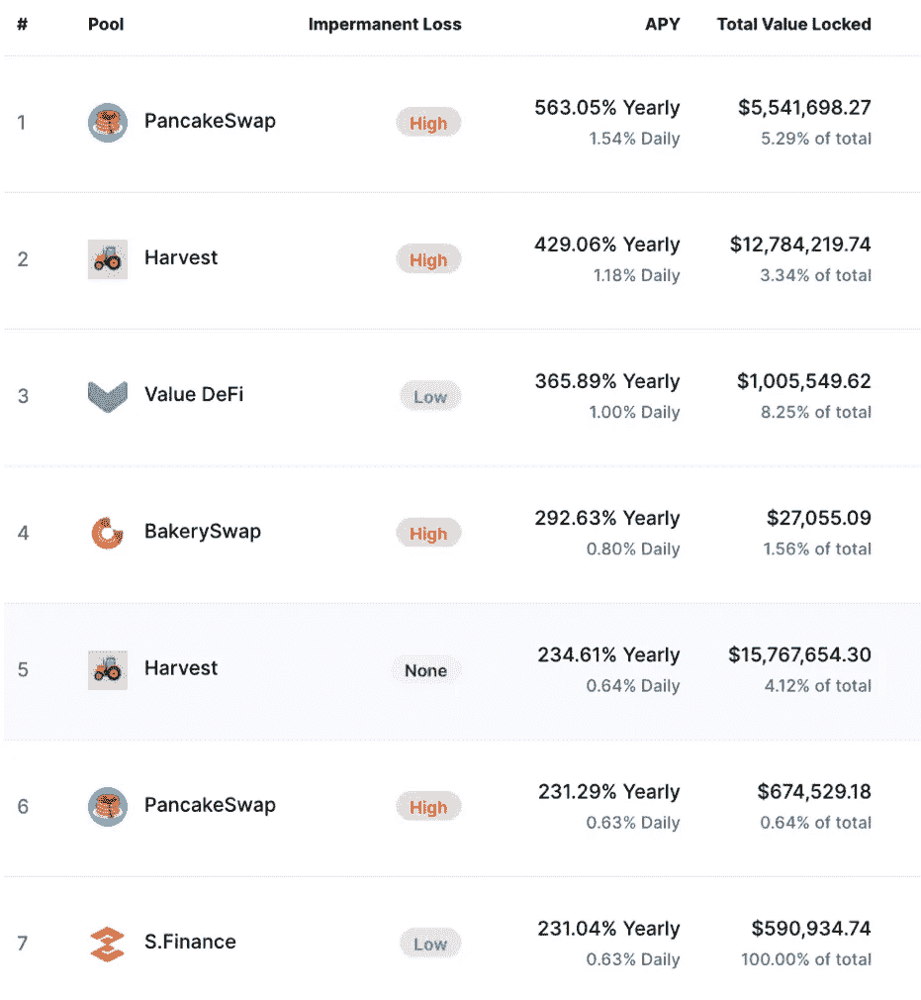

# 2020 DeFi 圣经——进入 DeFi 空间前必须知道的 5 件事

> 原文：<https://medium.com/coinmonks/2020-defi-bible-5-must-knows-before-you-enter-the-defi-space-2f9fe87c0e95?source=collection_archive---------3----------------------->

## 分散融资指南:从 500%收益率到 2400 万美元黑客

eFi，DeFi，DeFi。2020 年密码领域所有人舌尖上最热门的流行语。理应如此吗？“分散金融”的潜力是巨大的。乍看之下，它极具破坏性:否则怎么可能在“收益农业”账户上赚取 500%的年利率？然而，我想到的第一个问题是“什么？500%?这怎么可能呢？更别说可持续了？”

业内资深人士以前都见过。上一次是在 2017 年，当时 ICO 投资(或者投机？)的回报率在 10 倍至 1000 倍之间，之后整个市场陷入了持续两年的秘密熊市。根据行为金融学的规定，当实际上是时候退出的时候，绝大多数人都涌向一个新趋势。许多许多 2017 年 ICO 热潮的后来者没有看到他们投资组合的 10 倍，而是负 80%或更低。这是简单的市场动态，但没有什么能打败心理。同样没有帮助的是，绝大多数项目都是骗局，或者缺乏团队、愿景、实施的正确组合，以实现他们的承诺。

所以是的:做你自己的研究(DYOR！).让像我这样的人来帮助你，为你提供一个框架来理解基本原理、问号和感叹号。DeFi 很有前途。DeFi 充满了风险。DeFi 现在是同时存在的。但从更大的角度来看，2008 年比特币的出现以及随后过去 12 年密码世界的发展，是通过新技术引入非传统的金融思维和互动方式的第一步。从那以后，加密领域继续以指数速度发展，更新的加密货币和区块链技术不断涌现。DeFi 是下一步。它位于当今区块链领域创新的最前沿，不会阻碍它遇到的每一项金融服务。

与此同时，DeFi 人气飙升，其市值在 11 月份徘徊在 110-120 亿美元左右，与 6 月份的 10 亿美元相比，增长令人印象深刻。

Total value locked in DeFi has grown from $1B in June to $12B in November. (Source: [https://defipulse.com)](https://defipulse.com))

这就留下了一个问题:DeFi 到底是什么，为什么这么多人在谈论它？

*(PS:喜欢看的别忘了鼓掌！；-) )*

# **1。什么是 DeFi？**

加密货币的主要目标和目的之一是让任何人、任何地方都能普遍使用货币和支付。DeFi 更进一步，将其他传统金融服务——储蓄、贷款、交易、保险等——向世界各地的任何人开放。

通过加密货币和去中心化应用程序(dApps)等去中心化技术，任何拥有智能手机或支持钱包和互联网连接的人都可以利用他们可能无法通过传统方式获得的各种金融服务。换句话说，DeFi 的开发将区块链技术的应用从简单的价值转移扩展到了更复杂的金融用例。

> DeFi 的发展将区块链技术的使用从简单的价值转移扩展到了更复杂的金融用例，包括储蓄、贷款、交易、保险等等。

几乎所有的 DeFi 应用都建立在区块链以太坊上，这是仅次于比特币的世界第二大加密货币平台。以太坊主要是为创建和执行智能合约而设计的，这使得构建简单交易之外的其他类型的 dApps 变得更加灵活和容易。

智能合约是在区块链上运行的程序，当写入其中的特定条件得到满足时，这些程序会自动部署。举个简单的例子，智能合约可以被编程为在每年的圣诞节向另一个用户释放资金。但智能合约也可以让开发者构建复杂的 dApps，提供发送和接收加密货币之外的功能。DeFi dApps 可以创造稳定的收入，贷出资金并赚取利息，获得贷款，用一种资产交换另一种资产，甚至实施先进的自动化投资策略。

# **2。DeFi 套件**

一些最受欢迎的 DeFi 应用类型包括:

## I .分散式交易所(DEXes ),您拥有自己的钥匙

DEX 允许用户通过以太坊区块链上的智能合约直接相互买卖他们的密码，而无需中央权威机构。它有效地排除了任何中间人(特别是集中式加密交换)，因此用户可以重新控制他们的财务，不再需要将他们的钱委托给政府、金融机构或中央银行。

去中心化的交换平台(DEXes)如 [AirSwap Team](https://medium.com/u/b501917dd00d?source=post_page-----2f9fe87c0e95--------------------------------) 、 [Bancor](https://medium.com/u/2bd55d9e5fb5?source=post_page-----2f9fe87c0e95--------------------------------) 、 [IDEX](https://medium.com/u/b8cfa4a35001?source=post_page-----2f9fe87c0e95--------------------------------) 、 [paraswap](https://medium.com/u/3f01b85ff130?source=post_page-----2f9fe87c0e95--------------------------------) 、 [SushiSwap](https://exchange.sushiswapclassic.org/#/swap) 架构都略有不同。目前最流行的指数之一是分散交易协议。Uniswap 是一个完全分散的加密货币交易所，它使用自动做市商来自动结算交易，并允许用户直接从他们的钱包中交易流行的令牌。

作为对早期社区成员表示感谢的前所未有的举措，Uniswap 在 10 月份进行了一次[空投](https://airdrops.io/uniswap/)，向 2020 年 9 月 1 日之前创建的、在 Uniswap v1 或 v2 上至少进行过一次交易的每个地址赠送 400 个 [UNI](https://uniswap.org/blog/uni/) 。当时，400 UNI 的价值在 1600 到 3200 美元之间，目前徘徊在 1000 美元以下。拥有多个地址的用户确实从这份意外的礼物中受益匪浅。此外，在 Uniswap 的最新版本中(发布时间待定)，UNI token 持有者将从通过该平台进行的每笔交易中获得一定比例的佣金。

Uniswap conducted an [airdrop](https://airdrops.io/uniswap/) in October 2020, giving away 400 [UNI](https://uniswap.org/blog/uni/) to each address created before September 1, 2020, that conducted at least one transaction on Uniswap v1 or v2\. At the time, 400 UNI was worth between 1,600 and 3,200USD, and currently hovers under 1,000 USD.

## 二。借贷——更高的收益，更低的成本

借贷平台可以说是 DeFi 增长最快的领域，它通过智能合约将各方联系起来，而不是将管理工作留给银行。贷方可以向企业提供贷款或存款，并在其他人借入其资产时赚取利息。由于中间商被排除在交易之外，贷方能够获得更高的回报。

Compound 是一个受欢迎的区块链借贷 dApp 的例子。用户可以借出他们的密码并从中赚取利息，或者将加密货币存入复合智能合约作为抵押，以便借入资金。由于其分散的性质，用户不必指定他们的个人资料(姓名、财务历史等。)而他们的抵押物足以获得贷款。借款/贷款利率根据供求关系通过算法进行调整。

Source: Compound.finance website.

## 三。稳定的化合物——即时加工，低挥发性

[稳定货币](/the-capital/why-stablecoins-a-comprehensive-overview-of-their-foundations-and-future-8b6e6c30054d)是波动性较小的加密货币，因为它们的价格与美元等储备资产或黄金等大宗商品挂钩。将消除对价值波动的疑虑与即时处理以及加密支付的安全性和隐私性相结合，它们提供了强大的价值主张。

[包装比特币](https://wbtc.network) (WBTC)是市值最高的[代币之一，在撰写本文时市值约为 16 亿美元，排名第二。WBTCs 是一种将比特币发送到以太坊网络的方法，因此它们可以直接用于以太坊的 DeFi 系统。它允许用户通过分散式借贷平台借出的比特币赚取利息。其他受欢迎的 DeFi stablecoin 项目还有](http://coinmarketcap.com/defi/)[马克尔道](https://medium.com/u/743224aba00c?source=post_page-----2f9fe87c0e95--------------------------------) ( [戴](https://makerdao.com/en/))和[美元币](https://www.coinbase.com/usdc) (USDC)。

## 四。预测市场——以更低的费用和更高的赔率下注

分散预测市场协议允许用户在没有中介的情况下对未来事件的结果进行下注，例如选举。传统的博彩平台倾向于通过高收费、低赔率和各种限制从客户那里获取最大价值。像[August](https://medium.com/u/f4d568271227?source=post_page-----2f9fe87c0e95--------------------------------)和 [Guesser](https://medium.com/u/8c2547f8c77e?source=post_page-----2f9fe87c0e95--------------------------------) 这样基于区块链的预测市场正在通过提供一个去中心化的点对点交易所来改变这种情况，从而实现对其市场的全球透明访问。由于低费用和更好的赔率，用户保留了更多的奖金(感谢群众的智慧)。来自 [coindesk](http://coindesk.com/what-is-defi) 的一项观察指出" *DeFi 有可能提高人们对预测市场的兴趣，因为它们传统上不被政府所接受，并且在以集中方式运行时经常被关闭。*”

## 动词 （verb 的缩写）不赔钱的彩票——玩彩票不输钱

另一项 DeFi 服务包括参与无损失彩票。 [PoolTogether](http://pooltogether.com/) 是一种不输钱的游戏，参与者将戴的赌金存入一个共同的彩池。每个月底，一名幸运的参与者赢得所有利息，其他人拿回他们的初始存款。

## 不及物动词合成资产——押注现实世界的资产，但不持有它们

[Synthetix](https://www.synthetix.io/) 是一个建立在以太坊上的代币交易平台，允许用户创建和交换现实世界资产的合成版本。它允许用户以 ERC 20 代币的形式押注加密资产、股票、货币、贵金属和其他资产，而无需持有实际资产。合成资产由锁定在合成合约中的超额抵押品支持。Synthetix 在 2019 年升至 DeFi dApp 图表的顶端，并专注于在 2020 年过渡到[分权治理结构](https://blog.synthetix.io/transition-to-decentralised-governance/)。许多人期待的大合成功能是当它达到“在以太坊之上交易特斯拉和苹果股票的能力”。

> 在以太坊上交易像特斯拉和苹果这样的股票，而不需要实际持有股票。

## 七。Robo-advisors —基于自动化智能合约的投资组合

尽管对 DeFi 领域来说相对较新，但在机器人顾问的帮助下，DeFi 的投资者可以获得尽可能高的收益率。投资者通常需要持续关注合约，并迅速进行重新配置，以获得最佳收益。但现在，一个机器人顾问(通过智能合约设计和设置)可以为投资者进行监控和分配。例如，一个价值 500 万英镑的 ETH 投资池将自动转移到一个平台，该平台为基于 ETH 的衍生品提供最高比例的抵押品。

[Staked](https://medium.com/u/2e226f754735?source=post_page-----2f9fe87c0e95--------------------------------) 的收益机器人顾问( [RAY](http://staked.us/v/robo-advisor-yield) 和 [Rari Capital](https://medium.com/u/be5c2f03de20?source=post_page-----2f9fe87c0e95--------------------------------) 是两个受欢迎的机器人顾问，它们自动执行寻找高收益机会的过程。RAY 的目标是持有 ETH、或戴的投资者，他们可以将自己的资产放入一个资金池，让智能合约自动将资金池(或部分资金池)投资于收益率最高的合约。Rari Capital 的运作原理与此相同，但它更进了一步，为不同风险偏好的用户提供了三个独立的资金池。

The top 10 DeFi projects in market cap. Source: [CoinMarketCap.com](http://coinmarketcap.com)

# **3。为什么狂热？**

DeFi 热潮及其指数式增长是由其潜在的好处以及毫无疑问一直存在的“对错过的恐惧”推动的。特别是，DeFi 的“FOMO”可以归因于产量农业项目承诺的令人震惊的高产量，这些项目利用了人类的弱点和快速致富的愿望，几乎没有努力或责任。[高产农业项目的产量](https://coinmarketcap.com/yield-farming/)可以从 500%的幻觉年百分比产量(APY)到 0.57%的低 APY，有许多项目处于中间范围。

The yield farming projects with the highest Annual Percentage Yield (APY). Source: [CoinMarketCap](https://coinmarketcap.com/yield-farming/).

巨额回报的诱惑难以抗拒，诱使许多人涌向 DeFi 和产量农业，而不了解其中的风险。然而，让我们暂时把 DeFi 的风险放在次要位置，考虑一下让 DeFi 如此引人注目的许多好处和优势。

## I .分散式—快速智能合同部署，几乎不需要人工干预，成本更低

DeFi 的主要优势之一是它的分散性和摆脱了各种交易中的中间商。由于智能合同而不是集中式系统或人工看门人是 DeFi 运营的核心，因此它们可以快速部署并在很少或没有人工干预的情况下运行，成本更低。没有中间人也意味着用户不需要将他们的钱委托给第三方，因此他们有权直接控制自己的资金。

## 二。透明——人们可以验证区块链上发生的任何和每一笔交易

DeFi 代码和交易在区块链上是透明的，任何人都可以查看或审计。这种透明性与用户建立了信任，因为任何人都有机会验证和理解合同的功能或发现缺陷。尽管交易活动是公开的，任何人都可以查看，但它们在默认情况下是匿名的，因此用户的私人信息仍然受到保护。

## 三。全球性、无权限和包容性—任何人、任何地方、任何时间

DApps 旨在实现全球化、“无权限”和包容性。这意味着任何人，任何地方，任何时间都可以访问相同的 DeFi 服务和网络，只要他们有互联网连接。传统的金融服务通常要求你填写冗长的个人信息表格，并且有一定的限制，与此不同，任何人都可以从他们的加密钱包中创建和使用 dApps。

> 只要有互联网连接，任何人、任何地方、任何时间都可以访问相同的 DeFi 服务和网络。

## 四。互操作性——开源支持乐高式的可组合性

DeFi 应用程序背后的代码是开源的，任何人都可以查看，所以任何人都可以用代码作为构建模块来“编写”新的应用程序。DeFi 的可组合性带来了无限的可能性，因为 DeFi 应用程序可以像“金钱乐高”一样组装起来，以构建新的金融产品。例如，用户可以购买稳定的硬币 DAI，然后将其以复利形式贷出以赚取利息。

> DeFi 的模块化可组合性带来了无限的可能性，因为 DeFi 应用程序可以像“金钱乐高”一样组装起来，以构建新的金融产品。

## 动词 （verb 的缩写）赚取利润的机会—以更低的成本获得更高的利息

世界各国中央银行的利率保持在可怜的数字上，而且似乎随着时间的推移越来越差。当前美国利率美联储(基准利率)为 0.250%，英国利率 BoE(基准利率)为 0.100%，欧洲利率 ECB(基准利率)为 0.000%。相比之下，DeFi 为用户提供了从贷款平台(如上所述)或产量农业中赚取利息的机会。由于中间商和央行被排除在任何操作之外，用户往往会获得更高的利息。

# **4。挑战和风险**

不要犯错误，定义是有风险的。尽管 DeFi 生态系统已经展示了其优势和潜力，但它并非没有风险和挑战。与我们习惯的传统金融系统相比，作为一个年轻的金融系统，整个密码世界仍在发展，并在消除其皱纹的过程中。这需要时间，也意味着了解当前 DeFi 中存在的风险非常重要。脑海中立即闪回 2017 年的 ICO 热潮。

## 一、2017 年 ICO 热潮的重演？

1 min overview of ICOs over the period 2014 — Early 2018\. Source: [https://medium.com/hackernoon/a-comprehensive-guide-to-icos-crypto-funding-the-rise-the-boom-the-bust-the-next-b159fdf38010](/hackernoon/a-comprehensive-guide-to-icos-crypto-funding-the-rise-the-boom-the-bust-the-next-b159fdf38010)

[2017 年的首次硬币发行(ICO)热潮](/hackernoon/a-comprehensive-guide-to-icos-crypto-funding-the-rise-the-boom-the-bust-the-next-b159fdf38010)让加密市场大吃一惊，因为它创造了超过 60 亿美元的收入，是 2013 年至 2016 年间收入总和的四倍。ICOs 彻底改变了众筹，帮助加密初创企业以最低限度的责任吸引了创纪录的资金，是的，[一份永无止境的风险清单。](https://hackernoon.com/a-comprehensive-guide-to-the-next-generation-of-crypto-funding-v-ico-ieo-daico-eto-sto-939909782da6)这导致很大一部分项目据报道是由骗子操作的(根据 Statis Group 的[研究](http://research.bloomberg.com/pub/res/d28giW28tf6G7T_Wr77aU0gDgFQ)超过 80%)，而许多其他项目因未能为投资者带来正回报而破产。 [Deadcoins](http://deadcoins.com/) 已经记录了 780 枚硬币是骗局，超过 1000 枚硬币已经死亡。是的，另一个与当前 DeFi 热潮类似的是，嗯，疯狂的名字。从 2017 年的 JesusCoin、ButtCoin 和 CryptoMeth 到 2020 年的 PancakeSwap、SushiSwap 和 BakerySwap。如果事后来看有一件事是清楚的，那就是 2017 年的 ICO 炒作是短暂的，整个加密领域在 2018 年初陷入了熊市。难怪越来越多的人担心 DeFi 热潮是否会重演，项目逐渐消失，许多人可能会损失很多钱。

## 二。智能合约错误—毁灭性的漏洞

与网络和数字世界中存在的任何事物一样，智能合约容易受到无意的编程错误和恶意黑客的攻击。在 dApp 的开源代码中发现漏洞的黑客可以很容易地利用它们，导致数百万美元的瞬间流失。过去的一个很好的例子是[奇偶校验黑客攻击，由于智能合同](/ngrave/the-history-of-crypto-hacks-top-10-biggest-heists-that-shocked-the-crypto-industry-828a12495e76)中的一个错误，超过 600，000 ETH 丢失。最近的一个典型例子是 10 月 26 日发生在[的 Harvest Finance 黑客攻击](http://cryptobriefing.com/hackers-drain-defi-protocol-harvest-finance-24-million/)，在不到 7 分钟的时间里，2400 万美元从 Harvest Finance 的 stablecoin 和 BTC 资金池中被取走。黑客攻击导致 Harvest 的治理令牌农场暴跌 60%,由于流动性提供者逃离平台，总流动性减少了 4 亿美元。

*On October 26 2020, Harvest Finance’s FARM coin plummeted almost 60% on the news of a $24M hack and a subsequent $400M drain in liquidity as liquidity providers fled the platform. Source: CoinMarketCap.com.*

虽然智能合约的缺陷和漏洞是一种风险，但像 [Nexus Mutual](https://nexusmutual.io/) 这样的团队正在建立分散保险，以在智能合约被黑或失败的情况下覆盖用户。以太坊上的开放平台“*使用以太坊的力量，因此人们可以共同分担风险，而不需要保险公司*。

 [## 黑客流失 DeFi 协议收获 2400 万美元财务|加密简报

### 黑客从 Harvest Finance 的 stablecoin 和 BTC 资金池中获得了价值 2400 万美元的 USDT 和 USDC stable coin。丰收的…

cryptobriefing.com](https://cryptobriefing.com/hackers-drain-defi-protocol-harvest-finance-24-million/) 

## 三。高产农业——高风险高收益

高产农业可以说是 DeFi 激增背后的时髦词。产量农业的概念出现在 DeFi 运动中，作为一种在加密货币上获得可观收益的新方法。币安学院将高产农业解释为分散金融的西部荒野，农民们竞相争取种植最好的农作物。“收益农民使用(秘密)策略在不同的借贷市场之间转移他们的密码，以最大化他们的回报。这种对高收益的追求非常复杂，风险很大，通常不适合普通用户。

> 人们太容易被炒作所迷惑，被高得离谱的收益率所蒙蔽。如果你不小心或者根本没有意识到风险，比如未经审计的智能合同中隐藏的后门，你越来越有可能被烧伤。— [为高产农业定义脉搏。](http://defipulse.com/blog/rari-capital-v2/)

## 四。区分好的和坏的项目

根据[coin desk](https://www.coindesk.com/binance-ceo-defi-cannibalize-crypto-exchange),“*一种‘一切皆有可能’的文化在 DeFi 蓬勃发展，从 Yam 到 SushiSwap 等名字荒谬的项目一夜之间流行起来，但很快就消失了*。一般用户很难区分好的 DeFi 项目和坏的项目，导致许多用户被欺诈项目欺骗或投资注定失败的项目。在互联网上快速搜索就会发现许多恐怖故事，这些故事来自于那些一夜之间损失了数千美元或遭受农业诈骗的人(例如约翰·多伊因一个欺诈性的产量农业项目损失了价值 14 万美元的 Uniswap 的 UNI 代币)。已经有许多失败的项目，可悲的现实是，可能会有更多的失败项目。这绝对感觉像 ICO 热潮。

## 动词 （verb 的缩写）安全性—所有风险中最大的风险

就像你后口袋里的传统钱包容易受到扒手灵巧手指的攻击一样，加密货币的数字特性为网络攻击敞开了大门，除非它们得到妥善保护。[使用安全解决方案保护和存储加密货币的基础知识](/ngrave/keeping-your-crypto-safe-solving-the-private-key-paradox-4510e5c9f92c)需要加密货币所有者理解和实践。智能合约的漏洞已经是一种风险，而且通常超出了一般用户的控制，因此加密货币所有者必须尽可能减少他们的数字资产对黑客的脆弱性。安全解决方案包括通过使用冷钱包来拥有自己的私钥，其中[n rave](https://medium.com/u/d48e69debcf1?source=post_page-----2f9fe87c0e95--------------------------------)的[n rave](https://www.ngrave.io/)ZERO 是可用的“最冷”数字钱包。另一个挑战是，用户很难管理多个平台上的多个地址来访问他们的资产和数据。最近推出的 DeFi 钱包(同类产品中的第一款)， [Frontier](https://medium.com/u/7d5725797aeb?source=post_page-----2f9fe87c0e95--------------------------------) ，通过将用户的所有钱包合并到一个单一的集成界面中，而不共享他们的私钥，解决了这一问题。它使用户能够以一种新颖和安全的方式跟踪、查看和管理多个钱包、资产和协议。

# **5。DeFi 的未来如何？**

Whilst DeFi 的发展和它所代表的创新金融技术是非常令人兴奋的，它还远远没有准备好被大规模采用。虽然 DeFi 已经成功地向那些传统上无法获得金融服务的人开放了金融服务，这反过来吸引了越来越多的人参加 DeFi 运动，但很难说 DeFi 是否能够摆脱其狂野的西部感觉，并成熟到足以被主流接受。

## 一、技术炒作周期

作为一个处于发展中的年轻行业，几个挑战和变化威胁着 DeFi 的未来。如果有的话，它将不得不经历技术采用的典型阶段，通常被称为“技术炒作周期”。回到 2019 年，我在 ICO 热潮的背景下写了一篇关于这个周期的[文章](https://rubenmerre.medium.com/ico-101-the-initial-coin-offering-hype-cycle-3855274ac2ff)。当我们审视 DeFi 目前所处的阶段时，它最有可能处于创新触发点和膨胀预期峰值之间。

The “hype cycle” and its phases for Initial Coin Offerings. We’re currently somewhere between the innovation trigger and the peak of inflated expectations. Source: Ruben Merre — [Article](https://rubenmerre.medium.com/ico-101-the-initial-coin-offering-hype-cycle-3855274ac2ff).

> 当我们审视 DeFi 目前所处的炒作周期阶段时，它最有可能处于创新触发点和膨胀预期峰值之间。

## 二。以太坊 2.0

由于 stablecoins 的激增和 DeFi 的增长，以太坊越来越受欢迎，也暴露了网络中的安全性、可扩展性和拥塞问题。开发者希望通过以太坊 2.0 的推出来纠正这些问题，以太坊 2.0 将带来巨大的变化，包括对网络的[利益证明和](http://cointelegraph.com/explained/ethereum-20-staking-explained)分片更新。虽然以太坊 2.0 赌注已经开始测试，但升级的第一阶段(将看到以太坊切换到赌注共识机制的证明)的发布已被推迟到 11 月。

以太坊的增长也使其费用在 8 月份达到历史最高水平，并且在过去两个月里一直高于比特币。来自加密市场数据聚合器 Messari 的[推文](https://twitter.com/MessariCrypto/status/1314245644538834946?ref_src=twsrc%5Etfw%7Ctwcamp%5Etweetembed%7Ctwterm%5E1314245644538834946%7Ctwgr%5Eshare_3&ref_url=https%3A%2F%2Fcointelegraph.com%2Fnews%2Fethereum-s-fees-higher-than-bitcoin-s-for-a-record-two-straight-months)指出，这是以太坊交易费收入超过比特币的最长时期。据 [cointelegraph](https://cointelegraph.com/news/ethereum-s-fees-higher-than-bitcoin-s-for-a-record-two-straight-months) ，*报道，交易成本的飙升在以太坊社区内重新引发了激烈的辩论，即在 ETH 2.0 的推出完成之前，网络应如何适应过渡时期，目前预计在 2022 年的某个时候。*“由于大多数 DeFi 应用都建立在以太坊区块链之上，以太坊 2.0 的开发和最终发布将对 dApps 和 DeFi 运动产生巨大的影响[。如果以太坊 2.0 的解决方案完美到位，DeFi 可能更有可能成为主流。](http://cointelegraph.com/news/ethereum-20-likely-to-affect-defi-and-dapps-with-pos-introduction)

## 三。新规定

当 DeFi 在一个灰色的空间里蓬勃发展，而没有陈旧的监管来扼杀技术创新时，监管者已经被抛出了一个严重的曲线球。另一方面，缺乏监管使得 DeFi 生态系统容易受到安全风险的影响，因为个人将他们的资金放在不受监管的空间。苛刻的法规是 Basis 等 DeFi 项目失败的原因之一，当 Basis 认为它无法在美国证券交易委员会(SEC)的规则内工作时，[返还了 1 . 33 亿美元。然而，证券交易委员会在 7 月份迈出了拥抱 DeFi 的重要一步，当时](https://techcrunch.com/2018/12/13/basis-backed-with-133-million-from-top-vcs-to-build-a-price-stable-cryptocurrency-says-its-shutting-down-and-returning-the-money/?guccounter=1)[首次批准了](https://www.hedgeweek.com/2020/07/07/287239/arca-offers-first-sec-registered-fund-issuing-digital-securities)一个基于以太坊的基金。

另一方面，欧盟委员会(EC)关于数字资产的新立法提案对 DeFi 行业提出了生存问题。9 月 24 日通过的[加密资产市场(MiCA)法规提案旨在加强加密行业的消费者和投资者保护。然而，XReg Consulting 概述的一份](https://cointelegraph.com/news/european-commission-adopts-digital-finance-package-for-crypto-and-blockchain)[报告](https://uploads-ssl.webflow.com/5df7642ffbd9264804671001/5f7b3b3116ebd4add01abd32_XReg%20EU%20MiCA%20explained%20-issue%201-1.1a%20-FINAL.pdf)指出“*加密资产发行人必须以法律实体的形式组建的义务可能会对发行分散且没有可识别发行人的 DeFi 项目构成重大挑战*”国际可信区块链应用协会(INATBA)也[警告](https://cointelegraph.com/news/blockchain-industry-raises-concern-over-ec-s-proposed-crypto-regulations)根据拟议的 MiCA 法规，一些早期市场，如 DeFi " *可能不再对欧洲及其公民开放*。虽然欧盟已经批准了 MiCA 法规，但它还必须在欧盟内部接受额外的监管审查，这可能需要一年多的时间。与此同时，DeFi 将继续发展壮大。

> *“加密资产发行人必须以法律实体的形式组建的义务可能会对发行分散且没有可识别发行人的 DeFi 项目构成重大挑战。”*
> 
> *— XReg 咨询欧盟委员会的 MiCA(加密资产市场)监管提案。*

# 结论——这仅仅是开始

B lockchain 及其最新流行语 DeFi 处于当今金融创新的前沿。一方面，每年高达 500%的虚幻收益率，另一方面，利用智能合同漏洞可以在一夜之间扼杀一个项目，很明显，我们仍处于早期阶段。但承诺是真实的，有许多人和项目在努力建立一个更好的全球金融生态系统。梦想是任何人、任何地方、任何时间都可以无缝、安全、低成本地获得支付和汇款、借贷、储蓄账户、财富管理等服务。虽然一些[警告](https://cointelegraph.com/news/why-defi-in-its-current-state-is-destined-to-fail)“*当心 DeFi tokens 的垮台[……]渴望快速、高利润，人们会赔钱*，但其他[观点](https://swissborg.com/blog/defi-future-of-finance)则充满热情，认为 DeFi 将克服挑战，成为“*像我们今天所习惯的那样无缝的*”正如我们所知，DeFi 将继续发展并重新定义金融标准。

***关于作者:*** *鲁本·梅尔(Ruben Merre)是一位重复的科技企业家，通晓多种语言，终身学习，是全球最安全的加密货币钱包“ZERO”背后的数字资产安全公司*[*n grave*](https://ngrave.io/)*的创始人兼首席执行官。自 2018 年以来，鲁本和他的团队与纳米技术、密码学和硬件安全领域的顶级人士以及思想领袖合作，如著名密码学教授、比特币论文的第二参考文献 Jean-Jacques Quisquater。结果是:一个真正的端到端数字资产管理解决方案，具有最高的安全性(EAL7，世界上最高的安全认证)，以及直观的用户交互。*

喜欢你读的吗？然后别忘了鼓掌！还有，随便看看我的其他文章，别忘了访问[n rave](https://ngrave.io/)！

 [## 为何选择 Stablecoins —2020:全面概述其基础和未来

### 深入探讨 Stablecoins 的基本原理、优势、风险、实施和未来潜力。

medium.com](/the-capital/why-stablecoins-a-comprehensive-overview-of-their-foundations-and-future-8b6e6c30054d)  [## 从恶性通货膨胀到加密:在资产泡沫时代寻求财富保值&…

### 彭博痛苦指数，深入了解委内瑞拉和可比经济体，寻找价值储存，由…

medium.com](/coinmonks/from-hyperinflation-to-crypto-the-search-for-wealth-preservation-in-an-era-of-asset-bubbles-973ab5a62875)  [## 创纪录的刺激支出对通胀以及比特币价格和需求的影响

### 美联储和美国政府最近开始了有史以来最大的刺激支出，让 QE1-QE3 相形见绌，这意味着什么…

medium.com](/the-capital/the-impact-of-record-stimulus-spending-on-inflation-and-on-bitcoin-price-demand-474b87d42d83)  [## NGRAVE |无与伦比的加密安全性和无缝体验

### 第一个端到端的加密管理解决方案。最冷的硬件钱包。最冷的钥匙备份。不…

ngrave.io](https://ngrave.io) 

## 另外，阅读

*   最好的[密码交易机器人](/coinmonks/crypto-trading-bot-c2ffce8acb2a)
*   [德里比特评论](/coinmonks/deribit-review-options-fees-apis-and-testnet-2ca16c4bbdb2) |选项、费用、API 和 Testnet
*   [FTX 密码交易所评论](/coinmonks/ftx-crypto-exchange-review-53664ac1198f)
*   最好的比特币[硬件钱包](/coinmonks/the-best-cryptocurrency-hardware-wallets-of-2020-e28b1c124069?source=friends_link&sk=324dd9ff8556ab578d71e7ad7658ad7c)
*   [加密复制交易平台](/coinmonks/top-10-crypto-copy-trading-platforms-for-beginners-d0c37c7d698c)
*   最好的[加密税务软件](/coinmonks/best-crypto-tax-tool-for-my-money-72d4b430816b)
*   [最佳加密交易平台](/coinmonks/the-best-crypto-trading-platforms-in-2020-the-definitive-guide-updated-c72f8b874555)
*   最佳[加密贷款平台](/coinmonks/top-5-crypto-lending-platforms-in-2020-that-you-need-to-know-a1b675cec3fa)
*   [莱杰 vs 特雷佐](/coinmonks/ledger-vs-trezor-best-hardware-wallet-to-secure-cryptocurrency-22c7a3fd391e)
*   [block fi vs Celsius](/coinmonks/blockfi-vs-celsius-vs-hodlnaut-8a1cc8c26630)vs Hodlnaut
*   Bitsgap 评论——一个轻松赚钱的加密交易机器人
*   为专业人士设计的加密交易机器人
*   [PrimeXBT 审查](/coinmonks/primexbt-review-88e0815be858) |杠杆交易、费用和交易
*   HaasOnline 评论享受九折优惠
*   Bitmex 的[保证金交易指南](/coinmonks/the-idiots-guide-to-margin-trading-on-bitmex-dbbd7742c6fc?source=friends_link&sk=7bfa99d2a181142510c8442c8ddb0786)
*   [eToro 评论](/coinmonks/etoro-review-78807ddeb33c) |交易股票、密码、交易所交易基金、差价合约和商品
*   [Bitmex 高级保证金交易指南](/coinmonks/bitmex-advanced-margin-trading-guide-2270c195ce25?source=friends_link&sk=1d986cca731f5084b9a2db4a4bc4a7ad)
*   [开发人员的最佳加密 API](/coinmonks/best-crypto-apis-for-developers-5efe3a597a9f)
*   [加密套利](/coinmonks/crypto-arbitrage-guide-how-to-make-money-as-a-beginner-62bfe5c868f6)指南:新手如何赚钱
*   顶级[比特币节点](https://blog.coincodecap.com/bitcoin-node-solutions)提供商
*   最佳[加密制图工具](/coinmonks/what-are-the-best-charting-platforms-for-cryptocurrency-trading-85aade584d80)
*   了解比特币最好的[书籍有哪些？](/coinmonks/what-are-the-best-books-to-learn-bitcoin-409aeb9aff4b)

> [直接在您的收件箱中获得最佳软件交易](https://coincodecap.com?utm_source=coinmonks)

