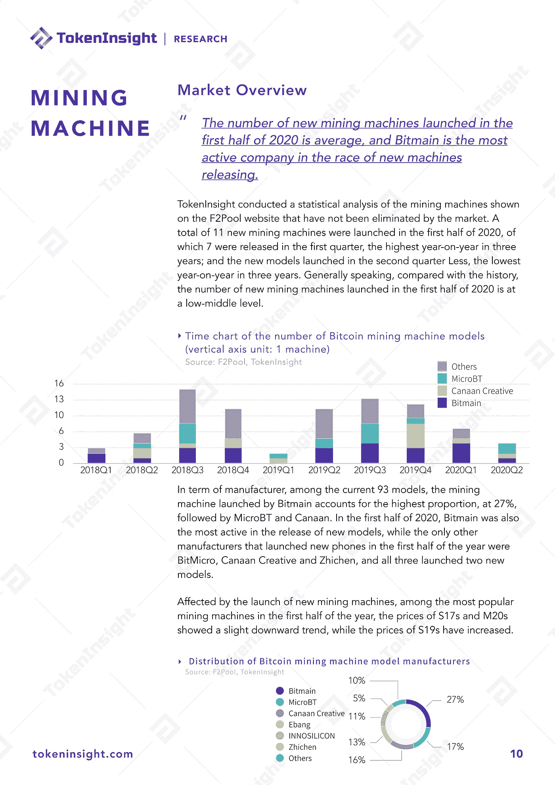
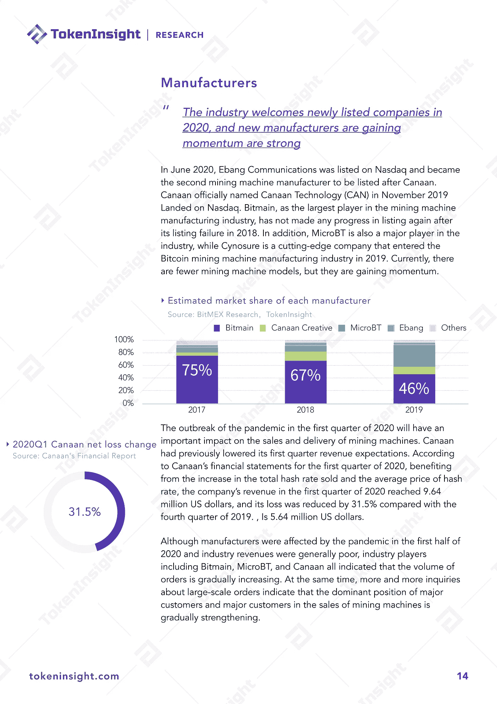

# 2020 年 Q2 加密货币开采行业报告

> 原文：<https://medium.com/coinmonks/2020-q2-cryptocurrency-mining-industry-report-50a908773b17?source=collection_archive---------3----------------------->

# **执行摘要**

1.**动荡**今年上半年，比特币市场经历了剧烈波动。第一季度新冠肺炎疫情的爆发和全球股市的大幅下跌导致市场在 3 月 12 日经历了一个“黑色星期四”。另一方面，发生在第二季度的第三次比特币挖矿奖励减半再次搅动了市场，其对市场杂凑率的影响尤为显著。

2.**历史第二**3 月 26 日，比特币网络经历了大幅下跌后的历史第二大难度下调，比例为 15.95%。难度调整期也增加到长达 17 天，远远超过平均 14 天。

3. **800 秒**在 3 月份的崩溃和减半之后，比特币的平均阻塞时间下降到了 800 秒左右。

4.**下降**持有 100–1000 BTC 之间硬币的地址数量是唯一呈现下降趋势的群体，半年内下降了 0.81%。

5.交易费占矿商总收入的比例在 5 月 20 日达到 21%的峰值后大幅下降。6 月份的平均交易手续费率为 4.3%，接近 5 月份减半前的平均水平 4.1%。

6. **27%** 目前 93 款中，比特大陆推出的矿机占比最高，为 27%，其次是 MicroBT 和迦南。

7.**17.9%**2020 年上半年新矿机平均哈希率为 81T，平均单位功耗为 42W/T，与一季度相比，二季度新机哈希率上升 17.9%，单位功耗下降 11%。

8.**强劲的发展势头**鲁边矿池自 4 月份推出后异军突起，其散列率一度在行业内超过 5%。此外，币安今年进入矿池领域后发展势头强劲，截至 6 月底已占据 5%的 hash 率。

9.**影响**上半年中国矿池受到较大影响，主要原因是新冠肺炎疫情导致矿机供应链延迟，矿机厂商内部纠纷，导致矿机无法大规模更新新矿机，交货时间延长。

10.**金融化**矿业在传统金融市场的火爆意味着对矿业的专业要求也越来越高，矿业金融化已是大势所趋。

# 关于 TokenInsight

**token insight 成立于 2017 年，是一家领先的数据&技术驱动的区块链金融机构。** TokenInsight 首创完整的区块链行业分类体系，覆盖超过**1600 个项目，**发布超过 **300 份评级报告，**对 **10 大行业进行深入研究。**

TokenInsight 的数据、评级和研究报告可以访问全球 70 多个数据平台，包括 **Messari、Delta、币安信息、AICoin、火币信息、**等。，月 PV 超过 3000 万。TokenInsight 已正式加入由加密货币排名网站 CoinMarketCap 发起的数据问责与透明联盟(Data)。

# 如果您喜欢我们的研究，请关注我们:

💡官方网站:[https://www.tokeninsight.com](https://www.tokeninsight.com/)

📌领英官方页面:[https://www.linkedin.com/company/tokeninsight/](https://www.linkedin.com/company/tokeninsight/)

🔎电报:[https://t.me/TokenInsightOfficial](https://t.me/TokenInsightOfficial)

🗺https://www.twitter.com/tokenInsight

📕https://www.reddit.com/r/TokenInsight/

## 另外，阅读

*   最好的[密码交易机器人](/coinmonks/crypto-trading-bot-c2ffce8acb2a)
*   [密码本交易平台](/coinmonks/top-10-crypto-copy-trading-platforms-for-beginners-d0c37c7d698c)
*   最好的[加密税务软件](/coinmonks/best-crypto-tax-tool-for-my-money-72d4b430816b)
*   [最佳加密交易平台](/coinmonks/the-best-crypto-trading-platforms-in-2020-the-definitive-guide-updated-c72f8b874555)
*   最佳[加密贷款平台](/coinmonks/top-5-crypto-lending-platforms-in-2020-that-you-need-to-know-a1b675cec3fa)
*   [最佳区块链分析工具](https://bitquery.io/blog/best-blockchain-analysis-tools-and-software)
*   [加密套利](/coinmonks/crypto-arbitrage-guide-how-to-make-money-as-a-beginner-62bfe5c868f6)指南:新手如何赚钱
*   最佳[加密制图工具](/coinmonks/what-are-the-best-charting-platforms-for-cryptocurrency-trading-85aade584d80)
*   [莱杰 vs 特雷佐](/coinmonks/ledger-vs-trezor-best-hardware-wallet-to-secure-cryptocurrency-22c7a3fd391e)
*   了解比特币的[最佳书籍有哪些？](/coinmonks/what-are-the-best-books-to-learn-bitcoin-409aeb9aff4b)
*   [3 商业评论](/coinmonks/3commas-review-an-excellent-crypto-trading-bot-2020-1313a58bec92)
*   [AAX 交易所评论](/coinmonks/aax-exchange-review-2021-67c5ea09330c) |推荐代码、交易费用、利弊
*   [Deribit 审查](/coinmonks/deribit-review-options-fees-apis-and-testnet-2ca16c4bbdb2) |选项、费用、API 和 Testnet
*   [FTX 密码交易所评论](/coinmonks/ftx-crypto-exchange-review-53664ac1198f)
*   [n 零审核](/coinmonks/ngrave-zero-review-c465cf8307fc)
*   [Bybit 交换审查](/coinmonks/bybit-exchange-review-dbd570019b71)
*   3Commas vs Cryptohopper
*   最好的比特币[硬件钱包](/coinmonks/the-best-cryptocurrency-hardware-wallets-of-2020-e28b1c124069?source=friends_link&sk=324dd9ff8556ab578d71e7ad7658ad7c)
*   最佳 [monero 钱包](https://blog.coincodecap.com/best-monero-wallets)
*   [莱杰纳米 s vs x](https://blog.coincodecap.com/ledger-nano-s-vs-x)
*   [bits gap vs 3 commas vs quad ency](https://blog.coincodecap.com/bitsgap-3commas-quadency)
*   [莱杰 Nano S vs 特雷佐 one vs 特雷佐 T vs 莱杰 Nano X](https://blog.coincodecap.com/ledger-nano-s-vs-trezor-one-ledger-nano-x-trezor-t)
*   [block fi vs Celsius](/coinmonks/blockfi-vs-celsius-vs-hodlnaut-8a1cc8c26630)vs Hodlnaut
*   Bitsgap 评论——一个轻松赚钱的加密交易机器人
*   为专业人士设计的加密交易机器人
*   [PrimeXBT 审查](/coinmonks/primexbt-review-88e0815be858) |杠杆交易、费用和交易
*   [埃利帕尔泰坦评论](/coinmonks/ellipal-titan-review-85e9071dd029)
*   [赛克斯石评论](https://blog.coincodecap.com/secux-stone-hardware-wallet-review)
*   [BlockFi 评论](/coinmonks/blockfi-review-53096053c097) |从您的密码中赚取高达 8.6%的利息