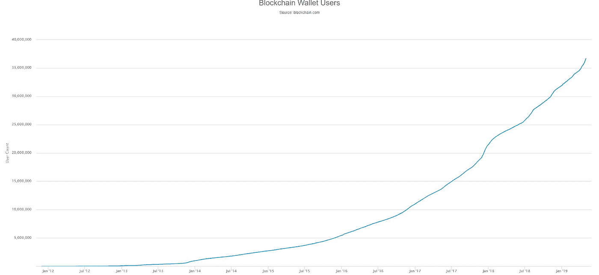
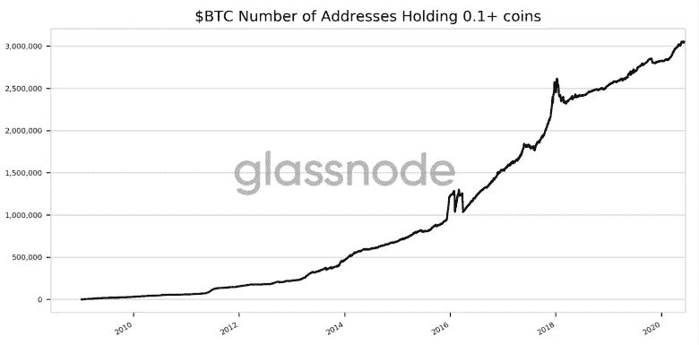
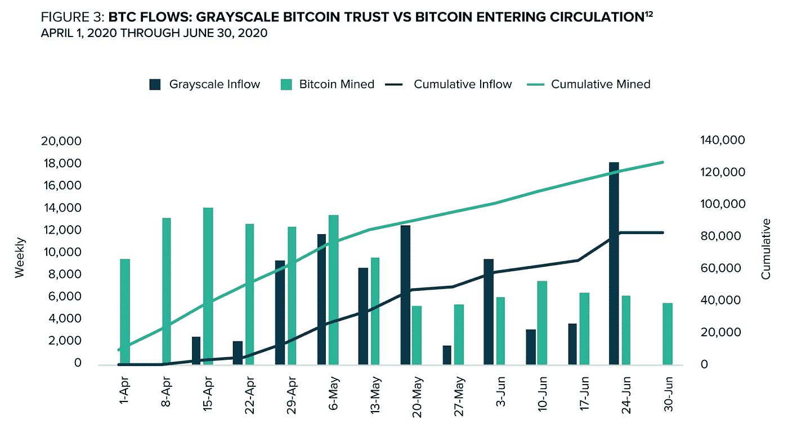
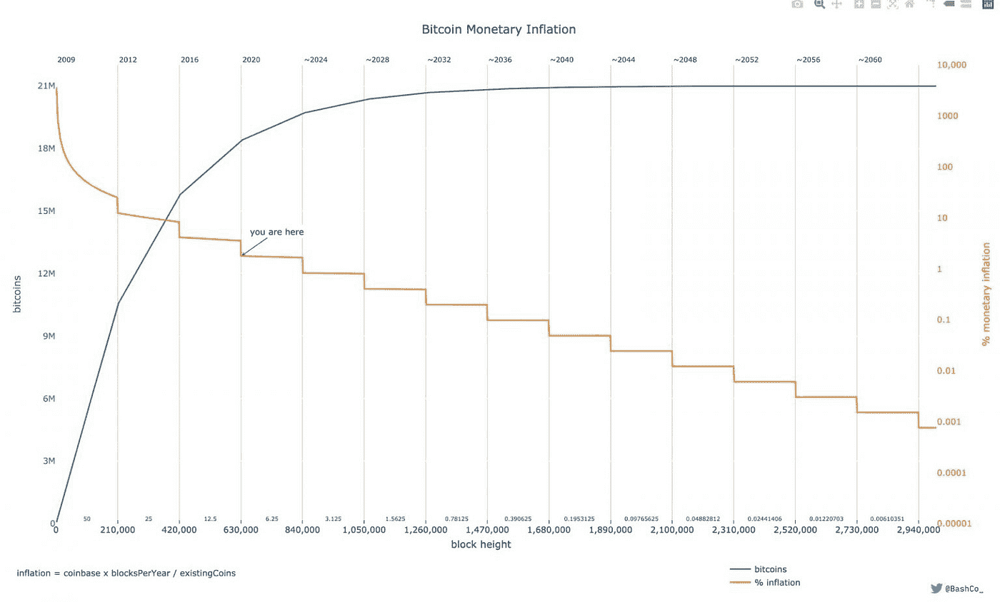
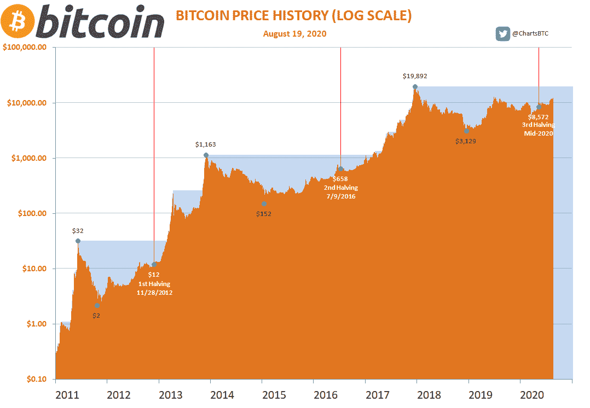
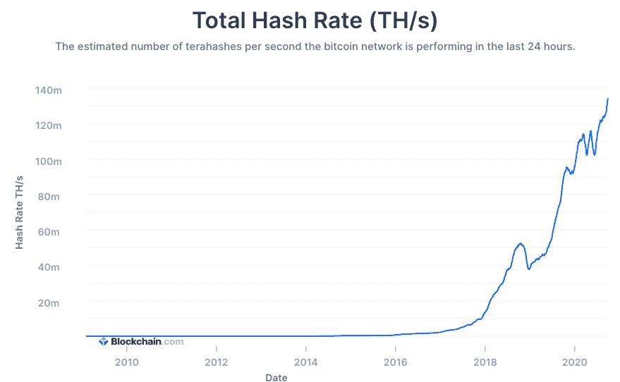

# 2021 年比特币前景

> 原文：<https://medium.com/coinmonks/2021-outlook-for-bitcoin-11a2e95b6c2?source=collection_archive---------5----------------------->

## 写于 10 月 1 日

比特币的历史很有趣，发展迅速，对理解其未来至关重要。第一个比特币区块于 2009 年 1 月 3 日开采。当时，比特币是计算机科学家和密码朋克们摆弄的一个玩具，希望建立一个去中心化的全球货币体系。**比特币首次在交易所交易是在 2010 年 3 月，价格为每枚 0.003 美元**。几个月后，第一次现实生活中的购买发生了——两个多米诺披萨，价格为 10，000 比特币。十年后，比特币经历了多次牛市和熊市，数百万新用户、矿工、开发者和企业家进入了所谓的“比特币生态系统”。

这个生态系统由所有的市场和交易者、所有保护区块链并获得新比特币的比特币矿工以及商人和比特币服务提供商组成。也许这个生态系统中最重要的部分是分散的比特币开发者群体。这些研究人员专注于改进比特币的软件，使其成为一个**可扩展的全球货币系统，可以在数百年内使用并进一步发展**。比特币的代码在不断升级。事实上，比特币生态系统的每个方面都在显著高速增长。新的比特币用户，更多的比特币积累，更多的比特币安全，更多的支持服务，展示了一个持续增长和强大的比特币生态系统。

The number of new bitcoin wallets is continuing to rise quickly, likely due to increased adoption & new entrants into bitcoin

The number of new bitcoin wallets is continuing to rise quickly, likely due to increased adoption & new entrants into bitcoin

Grayscale is accumulating more bitcoin than is mined each day, the available supply at current price levels is dwindling

比特币极其独特和强大的一个原因是，它成功地运作并协调数百万人支持生态系统，而没有任何中央权力，比如在政府或公司首席执行官之前。比特币实现了大规模的全球协调和安全，正常运行时间为 99.985%，比脸书、谷歌或亚马逊的正常运行时间都要长。没有中央电源，就不会有单点故障。**就像互联网本身一样，比特币不受任何人控制，实际上是*不可毁灭的*** 。这其中的一个关键方面是，没有人能够阻挠系统用额外的比特币中饱私囊。没有中央监管的另一个后果是，比特币交易不会受到审查。如果一方支付合适的费用，交易将被批准和结算。重大的系统改变，如偷币或供应改变，必须得到几乎所有参与者的同意，由于这种行为只对恶意行为者有利，网络永远不会同意。因此，按照设计，比特币不能被盗。事实上，随着时间的推移，越来越难得到。这就引入了比特币减半的概念。

比特币减半是大约每四年发生一次的事件，矿工因每隔大约 10 分钟获得比特币区块链而获得的奖励减半。第一批奖励是 50 BTC，然后是 25，现在是 12.5，三年半后是 6.25，四年后是 3.125，以此类推，直到第 21，000，000 个比特币被开采出来——从这一点开始，再也不会有新的比特币被开采出来。数十亿美元已经花在比特币挖掘上，没有人能够欺骗系统，这凸显了比特币可侵犯的稀缺性。

Orange line: Block subsidy — number of bitcoin issued per block. Blue line: Cumulative bitcoin supply

减半和比特币周期与比特币最大的财务收益相吻合。在每个减半期后不久，可以观察到价格逐渐然后突然上涨。比特币人士预计这一趋势将持续下去。原因很简单，对比特币的需求会随着时间的推移不断上升，而新增的供给会周期性减少。由于比特币的去中心化性质及其精心设计的经济强制规则集，获得比特币的唯一方式是公平地开采或购买它。此外，与黄金不同的是，当黄金价格上涨时，黄金矿工可以以更高的成本开采更多的黄金，但仍然有利可图，这种供应量的增加在比特币中是不可能的。**本质上，唯一能改变以反映比特币需求增长的是比特币的*价格*。**

比特币的第三次减半发生在 2020 年 5 月。与怀疑论者相反，采矿量并没有明显下降，因为区块奖励的减少使得采矿成本相对更高。自从减半以来，比特币挖矿实际上出现了大幅增长。**不像比特币的价格，挖矿基本上只涨不跌。除了与比特币价格大幅下跌相关的几次小幅下跌之外，比特币可衡量的 hashrate 一直在上升。这意味着比特币正不断变得更加安全、更加分散、更加难以阻止。**

这一切意味着什么？总之，我们有一个全球性的，数字化的，不可审查的货币系统，它是去中心化的，在数字世界中实现了稀缺性。本文写作期间，比特币的价格徘徊在 10600 美元左右。比特币的支持者认为，比特币有可能分别取代黄金甚至美元作为价值储存手段和记账单位的地位。总市值不到 2000 亿美元，这只相当于苹果市值的 10%。那么为什么价格低呢？首先，让我们讨论一下有效市场假说(EMH)。EMH 指出，鉴于所有信息都是公开的，资产的定价是公平的。比特币怀疑论者认为，商业在不断发展，因此股票会引发不断变化的信息，从而改变价格。他们会辩称，由于比特币的未来供应信息完全透明，价格没有理由大幅变动，也没有理由对比特币价格下跌做出反应。尽管比特币的供应发行信息是透明的，但它被许多人误解了。简单地说，**许多人怀疑比特币的弹性，无法被关闭、禁止或改变，同时认为，尽管比特币是过去十年中表现最好的资产，但它不会继续跑赢大多数资产**。

我相信比特币的价格将在未来几年内大幅上涨。这将重复比特币过去的两个周期。一些分析师**根据比特币的稀缺性对其价格进行了建模，他们认为未来几年比特币的价格将超过 30 万美元**。随着比特币变得越来越稀缺和越来越受欢迎，比特币的采用、使用和积累不断增加，这已经说明了这一点。

> 加入 Coinmonks [电报集团](https://t.me/joinchat/EPmjKpNYwRMsBI4p)，了解加密交易和投资

## 另外，阅读

*   [学习以太坊和 Web3 开发](http://blog.coincodecap.com/go/learn)
*   最好的[密码交易机器人](/coinmonks/crypto-trading-bot-c2ffce8acb2a)
*   [3 商业评论](/coinmonks/3commas-review-an-excellent-crypto-trading-bot-2020-1313a58bec92) | [Pionex 评论](/coinmonks/pionex-review-exchange-with-crypto-trading-bot-1e459d0191ea) | [Coinrule 评论](https://blog.coincodecap.com/coinrule-review-a-perfect-trading-bot)
*   [AAX 交易所审查](/coinmonks/aax-exchange-review-2021-67c5ea09330c) | [德里比特审查](/coinmonks/deribit-review-options-fees-apis-and-testnet-2ca16c4bbdb2) | [FTX 密码交易所审查](/coinmonks/ftx-crypto-exchange-review-53664ac1198f)
*   [n 零审核](/coinmonks/ngrave-zero-review-c465cf8307fc)
*   [Bybit Exchange 审查](/coinmonks/bybit-exchange-review-dbd570019b71) | [Bityard 审查](https://blog.coincodecap.com/bityard-reivew)
*   [3Commas vs Cryptohopper](/coinmonks/3commas-vs-pionex-vs-cryptohopper-best-crypto-bot-6a98d2baa203)
*   最好的比特币[硬件钱包](/coinmonks/the-best-cryptocurrency-hardware-wallets-of-2020-e28b1c124069?source=friends_link&sk=324dd9ff8556ab578d71e7ad7658ad7c)
*   [密码本交易平台](/coinmonks/top-10-crypto-copy-trading-platforms-for-beginners-d0c37c7d698c)
*   [莱杰 nano s vs x](https://blog.coincodecap.com/ledger-nano-s-vs-x)
*   [沃德评论](https://blog.coincodecap.com/vauld-review) | [尤霍德勒评论](/coinmonks/youhodler-4-easy-ways-to-make-money-98969b9689f2)
*   最好的[加密税务软件](/coinmonks/best-crypto-tax-tool-for-my-money-72d4b430816b) | [硬币追踪评论](/coinmonks/cointracking-review-a-reliable-cryptocurrency-tax-software-5114e3eb5737)
*   最佳[加密贷款平台](/coinmonks/top-5-crypto-lending-platforms-in-2020-that-you-need-to-know-a1b675cec3fa)
*   [莱杰 Nano S vs 特雷佐 one vs 特雷佐 T vs 莱杰 Nano X](https://blog.coincodecap.com/ledger-nano-s-vs-trezor-one-ledger-nano-x-trezor-t)
*   [block fi vs Celsius](/coinmonks/blockfi-vs-celsius-vs-hodlnaut-8a1cc8c26630)vs Hodlnaut
*   [Bitsgap 审查](/coinmonks/bitsgap-review-a-crypto-trading-bot-that-makes-easy-money-a5d88a336df2) | [Quadency 审查](/coinmonks/quadency-review-a-crypto-trading-automation-platform-3068eaa374e1)
*   [埃利帕尔泰坦评论](/coinmonks/ellipal-titan-review-85e9071dd029) | [赛克斯斯通评论](https://blog.coincodecap.com/secux-stone-hardware-wallet-review)
*   [BlockFi 审查](/coinmonks/blockfi-review-53096053c097) |在您的密码中赚取高达 8.6%的利息
*   [DEX Explorer](https://explorer.bitquery.io/ethereum/dex) 和[区块链 API](https://explorer.bitquery.io/graphql)
*   [加密套利](/coinmonks/crypto-arbitrage-guide-how-to-make-money-as-a-beginner-62bfe5c868f6)指南:新手如何赚钱
*   最佳[加密制图工具](/coinmonks/what-are-the-best-charting-platforms-for-cryptocurrency-trading-85aade584d80)
*   了解比特币最好的[书籍有哪些？](/coinmonks/what-are-the-best-books-to-learn-bitcoin-409aeb9aff4b)

> [直接在您的收件箱中获得最佳软件交易](/coinmonks/newsletters/coinmonks)

