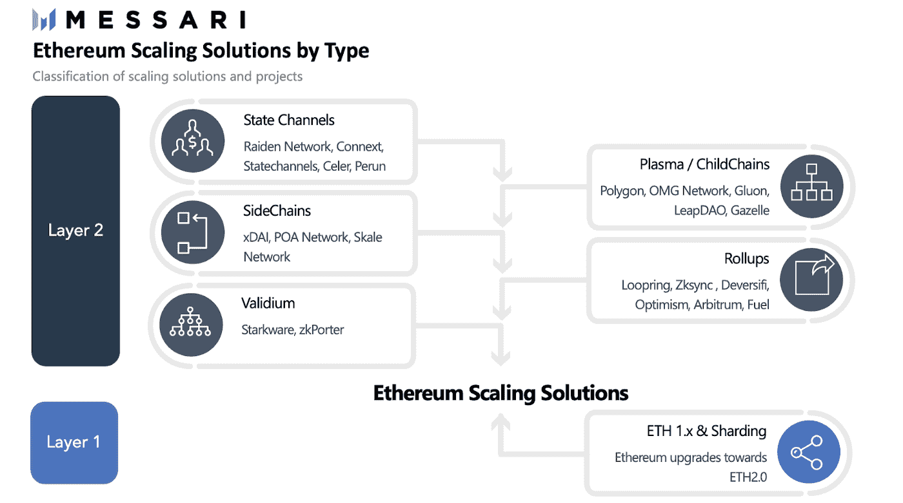

# 2021 年回顾:第 1 层、第 2 层扩展解决方案和 ETH 2.0 的未来

> 原文：<https://medium.com/coinmonks/2021-review-layer-1s-layer-2-scaling-solutions-the-future-of-eth-2-0-6d4bab27f769?source=collection_archive---------1----------------------->

Total Value Locked (TVL) in DeFi across all blockchains, with 62.43% in ETH in Q4 2021, down from 96.91% in January 2021 (Source: [https://defillama.com/chains](https://defillama.com/chains))

以太坊已经成为其自身成功的受害者——它的去中心化和无许可的方法导致了 DeFi 的革命，也使以太坊对许多用户来说成本过高。

从短期来看，L2 扩展解决方案的组合，特别是 rollups，以及 ETH 2.0 第一阶段数据层，以及各种 L1 区块链，如 Avalanche & Solana，其采用率在 2021 年大幅上升，在社区等待 ETH 2.0 的同时，满足了市场对低交易费用和快速交易的需求。

鉴于尚不清楚 ETH 2.0 的 2.0 阶段(碎片链)将于何时发生，或者未来是否将完全依赖于 L2 的同类产品，这将对 L1 协议市场、L2 扩展解决方案市场以及 ETH 2.0 产生影响。

今天，以太坊网络每天例行公事地促进数百亿美元的价值转移，超过 1500 亿美元的价值目前位于其网络上的智能合同中，以促进借贷、保险和支付方面的分散资产交换。

天然气(交易费)价格已经影响了许多人，使他们不再使用以太坊来探索其他第一层(L1)平台，这些平台提供类似的应用程序，交易费更低，分散化和安全性也各不相同。

L1 解决方案是具有不同性能和效用的本地区块链，例如 Avalanche、Solana 和 Terra 第二层(L2)解决方案是与底层 L1(在这种情况下是以太坊)集成的协议，以提高吞吐量和可用性。

竞争的 L1 协议已经用新的共识算法、区块链架构和执行环境进行了创新，但是与以太坊和 L2 解决方案相比，它们的采用增长了多少？

与 2021 年 1 月相比，以太坊在整个区块链的 DeFi TVL 的主导地位为 [96.91%](https://defillama.com/chains) ，截至今天，2021 年第四季度为 62.43%。

当我们等待 ETH 2.0 的最终形式时，L2 的一些项目已经解决了以太坊本身的一些网络拥塞问题，允许以更低的网络费用更容易地访问 DeFi 平台。

问题是，目前这些 L2 解决方案和桥梁实际上被使用了多少？

ETH 2.0 对 L1 区块链的未来有什么影响——2021 年的趋势显示，使用的分散化会继续吗？

ETH 2.0 最终推出碎片链会对目前的 L2 扩展解决方案产生怎样的影响？

我们来简单探讨一下。

**以太坊对比第一层区块链对比第二层使用**

与 L1 解决方案相比，以太坊上的实时 L2 扩展解决方案尚未被大规模采用。更便宜的 L1 解决方案，如 Avalanche 和其他几个，比 L2 的以太坊有更多的使用。

虽然以太坊今天实现了 12-60 秒的结束时间，每秒约 15-30 笔交易(tps)，但这一 tps 远低于传统支付系统，如 Visa，在真实世界中每秒约 [1，700 笔交易](https://steemit.com/cryptocurrency/@steemhoops99/transaction-speed-bitcoin-visa-iota-paypal)。

以太坊上的第 2 层扩展解决方案将以太坊的处理能力提高到每秒 2000-4000 次交易。

相比之下，在整个 2021 年期间从以太坊夺走 DeFi 市场份额的第 1 层协议——Solana、币安智能链和 Avalanche，已经实现了更快的事务吞吐量，Avalanche 在考虑任何分片或第 2 层优化之前，已经实现了 [< 1 秒终结](https://avascan.info/)和[每秒 4500 个事务](https://support.avax.network/en/articles/4136568-how-many-transactions-per-second-does-avalanche-support)。

Solana 每天每秒定期处理 [2，000+](https://solanabeach.io/) 笔交易，完成时间约为 13 秒，币安智能链处理约 [150 tps](https://academy.aax.com/en/binance-smart-chain-vs-solana-comparing-the-key-differences/) ，阻塞时间为 3 秒。

[此处](https://defillama.com/chains)概述了 TVL 在以太坊之外的第 1 层协议中被锁定的程度——今天的领导者是 TVL 的 Terra 亿美元)、币安智能链(169 亿美元)和雪崩(126.8 亿美元),紧随其后的是 Solana(120 亿美元)。

上图显示了第 1 层区块链的 TVL 增长与其价格的对比；雪崩是 2021 年 9 月以来表现最强的。

但是第二层解决方案呢？它们的使用量有多大？

L2 解决方案在 2020–2021 年锁定的总价值(TVL)仅达到峰值[>【70 亿】美元](https://l2beat.com/)。

下图显示了每个特定 L2 协议的 TVL，其中绝大多数位于 Aribitrum、dYdX 和 Loopring 中，所有这些都是汇总 L2 解决方案，如下所述。

可以看出，更便宜的 L1 解决方案，如 Avalanche 和其他一些解决方案，在以太坊上的使用比 L2 的更多。

例如，AVAX C 链(合同链)的采用一直在增加，平均达到 70 万以上。截至 2021 年 12 月的每日交易，超过 70，000 份累计合同部署在 C 链上。

将资金从以太坊转移到其他协议(如 Avalanche 等)的桥的 TVL 和当前市场份额如何？

下图来自 [this Dune.xyz 查询](https://dune.xyz/queries/118245/284806)。

如图所示，市场份额排名前三的桥梁是 [Ronin](https://coin98insights.com/what-is-ronin-network-ron) ，一个为区块链博彩制作的以太坊链接侧链，Polygon，一个锚定到主以太坊链的[等离子](https://ethereum.org/en/developers/docs/scaling/plasma/)(子链)，以及 Avalanche bridge 到 Avalanche 的 C 链(EVM 兼容合同链)，截至 2021 年 12 月 24 日以 61 亿美元[桥接](https://avascan.info/blockchain/c/bridge/0x50Ff3B278fCC70ec7A9465063d68029AB460eA04)。

2021 年下半年，EVM 兼容链及其桥梁的用户和活动大幅增加，部分原因是 L1 开发团队和他们的财务部门提供的激励措施大幅增加。

这种激励计划的一个例子是 Avalanche Rush，这是 DeFi on Avalanche 的一个 1.8 亿美元的激励计划，旨在吸引用户与部署在 Avalanche 上的“蓝筹”DeFi 项目进行互动，如 Aave 和 Curve。该计划主要作为生态系统参与者的流动性挖掘奖励。

大多数第 1 层激励计划的重点是促进 DeFi 在各自生态系统中的增长，尽管每个计划的确切目标和范围以及代币分配模式各不相同。

**当前第 2 层扩展解决方案概述**

[第 2 层解决方案](https://messari.io/article/ecosystem-of-ethereum-scaling-solutions)涉及链外扩展，这意味着交易和计算发生在以太坊基础链之外，保持基础层无拥塞。第 1 层解决方案包括扩展链上事务或扩展将所有事务保留在基础层的解决方案。

现有的 L2 联邦理工学院扩展解决方案包括 Loopring、Zksync、optimissive 和 Arbitrum 等多种类型的扩展解决方案；Starkware 和 zkPorter 等 Validium 解决方案；侧链如 xDai 和 Skale Network 状态通道，如 Celer 以及 Polygon、OMG 网络等等离子解决方案。

这些扩展解决方案中的每一个都有自己独特的优化和权衡，并且可以组合使用，虽然有些是特定于应用的，如支付通道，但其他解决方案可用于任何合同执行。

在所有 L2 中， **Rollups** 相对于不支持应用程序开发的等离子链或状态通道提供了最完整的解决方案，并且比依赖独立共识机制的侧链提供了更好的安全性。

汇总在链外执行事务，并在完成时向链中写入有效性的加密证明，这释放了主链上的资源，并减少了拥塞和费用。

ETH 2.0 可以放大 rollups 的可扩展性；因为汇总只需要缩放数据层，所以可以在 ETH 2.0 阶段 1 中使用。

[rollup 为 Ethereum 提供了一条通往可扩展性的道路](https://messari.io/pdf/messari-report-eth2-the-next-evolution-of-cryptoeconomy.pdf)，可以与新的第 1 层解决方案走向成熟的时间表相媲美，从某种意义上来说，第 1 层的竞争对手在一定程度上与可行的 roll up 解决方案竞争。

**L2 解决弊端**

虽然每个 L2 都可以提高性能，但 L2 解决方案的缺点主要包括网络进一步碎片化，而使用更具可扩展性的 L1(如 Avalanche)等主链可以提供更高的安全性保证，此外还不会碎片化，更分散，并具有更高的性能作为基础层，可以在此基础上构建 L2 解决方案，然后进一步扩展，而不是从较低性能的 L1 开始。

对于 L2，没有一个单一的全球国家支持可组合智能合约，这意味着尽管大多数用户目前依赖简单的 L1 系统进行使用和交互，但 L2 扩展解决方案需要改变用户行为、钱包、oracle 和 dApps，并在安全性方面进行各种权衡。

目前，跨 L2 的转移并不是无缝的，侧链需要桥接，这意味着各个 L2 项目之间总体上缺乏沟通。

等离子体的缺点具体包括用户从第 2 层提取资金的等待时间长。

状态通道是特定于应用程序的，而不是通用的智能合约，并且需要在使用之前提前锁定资金。

尽管 ZK 汇总比乐观汇总更快、更高效，但它们并没有为现有智能合约迁移到第 2 层提供简单的方法。

建立 ZK 汇总还依赖于一个集中的一方，如开发商，这破坏了去中心化，并打开了社会工程黑客的风险。

但是，与 L2 解决方案(如汇总)相比，ETH 2.0 分片的优势包括:分片可确保整个系统作为一个整体运行，具有相同的有效性和对数据的访问。

不像易拉宝或血浆解决方案，碎片中没有存款或资金，因为碎片是主链的一部分。

**ETH 2.0 vs 第 1 层和专用协议**

某些 L1 协议针对特定领域，或者具有完全不同的设计、架构和共识机制。

未来很可能涉及多个主链，如以太坊和索拉纳，通过一系列侧链相互作用。

某些[专门建造的利基区块链](https://decrypt.co/66299/why-purpose-built-niche-blockchains-are-set-to-win-in-the-longer-run)已经出现用于专门的任务——例如，使供应链更有效率，或者移动和存储不同类型的信息，或者以更高的吞吐量捕获更多的交易量。

大规模和复杂的应用程序需要经过优化和可扩展的自定义区块链来解决一系列特定的问题，而不需要与“包罗万象”的区块链架构(如比特币或以太坊)的限制相妥协。

虽然专门构建的区块链可以部署在特定的情况下，例如在企业中，但 L2 扩展解决方案、ETH 2.0 和各种 L1 区块链的组合可以互操作，以低成本提供所需的吞吐量水平，以实现 DeFi 的真正愿景，使所有人都可以访问和负担得起金融系统。

**什么是 ETH 2.0？**

ETH 2.0 是一个多阶段升级，通过改变基础设施本身来解决网络的可扩展性问题，首先是从工作验证(PoW)共识机制切换到利益验证(PoS)共识模型。

最终，ETH 2.0 将使以太坊能够以更快的吞吐量处理更多的交易，缓解当前存在的可扩展性瓶颈，并使网络对普通用户不可用，将以太坊从单区块链变为多链网络。

ETH 2.0 分几个阶段推出，第一个阶段名为信标链(阶段 0)，将于 2020 年 12 月上线。信标链引入了以太坊的本地堆栈，这是向 PoS 共识机制转变的一个特征。

ETH 2.0 的第二阶段被称为合并，预计在 2022 年由 Q2 完成，它将把信标链与以太坊主网合并，并标志着从 PoW 到 PoS 的正式移动。

在这个阶段，以太坊网络在当前状态下将作为一个碎片移植到以太坊 2.0 上。

最后一个阶段是阶段 2.0 或碎片链，该阶段将交易执行纳入碎片链，预计在 2023 年期间，该阶段将通过引入碎片来将所有操作的结算分散到 64 个新链而不是单个区块链，从而在扩展中发挥作用，最终显著提高基础层的交易吞吐量。

当前的以太坊基础设施具有由具有连续块的单链组成的区块链，这非常慢且低效。随着碎片链的引入，这个区块链被拆分，使得事务可以在并行链中处理。

ETH 2.0 的优势？

使用 ETH 1.0，网络每秒最多可以支持大约 30 个事务，但是 ETH 2.0 承诺每秒最多 100K 个事务。

与拥有少量验证器的大多数 PoS 网络相比，ETH 2.0 需要至少 16，384 个[验证器](https://launchpad.ethereum.org/en/faq)来使其更加分散，因此更加安全，但截至 2021 年第三季度，ETH 2.0 已经拥有超过 20 万个验证器，涉及超过 660 万个 ETH，总计 140 亿美元。

相比之下，雪崩目前有 [1205 个验证器](https://explorer.avax.network/validators)，索拉纳有 [1331 个验证器](https://solanabeach.io/validators)。

**ETH 2.0 的未来&第 2 层解决方案**

由于 ETH 2.0 有望解决 L2 扩展解决方案开始解决的许多可扩展性问题，因此存在 ETH 2.0 增加的吞吐量和速度是否会使 L2 扩展解决方案的采用过时的问题。

以太坊上的“蓝筹股”DeFi 应用程序可能会以汇总结束，如果它们从基础层移动的话。

社区情绪和经济激励将在最终结果中发挥作用。

据 [The Block](https://www.theblockcrypto.com/reports) 报道，如果未来是“以汇总为中心”，那么以太坊 2.0 网络将只用于安全性和数据可用性，而不是交易执行。

我们还不确定 ETH 2.0 提供的可扩展性水平，考虑到以太坊的采用和开发作为一个整体将继续增长，L2 解决方案可能仍然有 ETH 2.0 的用例。

如果汇总规模和保持可行，以太坊将可能[保持其在 DeFi 应用上的垄断](https://messari.io/pdf/messari-report-eth2-the-next-evolution-of-cryptoeconomy.pdf)，而 ETH 2.0 正在开发中。

此外，L2 解决方案不仅仅限于以太坊，而且旨在未来为多个区块链提供服务。

大多数社区将 ETH 2.0 视为长期解决方案，以太坊的持续发展确保了网络的稳定性，但扩展其功能以超越以太坊生态系统的 L2 解决方案可以继续做得很好。

以太坊的创造者 Vitalik Buterin 在 2020 年公开表示，在碎片链实现之前，ZK 卷可能会成为“至少几年内的主导扩展模式”。

正如 Vitalik 指出的那样，ETH 2.0 的数据容量将在计算能力之前升级，这意味着它将能够在处理更多交易之前存储更多数据。

预计在 2023 年，迁移到 ETH 2.0 的最后阶段将释放分片内的智能合同执行能力。

到 ETH 2.0 和 rollups 一起工作时，理论上应该有每秒 100，000 个事务的能力，这将大大有助于数十亿人的采用。

最终，以太坊的发展是一个动态的过程，解决高气费、扩展和竞争问题的需要意味着 ETH 2.0 过渡的各个阶段可能会被优先考虑。

> 加入 Coinmonks [电报频道](https://t.me/coincodecap)和 [Youtube 频道](https://www.youtube.com/c/coinmonks/videos)了解加密交易和投资

## 另外，阅读

*   [网格交易机器人](https://blog.coincodecap.com/grid-trading) | [Cryptohopper 审查](/coinmonks/cryptohopper-review-a388ff5bae88) | [Bexplus 审查](https://blog.coincodecap.com/bexplus-review)
*   [CoinLoan 审核](https://blog.coincodecap.com/coinloan-review)|[Crypto.com 审核](/coinmonks/crypto-com-review-f143dca1f74c) | [火币保证金交易](/coinmonks/huobi-margin-trading-b3b06cdc1519)
*   [最佳网上赌场](https://blog.coincodecap.com/best-online-casinos) | [币安评论](/coinmonks/binance-review-ee10d3bf3b6e) | [BitMEX 评论](https://blog.coincodecap.com/bitmex-review)
*   [Bookmap 评论](https://blog.coincodecap.com/bookmap-review-2021-best-trading-software) | [美国 5 大最佳加密交易所](https://blog.coincodecap.com/crypto-exchange-usa)
*   最佳加密[硬件钱包](/coinmonks/hardware-wallets-dfa1211730c6) | [Bitbns 评论](/coinmonks/bitbns-review-38256a07e161)
*   [新加坡十大最佳密码交易所](https://blog.coincodecap.com/crypto-exchange-in-singapore) | [收购 AXS](https://blog.coincodecap.com/buy-axs-token)
*   [投资印度的最佳密码](https://blog.coincodecap.com/best-crypto-to-invest-in-india-in-2021)|[WazirX P2P](https://blog.coincodecap.com/wazirx-p2p)|[Hi Dollar Review](https://blog.coincodecap.com/hi-dollar-review)
*   [加拿大最佳加密交易机器人](https://blog.coincodecap.com/5-best-crypto-trading-bots-in-canada) | [库币评论](https://blog.coincodecap.com/kucoin-review)
*   [火币加密交易信号](https://blog.coincodecap.com/huobi-crypto-trading-signals) | [HitBTC 审查](/coinmonks/hitbtc-review-c5143c5d53c2)
*   [如何在 FTX 交易所交易期货](https://blog.coincodecap.com/ftx-futures-trading) | [OKEx vs 币安](https://blog.coincodecap.com/okex-vs-binance)
*   [OKEx vs KuCoin](https://blog.coincodecap.com/okex-kucoin) | [摄氏替代品](https://blog.coincodecap.com/celsius-alternatives) | [如何购买 VeChain](https://blog.coincodecap.com/buy-vechain)