# 美国 22%的通货膨胀率，Twitter 放弃 NFTs，多边形的新区块链

> 原文：<https://medium.com/coinmonks/22-inflation-in-usa-twitter-drops-nfts-polygons-new-blockchain-88a0d437c179?source=collection_archive---------1----------------------->

## 超过 600 家银行现在支持比特币

1.  **美国的货币通胀达到历史最高水平**

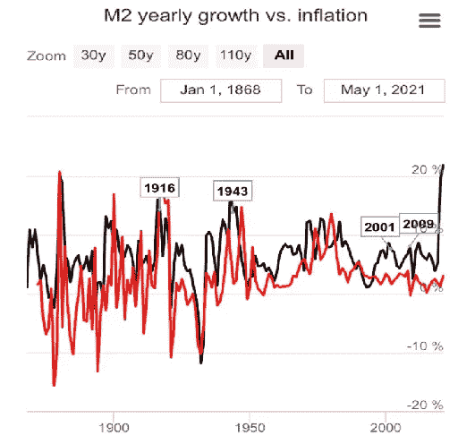

Black: M2 monetary inflation & Red: CPI inflation

*   **黑色:** M2 通货膨胀
*   **红色:** CPI 通胀

如果你在 2021 年的投资回报率达不到 22%，那你就是在倒退。因此，如果你想获得至少 22%的年回报率，试试这个体育期货套利机器人。

**2。据报道，索罗斯基金管理公司为比特币交易开了绿灯**

据报道，亿万富翁乔治·索罗斯的投资基金已经开始交易比特币。

**3。美国数百万人很快就能从全国 600 多家银行购买比特币**

由于支付提供商 NCR 和 NYDIG 之间的合作，美国大约有 650 家银行现在向他们大约 2400 万客户提供比特币购买服务。

**4。凯蒂·佩里宣布独家全球 NFT 合作并投资 Theta Network**

合作的第一个数字收藏品将展示凯蒂即将在全新的拉斯维加斯度假村世界酒店“演出”的内容，演出将于 2021 年 12 月开始。

**5。Twitter 在 Rarible** 上删除了 140 个以太坊 NFT 集合

*   Twitter [发布了 140 个 NFT](https://twitter.com/Twitter/status/1410227743636217856)。
*   该公司表示，NFT 是非卖品。
*   Twitter 表示，人们可以通过该公司的推文免费获得 NFTs。

6。数据显示以太坊在 Q1 和 Q2 的表现超过了 BTC；ETH 2.0 合约超 600 万以太

据统计，以太坊 2.0 存款合同本周已超过 600 万以太，合同中持有的以太坊价值超过 124 亿美元。

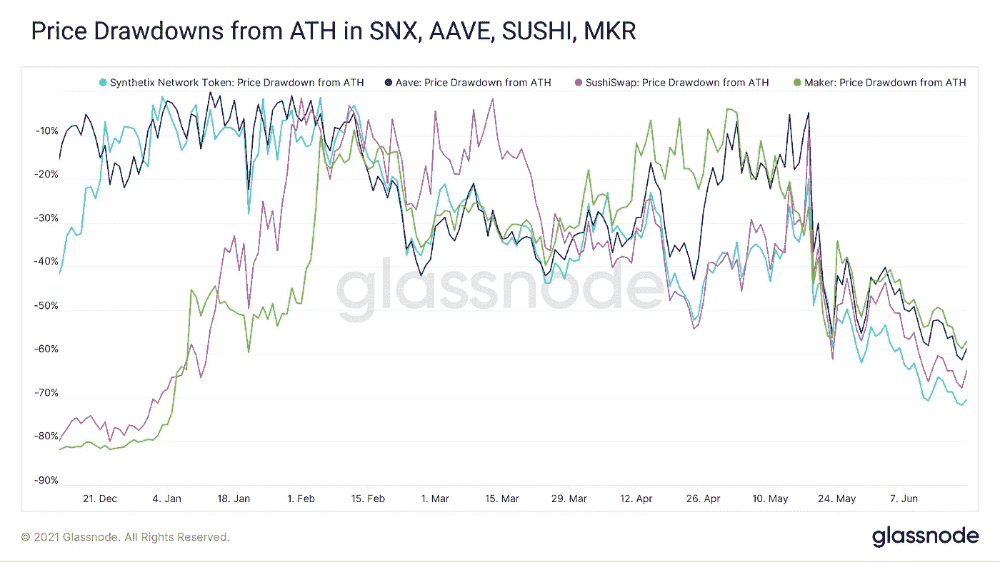

7。Uniswap 与 CoinMarketCap 的重大整合公告

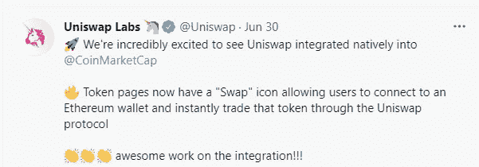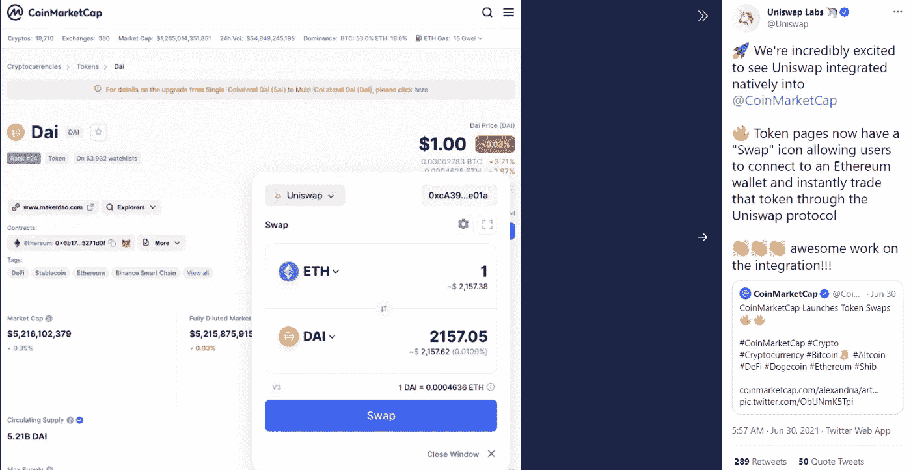

**8。北海巨妖将所有数字资产的押金削减至零**

从周一开始，[北海巨妖](https://blog.coincodecap.com/go/kraken)，一家加密货币交易所，[已经将其 70 多种数字资产的存款费用](https://blog.kraken.com/post/9733/kraken-slashes-deposit-fees-to-zero/)削减至零。据北海巨妖称，降低价格有望提高北海巨妖和分散金融(DeFi)协议和应用之间的价格稳定性。

**9。百万富翁购买虚拟土地**

虚拟世界分散土地[中的一处地产刚刚以价值 913，808 美元](https://www.theblockcrypto.com/post/108940/an-estate-in-virtual-world-decentraland-just-sold-for-nearly-a-million-dollars)的法力值售出

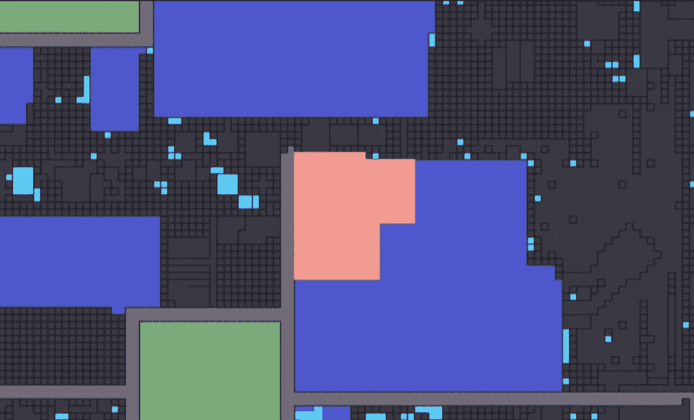

**10。图协议支持乐观以太坊在 Mainnet 发布时帮助扩展以太坊**

乐观以太坊是以太坊 L2 扩展解决方案，采用乐观汇总来降低费用、延迟和吞吐量，同时提供世界一流的开发人员和用户体验。

**12。“方舟 21 共享比特币交易所交易基金”希望成为第一个获得美国监管机构批准的基金**

“ [ARK 21Shares 比特币交易所交易基金](https://www.cnbc.com/2021/06/28/cathie-woods-ark-invest-files-to-create-a-bitcoin-etf.html)”将利用 21Shares 在开发加密货币交易所交易产品(etp)方面的经验，主要是在欧洲。根据美国证券交易委员会的文件，这位知名的科技投资者正在与投资产品公司 21Shares 合作，提交比特币 ETF 的申请。

**13。复合实验室推出“国库”让大公司收获 DeFi 收益**

以太坊上复合货币市场的创建者 Compound Labs 已经推出了一个名为 Compound Treasury 的新项目。

**14。Polygon (MATIC)推出新的通用区块链 Avail**

根据其网站，该项目被描述为“[通用，可扩展的数据可用性为重点的区块链](https://finance.yahoo.com/news/polygon-launches-general-purpose-blockchain-153924951.html)，目标是独立链，侧链和链外扩展解决方案”。

15。根据最近提交给美国证券交易委员会的文件，摩根士丹利持有 28.2 万股灰度比特币信托公司的股票

该银行在加密货币方面有反复无常的历史，有时会远离该领域，但最近却冒险向客户提供加密服务..拥有 28，289 GBTC

根据提交的文件，摩根士丹利欧洲机会基金公司今年早些时候购买了超过 28，289 股 GBTC 股票，获得了 26.5 个比特币的直接敞口。

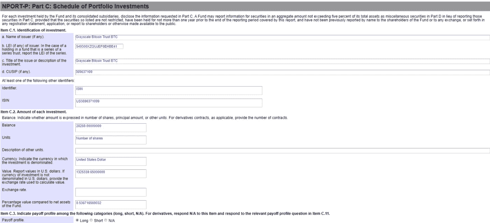

15。比特币基地获得德国首张加密许可证

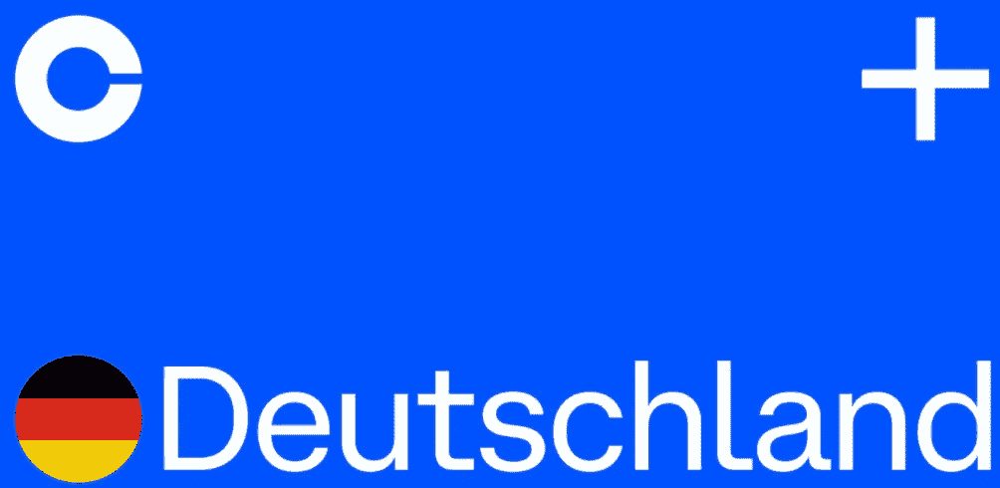

德国是全球第四大 GDP 经济体，也是唯一一个为加密货币交易所建立了全面监管框架的欧盟国家。德国已经有一个充满活力的区块链部门，在运行的比特币节点数量方面，德国仅次于美国。

**16。随着市场降温，以太坊燃气费处于六个月来的最低点，第二层解决方案正在缓解拥堵**

据区块链统计和分析师称，以太坊交易成本已降至去年 12 月以来的最低水平，原因是区块链活动放缓，而以太坊第 2 层解决方案协议(如 Matic)的采用率有所上升。

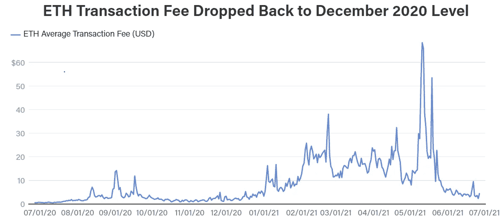

**17。苏富比将在即将到来的拍卖中接受 100 克拉稀有钻石的加密**

苏富比亚洲主席黄林诗韵在一份声明中说:

“最古老、最具象征意义的价值标准现在第一次可以用人类最新的通用货币购买了。”

苏富比称比特币/密码是人类最新的通用货币

18。墨西哥亿万富翁认为所有法定货币都是诈骗，并相信比特币

墨西哥亿万富翁里卡多·萨利纳斯·普里戈周日宣布，他的银行可能开始接受比特币，成为该国第一家接受比特币的银行。

“当然，我推荐使用#比特币，我和我的银行正在努力成为墨西哥第一家接受#比特币的银行，”萨利纳斯在一条推文中说。

**19。墨西哥银行将于 2021 年托管比特币？**

由于一个可能的潜在计划是根据里卡多·萨利纳斯·普里戈的评论提供比特币托管，因此应该有一个坚实的路线图来实现这一点，并且也需要墨西哥央行的同意。

**20。亿万富翁里卡多·萨利纳斯·普里戈接受比特币的计划被披露后，墨西哥迅速发出警告，反对对银行实施加密禁令。**

*   墨西哥当局周一发出警告，禁止金融机构与加密资产开展业务。
*   在亿万富翁里卡多·萨利纳斯·普里戈表示他的银行打算开展比特币业务后，提醒就发出了。
*   根据墨西哥中央银行和其他机构的说法，加密货币不被视为合法货币。

**21。波士顿联邦储备银行行长威廉·达德利认为，稳定硬币的“指数增长”可能会“扰乱”货币市场**

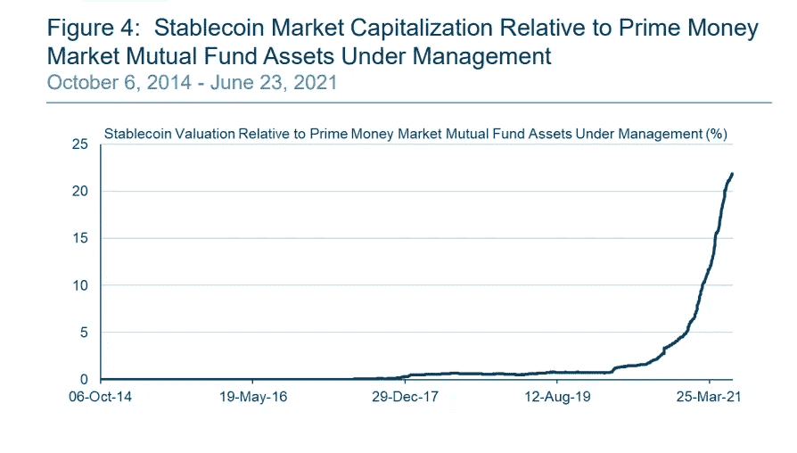

罗森格伦与雅虎财经作家 Brian Cheung 讨论了 stablecoins，并强调了泰瑟(USDT)。“鉴于美联储作为后台支持者的历史地位，这些稳定的债券(如泰瑟)的金融稳定风险难道不是美联储将允许的最大风险吗？”演讲结束后，张向波士顿联储主席问道。

“我之所以谈到 tether 和(稳定硬币)，是因为如果你看看他们的投资组合，它基本上看起来像一个主要货币市场基金的投资组合，但风险可能更高，”罗森格伦回应道。

**密码领域知名人士的观点**

**威利·吴**说，(在播客剪辑中提到过)

> 也许我们应该称之为最后一个周期，不是超级周期，而是最后一个周期

**B 计划**

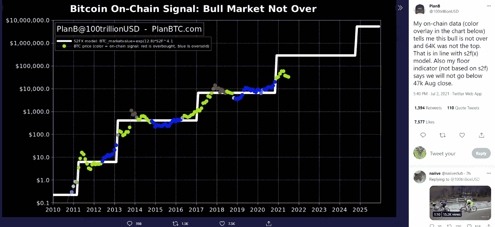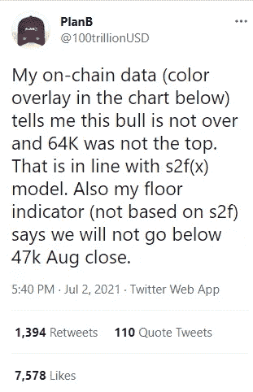