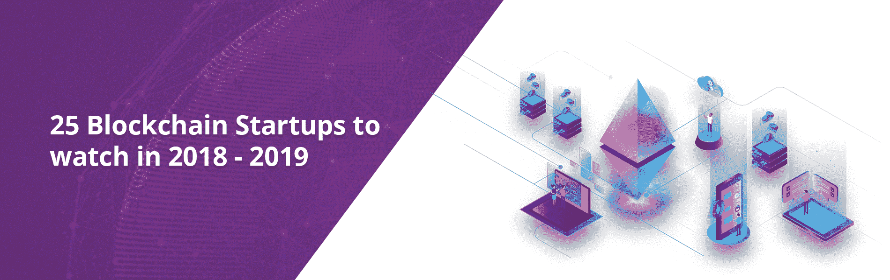
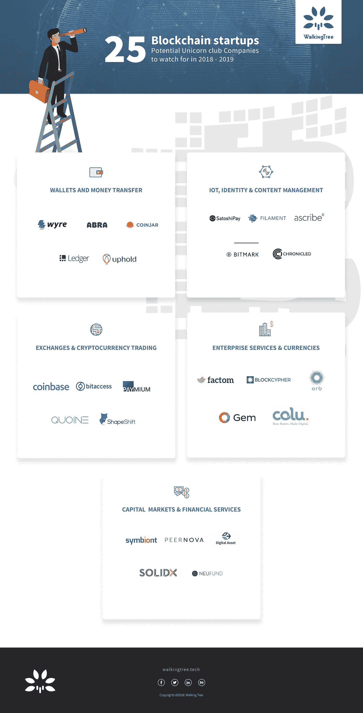

# 2018-2019 年值得关注的 25 家区块链创业公司(信息图)

> 原文：<https://medium.com/coinmonks/25-blockchain-startups-to-watch-in-2018-2019-infographic-113b4d8f1b19?source=collection_archive---------4----------------------->

# 比特币和区块链可能正在超越流行语的地位

对该行业的投资从 2012 年的几乎为零，增加到过去两年每年超过 5 亿美元。企业及其风险部门，尤其是金融服务领域的企业，已经大量加入竞争，希望借助区块链和分布式总账解决方案来解决棘手问题，包括数据对账、清算和结算等。全球主要银行和金融中介机构正与区块链公司密切合作，利用新技术改造遗留系统和基础设施。

**我们确定了 25 家私人控股的比特币和区块链公司，并根据每家公司的主要产品、业务线和/或用例将它们分为 5 类。**

## 以下是 25 家有前途的区块链创业公司，它们正在挑战传统观念，应该在 2018-2019 年予以关注。

## 钱包和汇款公司:-

*   [怀尔 ](https://www.sendwyre.com/)
*   [**凯西**](https://www.abra.com/)
*   [**总账**](https://www.ledgerwallet.com/apps/bitcoin)
*   [**Coinjar**](https://www.coinjar.com/)
*   [**光宗耀祖**](https://uphold.com/)

## 资本市场和金融服务:-

*   [**共生体**](https://symbiont.io/)
*   [**皮尔诺娃**](http://peernova.com/)
*   [**数字资产**](https://www.digitalasset.com/)
*   [**Solidx**](https://sldx.com/)
*   [neu fund](https://neufund.org/)

## 交易所和加密货币交易:-

*   [T43【比特币基地】T44](https://www.coinbase.com/)
*   [**Bitaccess**](https://www.bitaccess.co/)
*   
*   **[**Quoine**](https://quoine.com/)**
*   **[**Shapeshift**](https://shapeshift.io/)**

## **物联网,身份和内容管理:**

*   **[**Satoshipay**](https://satoshipay.io/)**
*   **[**丝(T14)**](https://filament.com/)**
*   **[**Ascribe**](https://www.ascribe.io/)**
*   **[**Bitmark**](https://bitmark.com/)**
*   **[**Chronicled**](https://chronicled.com/)**

## **企业服务和货币:**

*   **[**Factom**](https://www.factom.com/)**
*   **(T32) (T33) Blockcypher (T34) (T35)**
*   **[**Orb**](https://www.orbs.com/)**
*   **[**Gem**](https://gem.co/)**
*   **(T44) (T45) (Colu) (T46) (T47)**

> ****来源:** [**https://walkingtree.tech/blockchain-startups/**](https://walkingtree.tech/blockchain-startups/)**