# 3.5 万亿美元的和解法案| CELO 1 亿美元的拨款| 2500 万美元的快速贷款

> 原文：<https://medium.com/coinmonks/3-5-trillion-reconciliation-bill-celo-100-m-grant-25-million-flash-loan-exploit-a7876820277d?source=collection_archive---------3----------------------->

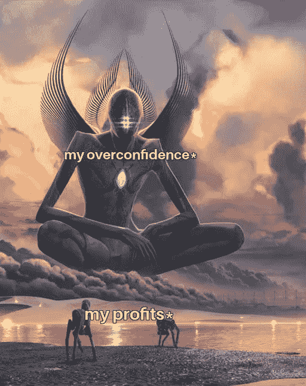

[Source](https://blog.coincodecap.com/college-investor)

## 公海每月 30 亿美元|斯蒂芬·库里收购 NFT 猿游艇俱乐部

同为修道士，

读一读我们一个实习生的故事，他在大学本科时就开始投资加密，以及他是如何经历起起落落学习加密的。

> [***电报上加入我们的密码信号频道***](https://t.me/coincodecap) *获取交易分析和买入机会。*

也

> *订阅我们的* [***Youtube 频道***](https://www.youtube.com/channel/UCbyDhTbOiKh2iUMKBi4-4Zg)*；这将对我们有很大帮助🙌*

现在，让我们看看上周 Crypto 发生了什么。📰

## 1.纽约市长候选人使用密码来获得选票

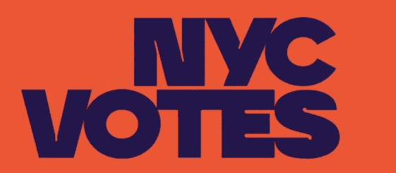

Source: Pentagram

纽约市长候选人的竞选承诺中包括加密货币。

“作为纽约市市长，我将使纽约成为全国最支持加密货币的城市。”财产税、罚款和费用将以加密货币支付，”共和党候选人柯蒂斯·西尔瓦昨天在推特上说。

“我们将建立更多的加密自动取款机，并为接受加密货币的企业提供激励。我们需要使我们的经济现代化，让每个人都更容易获得它，”他继续说道。

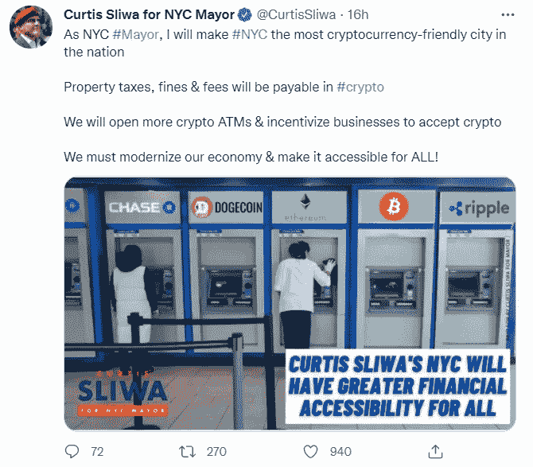

Source: Twitter

今年早些时候，赢得纽约民主党初选的候选人埃里克·亚当斯发誓要让纽约成为“比特币中心”。

“我们把生意带到了这里。”我们将成为生命科学的中心、网络安全的中心、自动驾驶汽车、无人机和比特币的中心，”亚当斯在今年夏天早些时候的一次竞选观察派对上宣布。

## 2.币安美国 CEO 预计公司将在三年内上市

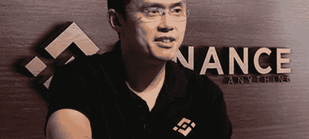

Source: Nairametrics

信息显示，全球最大的加密货币交易所的创始人兼首席执行官赵昌鹏(又名 CZ)宣布，其美国平台的目标是在未来三年内进行首次公开募股(IPO)。

据报道，他在接受 Zoom 采访时对该网站表示:“美国币安将会像比特币基地那样做。”。

据该平台的 [FAQ](https://support.binance.us/hc/en-us/articles/360046786914-States-That-Binance-US-Does-Not-Currently-Support) ，币安。“美国”现在在美国大多数州(但不是所有州)都可用，康涅狄格州、夏威夷、爱达荷州、路易斯安那州、纽约州、德克萨斯州和佛蒙特州的公民无法使用该服务。

据加密分析公司 Quantum Economics 的负责人马体·格林斯潘称，成功的首次公开募股将有助于币安合法化。美国监管机构眼中的美国，甚至可能对更大的加密领域产生有益的影响。

## 3.比特币十天内第二次测试 50000 美元大关

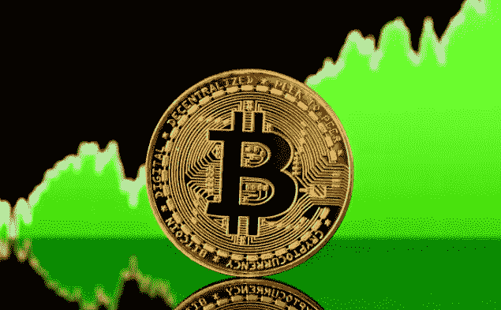

Source: The Independent

周四，世界上第一种也是最大的加密货币比特币重新突破了 5 万美元大关。比特币在撤退之前于 8 月 23 日达到了这一水平。

根据 CoinGecko 的数据，BTC 在过去 24 小时内上涨了 5.5%，在当地高点 50，171 美元达到顶点。比特币目前控制着 40.6%的市场，市值为 9416 亿美元。

虽然这是一个非常乐观的新月份的开始，但 9 月份传统上对比特币多头来说是一个充满挑战的月份。

根据 bybt.com 的数据，投资者已经连续四年在 9 月份亏损，最高月回报率勉强超过 6%。

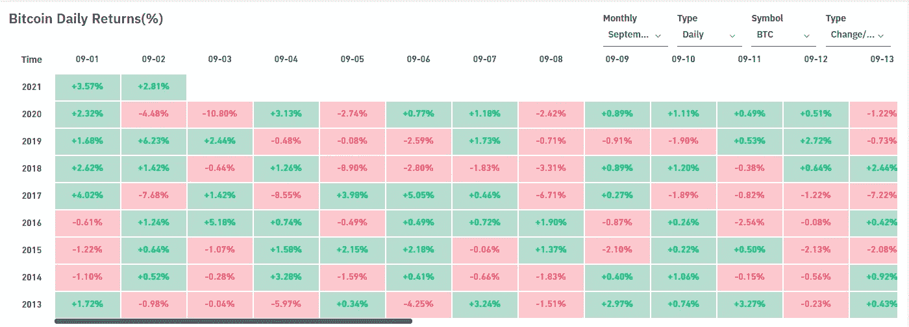

Source: Bybit

## 4.币安已被列入新加坡的“投资者警戒名单”

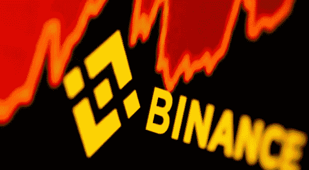

Source: The Straits Times

币安是业内最大的加密货币交易所，今天被新加坡金融管理局(MAS)列入投资者预警名单。

尚不清楚币安点 sg 是否会被归类为与币安点 us 相同的方式。

新加坡金融管理局将它认为“可能被错误地视为得到新加坡金融管理局许可或监管”的企业列入投资者警示名单。新加坡金融管理局是新加坡的中央银行和金融监管机构，负责货币政策和该国的金融业。

## 5.洪都拉斯开放首台比特币 ATM 机

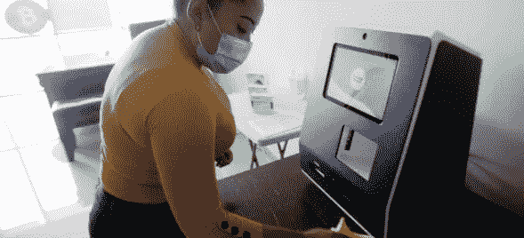

Source: Business Today

TGU 咨询集团在洪都拉斯首都和经济中心特古西加尔巴安装了这台机器。据路透社报道，“La bitcoinera”(ATM 的绰号)旨在满足该地区对比特币日益增长的需求。

28 岁的 TGU 咨询集团老板胡安·梅恩(Juan Mayén)告诉路透社，他的比特币自动取款机让洪都拉斯人购买加密货币变得更简单，以前这是通过不受监管的点对点交易平台或亲自完成的。

目前，自动取款机只接受最高 380 美元的比特币购买。用户必须遵守法律的“了解你的客户”标准，扫描他们的身份证件，并填写表格。

据 Mayén 称，如果机器被攻击，TGU 咨询集团可能会扩展到洪都拉斯的其他城市。

## 6.萨尔瓦多逮捕一名反比特币法律活动家

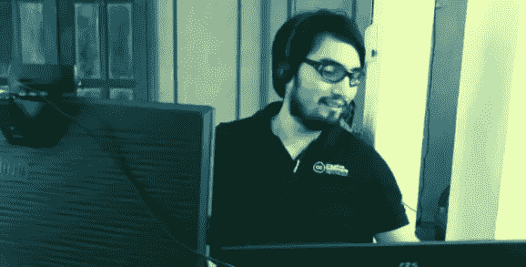

EL SALVADOR BITCOIN LAW CRITIC MARIO GOMEZ IN 2019\. IMAGE: MARIO GOMEZ/FACEBOOK

据当地消息称，萨尔瓦多警方拘留了加密货币和计算机系统专家马里奥·戈麦斯，他是该国最近批准的比特币法律的主要反对者，今天没有指控。

萨尔瓦多备受争议的比特币法律由总统纳伊布·布克勒(Nayib Bukele)倡导，该法律宣布比特币是该国的法定货币，与美元等值，并要求大多数商家接受比特币作为支付方式。软件孵化器 Hackerspace 的创始人戈麦斯是公开反对新法律实施的最杰出的萨尔瓦多人之一。

据当地报道，Gomez 在被拘留后不久被转移到国家民警中央调查处特别犯罪股。据警方称，戈麦斯正在接受调查，因为他“向众多账户受损的银行用户发送了虚假电子邮件。”萨尔瓦多官员想要搜查戈麦斯的手机和电脑。

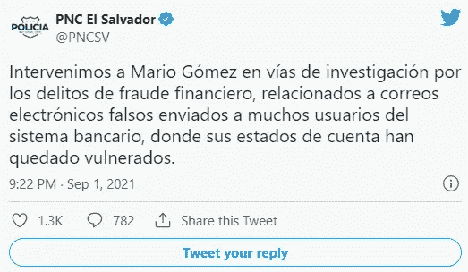

Source: Twitter

## 8.随着该国启动 1.5 亿美元的收养基金，国际货币基金组织再次发出比特币警告

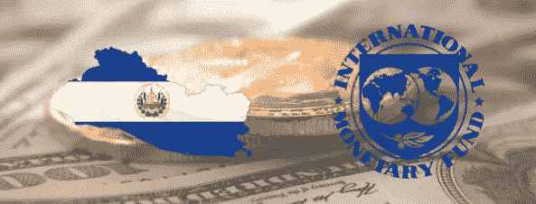

Source: Crypto State

国际货币基金组织(IMF)就萨尔瓦多即将采用比特币作为法定货币发出了又一次警告。

“私人发行的加密资产，如比特币，具有很大的风险。将它们与一种国家货币相提并论是一条不明智的捷径，”IMF 昨日在推特上写道，并附有一条链接，指向其最初于 2021 年 7 月 26 日发出的警告。

Source: IMF Twitter

萨尔瓦多国会昨日批准了一项 1.5 亿美元的基金，以帮助简化美元与该国主要加密货币之间的交易。

根据一份立法文件，“这项法律的目的是在不影响私人努力的情况下，从财政上支持国家提供的替代方案，允许用户实现比特币与美元的自动和即时兑换。”

## 9.财政部希望在 3.5 万亿美元的和解法案中包括加密货币报告规则

Image Source: Economic Times

这一切都是为了打击所谓的避税，就像 1 万亿美元基础设施计划中的条款一样。

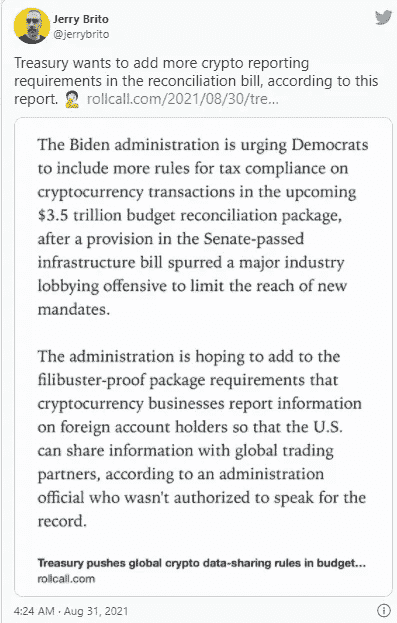

Source: Twitter

这些都不包括在当前的预算法案中，该法案本应是最终投票，但需要参议院所有 50 名民主党人的投票才能成功。这项 3.5 万亿美元的预算计划包括用于普及学前教育、干旱和气候变化预防、住房可负担性和可再生能源的资金。面对共和党人的抵制，参议院和众议院的民主党人正在推行这一计划。

拜登总统的美国财政部此前曾建议与其他国家交换信息，以迫使加密资产持有者纳税。财政部认为，这些玩家正在组建公司，利用离岸交易所和钱包玩一场价值数十亿美元的骗局。

美国需要来自其他国家的信息来进行压制。为了获得这些信息，它必须向贸易部门提供自己的信息，这就是实施修订后的报告规则的原因。

就在上个月，加密货币智库硬币中心和倡导组织区块链协会(Blockchain Association)公开反对众议院将于 9 月投票表决的 1 万亿美元基础设施计划。该法律包括一项最后一刻的修正案，将从事数字资产交易的人重新归类为“经纪人”，要求他们向美国国税局提供税务信息。

虽然该条款的目的是通过强化纳税申报义务来为该法案的 280 亿美元债务买单，但批评者认为，现在的词汇过于宽泛，可能需要矿工和验证人员收集他们正在处理的交易记录中的人的姓名和地址数据——这是一项几乎不可能完成的任务，会让该行业陷入生存危机。

## 10.据警方称，一名委内瑞拉男子假装自己被绑架，并窃取了价值 100 万美元的比特币

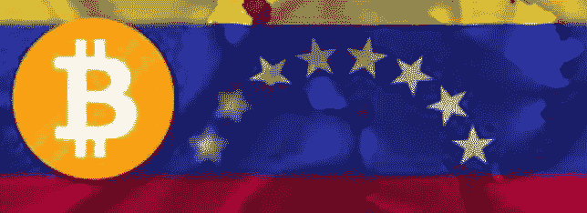

Source: Bitcoin news

一名 23 岁的基金经理假装自己被绑架，从客户那里窃取了超过 100 万美元的比特币，目前正在逃亡。

Source: Instagram Dogulasricovzla

根据 Rico 的证词，Hernandez 是许多客户的投资中间人。据 CICPC 的负责人说，埃尔南德斯据称从他客户的币安账户中掏空了 115 万美元。根据 Rico 的帖子，Hernandez 谎称他被绑架了，绑匪强迫他取钱。

## 11.Celo、Aave、Curve 和 Sushi 启动了价值 1 亿美元的 Defi 计划

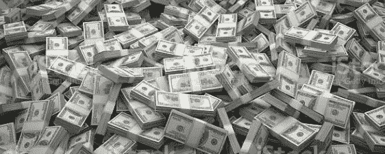

Source: Istock

Celo 是区块链的一项新举措，旨在为每个拥有智能手机的人提供比特币工具，特别是那些难以访问银行账户的人。

但是，当你可以在没有任何金融中介参与的情况下获得资产互换、快速贷款和投资工具时，为什么还需要银行账户呢？

Celo 今天宣布从关键的以太坊分散金融(DeFi)协议中融资 1 亿美元，用于奖励、教育和象征性激励，以及建立 DeFi for the People，旨在使 DeFi 能够为全球 60 亿智能手机用户所用。

该倡议的最初成员包括 Aave、RabbitHole、Moola Market、Valora、UMA、0x、Ubeswap 和 Sushi。Chainlink、The Graph、Curve 和 Wrapped.com 也加入成为“教育和基础设施合作伙伴”

这些议定书承诺提供 1 亿美元的初始资金，目的是提供任何激励计划所需现金的一半。

与此同时，Aave 向使用 Celo 移动应用程序访问协议的个人提供 2000 万美元的象征性奖励。分散化交易所 Curve 已经拨出 1400 万美元用于激励。以寿司掉期 DEX 闻名的寿司也在未来的 Celo 交易者面前晃来晃去 1000 万美元。

Celo 的价格在过去 24 小时内上涨了 60%，现在距离 0.94 美元的历史高点仅差 0.10 美元。

## 12.索拉纳突破 100 美元大关，成为第八大加密货币

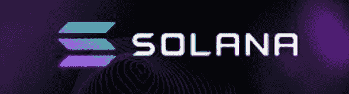

Source: Solana

SOL 是索拉纳区块链的象征，周一首次超过 100 美元，延续了前一周资产价格上涨 38.7%的趋势。

根据 CoinGecko 的统计数据，SOL 在发稿前小幅下跌前达到 101.42 美元的峰值。SOL 目前是第八大加密货币，交易量超过 22 亿美元，市值接近 290 亿美元。

整个上个月，代币的涨幅超过了 201%。

Solana 使用股权证明(PoS)共识方法来挖掘其 SOL 令牌，旨在与世界上最受欢迎的智能合约平台以太坊竞争，在去中心化金融(DeFi)和不可替代令牌(NFT)领域提供几个潜力。

该网络现在每秒支持超过 1000 个实时交易，工程师们认为在繁忙时期这个数字可能达到 50000 个。交易成本也远低于现在以太坊上的交易成本。

## 13.DeFi Project Cream Finance—2500 万美元的快速贷款

Source: Cream

借贷网站 Cream Finance 卷入了一起数百万美元的诈骗案。攻击者窃取了 Flexa Network 的本地货币 AMP 超过 4.18 亿英镑，以及 1308 个以太坊。

总额为 25，678，948 美元，然而根据 CoinGecko 的数据，截至记者发稿时，AMP 的价格已经下跌了 15%以上。Cream Finance 的本土奶油硬币也下跌了约 6%。

根据攻击者的地址，他们目前有 1880 万美元。

Cream Finance 通过“暂停对 AMP 的供应和借贷”停止了额外的损失，并补充说“没有其他市场受到影响。”

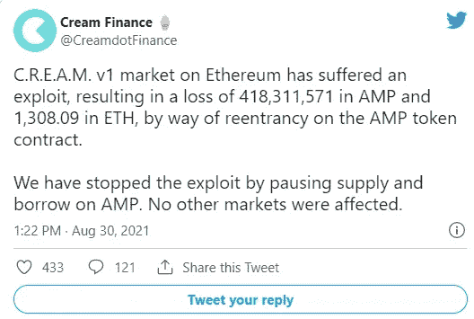

Source: Cream Finance

Cream Finance 是一个去中心化金融(DeFi)平台，允许用户从其闲置的比特币中赚取利息。与像 Aave 或 Compound 这样的平台不同，Cream 有一个更大的市场，可以容纳更多奇异的加密货币。Cream 是基于复合代码库的代码叉。

今年 2 月，Cream 卷入了另一起黑客攻击事件。当时，Alpha Finance 漏洞是攻击的核心原因，导致了 3750 万美元的损失。

## 14.以太坊 EIP-1559 升级已经在 ETH 烧了 4 亿美元

Source: Block Chain news

超过 4 亿美元的 ETH 现已被一次网络升级摧毁，这次升级摧毁了交易费，而不是将交易费分配给矿商。每小时大约燃烧 200 ETH(643，000 美元)。

这一里程碑在世界协调时周日上午 10 点左右达到，当时区块链以太坊从流通中移除了 124，865 ETH。

EIP-1559，燃烧 ETH 的更新，于 8 月 5 日生效。它旨在稳定以太坊波动的交易费用，并加速向以太坊 2.0(以太坊区块链的下一代)的过渡。

自 EIP-1559 生效以来，ETH 燃烧最繁忙的一天是 8 月 27 日，当时该网络从流通中移除了 11，176 个 ETH(3580 万美元)。繁忙的一天恰逢高交易费，平均费用达到 38.3 美元。

## 15.据杰克·多西称，Square 打算建立一个去中心化的比特币交易所

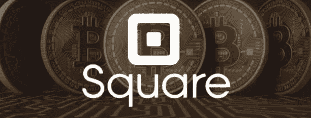

Source: Analytics Insight

Square 的现金应用是消费者购买和交易比特币的一种受欢迎的方式，但首席执行官杰克·多西对这种顶级加密货币有着深厚的感情——金融服务公司打算在该领域做更多的事情。多尔西上个月宣布了一个新的以比特币为中心的子公司，名为 TBD，现在他透露了它将是什么:一种去中心化的交易所。

基于其他区块链的分散式交易所，如以太坊的 Uniswap 和 SushiSwap，以及币安智能连锁的 PancakeSwap，已经广泛建立。TBD 希望建立一个基于比特币的完全无许可和去中心化的交易所，但将为客户提供一系列不同的入口，以将法定现金兑换为 BTC 货币。

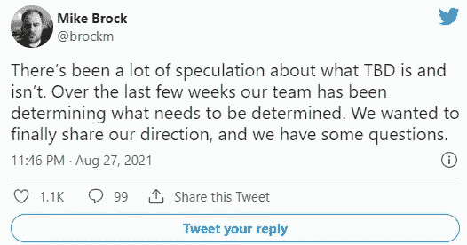

Source : Twitter

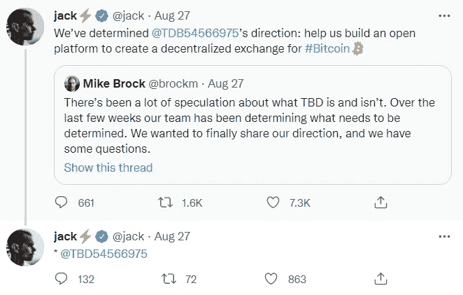

Source : Twitter

## 16.一名男子在比特币中损失了 80 万美元，他起诉了涉嫌青少年小偷的父母。

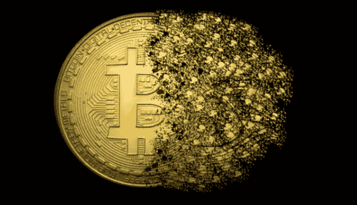

Source: Vieppo

安德鲁·绍贝尔在 2018 年丢失了 16 个比特币，当时价值约为 22 万美元。他追踪到它来自英国，并声称两个孩子用恶意软件拿走了它。在委婉地要求归还但没有得到回应后，他打算起诉这对年轻人的父母。

根据法庭记录，科罗拉多州居民安德鲁·绍贝尔的 16 枚比特币在 2018 年的一次恶意软件攻击中被盗。当时它的价值约为 22 万美元，占他总价值的 95%。

## 17.古巴政府表示将承认并监管加密货币

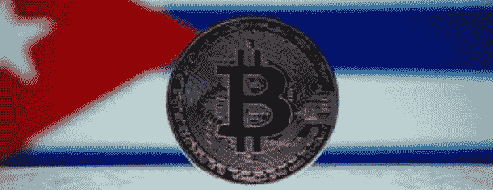

Source: Bitcoin News

据美联社报道，古巴政府昨天表示，将承认并监管用于支付的加密货币。

该声明以决议的形式发表，称该国央行古巴中央银行(Banco Central de Cuba)将控制居民如何使用比特币和以太坊等加密货币。

除了“社会经济利益的原因”，古巴政府没有提供关于加密货币为什么会在古巴受到控制和认可的实质性解释。然而，像在萨尔瓦多一样，这一行动可能被视为保护普通居民财富的一种方法。

## 18.摩根士丹利购买 2.4 亿美元的灰度比特币股票

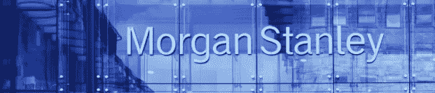

Source: Morgan Stanley

许多比特币用户认为自己是反大银行的。最大的银行之一摩根士丹利一直在买入比特币。

嗯，算是吧。

根据昨日提交给美国证交会的文件，摩根士丹利(Morgan Stanley)购买了超过 12 只基金的至多 650 万股灰度比特币信托(gray bit coin Trust)股票。按照目前每股 37.82 美元的价格，这相当于 GBTC 的 2.4 亿美元。这家投资银行将成为 GBTC 的第二大已知股东，仅次于凯西伍德的方舟投资管理公司，后者持有超过 900 万股股票。

尽管许多对冲基金和资产管理公司拥有 GBTC，但持有更多资本的投资银行却避而远之。几个月前，摩根士丹利首次进入该市场，当时它在提交给美国证交会的文件中披露，它已为其欧洲机会基金购买了 2.8 万股 GBTC 股票。截至 6 月 30 日的最新一波投资远远超过了这一数字。

# **NFT 空间**

## 1.一家名为幼虫实验室的秘密朋克初创公司已经与一家大型人才中介公司签署了一项协议

Source: Larvalabs

受欢迎的 CryptoPunks 和 Meebits NFT 项目的开发者幼虫实验室已经与联合人才机构签约。
UTA 将代表该团队寻求将其原创属性引入电影、电视、视频游戏和其他平台。

联合人才机构(UTA)已经签署了幼虫实验室，加密朋克背后的开发团队，以及 NFT 项目 Meebits 和 Autoglyphs。

幼虫实验室将由该机构代表，因为它追求基于其在电影，电视，视频游戏和其他娱乐平台的原始属性的项目，以及出版和许可机会。

## 2.三箭资本的以太坊 NFTs“星夜”基金

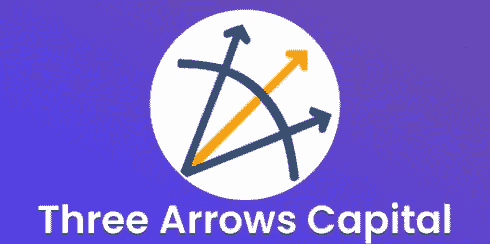

Source: Cryptojobs

加密货币对冲基金三箭资本(Three Arrows Capital)创建了一只基金，专门购买珍贵的 NFT 收藏品。上周五，它以 566 万美元买下了 NFT 艺术街区，创下了蓬勃发展的艺术作品收藏的新高。

根据其推特页面，加密货币投资公司今天推出了星夜资本，这是一只专注于“汇集世界上最好的非加密货币集合”的新基金。为了做到这一点，该公司与匿名的 NFT 收藏家 Vincent Van Dough 合作，Vincent Van Dough 在 Twitter 上有相当多的粉丝，在 NFT 有相当大的私人投资组合。

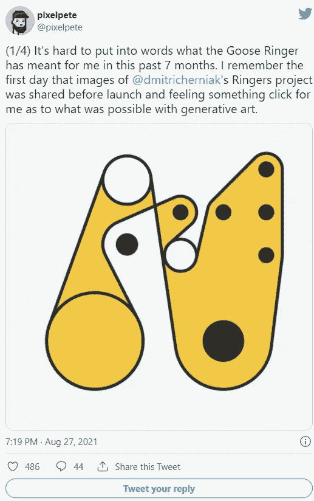

Source: Twitter

## 3.NFT 巨人 OpenSea 的 30 亿美元月

Source: The hustle

8 月份到目前为止，以太坊 NFT 平台 OpenSea 的交易额已超过 30 亿美元，周日创下了新的每日纪录。与该平台 7 月份 3.25 亿美元的交易量相比，增长了大约 10 倍。

与 7 月份相比，这是一个显著的增长，7 月份是 OpenSea 有史以来最大的一个月，当时市场的交易量相对较小，为 3.25 亿美元。OpenSea 的兴起与 NFT 收藏更广泛的市场需求相吻合，如个人照片收藏、生成性艺术品和交互式视频游戏对象。从昨日的每日新纪录可以看出，这一势头尚未减弱。

## 4.加密货币交易所币安将拍卖达芬奇和梵高的 NFT

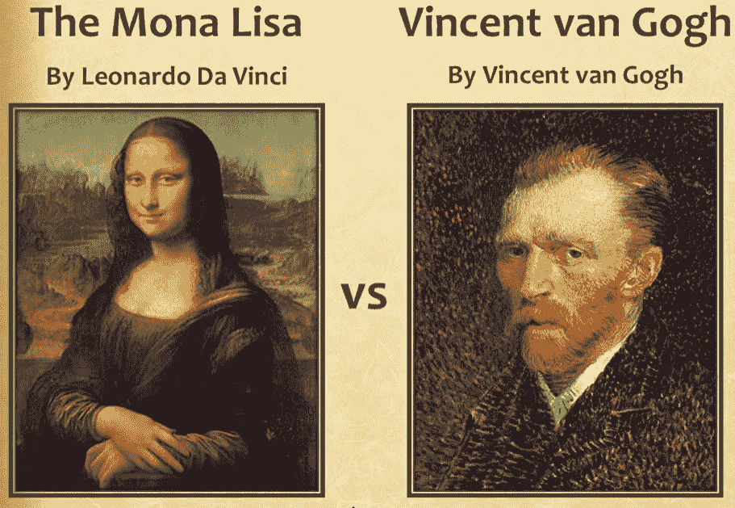

Source: Slide player

币安 NFT 市场已经宣布与国立艾尔米塔什博物馆合作，该平台将拍卖博物馆主要展览中的世界杰作的数字化选集。

这个名为“你的令牌存放在艾尔米塔什”的收藏由五个 NFT 组成，每个 NFT 都有一个副本保存在博物馆。

其中包括莱昂纳多·达·芬奇的《圣母子》、乔尔乔内的《朱迪思》、文森特·梵高的《紫丁香花丛》、瓦西里·康丁斯基的《第六乐章》和克洛德·莫内的《蒙杰龙花园的一角》的电子版

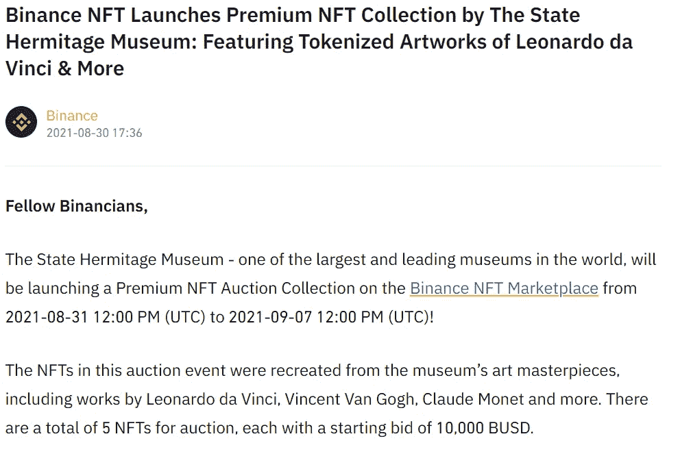

Source: Binance

每件 NFT 将于 8 月 31 日在币安 NFT 市场活动期间拍卖，起拍价为 1 万币安美元(BUSD)，约合 1 万美元。

币安美元是币安的本地加密货币，与美元挂钩。

艾尔米塔什博物馆的总经理米哈伊尔·皮奥特洛夫斯基将在复制品上签名并标记每个签名的精确时刻，以此来鉴定它。此外，拍卖获胜者将获得一个独特的 NFT 视频 Piotrovsky 验证艺术品。

## 5.一个小时内，无聊猿游艇俱乐部卖出了 9600 万美元的突变猿 NFT

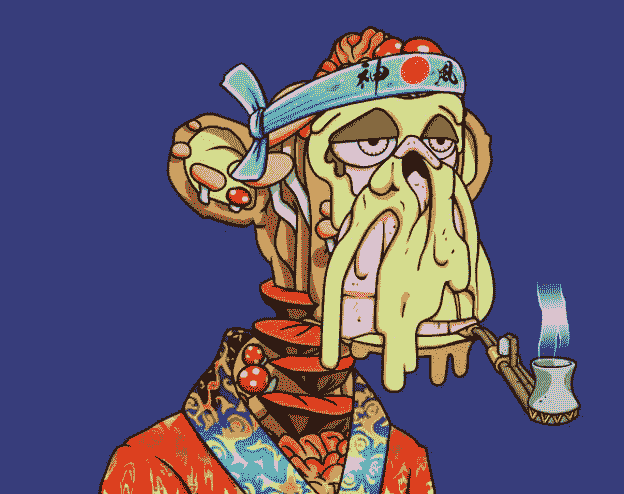

Source : Mutant apes

无聊猿游艇俱乐部的成员昨天收到了免费的突变猿 NFT。另外 10，000 只变异猿以每只 10，000 美元的价格提供给公众。在 NFT 市场 OpenSea 上，一只变异猿的最低要价约为 22400 美元。

周六晚上，Bored Ape Yacht Club 在 1 万只变异猿的公开拍卖中，在一个小时内赚了 9600 万美元，然后又空投了 1 万瓶变异血清，让总部位于以太坊的 NFT 的现有持有者免费铸造新猿。

Bored Ape 游艇俱乐部于 2021 年 4 月首次亮相，最初由 1 万个随机生产的 NFT 组成。每个人都有独特的特质，比如穿着花呢西装，而其他人在抽烟。这个概念可以与 CryptoPunks 相媲美，CryptoPunks 有 1 万个计算机生成的头像，看起来类似于空的，但成本要高得多。

Source: Twitter

无聊猿令牌持有者通过空投获得三种血清之一:M1，M2，或超级变种人(M3)。当一只无聊的猿被注射 M1 或 M2 血清时，产生的突变猿保留了原始猿的特征。M3 血清将猿转变成完全不同的东西，可能具有更罕见——因此也更有价值——的特征。

空投对于无聊的猿类持有者来说是一个非常划算的交易，因为它让他们保留了最初的 NFT，同时也铸造了一个有价值的额外令牌。

Source: Twitter

无聊的猿猴主人(包括昨天的 NBA 明星斯蒂芬·库里)经常用他们的猿猴作为他们 Twitter 个人资料的图片来表明他们是这个俱乐部的成员。库里为他的猿支付了 18 万美元。

## 6.Aavegotchi 上的 NFT 拍卖为出价过高的玩家提供补偿

Source: Avegochi

基于以太坊二层解决方案多边形的加密货币游戏 Aavegotchi 正在举办一场大规模的 NFT 拍卖会。
拍卖模式向出价高于自己的用户提供象征性奖励，从新的最高出价者的出价金额中扣除。

Aavegotchi 的功能类似于一个注入了密码的电子鸡:保持你的宠物幽灵健康和精神，你将通过 Aave，一个分散的金融贷款系统，获得产量农业令牌激励。这是萌芽中的“游戏赚钱”类型的最新作品，这是一种帮助支付账单的新型视频游戏。Pixelcraft 工作室现在正在为这款游戏的 NFT 拍卖开创一个新的子类别:“出价赢得”

周四开始并于今天结束的 Aavegotchi Haunt 2 NFT 拍卖会为参与 NFTs(加密收藏品)拍卖的用户提供补偿，即使他们输掉了拍卖。当一个玩家被出价超过时，他们将获得他们的出价 GHST 代币以及高达初始出价 10%的支付。额外的资金来自出价高于他们的投标。

该团队在 3 月份第一次下跌后修改了拍卖模式，当时 10，000 份 Aavegotchi NFTs 在 60 秒内售罄。虽然 Pixelcraft 的拍卖很成功，但许多玩家无法获得 NFT，因此如果不在二级市场上购买幽灵就无法玩游戏。

## 7.以太坊 NFT 密码朋克的总销售额已经超过 10 亿美元

Source: Crypto Punks

根据 NFT 聚合网站 CryptoSlam.io 的数据，CryptoPunks 是一个基于以太坊的 NFT 的 10，000 强集合，今天的销售额已经达到 10 亿美元。

这使得 CryptoPunks 成为继 8 月 8 日 NFT 游戏 Axie Infinity 之后第二个达到 10 亿美元大关的 NFT 项目。到目前为止，这款游戏已经产生了 16 亿美元的总交易额。

朋克已经变得如此昂贵，以至于现在最便宜的一辆车可以卖到 44.5 万美元。价格也在快速上涨:就在昨天，一首 CryptoPunk 的起价是 34.5 万美元。

有些朋克比其他人更不常见，他们的价值观各不相同；四年前制作该系列的算法为每个朋克赋予了不同的特征。比如有的抽烟，有的是僵尸或者外星人。

由布鲁克林工程师马特·霍尔和约翰·沃特金森领导的软件公司幼虫实验室在 2017 年发明了朋克。朋克原本应该在游戏中使用，但却被当作 NFT 出售。

霍尔和沃特金森为自己认领了 1000 个小混混，其余的免费送给社区。在随后的几年里，朋克的价值上升了，部分原因是它们是同类收藏中最古老的一种。

上个月末，交易量达到新高，一周内 CryptoPunks 的日交易量从 180 万美元增加到 4150 万美元。

本周比往常更暖和。根据 CryptoSlam 的统计数据，周一，当 Visa 购买了其中一款 Punks 时，CryptoPunks 的日销售额达到了 1.01 亿美元，该项目的整体交易量在前一周飙升了 716%。

## 8.以太岩 NFT 的“原始”代码有一个错误，允许任何人免费挖掘更多的矿

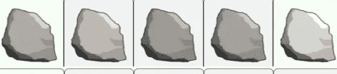

Source: Ether rock

2017 年，一名身份不明的开发商部署了两份几乎相似的 NFT 合同。他把第二个变成了以太石计划，现在石头可以卖到 170 万美元。
然而他因为问题放弃了第一个。那个被放弃的想法作为竞争对手的倡议重新浮出水面。

一幅以太石 NFT 现在的售价远远超过 100 万美元。毫无价值的 rock JPEGs 图片之所以能卖这么高的价格，原因之一是这个四年前的收藏仅限于 100 张，而且不能复制。

几周前，一名开发人员恢复了 2017 年宠物摇滚灵感 NFT 项目的更早版本，以太摇滚的开发人员放弃了该项目，因为一个缺陷允许任何人以以太坊的汽油费的价格铸造无限量的 NFT。

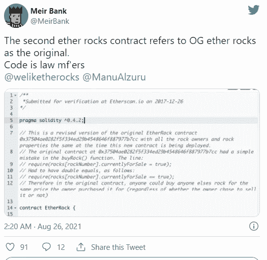

Source: Twitter

连续创业家加里·维纳查克昨晚花了 60 ETH(19.4 万美元)买了三块石头，而 YouTube 明星罗根·保罗说他“几乎没吃饭”就花了 6 万美元和 9.5 万美元买了两块石头。

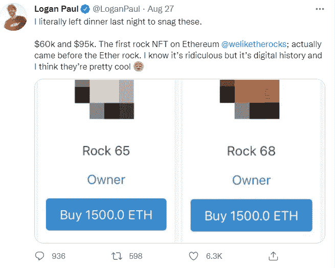

Source: Twitter

## 9.NBA 超级巨星斯蒂芬·库里以 18 万美元的价格收购了总部位于以太坊的 NFT 猿猴游艇俱乐部

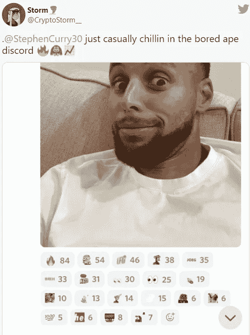

Source: Discord

NBA 球星斯蒂芬·库里发现了一项新的重大投资:他今天早些时候以 55 ETH(18 万美元)的价格购买了 NFT 一家无聊的猿类游艇俱乐部。

作为金州勇士队的控球后卫，库里曾三次获得 NBA 冠军，他也将自己的 Twitter 个人资料图像改为他的猿:一个穿着粗花呢西装的蓝色悲伤生物，并在该项目的 Discord chat 上分享了一张自拍。

这位 33 岁篮球运动员的猿是该项目的 1 万只猿之一。NFT 是一个只有受邀者才能加入的俱乐部的会员，也是一个只有会员才能进入的涂鸦板的入口。所有者拥有他们的猿的商业权利。

灵长类动物的独特特征保证了高价。只有 1%的猿类穿着粗花呢，3%有僵尸眼，5%有蓝色皮毛。几乎有四分之一的人有着同样空洞的表情。

在购买了猿猴 NFT 后，库里收到了 58 份额外的 NFT，包括一把剪刀、一块石头和手绘版的无聊猿猴 NFT。

***作者* : Eth！c@l 又名库马尔**

> 加入 [Coinmonks 电报频道](https://t.me/coincodecap)，了解加密交易和投资

## 另外，阅读

*   [尤霍德勒 vs 科恩洛 vs 霍德诺特](/coinmonks/youhodler-vs-coinloan-vs-hodlnaut-b1050acde55a) | [Cryptohopper vs 哈斯博特](https://blog.coincodecap.com/cryptohopper-vs-haasbot)
*   [币安 vs 北海巨妖](https://blog.coincodecap.com/binance-vs-kraken) | [美元成本平均交易机器人](https://blog.coincodecap.com/pionex-dca-bot)
*   [如何在印度购买比特币？](/coinmonks/buy-bitcoin-in-india-feb50ddfef94) | [WazirX 审核](/coinmonks/wazirx-review-5c811b074f5b) | [BitMEX 审核](https://blog.coincodecap.com/bitmex-review)
*   [比特币主根](https://blog.coincodecap.com/bitcoin-taproot) | [Bitso 评论](https://blog.coincodecap.com/bitso-review) | [排名前 6 的比特币信用卡](/coinmonks/bitcoin-credit-card-bc8ab6f377c6)
*   [双子座 vs 比特币基地](https://blog.coincodecap.com/gemini-vs-coinbase) | [比特币基地 vs 北海巨妖](https://blog.coincodecap.com/kraken-vs-coinbase) | [硬币罐 vs 硬币点](https://blog.coincodecap.com/coinspot-vs-coinjar)
*   [印度密码交易所](/coinmonks/bitcoin-exchange-in-india-7f1fe79715c9) | [比特币储蓄账户](/coinmonks/bitcoin-savings-account-e65b13f92451) | [Paxful 审核](/coinmonks/paxful-review-4daf2354ab70)
*   [杠杆令牌](/coinmonks/leveraged-token-3f5257808b22) | [最佳加密交易所](/coinmonks/crypto-exchange-dd2f9d6f3769) | [AscendEX 评论](/coinmonks/ascendex-review-53e829cf75fa)
*   [Godex.io 审核](/coinmonks/godex-io-review-7366086519fb) | [邀请审核](/coinmonks/invity-review-70f3030c0502) | [BitForex 审核](https://blog.coincodecap.com/bitforex-review) | [HitBTC 审核](/coinmonks/hitbtc-review-c5143c5d53c2)
*   [Crypto.com 费用](/coinmonks/binance-fees-8588ec17965) | [僵尸密码审查](/coinmonks/botcrypto-review-2021-build-your-own-trading-bot-coincodecap-6b8332d736c7) | [替代品](https://blog.coincodecap.com/crypto-com-alternatives)
*   [有哪些交易信号？](https://blog.coincodecap.com/trading-signal) | [比特斯坦普 vs 比特币基地](https://blog.coincodecap.com/bitstamp-coinbase)
*   [ProfitFarmers 回顾](https://blog.coincodecap.com/profitfarmers-review) | [如何使用 Cornix Trading Bot](https://blog.coincodecap.com/cornix-trading-bot)
*   [MXC 交易所评论](/coinmonks/mxc-exchange-review-3af0ec1cba8c) | [Pionex vs 币安](https://blog.coincodecap.com/pionex-vs-binance) | [Pionex 套利机器人](https://blog.coincodecap.com/pionex-arbitrage-bot)
*   [我的密码交易经验](/coinmonks/my-experience-with-crypto-copy-trading-d6feb2ce3ac5) | [比特币基地评论](/coinmonks/coinbase-review-6ef4e0f56064)
*   [CoinFLEX 评论](https://blog.coincodecap.com/coinflex-review) | [AEX 交易所评论](https://blog.coincodecap.com/aex-exchange-review) | [UPbit 评论](https://blog.coincodecap.com/upbit-review)
*   [AscendEx 保证金交易](https://blog.coincodecap.com/ascendex-margin-trading) | [Bitfinex 赌注](https://blog.coincodecap.com/bitfinex-staking) | [bitFlyer 评论](https://blog.coincodecap.com/bitflyer-review)
*   [麻雀交换评论](https://blog.coincodecap.com/sparrow-exchange-review) | [纳什交换评论](https://blog.coincodecap.com/nash-exchange-review)
*   [加密货币储蓄账户](/coinmonks/cryptocurrency-savings-accounts-be3bc0feffbf) | [赌注加密](https://blog.coincodecap.com/staking-crypto)
*   [BigONE 交易所评论](/coinmonks/bigone-exchange-review-64705d85a1d4) | [CEX。IO 审查](https://blog.coincodecap.com/cex-io-review) | [交换区审查](/coinmonks/swapzone-review-crypto-exchange-data-aggregator-e0ad78e55ed7)
*   [最佳比特币保证金交易](/coinmonks/bitcoin-margin-trading-exchange-bcbfcbf7b8e3) | [比特币保证金交易](https://blog.coincodecap.com/bityard-margin-trading)
*   [加密保证金交易交易所](/coinmonks/crypto-margin-trading-exchanges-428b1f7ad108) | [赚取比特币](/coinmonks/earn-bitcoin-6e8bd3c592d9) | [Mudrex 投资](https://blog.coincodecap.com/mudrex-invest-review-the-best-way-to-invest-in-crypto)
*   [WazirX vs CoinDCX vs bit bns](/coinmonks/wazirx-vs-coindcx-vs-bitbns-149f4f19a2f1)|[block fi vs coin loan vs Nexo](/coinmonks/blockfi-vs-coinloan-vs-nexo-cb624635230d)
*   [BlockFi 信用卡](https://blog.coincodecap.com/blockfi-credit-card) | [如何在币安购买比特币](https://blog.coincodecap.com/buy-bitcoin-binance)
*   [火币交易机器人](https://blog.coincodecap.com/huobi-trading-bot) | [如何购买 ADA](https://blog.coincodecap.com/buy-ada-cardano) | [Geco。一次复习](https://blog.coincodecap.com/geco-one-review)
*   [加密复制交易平台](/coinmonks/top-10-crypto-copy-trading-platforms-for-beginners-d0c37c7d698c) | [五大 BlockFi 替代方案](https://blog.coincodecap.com/blockfi-alternatives)
*   [CoinLoan 点评](https://blog.coincodecap.com/coinloan-review)|[Crypto.com 点评](/coinmonks/crypto-com-review-f143dca1f74c) | [火币保证金交易](/coinmonks/huobi-margin-trading-b3b06cdc1519)
*   [Bybit vs 币安](https://blog.coincodecap.com/bybit-binance-moonxbt)|[stealth x 回顾](/coinmonks/stealthex-review-396c67309988) | [Probit 回顾](https://blog.coincodecap.com/probit-review)
*   [顶级付费加密货币和区块链课程](https://blog.coincodecap.com/blockchain-courses)
*   [在美国如何使用 BitMEX？](https://blog.coincodecap.com/use-bitmex-in-usa) | [BitMEX 评论](https://blog.coincodecap.com/bitmex-review)
*   [最佳免费加密信号](https://blog.coincodecap.com/free-crypto-signals) | [YoBit 评论](/coinmonks/yobit-review-175464162c62) | [Bitbns 评论](/coinmonks/bitbns-review-38256a07e161)
*   [OKEx 审查](/coinmonks/okex-review-6b369304110f) | [Kucoin 交易机器人](/coinmonks/kucoin-trading-bot-automate-your-trades-8cf0ca2138e0) | [期货交易机器人](/coinmonks/futures-trading-bots-5a282ccee3f5)
*   [AscendEx Staking](https://blog.coincodecap.com/ascendex-staking)|[Bot Ocean Review](https://blog.coincodecap.com/bot-ocean-review)|[最佳比特币钱包](https://blog.coincodecap.com/bitcoin-wallets-india)
*   [霍比评论](https://blog.coincodecap.com/huobi-review) | [OKEx 保证金交易](https://blog.coincodecap.com/okex-margin-trading) | [期货交易](https://blog.coincodecap.com/futures-trading)
*   [比特币基地赌注](https://blog.coincodecap.com/coinbase-staking) | [热点评论](/coinmonks/hotbit-review-cd5bec41dafb) | [库币评论](https://blog.coincodecap.com/kucoin-review)
*   [最佳加密交易信号电报](/coinmonks/best-crypto-signals-telegram-5785cdbc4b2b) | [MoonXBT 评论](/coinmonks/moonxbt-review-6e4ab26d037)
*   [Coinswitch 俱吠罗评论](/coinmonks/coinswitch-kuber-review-1a8dc5c7a739) | [电网交易机器人](https://blog.coincodecap.com/grid-trading) | [比特币基地费用](/coinmonks/coinbase-fees-831e77d4f2c5)
*   [Bitget 回顾](https://blog.coincodecap.com/bitget-review)|[Gemini vs block fi](https://blog.coincodecap.com/gemini-vs-blockfi)|[OKEx 期货交易](https://blog.coincodecap.com/okex-futures-trading)
*   [OKEx vs KuCoin](https://blog.coincodecap.com/okex-kucoin) | [摄氏替代品](https://blog.coincodecap.com/celsius-alternatives) | [如何购买 VeChain](https://blog.coincodecap.com/buy-vechain)
*   [币安期货交易](https://blog.coincodecap.com/binance-futures-trading)|[3 commas vs Mudrex vs eToro](https://blog.coincodecap.com/mudrex-3commas-etoro)
*   [如何购买 Monero](https://blog.coincodecap.com/buy-monero) | [IDEX 评论](https://blog.coincodecap.com/idex-review) | [BitKan 交易机器人](https://blog.coincodecap.com/bitkan-trading-bot)
*   [币安 vs Bitstamp](https://blog.coincodecap.com/binance-vs-bitstamp) | [Bitpanda vs 比特币基地 vs Coinsbit](https://blog.coincodecap.com/bitpanda-coinbase-coinsbit)
*   [如何购买瑞波(XRP)](https://blog.coincodecap.com/buy-ripple-india) | [非洲最好的加密交易所](https://blog.coincodecap.com/crypto-exchange-africa)
*   [非洲最佳加密交易所](https://blog.coincodecap.com/crypto-exchange-africa) | [Hoo 交易所评论](https://blog.coincodecap.com/hoo-exchange-review)
*   [eToro vs robin hood](https://blog.coincodecap.com/etoro-robinhood)|[MoonXBT vs by bit vs Bityard](https://blog.coincodecap.com/bybit-bityard-moonxbt)
*   [Stormgain 回顾](https://blog.coincodecap.com/stormgain-review) | [Bexplus 回顾](https://blog.coincodecap.com/bexplus-review) | [币安 vs Bittrex](https://blog.coincodecap.com/binance-vs-bittrex)
*   [Bookmap 点评](https://blog.coincodecap.com/bookmap-review-2021-best-trading-software) | [美国 5 大最佳加密交易所](https://blog.coincodecap.com/crypto-exchange-usa)
*   [如何在 FTX 交易所交易期货](https://blog.coincodecap.com/ftx-futures-trading) | [OKEx vs 币安](https://blog.coincodecap.com/okex-vs-binance)
*   [如何在势不可挡的域名上购买域名？](https://blog.coincodecap.com/buy-domain-on-unstoppable-domains)
*   [印度的加密税](https://blog.coincodecap.com/crypto-tax-india) | [altFINS 审核](https://blog.coincodecap.com/altfins-review) | [Prokey 审核](/coinmonks/prokey-review-26611173c13c)
*   [区块链 vs 比特币基地](https://blog.coincodecap.com/blockfi-vs-coinbase) | [比特坎评论](https://blog.coincodecap.com/bitkan-review) | [币安评论](/coinmonks/binance-review-ee10d3bf3b6e)