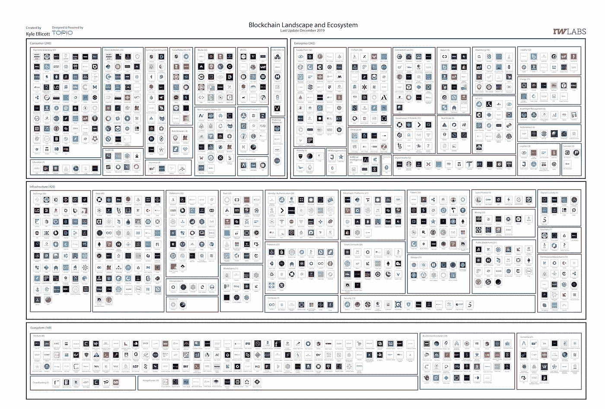

# 35 亿美元投资中国区块链初创公司/沃达丰离开 Libra / 2019 年 DApp 市场报告

> 原文：<https://medium.com/coinmonks/3-5bn-invested-in-chinas-blockchain-startups-vodafone-leaves-libra-2019-dapp-market-report-22ff4a0df2bd?source=collection_archive---------1----------------------->

Photo by [Sweetheart 陆初雪](https://unsplash.com/@luchuxue1997?utm_source=unsplash&utm_medium=referral&utm_content=creditCopyText) on [Unsplash](https://unsplash.com/s/photos/neon?utm_source=unsplash&utm_medium=referral&utm_content=creditCopyText)

*2020 年 1 月 22 日*

*当我们进入 2020 年已经快一个月的时候，这一景观正在继续成形，并且看不到放缓的迹象！让我们深入了解一下区块链最近发生的一切，DApps & DLT 风景。* ***中国*** *区块链创业公司获得 35 亿美元，比 2018 年大致下降 50%。沃达丰成为最新一个退出* ***天秤座协会的。*******NBA****继续介入区块链，萨克拉门托国王队发布了一个基于* ***以太坊*** *的运动装备拍卖平台。****Dapp.com****发布了其 2019 年度 DApp 市场报告，其中包含对新兴 DApp 景观的见解和学习。****block tower capital****分享其 2020 年主要行业主题。****Square****更看好比特币宣布推出“闪电开发套件”* ***黑客中午*** *开始在区块链上存储内容。**

> *[发现并回顾最佳加密软件](https://coincodecap.com)*

**我们甚至在大量的研究中找到了补习的余地(* [*Q4 2019 区块链景观**&*](https://www.topionetworks.com/markets/blockchain-landscape-5bf43854b9abe4633c1f87da)[*DApps 景观*](https://www.topionetworks.com/markets/dapps-stack-landscape-5de8d07eb9abe453e04203f8) *) &书籍(关于* [*数字资产*](https://www.scribd.com/document/430637579/Current-Market-Overview-of-Digital-Assets)*&*[*！)、基础设施、DApps、比特币、经济学、交易所和 Stablecoins。为了了解更多信息，让你跟上时代的步伐，这里有一张本周业内热门新闻的快照。*](https://www.amazon.com/dp/B07Z3LJCHW/ref=cm_sw_r_tw_dp_U_x_C6iSDbACJJN2Z)*

## *🏀 [NBA 萨克拉门托国王队与 ConsenSys 合作，在以太坊推出运动装备拍卖](https://www.theblockcrypto.com/post/53129/nbas-sacramento-kings-partner-with-consensys-to-launch-sports-gear-auctions-on-ethereum)*

*萨克拉门托国王篮球队与区块链软件开发公司 [ConsenSys](https://medium.com/u/6c7078bf7b01?source=post_page-----22ff4a0df2bd--------------------------------) 建立了合作关系。这一合作旨在发布一个基于以太坊区块链的运动装备拍卖平台。该平台使用 Consensys 的供应链平台 [Treum](https://treum.io/) 对拍卖物品进行认证，并对这一新平台上的交易历史进行透明的审计跟踪记录。… [阅读更多信息](https://www.theblockcrypto.com/post/53129/nbas-sacramento-kings-partner-with-consensys-to-launch-sports-gear-auctions-on-ethereum)*

## *📈[让你看起来聪明的 15 个区块链问题](https://www.forbes.com/sites/alisonmccauley/2020/01/16/want-to-be-smart-about-blockchains-in-2020-15-questions-to-ask/)*

*区块链和分布式账本技术总是让人迷惑不解。《福布斯》的作家艾莉森·麦考利采访了几位高管，以便对区块链有一个清晰的了解。通过采访，她设法列出了高管们心目中关于区块链评估的关键问题……[阅读更多信息](https://www.forbes.com/sites/alisonmccauley/2020/01/16/want-to-be-smart-about-blockchains-in-2020-15-questions-to-ask/)*

## *🇨🇳 [报道:2019 年中国区块链创业公司获得 35 亿美元](https://decrypt.co/17074/report-chinas-blockchain-startups-got-3-5-billion-in-2019)*

*根据 2019 年区块链投资和融资报告，中国共有 245 笔投资和融资交易，总投资额约为 35 亿美元。这两个数字都比 2018 年低约 50%，但明显高于 2017 年。热门投资领域包括:区块链新闻/市场英特尔、交易所和 DeFi，传统风投在 2019 年退居二线。大多数投资来自新成立的秘密基金。… [阅读更多信息](https://decrypt.co/17074/report-chinas-blockchain-startups-got-3-5-billion-in-2019)*

## *📖[为什么世界经济论坛正在创建区块链‘权利法案’](https://www.coindesk.com/why-the-world-economic-forum-is-creating-a-blockchain-bill-of-rights)*

*与任何技术一样，区块链技术的最终承诺和风险将归结于其战略、开发和实施中的个人决策。要控制所有这些设计选择是不可能的，但是在技术的最低标准上，关键参与者之间仍然有协调的空间。这就是为什么世界经济论坛的全球区块链委员会正在创建“区块链权利法案:去中心化未来的设计原则”。… [阅读更多](https://www.coindesk.com/why-the-world-economic-forum-is-creating-a-blockchain-bill-of-rights)*

## *📖 [Hedera Hashgraph CPO:“区块链的采用速度比我在物联网和人工智能领域看到的都要快”](https://www.forbes.com/sites/justinoconnell/2020/01/17/hedera-hashgraph-cpo-the-adoption-of-blockchain-is-going-faster-than-ive-seen-in-iot-and-ai/#23cd65d4f625)*

*Hedera Hashgraph 的首席产品官 Lionel Chocron 强调，区块链的采用速度比物联网和人工智能要快，并指出物联网需要更长的时间，因为需要连接数百万台设备。对于区块链，这比物联网和人工智能更容易，因为在其走向大规模采用的过程中，区块链既不依赖于大量的硬件投资，也不依赖于大量的数据……[阅读更多](https://www.forbes.com/sites/justinoconnell/2020/01/17/hedera-hashgraph-cpo-the-adoption-of-blockchain-is-going-faster-than-ive-seen-in-iot-and-ai/#23cd65d4f625)*

## *🇨🇳 [中国推出首个使用区块链技术的面部识别租车服务](https://dailyhodl.com/2020/01/14/china-launches-first-facial-recognition-car-rental-service-using-blockchain-technology-report/)*

*第三方在线和移动支付平台支付宝已经与悟空租车合作，允许消费者在与机器互动后驾驶他们的租赁汽车离开。新车型集成了支付宝人脸识别支付系统，据报道，该系统在没有服务员或人工验车的情况下完成了整个过程……[阅读更多](https://dailyhodl.com/2020/01/14/china-launches-first-facial-recognition-car-rental-service-using-blockchain-technology-report/)*

# *本周阅读的研究:*

*[Dapp.com](https://medium.com/u/52849c27fcd5?source=post_page-----22ff4a0df2bd--------------------------------)今天发布了其 [2019 年度 DApp 市场报告](https://www.dapp.com/article/dapp-com-2019-annual-dapp-market-report)，为社区提供了关于新兴分散化应用(DApp)领域活动的丰富见解和知识。该报告包括 2019 年新应用总数、重大事件、吸引量、活跃用户、领先主题等。*

*   **2019 年 dapp 活跃用户数较 2018 年有***翻倍，从 1.48 万增长到 3.11 万，有****277 万新增用户*** *体验去中心化 app。* ***用户留存仍是问题*** *对于 dapps 来说——2019 年只有 348K 老用户保持活跃，占全部活跃用户的 11%。***
*   ***金融服务(如借贷 dapps)有****2019 年最令人印象深刻的用户增长*** *。金融 dapp 用户数增长 610%，交易量增长 251%。***
*   ***在报告中纳入的 6 个区块链中，* ***EOS 的 mainnet 账户 dapp 使用率最高，为 48.91%*** *。这意味着每两个激活的账户中就有一个使用 EOS dapps。***

**你可以在这里找到[的完整报告](https://www.dapp.com/article/dapp-com-2019-annual-dapp-market-report)。**

# **本周的更多内容:**

**📖 [Square Crypto 正在为比特币钱包开发一个“闪电开发包”](https://www.coindesk.com/square-crypto-is-creating-a-lightning-development-kit-for-bitcoin-wallets)**

**📖[以太坊 2019 年](/@jjmstark/the-year-in-ethereum-2019-242012e4276d)作者[乔希·斯塔克](https://medium.com/u/d2400e27a419?source=post_page-----22ff4a0df2bd--------------------------------)**

**📖[2030 年夏天资产经理的一天](/melonprotocol/a-day-in-the-life-of-an-asset-manager-in-the-summer-of-2030-4f18009a5020)作者[莫娜·艾丽莎](https://medium.com/u/bf7c553c04ce?source=post_page-----22ff4a0df2bd--------------------------------)**

**📖[由](/@FidelityDigitalAssets/the-omnibus-model-for-custody-96b69710f92d) [Ria Bhutoria](https://medium.com/u/d2ea8cd877ed?source=post_page-----22ff4a0df2bd--------------------------------) 托管[富达数字资产](https://medium.com/u/3a8b739a08d1?source=post_page-----22ff4a0df2bd--------------------------------)的综合模式**

**♎澳大利亚可以监管脸书主导的天秤项目**

**♎[沃达丰成为最新一家退出 Libra 协会的公司](https://www.theblockcrypto.com/linked/53620/vodafone-becomes-latest-company-to-quit-the-libra-association)**

**📖[block tower 2020 年观塔及主题](https://blocktower.substack.com/p/towerwatch-7-the-return)**

**📖[黑客 Noon 在抛弃介质后将内容存储在区块链上](https://www.coindesk.com/hacker-noon-is-storing-content-on-a-blockchain-after-ditching-medium)**

**📖[这是马耳他作为区块链岛统治的终结吗？](https://decrypt.co/17024/is-this-the-end-of-maltas-reign-as-blockchain-island)**

**📖对于零工经济的工人来说，历史在重演——而且不是以一种好的方式**

**📖2020 年 WEF 的 CoinDesk:达沃斯开始时值得关注的秘密主题**

**💰[DeFi 能接管传统金融吗？这些创业公司都这么认为](https://decrypt.co/16987/can-defi-take-over-traditional-finance-these-startups-think-so)**

# **分散式应用程序手表**

## **📖[闭塞。一个人不会在 EOS 上发布其社交网络](https://www.coindesk.com/block-one-will-not-launch-its-social-network-on-eos)**

**历史上最大的首次硬币发行(ICO)背后的公司 Block.one 将不会使用公共 EOS mainnet 来推出其基于加密货币的社交媒体平台 Voice。根据该公司的常见问题页面，显示新的应用程序将运行在 EOSIO 软件的私人部署。关于是否在 EOS 上运行还没有定论……[阅读更多](https://www.coindesk.com/block-one-will-not-launch-its-social-network-on-eos)**

## **📖[去中心化数据存储:赋能&通过区块链技术保护隐私](https://btcmanager.com/decentralized-data-storage-empowering-protecting-privacy-through-blockchain-technology/)**

**由于区块链技术的出现，有可能创建分散存储解决方案，将数据存储在多台计算机或服务器上。这消除了我们之前分析的一些典型问题，同时通过共享用户的存储空间和正常运行时间来回报用户。区块链空间中致力于分散存储的一些公司是 [Sia](https://medium.com/u/96ebf78ad335?source=post_page-----22ff4a0df2bd--------------------------------) 、 [Storj](https://medium.com/u/31bb19d6e641?source=post_page-----22ff4a0df2bd--------------------------------) 和 [MaidSafe](https://medium.com/u/6876251327a7?source=post_page-----22ff4a0df2bd--------------------------------) ，它们基于区块链技术和点对点架构。… [阅读更多信息](https://btcmanager.com/decentralized-data-storage-empowering-protecting-privacy-through-blockchain-technology/)**

## **📖[抓住闪电:描绘比特币下一阶段的关键参与者](https://www.coindesk.com/grasping-lightning-mapping-the-key-players-in-bitcoins-next-phase)**

**在幕后，有更多的开发者致力于实现，如 [Blockstream](https://medium.com/u/b04e9938aa06?source=post_page-----22ff4a0df2bd--------------------------------) 的 c-lightning 和法国 Acinq 的艾克蕾尔。虽然这些软件背后的开发者倾向于专注于不同的功能，并且它们是用不同的编程语言编写的，但这三个软件都是[可互操作的](https://www.coindesk.com/lightning-last-test-shows-bitcoin-scaling-solution-almost-ready)，这意味着事务可以在它们之间无阻碍地发送。直到今天，来自这三个组织的开发人员继续每两周举行一次 IRC 聊天，讨论协议规范的未来变化……[阅读更多](https://www.coindesk.com/grasping-lightning-mapping-the-key-players-in-bitcoins-next-phase)**

**📖[股权之年区块链推出](/stakefish/the-year-of-proof-of-stake-blockchain-launches-d5cb947fc746)由 [JK | stake.fish](https://medium.com/u/9896ec369d48?source=post_page-----22ff4a0df2bd--------------------------------)**

**📖[嘉手纳向 Chainweaver 介绍宇宙生态系统](/kadena-io/kadena-introduces-chainweaver-to-the-cosmos-ecosystem-cde6f77875ec)作者[丽贝卡·罗德里格斯](https://medium.com/u/666bf2761d10?source=post_page-----22ff4a0df2bd--------------------------------)**

**📖【更新】[Michael Wuehler](https://blog.infura.io/getting-started-with-infura-28e41844cc89)撰写的《Infura 入门》**

# **🔮未来派读物**

**本周，我暂停播客，深入阅读蒂姆·莫恩最近的文章《科幻小说如何想象 21 世纪 20 年代》，思考未来。“享受吧！**

> ***👉下载全新* [*区块链为基础设施景观*](https://www.topionetworks.com/events/5d79268b78e00230faba6f77) *Q4 2019 版&* [*DApps“栈”景观*](https://www.topionetworks.com/markets/dapps-stack-landscape-5de8d07eb9abe453e04203f8)**

****

****Q4 2019 Edition** of the Blockchain for Infrastructure & Ecosystem Landscape**

**不想等到下周，[现在就订阅](http://click1.m.readwritelabs.com/xsdqkbbrgsdtqkmntpjlstcnkytvpvphsnhsqlvbrhhd_yfqbfcmslnskglmckvqv.html?source=post_page---------------------------)📥有关区块链、DApps 等的实时行业见解！**

> **[直接在您的收件箱中获得最佳软件交易](https://coincodecap.com/?utm_source=coinmonks)**

****