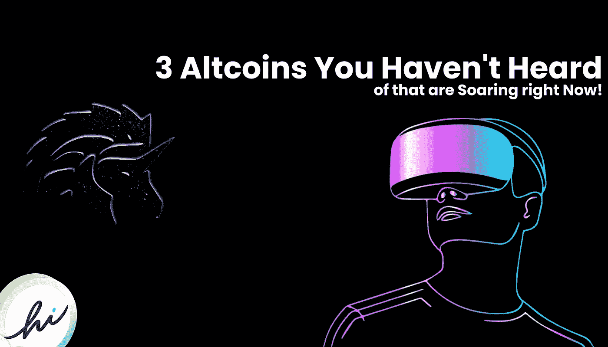
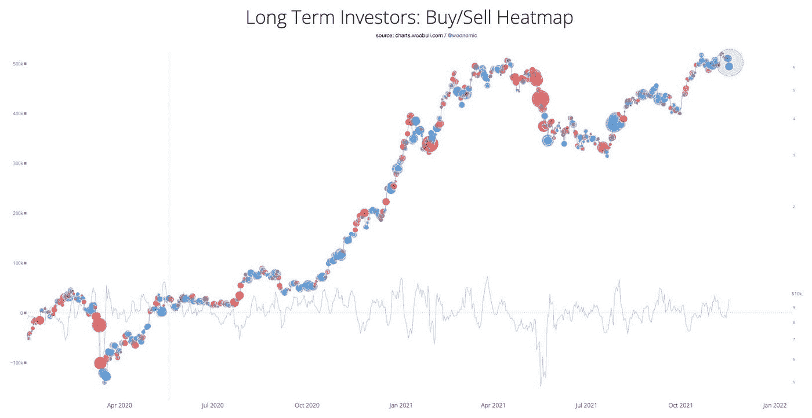
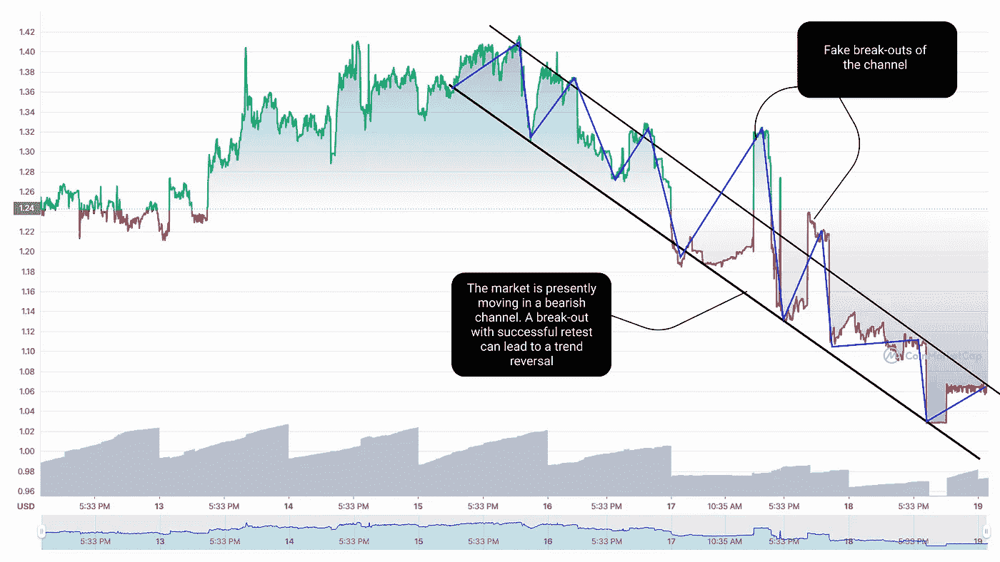
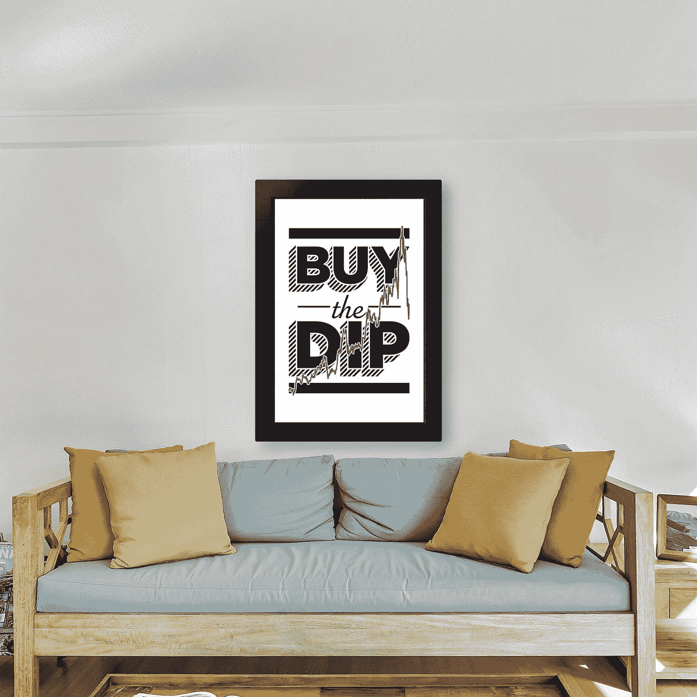
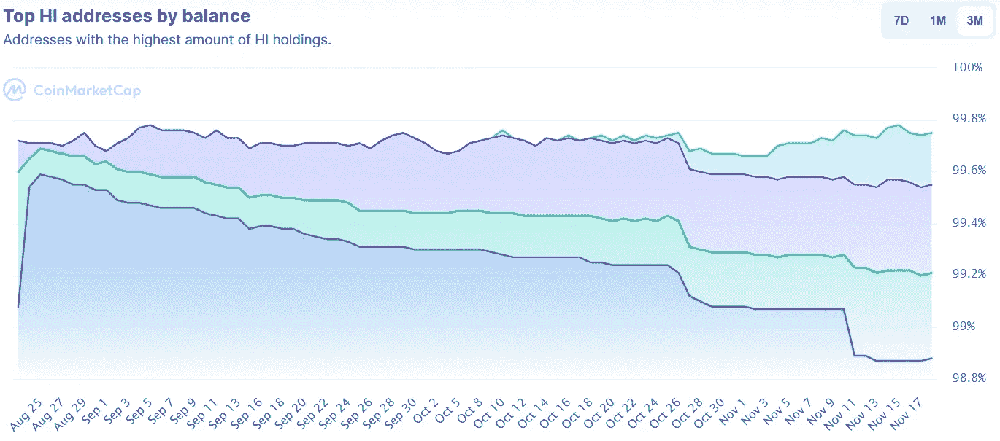
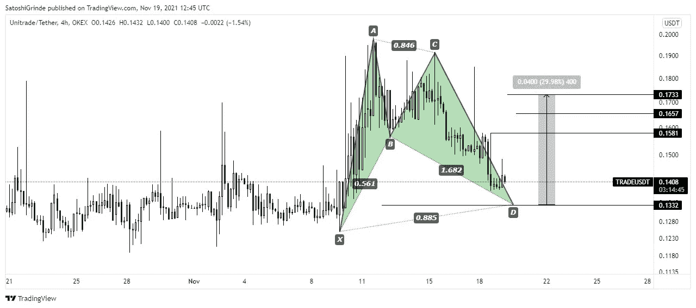
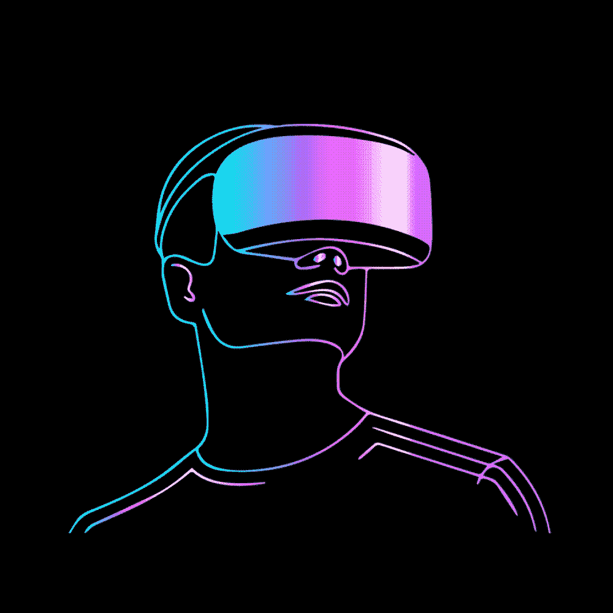
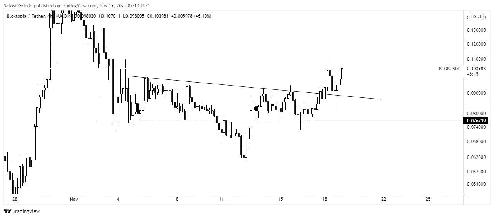

# 3 个你没听说过的另类硬币正在飙升！

> 原文：<https://medium.com/coinmonks/3-altcoins-you-havent-heard-of-that-are-soaring-right-now-ca0878325d82?source=collection_archive---------0----------------------->

## CoinMarketCap 上列出了超过 6，000 种硬币/代币，很难跟踪市场上蓬勃发展的各种硬币。所以这里有三种你可能没听说过的另类硬币，它们现在卖得很好。

比特币正在下跌，正如我在之前的一篇关于购买 dip 的[最佳加密货币的文章中所说，它正在拖累整个市场。但这总比把菲亚特存在你的银行账户里好，不是吗？据](/coinmonks/best-cryptocurrencies-to-buy-the-dip-november-2021-edition-bc27c551c18f?source=user_profile---------3-------------------------------)[报道](https://twitter.com/danheld/status/1460982222471716869?s=20)，去年流通中的美元有 40%是印刷的。所以比特币是价值的终极储存。

然而，购买蘸酱的不仅仅是我们。根据下面的头部地图，似乎长期霍德勒正在介入，并购买下跌。

# 喜元

我们名单上第一个被低估的硬币是 HI，因为它在不到一个月的时间里翻了 4 倍多(从 0.33 美元到 1.41 美元)

就目前的市场情况而言，我们已经讨论过比特币已经跌破 56，000 美元，并拖累了整个市场。因此，这可以证明是一个伟大的时间投资于高美元。因为，即使在崩盘后，HI 设法守住了强支撑位，目前交易价在 1 美元左右。因此，在牛市中继续前进，极有可能从这里反弹并突破 1.41 美元的历史高点。

请看下图，自最近的历史高点 1.41 美元以来，市场一直在熊市通道中运行。此外，随着时间的推移，交易量也在稳步下降，将价格引向其需求区域(这可能是一个很好的积累机会:使用 DCA)。除此之外，市场还做了两次假突破，但无法完成成功的重新测试，并回到通道中。因此，市场需要突破看跌通道，完成一次重新测试，以观察更高的价格。然而，在那之前，你可以继续买入和下跌。

7-D chart for HI

说到基本面，HI，或 hi Dollar，是一个非营利平台的原生令牌，允许你直接通过 Telegram、WhatsApp 等购买、发送或提取加密和法定货币。此外，该项目于六个月前启动，目前仍处于初始阶段，市场流通量为 **580，396，604 HI。**然而，由于该值没有上限，所以看看该项目在循环供应方面的进展会很有意思。

下面是一个不同的图表，我们可以看到，排名前 10 位的地址几乎占据了 hi 美元总发行量的 98%。然而，与 8 月份相比，这一数字一直在稳步下降，总发行量一直在流向投资者手中。因此，该项目仍处于早期阶段，可能会成为一个抓住一块蛋糕和骑牛的绝佳机会。

此外，hiChain Global 的 Github 存储库自推出以来频繁更新，最近一次更新发生在 10 月 15 日。hi 成员的数量也在稳步上升，现在接近 200 多万。

# UniTrade 分析

名字听起来很像，不是吗？(只要把贸易换成互换，你可以在我上一篇关于[最佳替代币购买 dip](/coinmonks/best-cryptocurrencies-to-buy-the-dip-november-2021-edition-bc27c551c18f) 的文章中找到。)不管怎样，UniTrade 最近表现非常好。此外，作为一个分散的交易平台，并建立在 Uniswap 之上，它可能会成为一个良好的投资机会。

根据下面的市场数据，交易/USDT 对正在形成看涨的蝙蝠形态。此外，在超过 91%的情况下，价格在到达 d 点后反转，因此，我建议你等待市场追踪到 0.132 美元，然后开始积累。因为市场可以从 0.886 纤维水平转回是非常显著的。我还标出了市场可能回落的价格。

# 街区分析

元宇宙，戴上耳机，一头扎进数字世界，坐在沙发上就能游遍整个星系，至少马克·扎克伯格是这么认为的。自从脸书更名为元，元宇宙硬币一直在蓬勃发展。然而，有一枚硬币仍处于初始阶段。BLOK，Bloktopia 的本土标志，一个由 Polygon 网络建立和支持的去中心化的元宇宙，正在打开新的投资大门。

从图表来看，BLOK 刚刚突破了主要阻力区，现在看起来不错。此外，它成功地再次测试，让我们能够确认突破，并假设市场看涨。此外，如果它回到 0.076 美元区域，开始 DCAing 并积累你想要的。我相信元宇宙相关的加密货币将在未来一段时间内迎来完美的繁荣。因此，在为时未晚之前，开始装满你的袋子。

# 结束语

交易最重要的部分是纪律和耐心。因此，不要只是前进，并在我们上面讨论的硬币或代币上全押。然而，以上所有的硬币都可以是一个合理的投资，所以去买 dip 吧。

资金不足以购买 dip？获得免费的 Hi 美元，使用下面的按钮注册，每天获得 1 美元。

本文没有任何金融建议，你应该只投资于你认为适合你的投资组合的市场。此外，文章包含附属链接，点击它们，我可能会赚取佣金。

***与我接通，***

[**Twitter**](https://twitter.com/prabxat)**|**[**LinkedIn**](https://www.linkedin.com/in/praxhat/)

ETH:0x 2784 D5 ca 62 ee 171192 ea 23 f 40 FB 76476547 c 244 e

> [*比特币:中本聪时代*](/coinmonks/bitcoin-the-age-of-satoshi-nakamoto-fe58157e740d?source=user_profile---------0-------------------------------)

> [*2021 年 11 月购买排名前 5 的密码*](/coinmonks/top-5-crypto-to-buy-in-november-2021-b9c99c44a704?source=user_profile---------1----------------------------)
> 
> [*美元弗洛基争霸|我们要 0.01 美元吗？*](/coinmonks/the-floki-supremacy-are-we-going-to-0-01-6763d56b9734?source=user_profile---------1-------------------------------)
> 
> [*BTCST 刚 3 天涨了 5 倍|目标是 1000 美元吗？*](/coinmonks/btcst-just-went-5x-in-3-days-is-it-aiming-for-1-000-9dcba894c954?source=user_profile---------1----------------------------)

> [*银行会灭亡还是会适应？DeFi 的未来将会决定。*](/coinmonks/will-banks-perish-or-adapt-the-future-of-defi-will-decide-80f13284f76?source=user_profile---------1----------------------------)

> [*你钱包里的 100 元钞票，是钱，还是没有价值的东西？*](/coinmonks/is-the-100-bill-in-your-wallet-money-or-something-that-has-no-value-99263e8dfba6?source=user_profile---------0----------------------------)
> 
> [*2021 年底前比特币还在破 100K 的路上吗？*](/coinmonks/is-bitcoin-still-on-its-path-to-break-100k-before-the-end-of-2021-4716a56745ce?source=user_profile---------1----------------------------)
> 
> [*我是如何在大学本科阶段开始投资 Crypto 的？*](https://praxhat.medium.com/how-did-i-start-investing-in-crypto-as-a-college-undergrad-ac9635d9d6b3?source=user_profile---------2----------------------------)

这篇文章中所写的一切都是我所相信的，你的想法可能与我的不同(显然，我们是两个不同的人)。所以，把这篇文章当做闲书，如果不喜欢内容，就当没看过吧！

> *加入* [*币僧电报频道*](https://t.me/coincodecap) *学习密码交易和投资。*

**同样，阅读**

*   [币安 vs 北海巨妖](https://blog.coincodecap.com/binance-vs-kraken) | [美元成本平均交易机器人](https://blog.coincodecap.com/pionex-dca-bot)
*   [如何在印度购买比特币？](/coinmonks/buy-bitcoin-in-india-feb50ddfef94) | [WazirX 审核](/coinmonks/wazirx-review-5c811b074f5b) | [BitMEX 审核](https://blog.coincodecap.com/bitmex-review)
*   [比特币主根](https://blog.coincodecap.com/bitcoin-taproot) | [Bitso 评论](https://blog.coincodecap.com/bitso-review) | [排名前 6 的比特币信用卡](/coinmonks/bitcoin-credit-card-bc8ab6f377c6)
*   [双子座 vs 比特币基地](https://blog.coincodecap.com/gemini-vs-coinbase) | [比特币基地 vs 北海巨妖](https://blog.coincodecap.com/kraken-vs-coinbase) | [硬币罐 vs 硬币点](https://blog.coincodecap.com/coinspot-vs-coinjar)
*   [印度加密交易所](/coinmonks/bitcoin-exchange-in-india-7f1fe79715c9) | [比特币储蓄账户](/coinmonks/bitcoin-savings-account-e65b13f92451) | [Paxful 审核](/coinmonks/paxful-review-4daf2354ab70)
*   [杠杆令牌](/coinmonks/leveraged-token-3f5257808b22) | [最佳加密交易所](/coinmonks/crypto-exchange-dd2f9d6f3769) | [AscendEX 评论](/coinmonks/ascendex-review-53e829cf75fa)
*   [Godex.io 审核](/coinmonks/godex-io-review-7366086519fb) | [邀请审核](/coinmonks/invity-review-70f3030c0502) | [BitForex 审核](https://blog.coincodecap.com/bitforex-review) | [HitBTC 审核](/coinmonks/hitbtc-review-c5143c5d53c2)
*   [Crypto.com 费用](/coinmonks/binance-fees-8588ec17965) | [Botcrypto 审查](/coinmonks/botcrypto-review-2021-build-your-own-trading-bot-coincodecap-6b8332d736c7) | [替代方案](https://blog.coincodecap.com/crypto-com-alternatives)
*   [有哪些交易信号？](https://blog.coincodecap.com/trading-signal) | [Bitstamp vs 比特币基地](https://blog.coincodecap.com/bitstamp-coinbase)
*   [ProfitFarmers 回顾](https://blog.coincodecap.com/profitfarmers-review) | [如何使用 Cornix Trading Bot](https://blog.coincodecap.com/cornix-trading-bot)