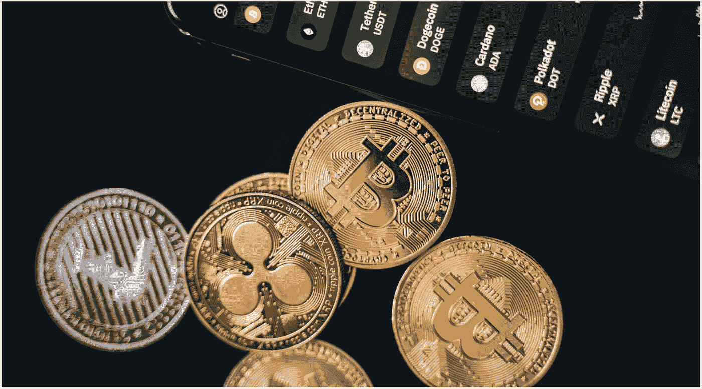

# 2022 年值得关注的 3 种加密货币

> 原文：<https://medium.com/coinmonks/3-cryptocurrencies-to-keep-your-eye-on-in-2022-2c24a3a1cab5?source=collection_archive---------11----------------------->

## **当加密市场受到** [**另一轮 FUD**](https://decrypt.co/86770/proposed-legislation-prohibit-private-crypto-india-sparks-confusion) **和抛售的冲击时，精通金融的投资者可能会寻求投资。**

数字代币的世界对散户投资者越来越有吸引力。与此同时，不像比特币那样浪费资源的加密货币正在席卷市场。

采矿加密指的是在区块链上发生的交易的验证过程，这是一种去中心化的公共分类账。完成这项工作的矿工会得到采矿费和新代币的奖励。市值最大的加密货币比特币所采用的[工作证明](https://www.forbes.com/sites/christopherhelman/2021/08/02/green-bitcoin-mining-the-big-profits-in-clean-crypto/)系统依赖于高耗能的计算能力来验证其区块链上的交易。[股权证明](https://ethereum.org/en/developers/docs/consensus-mechanisms/pos/#:~:text=Proof%2Dof%2Dstake%20is%20the,blocks%20they%20don't%20create.)，投资者将他们的硬币作为赌注，以成为区块链上的验证者，其排放远远低于工作证明系统或我们当前的银行法定货币方式。

## **1)雪崩(AVAX)**

由加密公司艾娃实验室开发的区块链生态系统 Avalanche 几个月来一直在吸引投资者远离第二大加密货币以太坊。这让 Avalanche 获得了“以太坊杀手”的绰号，尽管它并不想被人这样称呼。

这个区块链实际上经营着多个连锁店。X 链用于创建 AVAX 硬币和处理金融交易(为此，它使用非常低排放的股权证明系统)。P 链处理自己的赌注，C 链处理智能合同，即在区块链编码的协议。这种多链解决方案使雪崩区块链快如闪电。Avalanche 的 Wilson Wu 告诉我们，他们的系统每秒处理 4.500 笔交易。

**好消息:**在撰写本文时，Avalanche 是市场上第 11 大加密货币，随着以太坊面临更多类似的竞争对手，其份额可能会在未来几个月继续飙升。Avalanche 还希望向新用户赠送 1000 万枚 AVAX 币，让他们熟悉这个系统。根据 CoinGecko 的数据，AVAX 的价格在上个月上涨了 80.8%。

坏消息:你可能不会很快挖掘自己的 AVAX 币。如果你想成为这个网络上超过 1000 个验证者中的一个，你必须投入大约 2000 个 AVAX 硬币。那可是 20 多万欧元！

## **2) Filecoin (FIL)**

Filecoin 是另一个有趣的协议令牌。Filecoin 项目的目标实际上是存储人类提供的最有价值的信息，并最终彻底改变(并分散)云存储世界。

Filecoin 系统连接了世界上成千上万的电脑，创造了一个巨大的存储系统，用户可以随时使用。为了在区块链上开采金币，该协议使用了自己独特的系统，名为时空证明。使用这种挖掘过程，为他人存储数据的用户将块添加到链中。这意味着矿工实际上通过提供存储空间和服务数据来赚取代币。

**好处:** Filecoin 是一个值得参与的好项目。这种硬币相对环保，因为区块链系统在验证交易时只使用现有设备。一枚 FIL 硬币目前售价约 45 欧元。

**坏处:**尽管 Filecoin 的系统分散且无法破解，但它仍然依赖于当地的网速和可用性。Filecoin 网络本身仍然是一个相当模糊的 dApp(去中心化应用程序)，这使得它在人群中的采用相当缓慢。当你拿着这枚硬币时，不要期待任何疯狂的上涨，而是稳定的增长。然而，在过去的 12 个月里，代币的价格确实上涨了 68%。

## **3)比特币(BTC)**

尽管比特币仍然是污染最严重的分散技术之一(一些研究人员估计，仅今年一年，比特币就可能留下相当于伦敦 T11 大小的碳足迹)，但许多人认为，加密货币现在可能实际上正在推动绿色能源。Twitter 首席执行官杰克·多西是支持比特币的人之一，他在自己的社交媒体平台上推出了一个比特币小费罐，并正在与他的支付公司 Square 合作开发一个去中心化的比特币交易、挖掘系统和钱包。

理解比特币就是理解 crypto。它是世界上最古老的加密货币，由一位匿名的计算机科学家于 2009 年发明，只知道他的笔名[中本聪](https://nypost.com/2021/11/20/how-two-men-one-dead-one-alive-came-to-claim-they-invented-bitcoin/)，以实现一个完全不受银行和政府控制的全球支付系统。

**好消息:**比特币很有可能继续在加密货币的故事中扮演核心角色。购买自己的比特币股份几乎被普遍认为是加密投资的第一步。没有一家加密交易所不卖比特币。2022 年比特币的价格前景[也非常乐观](https://time.com/nextadvisor/investing/cryptocurrency/bitcoin-price-predictions/)。

**坏处:**比特币的交易费用仍然很高，显然，要减少比特币开采过程的污染，还有很多工作要做。

Source: Pexels (CC0).