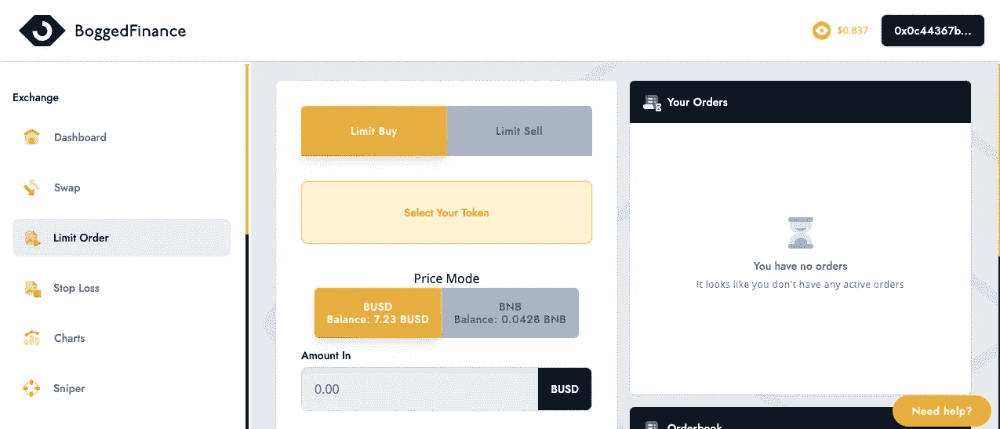

# 3 Dapp 在币安智能链上引入订单簿功能

> 原文：<https://medium.com/coinmonks/3-dapp-that-bring-order-book-feature-on-binance-smartchain-4851a83a23ce?source=collection_archive---------1----------------------->

订单簿是一个数字列表簿，它保存并列出特定加密资产的所有购买/出售订单。它的主要功能是维护在特定价格点出售或购买的令牌枚举。在所有使用币安克隆脚本建立交易所的情况下，它将自动成为基于订单簿的 CEX。

订单簿还为流动性高的交易所提供了解决方案。它有助于管理低滑点，而不用担心交易量。一般来说，有 Dapp 平台可以帮助你下限价单，这是由他们的订单簿功能处理的。他们根据自己的条件提供限价单协议。限价单是一种购买订单，用户可以以特定的购买或出售价格下单，其限制由用户自己决定。当市场价格达到用户的目标价格时，可以自动执行交易。它允许用户逢低买入或获利了结，从市场波动中获利。

在本帖中，我们将了解一些在币安智能链上带来订单簿功能的顶级 Dapp。

# 库鲁鲁

[Kururu](https://kururu.finance/) 是一个提供创建简单订单簿交易的平台，用户可以免费创建订单并将其列入市场。这使得其他用户能够来选择所需的订单，并在将来开始互换交易。

# 1 英寸

1inch Network 是以太坊、多边形和币安智能链上的 DeFi/DEX 聚合器。它是一个聚合分散协议的平台，这些协议的协同作用能够在 DeFi 领域实现最有利可图、快速和安全的操作。其聚合器协议通过利用广泛的协议并执行参数验证和执行验证，提供了经济高效且安全的交易。它的流动性协议为用户提供了免受各种攻击的安全性。这也为流动性提供者提供了资本效率。

其 **1 英寸限价单**协议提供了 DeFi 中最具创新性和灵活性的限价单功能。这种订单簿功能允许用户以特定的价格购买或出售加密资产。当前支持的令牌有 ERC20/BEP20、ERC721 和 ERC1155。它为市场上的竞争对手提供了更高水平的效率和灵活性。也没有任何指控。

# 博格工具

Bogtools 是一个分散的金融平台，允许您研究和订购币安智能链上的任何令牌。它的订单功能是最受欢迎的功能之一。主要功能是限制 PancakeSwap 的订单。它有助于在链上执行限价单，利用 PancakeSwap 流动性。这种限价单功能利用了 PancakeSwap 在当前效用下的流动性。他们声称，该平台将在未来利用多个分散的交易所。这将使订单以尽可能好的价格成交。

限价订单每份价值 2.50 美元的 BOG，如果不执行，将有 31 天的有效期。这个平台的用户需要持有一个 BOG 令牌作为费用。收取的费用将用于补偿平台的天然气成本。这笔费用的利润将分配给流动性提供者利益相关者和博格工具开发商。

## 也阅读

 [## 最佳免费加密交易机器人——前 16 名比特币交易机器人[2021]

### 2021 年币安、比特币基地、库币和其他密码交易所的最佳密码交易机器人。四进制，位间隙…

medium.com](/coinmonks/crypto-trading-bot-c2ffce8acb2a)  [## 最佳 6 个加密交易信号电报通道

### 这是乏味的找到正确的加密交易信号提供商。因此，在本文中，我们将讨论最好的…

medium.com](/coinmonks/best-crypto-signals-telegram-5785cdbc4b2b)  [## BlockFi 评论 2021 —通过您的加密获得 8.6%的利率

### 让你的密码发挥作用，获得比特币和其他加密货币的最佳利率

medium.com](/coinmonks/blockfi-review-53096053c097)  [## 加密税务软件——五大最佳比特币税务计算器[2021]

### 不管你是刚接触加密还是已经在这个领域呆了一段时间，你都需要交税。

medium.com](/coinmonks/best-crypto-tax-tool-for-my-money-72d4b430816b)