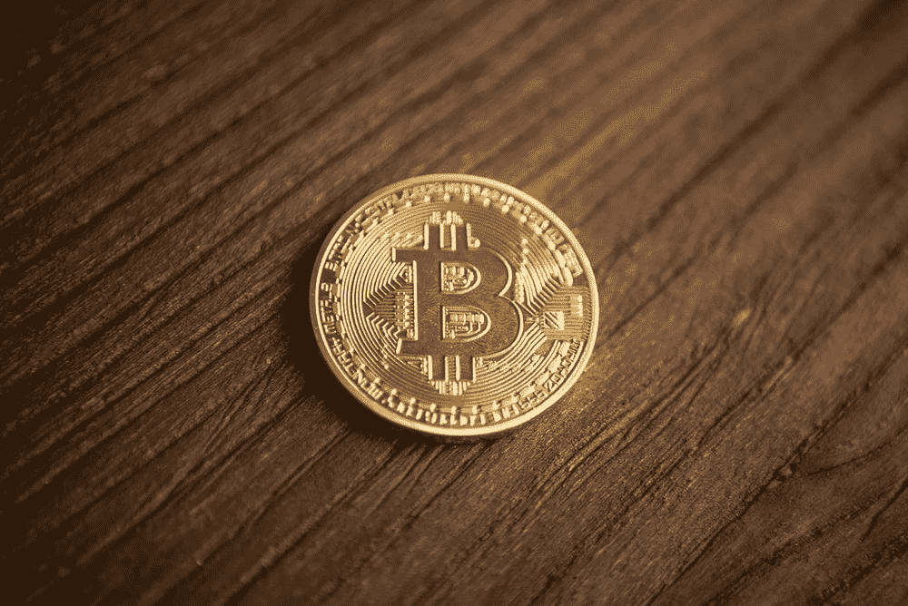

# 在 CeFi 和 DeFi 上增加比特币筹码的 3 种简单方法

> 原文：<https://medium.com/coinmonks/3-easy-ways-to-increase-your-bitcoin-stack-with-yield-on-cefi-and-defi-9c385020accc?source=collection_archive---------0----------------------->

借出比特币，提供流动性，可以帮助被动地增长你的比特币胸部。这里有一些不同的平台，你可以花很少的精力和时间被动地赚取比特币的利息。

Image by [André François McKenzie](https://unsplash.com/@silverhousehd) on Unsplash

在你的比特币上赚取比特币是加密资产类别中最令人兴奋的一个方面。由于比特币的通货膨胀率在降低，叠加…