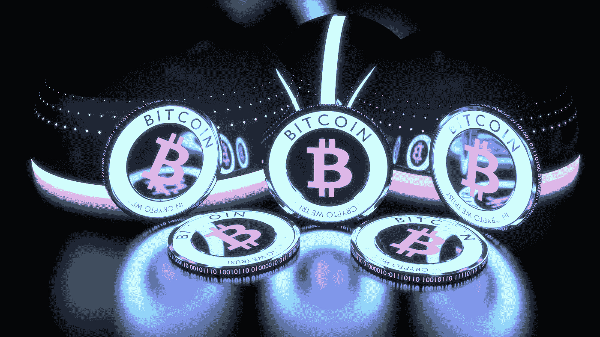
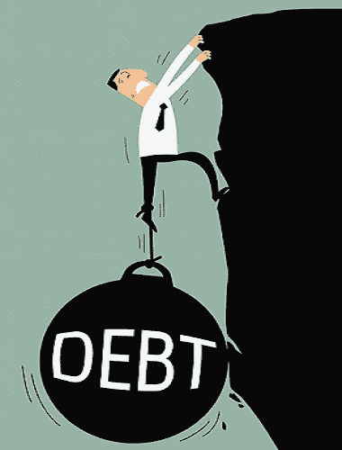
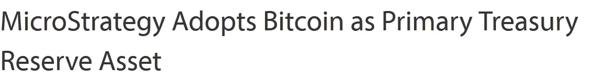

# 3 个关键因素可以导致比特币的大规模采用(和菲亚特下降)

> 原文：<https://medium.com/coinmonks/3-key-factors-that-can-lead-bitcoin-to-mass-adoption-and-fiat-decline-c9b81b6bf11f?source=collection_archive---------2----------------------->

## 让我们试着揭示这个巨大的泡沫…

从很多角度来看，2020 年对于全球经济和全人类的命运来说都是具有根本性的一年。越来越多的人怀疑政府和央行为应对冠状病毒紧急情况而采取的措施是否足够，是否能够引领全球经济增长。答案？这是不会发生的……
我们在这个时期面临的只是**对人口**、隐私和货币发行的前所未有的控制。封锁、口罩和一般卫生设施等限制性措施已导致民众屈服，这在不久前还是不可想象的。**像瑞典这样的良性案例甚至没有被考虑在内**，这表明该指令是一个指令，是通过前所未有的宣传精心策划的。

# 为了对抗债务，我们使用债务

世界各地的中央银行认为，他们可以通过在资产负债表上增加越来越多的债务来逃避公共债务问题，从而成倍地增加全球的问题。数据摆在那里，任何人都可以看到:在新冠肺炎之前，全球经济 80 万亿美元，而债务是 250 万亿美元，其中 180 万亿美元是在过去 20 年里增加的。显然，这些是 covid 之前的数据，所以，是的，你确实应该担心…

# 奥地利解决方案？

作为奥地利经济学的爱好者，我想起了两位杰出思想家的两句名言。第一个是冯·哈耶克，他提出**在货币问题上结束国家垄断，由公共和私人实体竞争，提出最佳货币**，然后由自由市场选择。第二个建议，或者更确切地说，来自米塞斯，他说:“**没有办法避免信贷扩张导致的繁荣最终崩溃。另一种选择只是，这场危机是应该首先作为自愿放弃进一步信贷扩张的结果出现，还是随后作为相关货币体系的最终和全面灾难出现”。因此，我们的经济是一只追着尾巴的漂亮狗:只要它继续跑，就有稳定经济的表象，当狗停下来时，一切都会像多米诺骨牌一样倒下。**

# 默认

因此，按照米塞斯的说法，对于当前的全球形势，我们只有两种选择:通过通缩性萧条(包括银行体系崩溃)违约或通过恶性通胀违约。是的，你没看错，**违约就在**那里，迟早会发生。如果你想告诉我，形势已经得到控制，法定货币将能够抵御央行货币政策的冲击，那么这篇文章不适合你(几年后我会很高兴再次见到你)。

但是现在我们明白了我们的处境有多糟糕，有什么解决办法呢？事实上，解决方案很少，甚至可能没有。**我们面临着无法治愈的疾病，但只能缓解。坠落将是毁灭性的，但也许有降落伞可以使用。降落伞显然是中本聪创造的货币，他是近年来我们应该追随的唯一真正的先知和经济大师。 [**比特币**](https://blog.coincodecap.com/a-candid-explanation-of-bitcoin) **似乎比以往任何时候都更能解答各国央行及其货币政策**所采取的疯狂行动。我试图阐明和分析能够导致比特币被用作全球支付系统的原因和因素。**

# 1.企业

在比特币成为全球数十亿人的主流之前,**它首先必须被全球非常重要的公司认可为价值储存手段**。别开玩笑了，银行不太可能把比特币当回事。对他们来说，这仍然是一场游戏，一场赌博，但许多公司正在评估接受比特币支付的可能性，并将这种资产作为长期的价值储存手段。这方面的例子还不多，但未来在经济层面出现的情况正导致这一趋势的速度呈指数增长。**以最大的上市商业智能公司 MicroStrategy** 为例，该公司几周前宣布收购了约 4.25 亿美元，并采用中本聪的加密货币作为主要的价值储存手段。让我们以 Just Eat 为例，在法国，该公司已决定接受比特币支付；在日本和瑞士，人们可以在 BTC 缴税。
比特币是为人们而生的，但是**公司和企业将促进大规模采用的到来。**

# 2.无银行账户者的银行业务

比特币无疑是过去十年中最有趣的投机资产之一，但正如我们所知，它不仅仅是这样。到 2020 年，仍有数十亿人发现自己在转移资金和开立银行账户方面存在困难，比特币满足了这些人的需求。我们显然是在谈论非洲大陆、南美和西亚。这些地方和生活在那里的人们有可能在比特币中找到一种健康的货币，并在此基础上重建被战争和国家货币贬值摧毁的大陆。因此，我们可以评估这些人群，作为最后的实验，看看比特币是否准备好被大规模采用，以及人们是否准备好学习使用专门为他们创造的媒介。**为没有银行账户的人提供银行服务，我们才刚刚开始……**

# 3.法币贬值

正如我们从序言中了解到的，全球各央行实施的**货币政策****无疑是对比特币最好的营销。法定货币没有硬性上限，因此不一定能支撑全球经济，这一事实令人非常担忧。正如我前面提到的，坠落将是毁灭性的，但至少有一个降落伞。比特币无疑是躲避目前系统性通胀的理想货币。**大规模采用也经历了我们货币体系的失败。****

你呢？你认为会让比特币成为主流的因素有哪些？

请在评论中告诉我！

关注我在加密和区块链领域的其他文章！

## 另外，阅读

*   最好的[加密交易机器人](/coinmonks/crypto-trading-bot-c2ffce8acb2a)
*   [密码本交易平台](/coinmonks/top-10-crypto-copy-trading-platforms-for-beginners-d0c37c7d698c)
*   最好的[加密税务软件](/coinmonks/best-crypto-tax-tool-for-my-money-72d4b430816b)
*   [最佳加密交易平台](/coinmonks/the-best-crypto-trading-platforms-in-2020-the-definitive-guide-updated-c72f8b874555)
*   最佳[加密贷款平台](/coinmonks/top-5-crypto-lending-platforms-in-2020-that-you-need-to-know-a1b675cec3fa)
*   [最佳区块链分析工具](https://bitquery.io/blog/best-blockchain-analysis-tools-and-software)
*   [加密套利](/coinmonks/crypto-arbitrage-guide-how-to-make-money-as-a-beginner-62bfe5c868f6)指南:新手如何赚钱
*   最佳[加密制图工具](/coinmonks/what-are-the-best-charting-platforms-for-cryptocurrency-trading-85aade584d80)
*   [莱杰 vs 特雷佐](/coinmonks/ledger-vs-trezor-best-hardware-wallet-to-secure-cryptocurrency-22c7a3fd391e)
*   了解比特币的[最佳书籍有哪些？](/coinmonks/what-are-the-best-books-to-learn-bitcoin-409aeb9aff4b)
*   [3 商业评论](/coinmonks/3commas-review-an-excellent-crypto-trading-bot-2020-1313a58bec92)
*   [AAX 交易所审核](/coinmonks/aax-exchange-review-2021-67c5ea09330c) |推荐代码、交易费用、利弊
*   [Deribit 审查](/coinmonks/deribit-review-options-fees-apis-and-testnet-2ca16c4bbdb2) |选项、费用、API 和 Testnet
*   [FTX 密码交易所评论](/coinmonks/ftx-crypto-exchange-review-53664ac1198f)
*   [n 零审核](/coinmonks/ngrave-zero-review-c465cf8307fc)
*   [Bybit 交换审查](/coinmonks/bybit-exchange-review-dbd570019b71)
*   [3Commas vs Cryptohopper](/coinmonks/cryptohopper-vs-3commas-vs-shrimpy-a2c16095b8fe)
*   最好的比特币[硬件钱包](/coinmonks/the-best-cryptocurrency-hardware-wallets-of-2020-e28b1c124069?source=friends_link&sk=324dd9ff8556ab578d71e7ad7658ad7c)
*   最佳 [monero 钱包](https://blog.coincodecap.com/best-monero-wallets)
*   [莱杰纳米 s vs x](https://blog.coincodecap.com/ledger-nano-s-vs-x)
*   [bits gap vs 3 commas vs quad ency](https://blog.coincodecap.com/bitsgap-3commas-quadency)
*   [莱杰纳米 S vs 特雷佐 one vs 特雷佐 T vs 莱杰纳米 X](https://blog.coincodecap.com/ledger-nano-s-vs-trezor-one-ledger-nano-x-trezor-t)
*   [block fi vs Celsius](/coinmonks/blockfi-vs-celsius-vs-hodlnaut-8a1cc8c26630)vs Hodlnaut
*   Bitsgap 评论——一个轻松赚钱的加密交易机器人
*   为专业人士设计的加密交易机器人
*   [PrimeXBT 审查](/coinmonks/primexbt-review-88e0815be858) |杠杆交易、费用和交易
*   [埃利帕尔泰坦评论](/coinmonks/ellipal-titan-review-85e9071dd029)
*   [赛克斯·斯通评论](https://blog.coincodecap.com/secux-stone-hardware-wallet-review)
*   [BlockFi 审查](/coinmonks/blockfi-review-53096053c097) |赚取高达 8.6%的加密利息