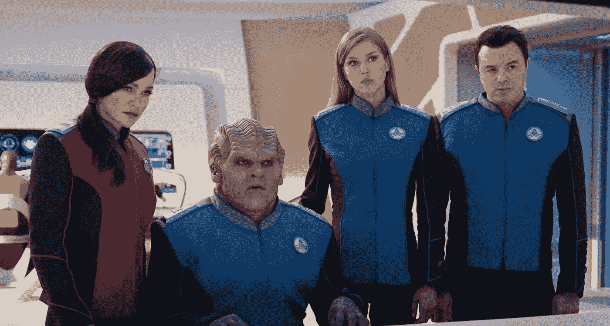
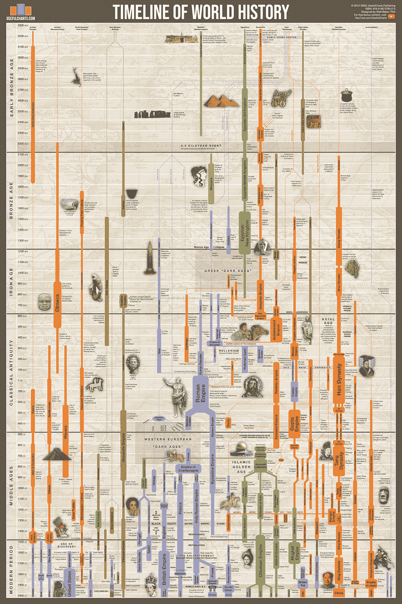
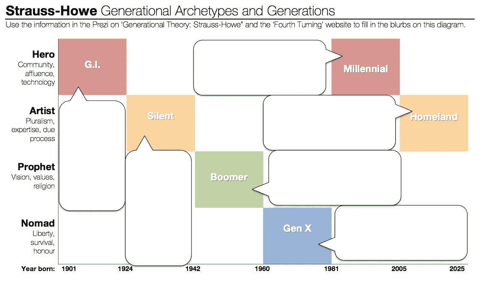
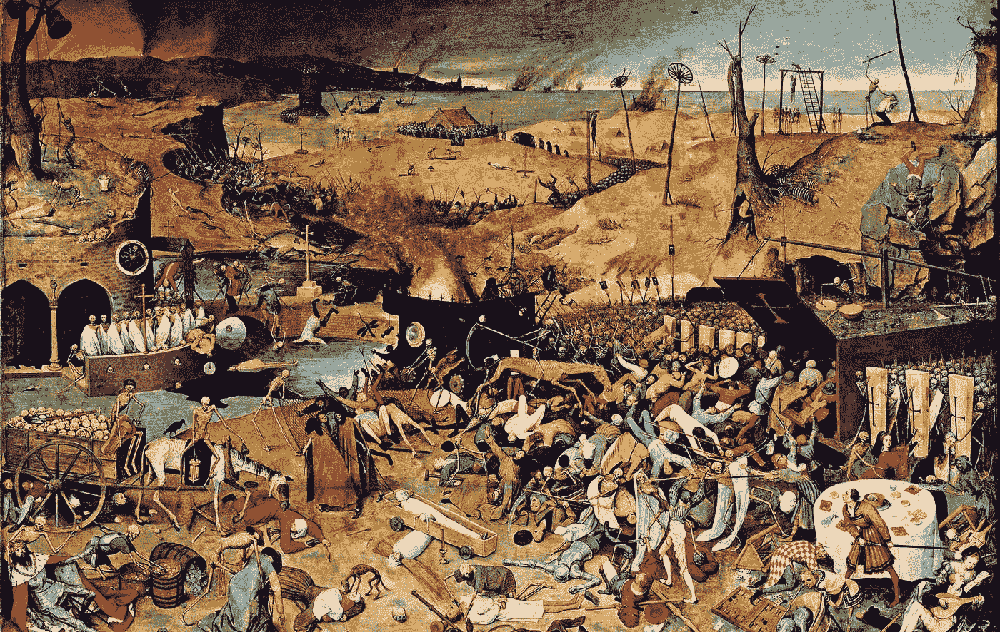
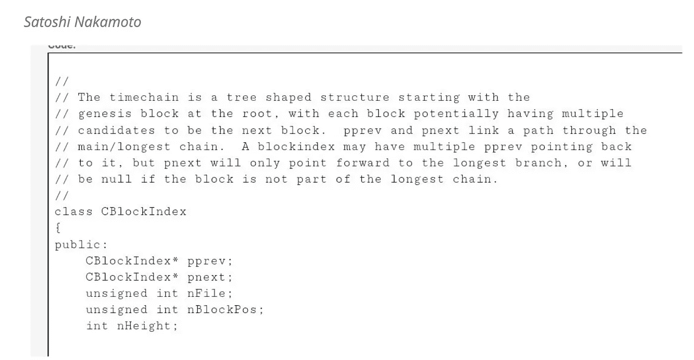

# 3 项观察表明，我们正在“分叉”并开始一个新时代

> 原文：<https://medium.com/coinmonks/3-observations-that-show-we-are-forking-and-starting-a-new-era-5fb35b3eb9f2?source=collection_archive---------5----------------------->

***The Orville*** is a science fiction comedy TV series created by Seth MacFarlane (right), that describes the journey of USS Orville, an exploratory spaceship in the 25th century. A parody of [*Star Trek*](https://en.wikipedia.org/wiki/Star_Trek:_The_Original_Series), it brings up serious issues like: social inequality, racism, gender identity, injustice, misinformation, and violence in a utopian post-monetary universe ([Source](https://en.wikipedia.org/wiki/The_Orville))

## *连接历史、区块链、时间链和社会*

这个漫长的[劳动节](https://en.wikipedia.org/wiki/Labor_Day)和[犹太新年](https://en.wikipedia.org/wiki/Rosh_Hashanah)周末让我尽情享受塞思·麦克法兰滑稽的科幻恶搞[奥维尔](https://en.wikipedia.org/wiki/The_Orville)，并提醒我 25 世纪的 [*乌托邦未来*](https://en.wikipedia.org/wiki/The_Orville_(season_1)) 可能会是什么样子。一个不仅没有系统性不平等、种族主义、性别认同、不公正、错误信息、暴力和疾病的未来，而且是一个通过*后货币秩序*自我组织的宇宙，在这个宇宙中，人们的行为和价值观，而不是金钱，是当地的“货币”。

虽然我有时想知道[资本主义是否真的结束了](/@renegadeinc/financial-capitalism-the-endgame-7aa15da591cc)，如果真的结束了，接下来会发生什么，但我偶然发现了[有用的图表](https://usefulcharts.com/)(人们是这样称呼它们的),这些图表总结了人类历史(见下文),并帮助我观察到三件重要的事情，这些事情向我暗示了等待我们的是什么。

Covering 53 centuries (Y axis) from 3300 BCE to present, this chart displays all the major empires, kingdoms and civilizations throughout history in a side-by-side format (X axis), so that we can quickly see how different events in Pre-Columbian American, African, European, Middle Eastern and Asian history relate to one another ([Source](https://usefulcharts.com/products/timeline-of-world-history))

# 观察#1:当事情发生时，它们在任何地方发生(X 轴)

这幅图像传达的一个强烈信息是，尽管我们把历史事件描述为地理上分散的，但它们实际上是无处不在的。我主要研究了以欧洲为中心的希腊帝国和 T2 罗马帝国的历史，并意识到我对 T4 汉朝、笈多帝国和萨珊王朝的编年史同样一无所知。

甚至在旅行和全球化时代之前，这些全球性事件就表明了我们的相互依赖，并表明有深层的，也许是遗传学和表观遗传学的驱动因素将我们整个物种(即人类)联系在一起。

这种“ [*分享历史*](https://sharedhistory.eu/om/background) 的想法，不仅仅是两个不同的人可以分享彼此的某一段历史，而且承认**我们是同一段历史的一部分，**虽然我们可能有不同的背景、经历和故事可以分享。

# 观察#2:当什么都没发生时，什么都没发生(X 轴)

我们都知道[马克·吐温的名言](https://quoteinvestigator.com/2014/01/12/history-rhymes/):*历史不会重演，它押韵*。这种历史的周期性在施特劳斯-豪的世代理论中得到最好的描述，表明全球历史中每 80-100 年发生一次世代循环。根据该理论，历史事件与每一个新时代(称为转折)中释放的代际人物或原型(见下文)相关，每个新时代持续 20-25 年，其中新的社会、政治和经济气候占主导地位。

In their book ***The Fourth Turning*** (1997) the four personas are called: *Prophet, Nomad, Hero,* and *Artist*. These personas not only share a similar age-location in history, but also share same attitudes towards family, risk, culture, values, and civic engagement. ([Source](https://www.leadersedge.com/industry/the-fourth-turning-is-here))

这种历史周期性让我们在某种程度上可以预测，并为未来的事件做好准备。例如，以下是卡尔·萨根在他 1997 年的书《恶魔出没的世界》中关于今天的预言:

> “……科学不仅仅是一个知识体系；这是一种思维方式。我对我的子孙时代的美国有一种不祥的预感——那时美国是一个服务和信息经济体；几乎所有关键的制造业都转移到了其他国家；当令人敬畏的技术力量掌握在极少数人手中，甚至没有人代表公众利益能够抓住问题；当人民失去了制定自己的议程或明智地质疑当权者的能力时；当我们紧握着水晶，紧张地查询我们的星座运势，我们的批判能力下降，无法区分什么感觉良好，什么是真实的，我们几乎没有注意到，**滑回迷信和黑暗**……”(第 25 页，重点是我的)

# 观察#3:从一个历史时期到另一个历史时期总是因为两件事情中的一件，或者两件都是(Y 轴)

尽管历史看起来像一个由连续事件组成的长长的连续故事情节，但当我们回到我们的“有用图表”时，我们会看到历史实际上是连续的，在那里有明确的“中断”,世界事件停止了。

如果我们在一个时代结束时(青铜时代到铁器时代，古代到中世纪到现代)检查这些停顿，我们注意到两件事情中的一件(或两件)发生了:

(1)一次灾难性的气候事件(想想[4200 年的干旱](https://en.wikipedia.org/wiki/4.2-kiloyear_event)，[小冰期](https://en.wikipedia.org/wiki/Little_Ice_Age)

(2)灾难性的疫情(想想 T4 的查士丁尼瘟疫或黑死病)

This 1562 painting, “The Triumph of Death,” by Pieter Bruegel the Elder, illustrates the devastating impact the bubonic plague had on society ([Source](https://www.nationalgeographic.co.uk/history-and-civilisation/2020/04/fast-and-lethal-the-black-death-spread-more-than-a-mile-per-day))

> 我认为，虽然广泛的社会崩溃正在发生，但 2021 年感觉不同的原因是因为我们正在经历极端气候事件和一波又一波无情的全球疫情。

这些灾难的后果影响了所有年龄和所有地域的每个人。除了生命损失，新冠肺炎全球经济衰退的影响预计将会持续很长时间，尤其是在新兴市场和发展中经济体。

*(全面考察新冠肺炎的社会经济影响可以在这里找到***)。**

*然而，正如历史学家之前所说，流行病和极端气候事件也为新的机遇铺平了道路。因此，我们可以想象一个充满创造力和繁荣的艺术、文化和科学财富的未来世界。*

# *最后的思考:社会 4.0 会是什么样子，区块链和时间链跟它有什么关系？*

*我以前写过，并不是所有的事情都是不好的。疫情加速了创新，释放了创造力的浪潮和对 T2 合作的需求，无论是在 T4 个人层面还是制度层面。*

*尽管目前关于加密货币的讨论[(中国](https://medium.datadriveninvestor.com/the-cryptocurrency-gold-rush-has-ground-to-a-halt-heres-why-44da0984eb33)[，](https://www.bbc.com/news/world-us-canada-58414555) [SEC](https://www.cnbc.com/2021/08/19/experts-say-sec-approval-for-a-bitcoin-etf-wont-happen-any-time-soon.html) ，[埃隆·马斯克的 YOLO](https://www.cnbc.com/2021/07/22/elon-musk-says-he-plans-to-hold-bitcoin-long-term-on-the-b-word-panel.html) ，[萨尔瓦多](https://www.cnn.com/2021/09/06/business/bitcoin-price-el-salvador-intl-hnk/index.html))吵吵闹闹，但是[区块链对社会公益](/p2p-models/blockchain-for-social-good-a-field-in-expansion-9ecf6fa0143)的使用正在扩大，而 [NFTs](/tribalscale/what-are-nfts-and-why-are-they-becoming-popular-c3ca2c84a4b3) 作为[通用创意收入](https://li.substack.com/p/the-case-for-universal-creative-income?utm_source=newsletter&utm_medium=email&utm_campaign=newsletter_axiosprorata&stream=top)的载体的使用，正在巩固一个理念，即在数字世界中，**用户权利***

*这一切都感觉像是进入*奥维尔的乌托邦未来的第一步，*一个再生社会( [**社会 4.0**](/society4/map-24f1c3df7b9) )对抗极端气候事件的原因， [**【元宇宙】**](/building-the-metaverse/market-map-of-the-metaverse-8ae0cde89696) 允许一个新的社会秩序，利用群体智慧，鼓励制定全球经验和合作。*

*但是区块链不仅仅是一个不可信的 P2P 网络，它允许新的交易方式。**区块链也是一个** [**时间链**](https://cryptoinsider.media/timechain-satoshis-original-vision-blockchain-bitcoin/) *，*中本聪在他的预发布源代码中给区块链起的原名(下图)。*

*调用区块链 Timechain 很重要。它 ***不强调*** 数据是按块组织的这一事实(有[其他方式](https://en.wikipedia.org/wiki/Directed_acyclic_graph)可以做到这一点， ***强调*** [时间](https://blog.goodaudience.com/timechain-a-decade-of-misunderstanding-blockchain-bcb56d7839a3)(或者更具体地说是“权威的事件年表”)的重要性，这使得分散的账本是基于激励的、不可变的和不可信的*。**

**

*Timechain was the original name in the pre-release source code of Bitcoin, before referred to as blockchain ([Source](https://niftycryptonomad.com/bitcoin-timechain-not-blockchain/))*

> *最后，区块链或 Satoshi 的预发布时间链，就像历史一样。它有一个不变的真理，一个禁止性的不可逆的时序，通过代码押韵，并通过其分散的网络效应增长-直到它分叉-成为一个更有弹性的，可持续的未来版本。*

**如果你觉得这个内容很吸引人，并且对自己的试运行内容感兴趣，请查看量子经济学的* [*按需分析*](https://quantumeconomics.io/market-analysis/) *服务**

> *加入 Coinmonks [电报频道](https://t.me/coincodecap)和 [Youtube 频道](https://www.youtube.com/channel/UCbyDhTbOiKh2iUMKBi4-4Zg)了解加密交易和投资*

## *另外，阅读*

*   *[我的密码交易经验](/coinmonks/my-experience-with-crypto-copy-trading-d6feb2ce3ac5) | [比特币基地评论](/coinmonks/coinbase-review-6ef4e0f56064)*
*   *[AscendEx 保证金交易](https://blog.coincodecap.com/ascendex-margin-trading) | [Bitfinex 赌注](https://blog.coincodecap.com/bitfinex-staking) | [bitFlyer 点评](https://blog.coincodecap.com/bitflyer-review)*
*   *[麻雀交换评论](https://blog.coincodecap.com/sparrow-exchange-review) | [纳什交换评论](https://blog.coincodecap.com/nash-exchange-review)*
*   *[加密货币储蓄账户](/coinmonks/cryptocurrency-savings-accounts-be3bc0feffbf) | [赌注加密](https://blog.coincodecap.com/staking-crypto) | [加密交易机器人](https://blog.coincodecap.com/best-crypto-trading-bots)*