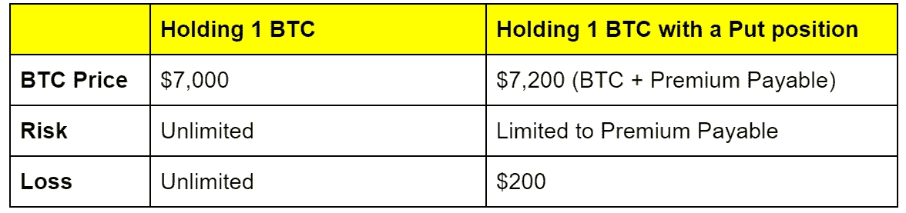

# 比特币 Halvening 的 3 种期权交易策略

> 原文：<https://medium.com/coinmonks/3-options-trading-strategies-for-the-upcoming-bitcoin-halvening-42f714e62013?source=collection_archive---------3----------------------->

你准备好迎接即将到来的比特币(BTC) halvening 了吗？了解更多有关如何利用选项不仅保护，而且增强您的加密产品组合的信息。

**首先，什么是比特币 halvening？**

比特币减半是指每四年生产一次新比特币的速度减半。

不过你不用担心 BTC 会很快用完！为了控制通胀，比特币协议被编程为限量供应 2100 万枚，新的比特币逐渐进入系统，作为对网络处理器(又名矿工)的激励。

> [发现并回顾最佳交易软件](https://coincodecap.com/category/trading-automation)

类似于金矿开采难度的增加，比特币的创造速度每四年降低一半。

**牛市还是熊市？即将于 2020 年 5 月实施的 halve ving**

*来源:* [*交易视图*](https://www.tradingview.com/chart/BLX/mcIa8MCn-BITCOIN-Will-the-6000-gap-be-filled-before-the-Halving/)

下一次 BTC halvening 预计将在几个月后的 2020 年 5 月发生。就像在以前的 halvenings 中一样，这导致了[对价格方向的不同意见](https://www.coindesk.com/why-bitcoins-next-halving-may-not-pump-the-price-like-last-time)，潜在的大规模价格波动和[“供应冲击”](https://www.forbes.com/sites/billybambrough/2019/06/14/exciting-bitcoin-progressions-are-building-ahead-of-coming-supply-shock-warns-vc/)是可以预期的。

作为最灵活的衍生工具之一，期权将使您能够在平仓前管理、提升或保护您的加密头寸。

这里有三种方法可以做到:

**1。把你的赌注变成利润**

你对 halvening 持乐观还是悲观态度？您可以购买期权来利用定向视图。

**为什么买期权而不是做多/做空？**

有了期权，你就获得了用少量前期成本(*)交易 BTC 波动率的权利，而无需投入全部资本。*

*如果你看好 BTC 股市下跌，这里有一个场景。*

***BTC/美元起始价格:7000 美元***

***BTC/美元最终价格:9000 美元***

**

*你可以用 1000 美元购买一个看涨期权来控制一个 BTC 的走势，而不是持有你在 7000 美元时购买的一个 BTC，然后用你的全部抵押品来渴望市场。*

*如果 BTC 价格飙升至 9000 美元，你将从看涨期权中获得 100%的回报，相比之下，在市场上渴望 BTC 的回报率为 28.5%。*

*购买期权是实现杠杆的一个很好的方式，同时将你的风险限制在应付的*溢价*内。*

***涉及的风险***

*当然，从来没有保证的回报。作为期权买家，你要承担支付全部*溢价的风险。**

*然而，由于期权比同等的多头和空头头寸需要更少的资金，你的潜在损失将被封顶。*

## *2.保护您的加密组合免受潜在的威胁*

*担心你的投资组合会受到价格波动的影响？你可以用期权为你的加密资产投保。*

*就像比特大陆如何向矿业买家提供看跌期权来缓解他们对 BTC 价格波动的担忧一样，你也可以购买看跌期权来保护你的加密资产。*

****

*例如，如果你持有 1 BTC，买入价格为 7000 美元，并担心价格波动减半，你可以购买一个价格为 200 美元的看跌期权，以保护你的头寸免受可能的崩盘。*

*如果 BTC 暴跌，你的最大损失将被限制在 200 美元。它是这样工作的。*

*如果 BTC 在结算日跌至 6000 美元，你的 BTC 将损失 1000 美元。然而，您的看跌期权的内在价值为 1000 美元，可以以该金额出售，从而抵消潜在的损失，并将您的损失限制在您的[应付溢价](https://blog.sparrowexchange.com/glossary/premium-payable/)。*

## *3.你认为 halvening 将是一个非事件？无论如何，让您的加密资产为您服务。*

*如果你不知道 BTC 将走向何方，你仍然不应该错过价格行动，让你的资产为你工作！*

*不只是 HODL。如果你认为走势将主要是单边、横向或区间波动，你可以卖出期权，从收到的溢价中赚取收入，并将你的资产货币化。*

*这里有一个场景。*

**

*如果你在 7，000 美元持有 1 BTC，对 BTC 保持中立或轻微看跌，预计它不会在 8，000 美元以上交易，你可以出售 1 BTC 的看涨期权，并获得 200 美元的溢价，这是你的保留。*

*如果 BTC 价格跌至 6500 美元，溢价会抵消一部分损失。如果 BTC 的价格上涨到 7500 美元，溢价将使你的利润超过 500 美元。*

*你可以把保费当做收入或者用来购买(免费！)保护您的投资组合。*

***做好降半旗的准备***

*为什么把自己限制在渴望、做空或引导 BTC 押注于 halvening 呢？尝试这些更聪明的方法，你可以用期权在 BTC·哈尔文宁身上下注。*

***免责声明***

*此处提供的信息仅供参考。不应将其视为法律或财务建议。您应该咨询律师或其他专业人士，以确定什么最适合您的个人需求。*

*对于使用我们的内容可能获得的任何结果，Sparrow 不做任何保证或其他承诺。在没有咨询自己的财务顾问、进行自己的研究和尽职调查之前，任何人都不应做出任何投资决定。*

*在法律允许的最大范围内，如果任何信息、评论、分析、意见、建议和/或推荐被证明不准确、不完整或不可靠，或导致任何投资或其他损失，Sparrow 概不负责。*

*通过我们的任何沟通渠道包含或提供的内容无意也不构成法律建议或投资建议，也不形成任何律师-客户关系。您使用我们任何沟通渠道上的信息，风险由您自行承担。*

> *[在您的收件箱中直接获得最佳软件交易](https://coincodecap.com/?utm_source=coinmonks)*

****