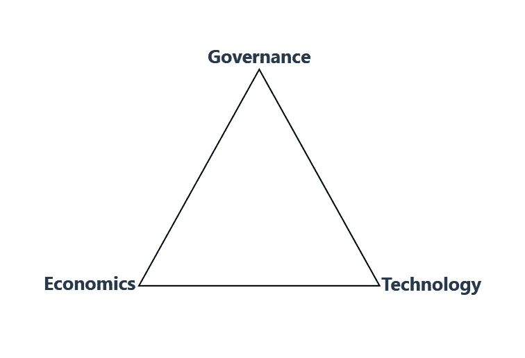

# 区块链的 3 大支柱

> 原文：<https://medium.com/coinmonks/3-pillars-of-blockchain-dd2ce976d1cd?source=collection_archive---------0----------------------->

距离 **Satoshi** 发布第一份比特币白皮书已经过去了将近十年。

从那以后，区块链行业在价格图中看到了许多起伏。但是有一件事一直在沿着增长曲线发展，那就是技术的发展。

因此，我们现在正处于一个阶段，除了术语**可扩展性**，还有区块链的另外两个支柱。

因此，区块链的三大支柱是——**治理**、**经济**、**技术。**我称之为 ***获取*** 架构。

# 管理

那么，什么是治理？

它是确保任何协议是否被遵循的一个。就像任何国家都有法律一样，在区块链中，有许多协议需要网络用户遵守——区块生产者(BP)、开发者、dApps 消费者。

在过去以太坊道黑期间，由于缺乏治理，导致社区分裂，导致以太坊等。

目前，大多数公共区块链缺乏这种成分。由于它的缺失，对现有软件，即**技术**进行任何更新都非常困难，因为害怕社区分裂。

现在，你明白如果在基于区块链的网络中没有良好的治理会发生什么。

# 经济学

每个人都知道经济学在现实世界中的应用。

但是，就区块链而言，经济学一词实际上是象征经济学的意思。

这是什么？

令牌经济学是在一个去中心化的世界中对加密货币的激励。不像传统的应用程序，用户只获得奖励积分，没有任何经济价值。但是，在区块链·戴普斯的世界里，每个用户都会得到与贡献成比例的奖励。而且这个奖励可以用来交换任何形式的商品。

与比特币一样，矿工会获得一些比特币作为奖励，以确保网络安全，即当某个区块被验证为使交易不可逆转时。在所有区块链网络中也是如此。

事实上，由于缺乏经济学，众所周知的 BitTorrent(俗称 Torrent)面临着文件丢失或下载速度慢的问题。由于保留旧文件(文本、图像、视频)没有任何奖励，人们无法找到旧电影。虽然它已经被证明是一个成功的去中心化网络，甚至政府也不能阻止，但是由于没有良好的经济效益，网络面临着下载速度慢的问题，因为很少有对等点拥有该文件。

现在，你可能已经了解了记号组学在区块链中的重要性。

# 技术

最后一部分，即技术。

好吧，大家都知道它是什么，为什么需要它？

尽管如此，为了说明我所说的这个组件是指 ***安全性*** 、 ***可伸缩性*** 、 ***去中心化*** 。

在这三个技术术语中，谈论最多的是可扩展性，因为没有网络，这与传统平台的速度相匹配，如—

*   每秒五万个赞的脸书。
*   每秒 1000 笔交易的 Visa/Master 卡。
*   每秒钟有 10 万笔交易的密码交易所。
*   每秒 393 笔交易的 Paypal。

另一方面，在密码世界，我们有这样的网络—

*   每秒交易 3-5 次的比特币。
*   每秒 15–20 次交易的以太坊。
*   每秒 4000 个事务的 EOS。
*   每秒 10，000 次交易。
*   每秒 10 万次交易的 Bitshares。

> 注意:所有值都是公共区块链的最大值。

通过区块链，我们知道它是安全的，即不可逆的。数据一旦记录下来，谁也不能修改。

因此，在现实中看到这一点后，人们转向了可伸缩性，以便大规模采用。就在去年，以太坊和秘密交易中出现了大量的 ico。然后，就成了讨论的问题。

嗯，即使将来解决了可扩展性，也应该确保它是分散的，即任何人都可以加入网络。

# 结论

因此，为了看到一个更美好的世界，上面提到的是基于区块链的网络的 3 个支柱。也适用于在区块链上做一个 dApp。

暂时就这样了。

## 连接方式:

电子邮件—[dalvath3700@gmail.com](mailto:dalvath3700@gmail.com)

[Github](https://github.com/abhi3700)

[电报](https://t.me/abhi3700)

[钢模](https://steemit.com/@abhi3700)

领英

[推特](https://twitter.com/abhi3700)

[中等](/@abhi3700)

[脸书](https://www.facebook.com/abhi3700)

> [直接在您的收件箱中获得最佳软件交易](https://coincodecap.com/?utm_source=coinmonks)

