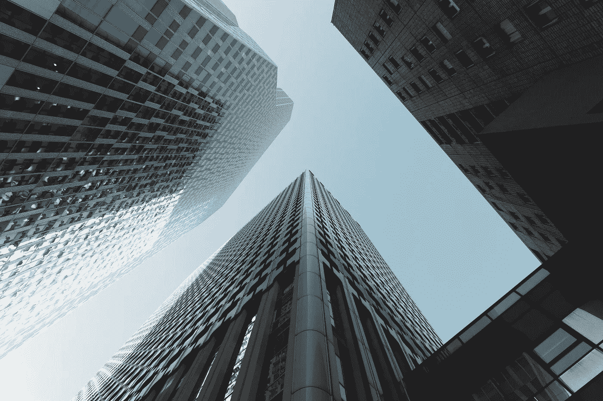

# 比特币比替代品更环保的 3 个原因

> 原文：<https://medium.com/coinmonks/3-reasons-why-bitcoin-is-greener-than-the-alternatives-2b238d0ce33c?source=collection_archive---------5----------------------->

## 不要爱上 FUD

Photo by [Sirisvisual](https://unsplash.com/@sirisvisual?utm_source=unsplash&utm_medium=referral&utm_content=creditCopyText) on [Unsplash](https://unsplash.com/s/photos/wall-street?utm_source=unsplash&utm_medium=referral&utm_content=creditCopyText)

我们生活在后真相时代。任何人都可以相信他们想要的任何东西，而不需要用事实、数据或理性的论点来证实他们的立场。

比特币对金融行业造成了很大的损害，这已经树立了强大的敌人。银行、华尔街，甚至政府都在失去…