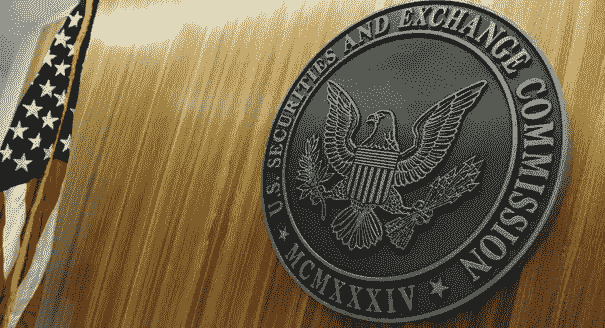

# 加密货币即将被大规模采用的 3 个原因

> 原文：<https://medium.com/coinmonks/3-reasons-why-crypto-currency-is-on-the-verge-of-mass-adoption-1560ab9b000b?source=collection_archive---------2----------------------->

自匿名的中本聪开发比特币以来，加密货币已经走过了一段路。Satoshi 的想法是开发一个去中心化的“点对点电子现金系统”，这意味着没有个人或机构可以控制它。然而，事实证明，这非常适合丝绸之路等黑市活动。

几年后，比特币开始引起公众的注意，因为个人在日常活动中使用比特币的故事开始出现，比如一名男子在 2010 年用 10000 比特币买了 2 个披萨。如果他存了那 10 000 个比特币，他现在会有 120 00 万美元。尽管比特币被越来越多的人采用，并有合法用途，但它被大规模采用仍然存在许多障碍。

然而，进入 2018 年，大多数障碍都已消除，加密货币成为主流的所有基础都已到位。

# **1。政府、银行、投资者和公众人物采用**

很长一段时间以来，政府和监管机构一直威胁要禁止加密货币(许多人现在仍在这么做)，银行和大型投资者都表示，这只是一种时尚，或者说是一个将会破裂的泡沫。因此，毫不奇怪，许多人对投资持怀疑态度，犹豫不决。

各国政府现在开始对加密货币开放，其中许多公开承认它在我们未来的地位，甚至通过支持一些加密货币来表现出强烈的支持。其例子包括:

*   SEC(美国证券交易委员会)最近召开了一次会议，为美国加密货币开了绿灯，并表示为了子孙后代，他们将限制法规，以允许加密货币增长并继续创新。
*   Vechain 最近在一月份与中国政府的国家研究咨询中心(NRCC)合作。他们战略伙伴关系的目标是，

“实施**区块链**和物联网解决方案，以收集用户数据并将其发送回内部供应链实体，以便他们可以为最终用户开发更多定制产品。希望这将减少分销瓶颈，增加收入，并节省制造成本。”

中国吸引了大量媒体关注，并对加密货币市场产生了巨大影响，因为中国贡献了加密货币的很大一部分贸易量。由于媒体传播不合理的 fud(恐惧、不确定性和怀疑的缩写),它们产生了有害的影响。除了媒体的干预，中国政府事实上在很长一段时间内禁止了加密货币交易，这导致了比特币流行以来最大的一次崩溃。显然，这种伙伴关系表明管理机构正在改变观念和释放控制。还有一段路要走，但我们已经取得了良好的进展。

*   最后一个例子是由全球 100 多家银行支持的加密技术，也称为 [Ripple](https://www.fool.com/investing/2017/12/17/5-big-banks-currently-testing-ripples-blockchain-t.aspx) (XRP)。它不仅很受银行的欢迎，也很受投资者的欢迎，因为它有一个出色的团队，重要的资源，低转让费和快速的交易时间，并且在 2017 年，由于其 1000%以上的增长，它进入了每个机构的雷达

你可能会问，这些例子如何证明加密货币即将被大规模采用，答案很简单。如前所述的政府、权威机构和银行现在支持并使用加密。这促进了公众对它的接受，因为信任和合法的机构支持它。

为了让 crypto 真正得到信任和推广，大牌和有影响力的人需要支持 crypto，这正是正在发生的事情。鲨鱼池投资者马克·库班最初回避了加密的概念，他后来收回了他的声明，并像许多知名投资者一样投资了数百万美元。泰·洛佩兹是一位成功的社交媒体影响者和企业家，他也经常推广加密货币，并将其公之于众。马克·扎克伯格今年早些时候在他的页面上发表了一份[声明。](https://www.facebook.com/zuck/posts/10104413015393571)

> “我有兴趣深入研究这些技术的积极和消极方面，以及如何在我们的服务中最好地使用它们。”

不仅有人建议脸书将实施加密货币，而且柯达和 Telegram 等其他大公司也在开发自己的货币。

随着这种新的伙伴关系，各种组织和个人的声明和支持，crypto 越来越受到关注。

# 2.教育

(Stanford University, CREDIT LINDA A. CICERO / STANFORD NEWS SERVICE)

作为人类，我们有一个影响我们所有人的紧迫的恐惧，那就是对未知的恐惧。人们不相信他们不了解的东西，通常他们不愿意走出他们的舒适区，如果他们没有做适当的研究，他们很容易被谣言和错误信息所说服。为了让社会真正对加密开放，他们需要了解它的所有好处，以及一旦它融入我们的社会，它能在多大程度上改善我们的日常生活。

这个问题很容易解决，高等教育机构现在正在提供加密货币课程。墨尔本皇家墨尔本理工大学提供为期 8 周的在线比特币课程。纽约大学和斯坦福大学都提供加密货币课程，甚至有一所大学专门面向区块链，猜猜它的名字…区块链大学。

这些都是著名的教育机构，通过提供课程来教育那些愿意，更多的人将了解加密的应用，以及它将如何有利于我们的未来。

# 3.真实用例

(Bitcoin ATM in Buraimi)

谁会愿意拿自己辛辛苦苦攒下的钱去买一种属于动荡市场的数字货币呢？有些数字货币没有内在价值，而且直到最近还鲜有使用案例。我会给你比答案，几乎没有人。为什么有人会倾向于将辛苦赚来的钱投资到一个风险大、波动大、难以变现且几乎没有用武之地的市场？

谢天谢地，这已经不是问题了。首先，crypto 已经被应用到几乎每一个行业健康，金融，营销，游戏，社交媒体，你能想到的。加密货币不仅提供了一个巨大的投资机会，而且还可以在我们的日常生活中使用。

使用案例:

*   饭店
*   酒店
*   购买和销售产品
*   如果你是怀俄明州的居民，就要纳税
*   咖啡馆
*   机场
*   教育(尼科西亚大学现在接受比特币)
*   汽车经销商
*   哦，还有自动取款机！

这样的例子不胜枚举。

# 结论

加密货币已经从诞生之初的位置发展到了光年之外。在过去的 5 年里，它的受欢迎程度大幅增长，仅 2017 年以来，它的市值就从 200 亿美元增长到 1 月份的 8000 亿美元。

这是一个快速增长的行业，现在政府、投资者和社交媒体影响者都在支持它，它将继续其受欢迎程度的快速上升。

不仅有更多的支持，而且加密货币现在正由著名的教育机构如斯坦福大学教授，这样公众对加密的了解和重视将继续提高。

加密货币的一大局限是缺乏用例。正如我之前提到的，投资者有许多方式使用他们收到的加密货币，这意味着他们的资金更容易获得，这将刺激更多的个人和企业投资。

最后，通过巨大的成就，如合作伙伴关系和密码行业内的持续发展，它的受欢迎程度大幅增加，而且没有显示出放缓的迹象。有了教育、政府支持和真实的使用案例，加密货币拥有了它真正大规模融入我们日常生活所需的一切。

> [在您的收件箱中直接获得最佳软件交易](https://coincodecap.com/?utm_source=coinmonks)

这篇文章是严谨带给你的，如果你喜欢这篇文章，并想通过展示你的支持来帮助我们的创业，请喜欢我们的脸书页面，[严谨官方](https://www.facebook.com/RigourOfficial/)！！