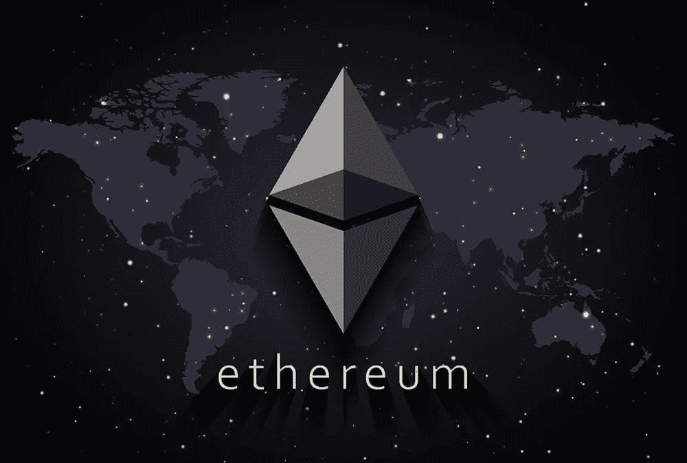

# 以太坊将很快触及 2000 美元的 3 个原因

> 原文：<https://medium.com/coinmonks/3-reasons-why-ethereum-will-hit-2000-soon-5a9f12c4fa86?source=collection_archive---------2----------------------->

巨大的现货交易量，有利的期货溢价，以及顶级交易员买入下跌都可能是以太坊价格可能会继续反弹的信号。

三天下跌 27%后，以太坊价格最终于 1 月 22 日触底，为 1040 美元。

大幅调整清算了价值 6000 亿美元的期货合约。有趣的是，以太坊…