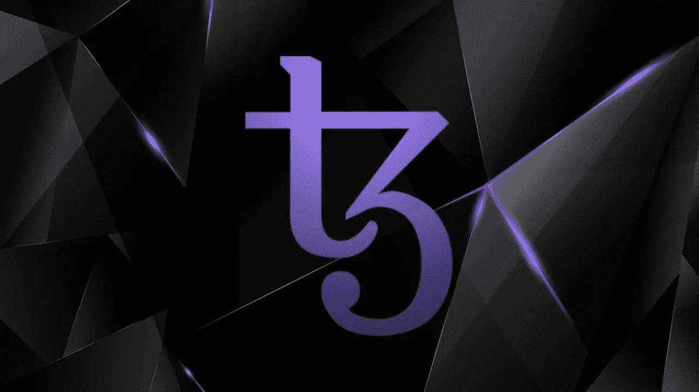

# Tezos 价格快速上涨的 3 个原因

> 原文：<https://medium.com/coinmonks/3-reasons-why-the-tezos-price-rises-very-fast-35875c320eae?source=collection_archive---------5----------------------->

在这篇文章中，我们来看看最近 Tezos 价格抛物线上涨的背后是什么，并分析在什么点上它可能值得进入 XTZ 硬币。

以太坊(ETH)目前是智能合约采用和活跃用户的主要第一层协议。这是毫无疑问的。然而，在这个领域，协议之间的竞争比以往任何时候都要激烈…