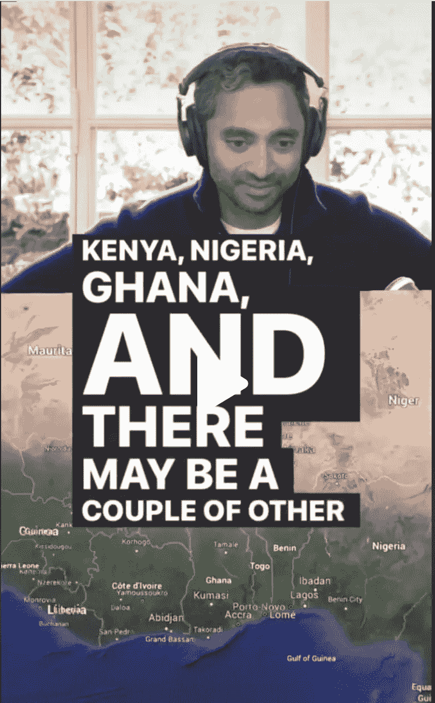
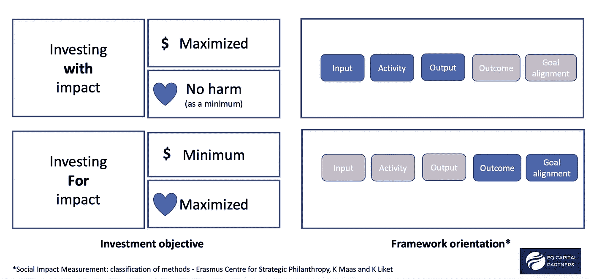

# 给即将来非洲投资的查马斯(以及任何亿万富翁)的 3 条建议

> 原文：<https://medium.com/coinmonks/3-recommendations-to-chamath-and-to-any-billionaire-who-is-coming-to-invest-in-africa-da65147008fa?source=collection_archive---------2----------------------->

The ‘King of SPACS’, Chamath Palihapitiya is [announcing](https://www.tiktok.com/@all_in_tok/video/7024464844665654575?_d=secCgwIARCbDRjEFSACKAESPgo8f%2FTTWZjPT%2FUyy8sWdmIlAzsOyQITrWPAz7Cpbaj7U%2BNGSZ1mkPAEId1zzBSREjkXpTzqoHtG6rglSGKJGgA%3D&checksum=cd43e5a944e18f8afff13c642e48e45fbe83bc3f9bcfec4e30c478ca44a08eef&language=en&preview_pb=0&sec_user_id=MS4wLjABAAAAK70UnItXqD5l92TkmsOAVhvE-RMSmsd4821eFonI-VopaMhLdzi-oc1JQJaXUsa-&share_app_id=1233&share_item_id=7024464844665654575&share_link_id=FBF62519-5824-47E6-B72E-52BAE16E5BC8&source=h5_m&timestamp=1635614774&tt_from=copy&u_code=dfbm8ji2aa104b&user_id=6892600321018250246&utm_campaign=client_share&utm_medium=ios&utm_source=copy&_r=1&is_copy_url=1&is_from_webapp=v1) his maiden visit to Kenya, Ghana, Nigeria ([here](https://kenyanwallstreet.com/chamath-palihapitiya-is-visiting-kenya-ghana-nigeria/)), underlying the increasing interest of US billionaires to invest in Africa (listen to the full podcast [here](https://www.youtube.com/watch?v=cGenTdTrYEo))

*为什么硅谷风险投资不适合非洲，以及如何进行早期投资*

现在我得到了你的注意，我想首先说我没有资格给*任何人*财务建议，更不用说给成功的亿万富翁和有影响力的人了，比如:[查马斯·帕里哈皮蒂亚](https://en.wikipedia.org/wiki/Chamath_Palihapitiya)、[大卫·萨克斯](https://en.wikipedia.org/wiki/David_O._Sacks)、[杰森·卡拉卡尼斯](https://en.wikipedia.org/wiki/Jason_Calacanis)和[大卫·弗里德伯格](https://www.linkedin.com/in/davidfriedberg/)，他是**[YouTube 频道](https://www.youtube.com/channel/UCESLZhusAkFfsNsApnjF_Cg/videos)和[播客](https://podcasts.apple.com/us/podcast/e53-wealth-tax-inflation-as-a-capital-allocator-big/id1502871393?i=1000540200057)**

**但是，我和我在 ImpactRooms 的合伙人多年来一直参与建立和投资非洲的早期公司，我对那些精通技术、资金雄厚的美国投资者有三条建议，他们突然发现了非洲在这个新兴的 Web 3.0 数字经济中提供的投资机会(见下文)。**

**(这个[我也写到这里](https://healthblockchanger.medium.com/africa-is-rising-and-blockchain-is-a-central-part-of-it-81e95d8bbebd))。**

****

**Despite COVID-19, the African continent has been continuing to grow especially thanks to on-the-ground pan-African funds like [Launch Africa](https://www.launchafrica.vc/) (Image from IR)**

# **建议 1:理解为什么大多数初创公司和加速器在非洲苦苦挣扎**

**在非洲，初创企业的雄心和市场现实之间存在脱节。**

**尽管可用投资资本呈指数增长(预计今年将达到 40 亿美元)，但说全球资本在非洲稀缺还是轻描淡写。非洲人的购买力有限，消费者对效用和价格很敏感。他们把有限的收入花在被认为有价值的产品或服务上，优先考虑成本和易于购买，而不是忠诚度。因此，初创公司的产品必须是负担得起的、可获得的、用户友好的。此外，消费者很少愿意接受完全数字化的分销方式，他们更喜欢通过融入人际互动来建立信任的“技术接触”方式。**

**毫不奇怪，初创公司高估了用户的数字素养，特别是如果他们生活在农村地区，他们可能无法认识到这些消费者在尝试新产品时承担的风险，特别是当他们已经经历了过去的失望。这种高昂的客户获取成本( [CAC](https://en.wikipedia.org/wiki/Customer_acquisition_cost) )可能会令人望而却步，需要初创公司依赖跨国公司、电信公司和银行作为战略合作伙伴和分销渠道(完整报告见[此处](https://kinyungu.com/wp-content/uploads/2021/03/Chasing-Outliers-Full-Report-FINAL.pdf))。**

**类似地，通过一个密集的导师计划，运营数十家高增长创业公司的创业加速器可以在一个演示日筹集大量资金(由 Y-Combinator 开创，由 tech stars 推广)，在新兴市场可能会相对 T10 运作良好，但在非洲 T12 并不特别成功 T13。**

**这种劳动和资本密集型[加速器模式](https://masschallenge.org/article/accelerators-vs-incubators)可能不适合有多种原因。一个是，对教育、数字文化和互联网的异质访问，在加入这些项目的初创公司的经验、成熟度、行业选择、团队规模**甚至心态**方面产生了显著差异。此外，退出的缺乏不能吸引足够的投资者来创造*一个投资的良性循环*，许多加速器(和他们的初创企业)发现自己资金紧张，感到沮丧。也有例外，比如: [Startupbootcamp AfriTech](https://www.startupbootcamp.org/accelerator/afritech/) 、 [Grindstone](https://grindstonexl.com/) 和 [AdanianLabs](https://www.adanianlabs.io/) ，他们专注于*能力发展*并渴望通过使用开放式创新来创建技术生态系统(如下)。**

****

**Opening the boundaries of R&D may create cross-sector synergies and investment opportunities ([here](https://f1d0651a-c40a-4877-b5d5-7f6204467ba9.filesusr.com/ugd/cdd60c_5d9debf5822c4e84940b69925d8d2ba2.pdf))**

# **建议 2:理解为什么硅谷风险投资模式不适合非洲**

**风险投资是一种战略，它使那些拥有未经证实的商业模式的公司能够超越自然增长的限制，迅速地以指数方式扩大规模(又名**超增长**)，这样他们就可以获得**超大的回报**接受相对较高的失败风险( [*【快速失败】*](https://www.forbes.com/sites/danpontefract/2018/09/15/the-foolishness-of-fail-fast-fail-often/?sh=5a57c70e59d9) )。**

**这种方法背后有四个核心假设:**

1.  **初创企业是一种能够以低(在非洲是非常低的)固定成本或烧钱率实现高增长的企业。**
2.  **风险投资是一种高风险、高回报的方式，少数成倍成功的“赢家”补偿了大量的“输家”。**
3.  **风险投资包括快速使用越来越多的资本来创造价值的指数增长，从而推动回报预期。**
4.  **风险投资资助的初创公司寻求占领广泛而深入的消费者市场，这些消费者精通数字技术，具有很高的购买力。**

**但是，旨在支持高增长公司的硅谷风险投资模式需要巨大的回报，而非洲市场不一定能够提供这种回报，因为资本稀缺、债务负担以及与建设基础设施相关的成本。在资金池浅、交易流稀缺的情况下，使用“喷雾祈祷”策略追求“不惜一切代价的增长”，可能会危及这些早期公司的生存能力。**

> **寻找现金的压力可能会促使创始人选择第一批愿意投资的投资者，而不是那些代表最佳价值观和战略契合度的投资者。**

# **建议 3:背景很重要。思考后增长，而不是超增长。思考生态系统，而不是垂直行业**

**据估计，[经济多样化](https://messaging-custom-newsletters.nytimes.com/template/oakv2?campaign_id=228&emc=edit_pc_20211001&instance_id=41850&nl=peter-coy&productCode=PC&regi_id=61116760&segment_id=70468&te=1&uri=nyt%3A%2F%2Fnewsletter%2F9b866bf7-95b6-529e-8169-2805da99cdcd&user_id=304c85cc8cc3e99ed36059bf944873c5)和非洲大陆自由贸易协定( [AfCFTA](https://openknowledge.worldbank.org/bitstream/handle/10986/34139/9781464815591.pdf) )不仅将促进贸易，还将推动经济增长 67 亿美元，并在 2035 年前使 3000 万非洲人摆脱贫困。但是减少繁文缛节是不够的，非洲经济的[数字化和‘绿化’](https://www.forbes.com/sites/mikeosullivan/2021/12/04/the-pitchbook-economy/?sh=541f2c6a2547)需要寻求私人资本。**

**这就是重新构建我们对非洲和非洲商业的想法的切入点。**

**非洲在走向繁荣的道路上面临的最重要的挑战之一是，尽管其宏观经济基本面正在改善，其全球经济地位以及单个国家的增长前景如何，但它正在为其被赋予的 [**过度膨胀的长期风险**](https://www.brookings.edu/wp-content/uploads/2021/10/21.10.07_Perception-premiums.pdf) 付出高昂的代价。**

**这种[感知溢价](https://www.brookings.edu/research/the-ruinous-price-for-africa-of-pernicious-perception-premiums/)是*非洲被迫付出的毁灭性代价*，它破坏了非洲的可持续发展，除非引入更公平的融资规则。此时，大幅降低的利率(实际利率为负)使发达经济体能够通过扩大大规模货币和财政刺激有效地度过疫情经济低迷期，而非洲资产上抑制增长、由违约驱动的借款利率为复苏放缓和债务过剩风险增加创造了条件。**

> **这为风险投资者提供了一个独特的机会，参与提升非洲经济，并将无限顺周期信用降级驱动的风险叙事转变为机会和增长叙事。**

**除了将非洲从后殖民时代的恶性债务循环中解救出来，并让他们的经济前景更加光明，*从高速增长转向* [*后增长模式*](https://en.wikipedia.org/wiki/Post-growth) 可以提供一种[可行的投资模式](https://hubersocial.com.au/measurement-approach)，在传统风险投资和影响力投资之间架起一座桥梁。在这个模型中 Huber 社会福利衡量框架——强调根据投资对个人、社区和社会福利创造的贡献来确定“价值”,确保它是结果驱动的和目标一致的(下面的)。**

****

**[Huber Model](https://hubersocial.com.au/measurement-approach) allows investors and fund managers to make decisions that maximize social value alongside financial value (Courtesy Barry Palte, [EQ Capital Partners](https://eqcapitalpartners.com/)).**

# **最终想法:**

**非洲是世界上增长最快的市场，估计占全球人口的三分之一，到 21 世纪末，20 个增长最快的城市中有 17 个在非洲。从科技中心、加速器、公司创业合作以及区块链、T21 和加密货币的采用来看，这是一次跨越式发展。**

****

**对投资者来说，我的信息很简单:**

*   **投资非洲创业者，尤其是女性创业者。**
*   **优先考虑农村覆盖。**
*   **研究成本、效率和范围。**
*   **通过具有离线解决方案的技术驱动型平台，促进与主要采购商和生产商的合作，从而扩大影响和规模。**
*   **混合使用现场干预和技术干预，利用创新者的数据分析能力。**
*   **构建相当大的产品数据集，目前存在于筒仓中，使用分散和分布式技术来促进数据主权和业务互操作性。**

> **最重要的是，作为医生我请求你，**
> 
> **不伤害任何人——**

**ImpactRooms 是同类产品中的第一个，即[企业自动扶梯](https://techcrunch.com/2021/12/08/enterprise-escalator-impact-rooms-rises-to-prepare-african-startups-for-growth-and-investment/)，帮助非洲公司在所有财务阶段为增长和投资做好准备。**

> **加入 Coinmonks [电报频道](https://t.me/coincodecap)和 [Youtube 频道](https://www.youtube.com/c/coinmonks/videos)了解加密交易和投资**

## **也阅读**

** [## 杠杆代币[多头代币]终极指南

### 杠杆化令牌是具有杠杆化风险敞口的 ERC20 令牌，不考虑保证金、要求、管理…

medium.com](/coinmonks/leveraged-token-3f5257808b22)  [## 最佳加密交易所| 2021 年十大加密货币交易所

### 加密货币交易所的加密交易需要了解市场，这可以帮助你获得利润。之前…

blog.coincodecap.com](https://blog.coincodecap.com/crypto-exchange)  [## 2021 年最佳加密交换平台| CoinCodeCap

### 如果我们看看今天的场景，许多加密货币交换平台提供了广泛的功能和深度…

blog.coincodecap.com](https://blog.coincodecap.com/best-swap-platforms)  [## 2021 年最佳加密借贷平台| 6 大比特币借贷平台

### 获得比特币和其他加密货币的最佳贷款利率

medium.com](/coinmonks/top-5-crypto-lending-platforms-in-2020-that-you-need-to-know-a1b675cec3fa)  [## 2021 年最佳免费加密交易机器人

### 2021 年币安、比特币基地、库币和其他密码交易所的最佳密码交易机器人。四进制，位间隙…

medium.com](/coinmonks/crypto-trading-bot-c2ffce8acb2a)  [## 最佳 4 个加密交易信号电报通道

### 这是乏味的找到正确的加密交易信号提供商。因此，在本文中，我们将讨论最好的…

medium.com](/coinmonks/best-crypto-signals-telegram-5785cdbc4b2b)  [## 获取信号、交易机器人和套利

### 在本文中，我们将回顾 Bitsgap，这是一个满足您所有交易需求的一站式加密交易平台。它…

blog.coincodecap.com](https://blog.coincodecap.com/bitsgap-review)  [## 40 个最佳电报频道，用于加密、电影、表演和演讲| CoinCodeCap

### 随着我们周围无限的信息，我们很难筛选和了解有价值的信息。电报有…

blog.coincodecap.com](https://blog.coincodecap.com/best-telegram-channels)  [## 仙境提供了 83，412%的 APY 赌注:仙境是一个骗局吗？CoinCodeCap

### 仙境是雪崩网络的第一个基于时间令牌的分散储备货币协议。一篮子…

blog.coincodecap.com](https://blog.coincodecap.com/wonderland-offers-an-83412-apy-on-staking-is-wonderland-a-scam)  [## 天秤座货币——脸书的加密货币

### 自 2018 年马克·扎克伯格决定致力于改善区块链以来，关于天秤座货币的传言就一直存在…

blog.coincodecap.com](https://blog.coincodecap.com/libra-currency-a-cryptocurrency-by-facebook)**