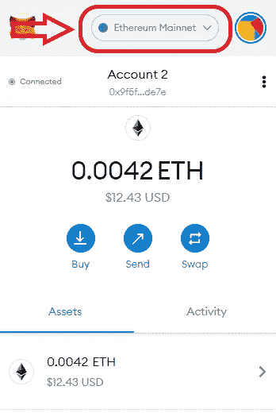

# 将资金从以太坊转移到多边形的 3 个步骤

> 原文：<https://medium.com/coinmonks/3-steps-to-move-funds-from-ethereum-to-polygon-3d694c620884?source=collection_archive---------0----------------------->

你一直在 DYOR(做你自己的研究)加密货币市场，偶然发现了这个名为 MATIC(多边形网络的本地令牌)的宝石。该研究称，你可以通过[多边形网络](https://polygon.technology/)参与 DeFi——游戏、借贷、农业和 NFT，这将使你体验到更低的油价和更快的交易时间，现在你在想“我到底该怎么做？”。

幸运的是，你偶然发现了这篇文章，这篇文章将指导你如何一步一步地将你的资金转移到多边形网络链上。

# 步骤 1:首先，在元掩码上连接到正确的 Mainnet

确保您已经在桌面上下载了 MetaMask Chrome 扩展(如果您使用 Google Chrome)。如果你还没有这样做，你可以在这里[找到如何做。](https://blog.wetrust.io/how-to-install-and-use-metamask-7210720ca047)

当你进入 MetaMask 时，你可能只会在网络选择下拉菜单中看到以太坊主网，然后点击***‘自定义 RPC’。***

然后你会被带到一个页面，在那里你需要填写一些细节。我是这样做的:

**网络名称**:自动维护网/多边形维护网

**新的 RPC URL**:[https://rpc-mainnet.maticvigil.com/](https://rpc-mainnet.maticvigil.com/)*(如果这样不行，试试替代的)*

**备选 RPC 网址**:[https://bellowing-ancient-wave . matic . quiknode . pro/ff 002 e 91 F8 c 0779 E0 c 7295 F4 A8 BF 3908546404 ca/](https://billowing-ancient-wave.matic.quiknode.pro/ff002e91f8c0779e0c7295f4a8bf3908546404ca/)

**链条 ID** : 137

**货币符号** : MATIC

**屏蔽浏览器网址**:[https://polygonscan.com/](https://polygonscan.com/)

点击保存，你就完成了！如果您遇到任何问题，您可以随时访问[此处](https://docs.matic.network/docs/develop/metamask/config-matic)并查看 Polygon Networks 开发者页面上的文档。

现在，您已经准备好使用 Matic Mainnet 并将资金从以太坊转移到 Polygon。

# 第二步:将你的资金转移到 Metamask 上的以太坊主网

这是我们今天将要讨论的所有过程中最简单的一步(我认为)。

你需要做的就是从你使用的交易所转移你的 ERC20 资金。对于这个例子，我从一家交易所购买了一些 ETH，并将其发送到我在 ***以太坊主网*** 上的 MetaMask 钱包中。

对于这个例子，我已经转移了价值 12 美元的 ETH(记住，你可以将任何 ERC20 令牌转移到你的 ***以太坊主网*** MetaMask 钱包)。

# 第三步:将你的资金从以太坊主网转移到自动主网(多边形 PoS 桥)

有趣的部分来了！

首先，我们需要进入[钱包。Matic](https://wallet.matic.network/bridge) 。然后你需要打开你的 MetaMask 扩展并连接到 ***以太坊主网。***

一旦您进入[https://wallet . matic . network/bridge](https://wallet.matic.network/bridge)并成功连接到 ***以太坊主网，*** 在金额框中输入 ETH 的金额(或任何资产)。以我为例，我点击“Max”转移我所有的资金。

如你所见，我能转账的总金额已经到了 2.16 美元；其原因是以太坊的汽油费(在撰写本文时，该费用相当于 10 美元)。

在此期间，完成存放以太并将资金从以太坊网络转移到多边形网络的过程花费了我 10.61 美元。

> 提醒:永远要把这些费用考虑进去。如果你知道你将参加多边形网络上的大多数 DeFi 活动，我建议你存入更多的钱。

完成 ETH 存款后，点击“继续”,您将看到您将收到的金额和“预计交易费”。点击“继续”。

将弹出一个 MetaMask 窗口，要求您“确认”交易(仍在 ***以太坊主网*** 上)。

确认交易后，您将被带回*钱包。并且将不得不等待交易完成。*

根据我的经验，这可能需要几分钟，但在某些情况下，当世界上所有的人都决定和你做同样的事情时，这可能会比预期的时间长一点。所以，不要烦恼！

现在，我们等待多边形网络的存放完成。这一部分可能需要花几分钟来思考你的钱包。Matic dashboard 查看您的资金。此外，您还可以在弹出窗口底部的[以太扫描](https://etherscan.io/gastracker)上查看您的存款交易状态。

你可以关闭这个小小的弹出窗口，然后点击“返回钱包”，看看你的资金是否已经反映出来。如果没有，去喝杯咖啡，然后回到你的办公桌前再次检查。

或者，检查您交易的另一种方法是回到您的钱包，点击“交易进行中”，您将能够在下拉列表中看到您的存款交易。

在那里！将资金从以太坊转移到 Polygon 就像 1，2，3 一样简单…资金(2.16 美元)现在在 ***Polygon/Matic Mainnet 上反映在我的钱包中。***

*感谢收看，任何观点的表达(可能会在不另行通知的情况下更改)都是我(作者)个人的，我(作者)不保证所提供的任何信息或分析的准确性或完整性。*

**在 Twitter 上关注我:** [@0x_idkcrypto](https://twitter.com/0x_idkcrypto)

> 加入 [Coinmonks 电报频道](https://t.me/coincodecap)，了解加密交易和投资

## 也阅读

 [## 最佳加密交易所| 2021 年十大加密货币交易所

### 加密货币交易所的加密交易需要了解市场，这可以帮助你获得利润…

blog.coincodecap.com](https://blog.coincodecap.com/crypto-exchange)  [## 2021 年 9 大最佳加密借贷平台

### 当谈到加密货币贷款时，大量因素等同于良好的收入状况。此外，借款的一部分…

blog.coincodecap.com](https://blog.coincodecap.com/crypto-lending)  [## 加密交易机器人——最佳免费加密交易机器人

### 2021 年币安、比特币基地、库币和其他密码交易所的最佳密码交易机器人。四进制，位间隙…

medium.com](/coinmonks/crypto-trading-bot-c2ffce8acb2a)  [## 最佳 6 个加密交易信号电报通道

### 这是乏味的找到正确的加密交易信号提供商。因此，在本文中，我们将讨论最好的…

medium.com](/coinmonks/best-crypto-signals-telegram-5785cdbc4b2b)  [## BlockFi 评论 2021:利弊和利率

### 今天，我们提出了一个全面的 BlockFi 评论，这是一个成立于 2017 年的加密贷款平台，拥有其…

blog.coincodecap.com](https://blog.coincodecap.com/blockfi-review)  [## 加密税务软件——五大最佳比特币税务计算器[2021]

### 不管你是刚接触加密还是已经在这个领域呆了一段时间，你都需要交税。

medium.com](/coinmonks/best-crypto-tax-tool-for-my-money-72d4b430816b)  [## Pionex 评论 2021 |免费加密交易机器人和交换

### Pionex 是为交易自动化提供工具的后起之秀。Pionex 上提供了 9 个加密交易机器人…

medium.com](/coinmonks/pionex-review-exchange-with-crypto-trading-bot-1e459d0191ea)  [## 存储比特币的最佳加密硬件钱包[2021]

### 保管您的数字资产很容易，但找到正确的存储方式却是一项繁琐的任务。在线钱包有一个风险…

blog.coincodecap.com](https://blog.coincodecap.com/best-hardware-wallet-bitcoin)  [## 如何在印度购买比特币？2021 年购买比特币的 7 款最佳应用[手机版]

### 如何使用移动应用程序购买比特币印度

medium.com](/coinmonks/buy-bitcoin-in-india-feb50ddfef94)