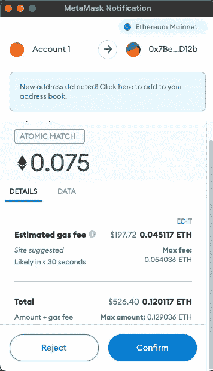
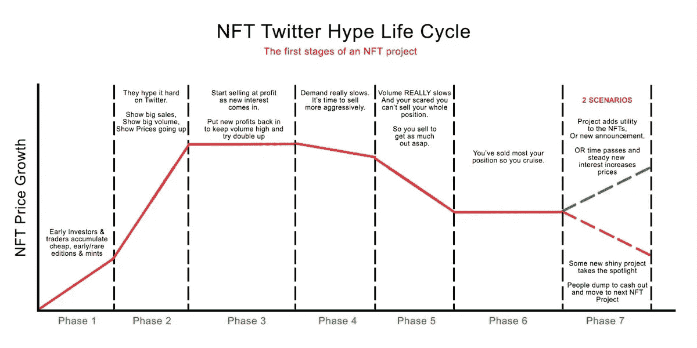
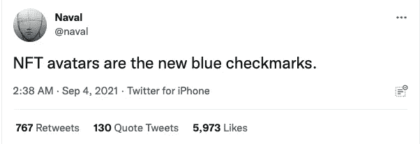
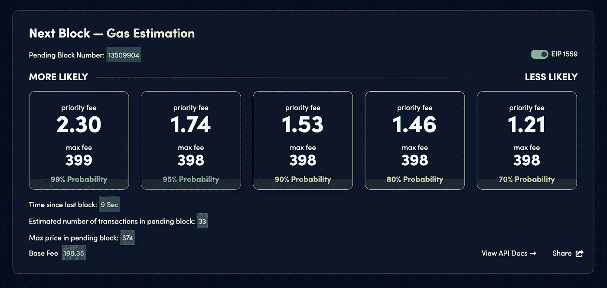
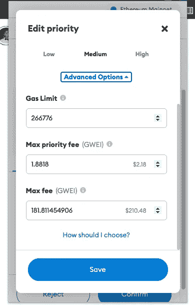

# 在交易 NFT 之前，你需要知道的 3 件事

> 原文：<https://medium.com/coinmonks/3-things-you-need-to-know-before-getting-into-trading-nfts-b361a6eab1ad?source=collection_archive---------4----------------------->

## 不要像我一样在 FOMO 失去成千上万的人

The Modz #[5024](https://opensea.io/assets/0x50e712b3a260d7639179e8277836253461418f23/5024), top 2% in rarity (sold for 0.4 ETH)

你已经听说过[改变生活的金钱](https://twitter.com/adriyoung/status/1449449126534344704?s=20)，你已经在 OpenSea 上看到了看起来很酷的涂鸦，也许你甚至有一两个备用以太坊来尝试一下加密淘金热。

但是如果你想开始交易 NFT 的股票，但你还没有成为富人或有影响力的人，你*实际上*怎么玩这个游戏*？*

这是我几周前面临的问题，在 FOMO 打败我之后。

这是我从战场上直接学到的一些经验，这样你就不会犯和我一样的错误。

# 放弃所有关于用户体验的假设

像**优步**、 **Airbnb** 和 **Doordash** 这样的应用已经普遍提高了我们对移动应用的期望标准。

轻点轻点。刷，刷。嘣，你现在在夏威夷。

但是，如果 web3 要成为像互联网那样的世界，它目前仍处于大型机时代。

从建立你的账户到出售你的艺术品，没有什么是简单明了的。

例如，我不小心买错了 NFT——一个价值 1000 美元的错误。

基本上，我在 OpenSea 上点击了立即购买，然后改变了主意，但我忘了在 Metamask 弹出窗口上点击拒绝。所以当我试图再买一个的时候，第一个还在我的 Metamask“购物车”里。

Example of Metamask pop-up. **Always** click reject if you’re not buying.

最近，在 OpenSea 上也有一个新的技巧，人们以非常便宜的价格列出 NFT 的，然后立即将价格提高 10 倍。

OpenSea 需要一段时间来更新价格，所以你最终可能会支付比你最初看到的更多的钱。我见过有人被骗了几千块。

更不用说所有的假冒造币网站和 discords 最近被黑了。

避免这一切的最好方法是在 MetaMask 确认页面上确认价格。

**教训:**密切关注流程的每一步。

# 大多数项目遵循相同的模式

上面的价格图对于 OpenSea 的绝大多数藏品来说都是准确的。

理想情况下，你想在**白名单**或**预造币** ( *第一或第二阶段)——*如果你把握好时机，即使是质量较低的项目，你也几乎可以保证盈利。

然后你有两个选择:冒险等到 reveal 之后，有可能得到一件比底价高出 3-5 倍的珍品，或者在 reveal 之前的炒作周期中锁定 20-30%的涨幅。

我推荐后者用于快速转手的低价项目，因为它们的价格大多会在披露后飙升，然后下跌，永远不会回升。不要拿着它们超过一两天(除非你真的喜欢艺术😉).

更高质量的项目(例如，很酷的艺术品和/或由有影响力的人支持的项目)值得持有更长时间，因为价格往往更稳定，其他有影响力的人可能会拿起它们，他们甚至可能向你空投免费商品。

例如，[女人的世界](https://opensea.io/collection/world-of-women-nft)在加里·维发了关于她们的微博后被转发了 10 次。

我在这里的个人经历是运气好，在一个中等质量的项目中创造了前 2%的稀有品种(文章的第一张图片)，但是过早地卖了。

从我这里买的人把它翻过来换成了 **3x** 。

但是你生活和学习。

教训:根据项目的质量选择你的交易策略。

# (好)信息为王

与更广阔的加密世界类似，NFT 空间的每个人都在兜售他们的项目，就像它是下一个苹果一样。

关键在这里:**内容策展。**

关注每个人，在他们的简历上打上勾号，打上一串@，在 Twitter 上发布一个像素化的或猴子的 avi。

facts.

看看 NFT YouTube 上的几个视频( [Giancarlo 是最好的一个](https://www.youtube.com/channel/UCPC2iE2Yuj20m5Dimn-vVBg))，然后加入他们的一堆不和谐音，不要关注所有垃圾的。

滚动[日历查看即将到来的下降](https://nftcalendar.io/)并真正进入你看起来很酷的东西。如果你喜欢艺术，很可能其他人也会喜欢。

慢慢地，但肯定地，你会积累一系列可靠的线索。

也许最重要的是——花点时间理解以太坊是如何工作的。

如果你想获得一个薄荷糖，需要理解的一个关键概念是**气体战争、**或者如何避免它们。

> 以太气 [**的 TLDR 是指在区块链上做任何事情都要花钱，这样人们就不会在网络上发垃圾邮件或永远运行一段代码。**](https://ethereum.org/en/developers/docs/gas/)

以太坊目前的效率仍然很低，所以当人们高度期待的 NFT 下跌，人们争相购买时，它变得非常拥挤，交易费用飙升。

但是今年夏天早些时候，改变游戏规则的**优先权费**作为 EIP-1559 的一部分被引入。

这是一种给矿工“小费”的方式，这样你的交易就有更高的机会在队列中的其他交易之前得到验证——基本上就像贿赂俱乐部的保镖让你插队一样。

这里的关键点是优先权费允许你基本上保证任何你想要的钱。

Free gas estimator from [blocknative](https://www.blocknative.com/gas-estimator).

Blocknative 有一个非常酷的实时天然气估计器(见上文)，它会告诉你当前价格，有 99%的机会赢得交易。

你将支付*比*多得多的费用(想想 50%到 100%+最初的交易)，但如果这有助于你获得下一个**密码朋克**，这些费用将只是沧海一粟。

当确认元掩码上的交易时，将键入这些值。点击*编辑* (上图*预计油费*)，出现下图。

**永远不要**改变你的气体限制，也不要依赖 Metamask 的预设(如低、中、高)，因为它们不如 Blocknative 的优化。

设定适当的汽油限额可能意味着获得一辆 100 倍 NFT 汽车或失去一个造币厂及其全部交易费用的区别。

是的，以太坊会收你几百*即使你交易失败*。

真是疯狂的时代。

(PD:这些对索拉纳和 NFT 来说都不是真的)。

**教训:**花点时间学学基本面，不要盲目进去。

# 资源和链接

老实说，我不知道 NFT 在他们目前的迭代中是否有任何真正的长期持久力，但他们目前是一个非常有趣的游戏，并将在可预见的未来继续为人们赚钱。

我已经提供了文章中提到的大多数资源的链接，但是我将在下面留下一些可能有帮助的附加链接。

铸造快乐，欢迎来到元宇宙！

*(不，不是* [*那种*](https://apnews.com/article/facebook-meta-mark-zuckerberg-technology-business-5ad543ab7780caae435935f0aca9fac6) *元宇宙)*

*   [**如何打赢一场气战**](https://twitter.com/thedigitalvee/status/1432396547434688514?s=20) —关于在 Metamask (Twitter 线程)上设置气费的更深入的解释。
*   [**如何从 ethers can**](https://momentranks.com/blog/how-to-mint-an-nft-from-a-smart-contract-on-etherscan-step-by-step)**——**避免高额油费的另一个好方法，或者直接从项目网站上造币，因为它们可能不可靠。
*   [**block native Gas Estimator**](https://www.blocknative.com/gas-estimator)**——**文中提到，显示你当前锁定的任何交易的天然气价格。
*   [**Dune Analytics**](https://dune.xyz/ruth/Party-Degenerates-NFT)**——**一个免费的仪表板，上面有关于持有人、收藏平均价格等数据。
*   **—自动计算你的令牌有多稀有。适用于估计列表价格。**
*   **[**以太扫描**](https://etherscan.io/) —以太坊的谷歌。熟悉界面的基本部分是很好的，因为它在 NFT 世界中非常常用。**
*   **[**open zeppelin**](https://docs.openzeppelin.com/openzeppelin/)——Solidity 开发的首选库(又名开源 NFT/ERC721 标准的家伙)。**

> **加入 Coinmonks [电报频道](https://t.me/coincodecap)和 [Youtube 频道](https://www.youtube.com/c/coinmonks/videos)了解加密交易和投资**

## **也阅读**

** [## 最佳加密交易所| 2021 年十大加密货币交易所

### 编辑描述

blog.coincodecap.com](https://blog.coincodecap.com/crypto-exchange)  [## 2021 年 10 大最佳加密贷款平台| CoinCodeCap

### 编辑描述

blog.coincodecap.com](https://blog.coincodecap.com/crypto-lending)  [## 2021 年最佳免费加密交易机器人

### 2021 年币安、比特币基地、库币和其他密码交易所的最佳密码交易机器人。四进制，位间隙…

medium.com](/coinmonks/crypto-trading-bot-c2ffce8acb2a)  [## 最佳 4 个加密交易信号电报通道

### 这是乏味的找到正确的加密交易信号提供商。因此，在本文中，我们将讨论最好的…

medium.com](/coinmonks/best-crypto-signals-telegram-5785cdbc4b2b)  [## BlockFi 评论 2021:利弊和利率| CoinCodeCap

### 编辑描述

blog.coincodecap.com](https://blog.coincodecap.com/blockfi-review)  [## 如何在印度购买比特币？2021 年购买比特币的 7 款最佳应用[手机版]

### 如何使用移动应用程序购买比特币印度

medium.com](/coinmonks/buy-bitcoin-in-india-feb50ddfef94)  [## 加密税务软件——五大最佳比特币税务计算器[2021]

### 不管你是刚接触加密还是已经在这个领域呆了一段时间，你都需要交税。

medium.com](/coinmonks/best-crypto-tax-tool-for-my-money-72d4b430816b)  [## 存储比特币的最佳加密硬件钱包[2021] | CoinCodeCap

### 编辑描述

blog.coincodecap.com](https://blog.coincodecap.com/best-hardware-wallet-bitcoin)  [## Pionex 评论 2021 |免费加密交易机器人和交换

### Pionex 是为交易自动化提供工具的后起之秀。Pionex 上提供了 9 个加密交易机器人…

medium.com](/coinmonks/pionex-review-exchange-with-crypto-trading-bot-1e459d0191ea)**