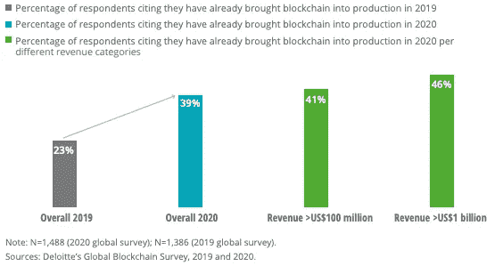
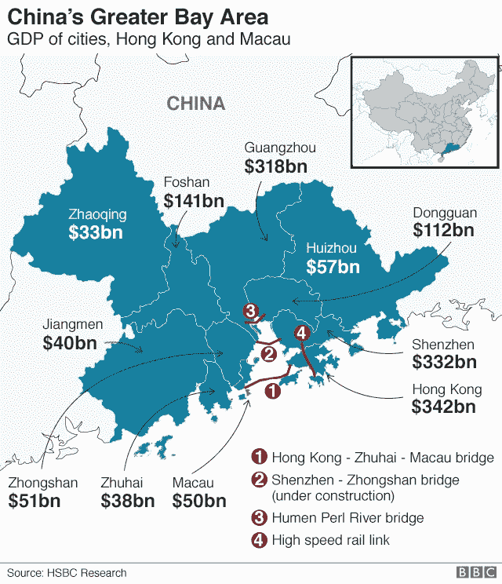
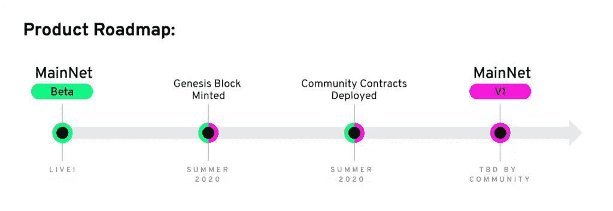
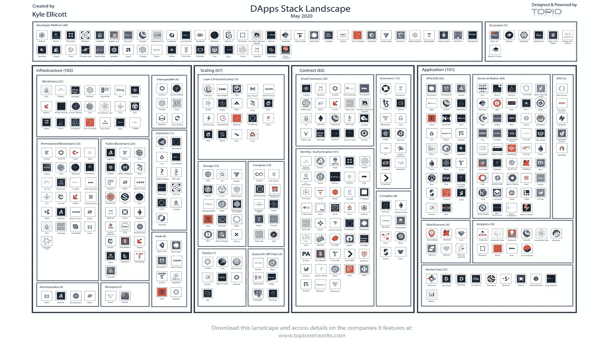

# 全球 39%的企业拥有区块链 Live /奥地利建筑 COVID DApps /美国空军建筑供应链网络

> 原文：<https://medium.com/coinmonks/39-of-enterprises-globally-have-blockchain-live-austrian-building-covid-dapps-u-s-9c79cbb63884?source=collection_archive---------2----------------------->

*2020 年 6 月 24 日
本周在景观……****德勤*** *发布其* ***2020 年全球区块链调查*** *显示，全球 39%的公司现在都在生产区块链，高于 2019 年的 23%——这项调查充满了区块链在整个企业中推进的洞察力。* ***汇丰*** *利用区块链完成了全球首笔商业上可行的贸易融资交易。* ***美国空军*** *正与* ***辛巴链*** *合作开发一种用于供应链物流的区块链。* ***中国广发银行*** *(中国最大的商业银行)最近推出了首个基于区块链的跨境金融系统，允许在整个* ***【大湾区】*** *【包括 mainland China、香港和澳门)进行无缝支付结算，请密切关注这一点，因为该地区 11 个城市的总人口约为 7000 万，而且还在不断增长，相比之下，旧金山湾地区的人口约为 800 万。****PayPal*******Venmo****推出密码买卖。* ***亚马逊*** *专利区块链驱动增强供应链透明度。* ***威廉·夏特纳*** *将自己最喜欢的回忆令牌化在蜡区块链上。* ***势不可挡的领域*** *【新博客平台】，****Unibright****正在酝酿增材制造，读图计划数字化集装化。再加上****Celo****神谕总览，****DApps****为抗击假新闻，先看看****Dapper Lab*****Flow**区块链，还有更多！尽情享受吧！***

## **📈[德勤:全球 39%的公司现在都在生产区块链](https://cointelegraph.com/news/deloitte-39-of-companies-worldwide-now-have-blockchain-in-production)**

****

**Source: [Deloitte](https://www2.deloitte.com/content/dam/insights/us/articles/6608_2020-global-blockchain-survey/DI_CIR%202020%20global%20blockchain%20survey.pdf) Global Blockchain Survey**

**审计公司 [Deloitte](https://www2.deloitte.com/content/dam/insights/us/articles/6608_2020-global-blockchain-survey/DI_CIR%202020%20global%20blockchain%20survey.pdf) 最近的一项调查显示，来自全球重要科技公司的近 40%的受访者目前正在生产区块链。调查显示，许多公司越来越重视区块链技术和未来数字资产的潜力……[阅读更多信息](https://cointelegraph.com/news/deloitte-39-of-companies-worldwide-now-have-blockchain-in-production)**

## **🌎[“全球最大的分布式对等网络”为分散式互联网奠定基础](https://www.forbes.com/sites/johnkoetsier/2020/06/20/largest-distributed-peer-to-peer-grid-on-the-planet-laying-foundation-for-a-decentralized-internet/?subId3=xid:fr1592694444783fhi#2de5a8d76798)**

**互联网去中心化项目 triple 的创始人 Kristof de Spiegeleer 声称，这个项目的容量是区块链所有其他项目的 5-10 倍。该项目拥有 18，000 个 CPU 内核和 9000 万千兆字节。对于区块链项目来说，这看起来几乎是异端邪说，因为这些项目通常说的比代码多，但这不是典型的泵送转储加密游戏。相反，这是一个长期的项目，以其最初的形象重新连接互联网:去中心化、无主化、可访问、免费。… [阅读更多信息](https://www.forbes.com/sites/johnkoetsier/2020/06/20/largest-distributed-peer-to-peer-grid-on-the-planet-laying-foundation-for-a-decentralized-internet/?subId3=xid:fr1592694444783fhi#2de5a8d76798)**

***相关:📖* [*区块链故事:我们治理模式的下一次进化*](/nodle-io/blockchain-tales-the-next-evolution-of-our-governance-model-c39811743cce)**

## **🏦[汇丰利用区块链完成第一笔贸易融资交易，打开 9 万亿美元市场供大众采用](https://www.zerohedge.com/news/2018-05-13/hsbc-completes-first-trade-finance-deal-using-blockchain-opening-9-trillion-market)**

**总部位于英国的银行巨头汇丰银行利用区块链完成了世界上第一笔商业上可行的贸易融资交易。汇丰为美国食品和农业集团嘉吉(Cargill)处理了一份信用证。这家银行巨头使用了由技术联盟 R3([R3 团队](https://medium.com/u/309e832dbd94?source=post_page-----9c79cbb63884--------------------------------))开发的 Corda 区块链平台。该公司称，嘉吉公司的交易是上周从阿根廷到马来西亚的一批大豆……[了解更多](https://www.zerohedge.com/news/2018-05-13/hsbc-completes-first-trade-finance-deal-using-blockchain-opening-9-trillion-market)**

## **📖[美国空军给区块链公司 150 万美元建造](https://www.coindesk.com/us-air-force-gives-blockchain-firm-1-5m-to-build-supply-chain-network)**

**美国空军已选择 SIMBA Chain，一家区块链即服务公司，在两年内研究和开发一种用于供应链物流的区块链。这家区块链公司获得了 150 万美元，并进入了其小企业创新研究(SBIR)美国空军项目的第二阶段，新的任务是调查区块链的军事供应链价值主张… [阅读更多信息](https://www.coindesk.com/us-air-force-gives-blockchain-firm-1-5m-to-build-supply-chain-network)**

***相关:📖* [*亚马逊箱包专利利用区块链技术增强供应链透明度*](https://btcmanager.com/amazon-patent-blockchain-technology-supply-chain/)**

## **📖[区块链系统汇聚中国 2 万亿美元大湾区](https://decrypt.co/32592/blockchain-system-brings-chinas-2-trillion-greater-bay-area-together)**

****

**Source: [BBC](https://www.bbc.com/news/business-47287387)**

**中国最大的商业银行中国广发银行最近推出了首个基于区块链的跨境金融系统，允许在大湾区组成的 mainland China、香港和澳门之间进行无缝支付结算。广发银行区块链平台提供包括报关在内的系统信息验证服务，跨境征信授权……[阅读更多](https://decrypt.co/32592/blockchain-system-brings-chinas-2-trillion-greater-bay-area-together)**

## **🏦[三星支持的 Blocko 为阿拉伯银行建立基于区块链的信用系统](https://cointelegraph.com/news/samsung-backed-blocko-to-build-blockchain-based-credit-system-for-arab-bank)**

**伊斯兰开发银行的研究机构正在与三星支持的区块链供应商 Blocko 合作，旨在开发一个基于区块链的智能信贷管理系统。该合作伙伴关系是 Blocko 于 4 月在中东、非洲和东南亚发起的 E24P 区域联盟的一部分。该系统将帮助银行提供真正独特的解决方案，对伊斯兰金融世界产生重大影响……[阅读更多信息](https://cointelegraph.com/news/samsung-backed-blocko-to-build-blockchain-based-credit-system-for-arab-bank)**

***相关:📖* [*PayPal、Venmo 推出加密买卖*](https://www.coindesk.com/paypal-venmo-to-roll-out-crypto-buying-and-selling)**

## **📖 [10 大最有前途的欧洲区块链创业公司值得关注](https://www.eu-startups.com/2020/06/10-of-the-most-promising-european-blockchain-startups-to-watch/)**

**区块链技术在金融普惠、智能合同以及商品和交易跟踪方面有许多用途，是打击欺诈的强大工具。这些记录不能追溯更改。这篇文章重点介绍了 10 家最有前途的欧洲初创公司，它们通过自己的主要服务和产品支持并扩展了区块链的使用……[阅读更多](https://www.eu-startups.com/2020/06/10-of-the-most-promising-european-blockchain-startups-to-watch/)**

***相关:📖* [*Unibright 与弗劳恩霍夫 IPK 合作基线增材制造*](/unibrightio/unibright-and-fraunhofer-ipk-collaborate-on-baselining-additive-manufacturing-7469c36143a3)*——*[*Unibright . io*](https://medium.com/u/9fe2494e51f4?source=post_page-----9c79cbb63884--------------------------------)**

# **本周的更多内容:**

**📖[威廉·夏特纳在蜡区块链上令牌化自己最喜欢的回忆](https://cointelegraph.com/magazine/2020/06/24/william-shatner-nft-wax-blockchain)**

**💸[2020 年的秘密投资者格局](/@rbozman/the-2020-crypto-investor-landscape-dd15c053880f) — [雷根·波兹曼](https://medium.com/u/512d59267fcf?source=post_page-----9c79cbb63884--------------------------------) / [CoinList](https://medium.com/u/88ecffe5cb1?source=post_page-----9c79cbb63884--------------------------------)**

**🎮[主要明星如何以及为什么接受符号化](https://cointelegraph.com/news/how-and-why-major-stars-are-embracing-tokenization)**

**📖[数字集装箱化](https://www.maritime-executive.com/corporate/digital-containerization-1)**

**📖[口袋网络是 Web 3 对亚马逊网络服务的回应](https://decrypt.co/32757/pocket-network-web-3-answer-amazon-web-services)**

**🎮[神话般的、玩家所有的经济和区块链](/playmythical/mythical-player-owned-economies-and-blockchain-b3ebfc82d7e5)——[鲁迪·科赫](https://medium.com/u/f847a1513ea2?source=post_page-----9c79cbb63884--------------------------------)**

**📖[unstopped Domains 推出防审查博客平台](https://www.coindesk.com/unstoppable-domains-launches-censorship-resistant-blogging-platform)**

# **分散式应用程序手表**

## **📖[以太坊 2.0 可能会影响带 PoS 介绍的 DeFi 和 DApps】](https://cointelegraph.com/news/ethereum-20-likely-to-affect-defi-and-dapps-with-pos-introduction)**

**以太坊 2.0 版将于 2020 年下半年推出。ETH 2.0 将在一个方面改变 Defi 的动态，因为我们可能会看到 Defi 中的交易更少拥塞，并且潜在地，赌注模式可能会降低交易成本……[阅读更多](https://cointelegraph.com/news/ethereum-20-likely-to-affect-defi-and-dapps-with-pos-introduction)**

***相关:📖* [*以太坊上效用的进化*](https://messari.io/article/the-evolution-of-utility-on-ethereum)*——*[*威尔森·威亚姆*](https://twitter.com/WilsonWithiam/status/1271494935003500546) */* [*梅萨里*](https://medium.com/u/7cf93d3c3400?source=post_page-----9c79cbb63884--------------------------------)**

## **📖[奥地利政府资助开发基于区块链的新冠肺炎应用](https://www.coindesk.com/austrian-government-funds-development-of-blockchain-based-covid-19-app)**

**奥地利政府正专注于开发总部位于区块链的新冠肺炎应用程序。最近，一个名为 QualiSig 的项目从该国联邦数字和经济事务部获得了 6 万€(6.76 万美元)。该项目通过使用奥地利数字身份系统的元素，围绕欺诈预防、假新闻和健康数据创建了三个与 COVID 相关的原型… [阅读更多信息](https://www.coindesk.com/austrian-government-funds-development-of-blockchain-based-covid-19-app)**

## **📖[基于以太坊的“社交令牌”异军突起](https://decrypt.co/32921/sudden-rise-ethereum-based-social-token)**

**总部位于纽约的初创公司 Roll 目前处于私人测试阶段，目前提供约 160 个社交令牌，如$ALEX、$KERMAN 和$CALVIN，每个都代表一位艺术家、影响者或企业家。Roll 将自己描述为向社会资金提供区块链基础设施。它代表用户创造了 ERC-20 代币，并使社交资本易于存储和处理。它提供了一个买卖它们的交易平台……[阅读更多](https://decrypt.co/32921/sudden-rise-ethereum-based-social-token)**

***相关:📖***——*[*解密*](https://medium.com/u/2de7a312127a?source=post_page-----9c79cbb63884--------------------------------)***

**📖[Celo 神谕简介](/celoorg/an-introduction-to-celo-oracles-fd1a534669bb) — [科迪博恩](https://medium.com/u/d5d32d8f9581?source=post_page-----9c79cbb63884--------------------------------) / [Celo 基金会](https://medium.com/u/18e0dc50a66e?source=post_page-----9c79cbb63884--------------------------------)**

**📖[eth 2 的经济学](https://thecontrol.co/the-economics-of-eth2-dbcc78a2f48)**

**📖开始开发 dApps 之前我希望知道的 5 件事**

**📖[人物第一眼:流量](https://figment.network/resources/figments-first-look-flow/)——[人物网](https://medium.com/u/618d17b61837?source=post_page-----9c79cbb63884--------------------------------) / [流量网](https://medium.com/u/22ac47d15ea7?source=post_page-----9c79cbb63884--------------------------------)**

****

**Source: Flow/Figment Networks**

# **🎙️研究:2020 年区块链和 DApps 状况:**

****

**Source: [Topio Networks](https://www.topionetworks.com/markets/dapps-stack-landscape-5de8d07eb9abe453e04203f8)**

***现已上市，免费赠送的是我最新研究的去中心化应用或* [***DApp“堆栈”景观图***](https://s3.amazonaws.com/spoke-profiles-prod-assets/uploads/a069e1e1e798c975d4eca968c72f4ac1352d62a4/original/DApps_Stack_Landscape_Q2_2020.pdf?utm_source=Social%20Media&utm_medium=LinkedIn&utm_campaign=Topio%20-%20Dapps%20Landscape%20update&utm_content=S3%20Link)**—Q2 2020 年版。这张地图提供了新兴 DApps 行业的全面概述和分类，突出显示了在构建下一代应用程序中发挥重要作用的 400 多家全球公司。作为奖励，我包括了一些生态系统玩家和团体，当你准备发布你的应用时，你需要熟悉它们。如果这是你看到的第一个版本，那就把它当作你进一步理解不仅仅是这个行业，而且是构建一个完全或部分去中心化的应用程序所需的所有核心技术的指导性路线图(DApp)。****

****

**Source: [Topio Networks](https://www.topionetworks.com/markets/blockchain-landscape-5bf43854b9abe4633c1f87da)**

***另外，你可以找到我的 Q1 2020 对整个* [***区块链格局***](https://www.linkedin.com/posts/kyleellicott_q12020-blockchain-landscapekyleellicotttopionetworks-activity-6638879840634310656-UNtB) *的研究。这是《风景》的第五版。你会发现地图上包括 747 家公司(总共 900 多家独特的+更广泛的关键生态系统参与者)，它们从 2010 年到 2020 年筹集了 220 多亿美元的资金，仅 2017 年以来就投资了 180 多亿美元！***

**📣*想要了解区块链、DApps、DeFi 和 FinTech 行业的所有头条新闻、投资、深入研究和最新动态吗？* [***订阅***](https://www.topionetworks.com/newsletters) *并关注我的* [***推特***](https://twitter.com/kyleellicott) *获取每周更新及更多！***

> **[在您的收件箱中直接获得最佳软件交易](https://coincodecap.com/?utm_source=coinmonks)**

****