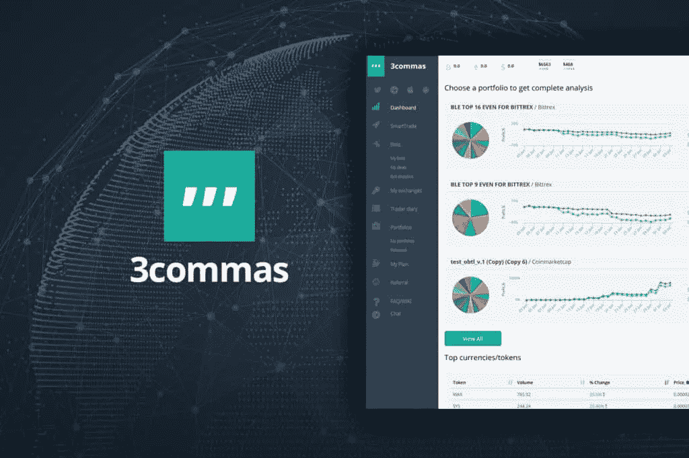
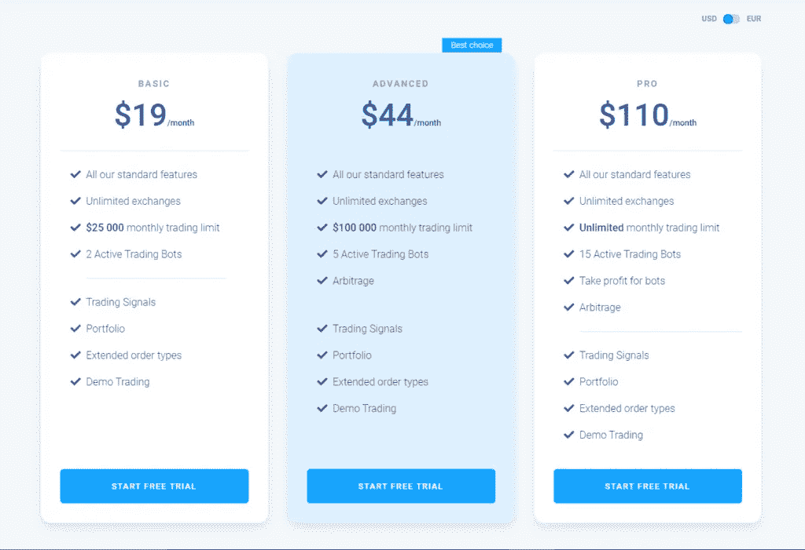
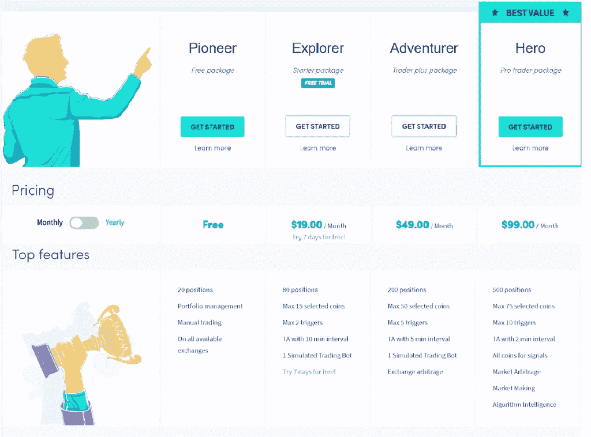
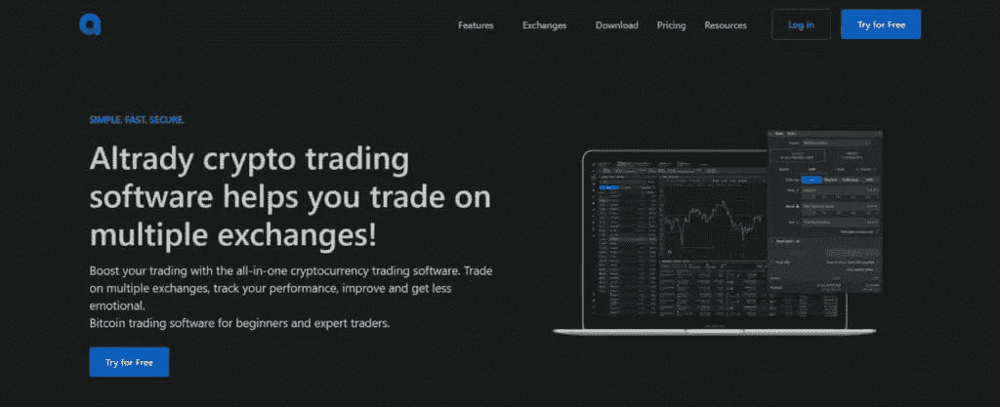
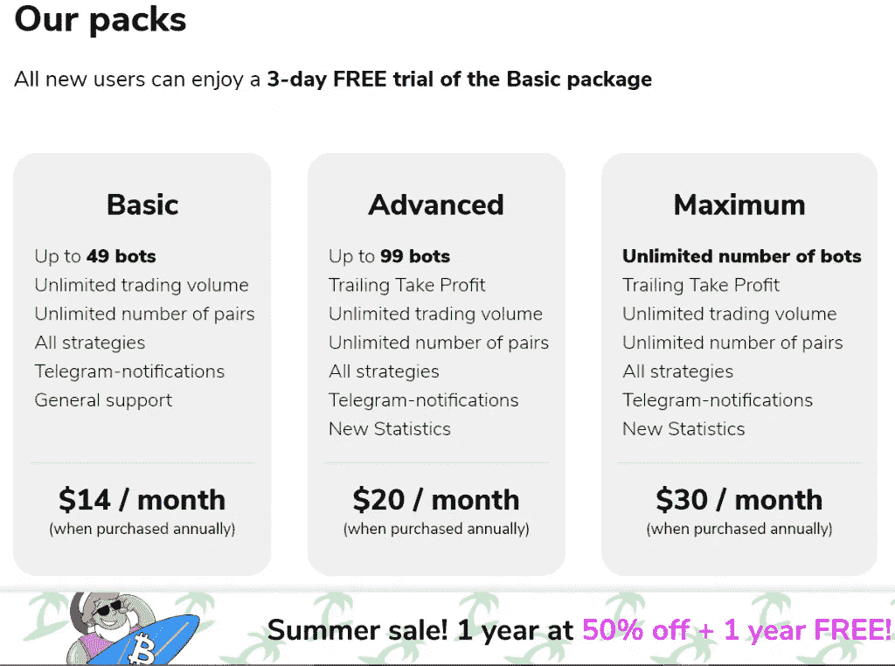
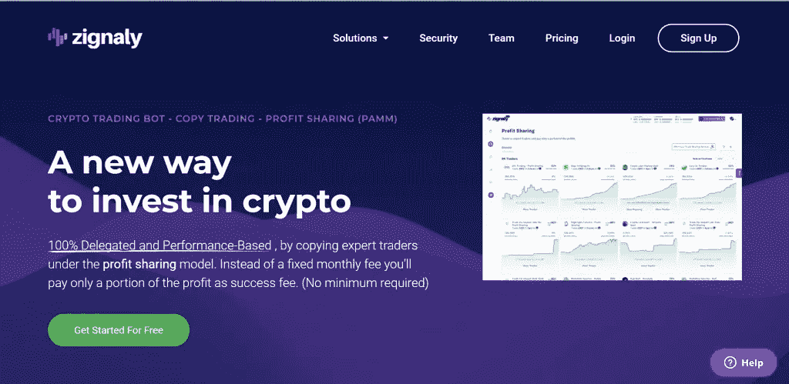
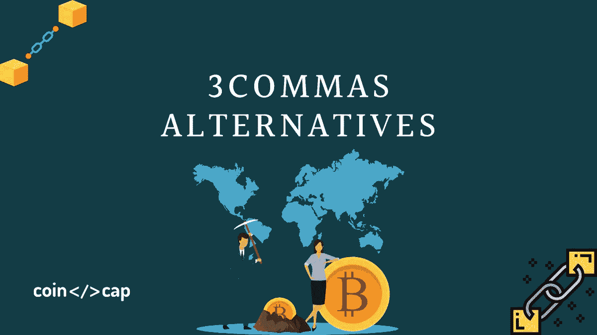

# 2023 年前 3 大商业替代品

> 原文：<https://medium.com/coinmonks/3commas-alternatives-8707e059650a?source=collection_archive---------2----------------------->

3Commas 是市场上最受欢迎的交易机器人提供商之一。然而，没有适当的研究和比较其替代品，这将是模糊的担保。因此，这篇文章将帮助你了解 5 个最好的 3 个选择。

# 总结(TL；博士)

*   从[**3 命令**](https://3commas.io/?c=tc252152) 开始有三种类型的僵尸工具:做空僵尸工具、简单僵尸工具、复合交易僵尸工具和复合做空僵尸工具。
*   [**Bitsgap**](https://bitsgap.com/?ref=2cb1231&utm_source=coincodecap&utm_medium=article&utm_campaign=promo) 将您连接到超过 25 个主要的[加密货币交易所](https://coincodecap.com/crypto-exchange)，并允许您在一个位置进行所有交易。
*   第三方[密码信号](https://coincodecap.com/best-crypto-signals-telegram)可在[**crypto hopper**market](https://www.cryptohopper.com/marketplace?atid=15596)上获得，以帮助你决定是否进入或退出一个位置。
*   [**TradeSanta**](https://tradesanta.com/en/site/set-referral-cookie?referral_id=177722) 是一个专门从事自动化交易方式的加密货币 bot 交易平台。
*   [**Zignaly**](https://zignaly.com/trader/qrNzUFvY) 是下一代基于云的加密交易机器人平台，为广大交易者提供了各种有用的功能。

# 什么是 3Commas？

3Commas 是总部位于加拿大温哥华的知名[密码交易机器人](/coinmonks/crypto-trading-bot-c2ffce8acb2a)平台，成立于 2017 年。

该软件连接到多达 23 个主要的加密货币交易所，允许您在一个位置管理您的所有账户。此外，它还包括一个复杂的交易终端，使您能够创建自己的交易策略，并模仿伟大交易者的交易方法。

[**3Commas**](https://3commas.io/?c=tc252152) 提供四种机器人:短机器人、简单机器人、复合机器人、复合短机器人。例如，Options Bot 使您能够自动化您的期权交易方法。

要了解更多信息，请阅读[3 商业评论](https://coincodecap.com/3commas-review-an-excellent-crypto-trading-bot)。

[3Commas](https://blog.coincodecap.com/go/3commas)

# 1. [**Bitsgap**](https://bitsgap.com/?ref=2cb1231&utm_source=coincodecap&utm_medium=article&utm_campaign=promo)

[**Bitsgap**](https://bitsgap.com/?ref=2cb1231&utm_source=coincodecap&utm_medium=article&utm_campaign=promo) 于 2018 年在爱沙尼亚成立，专注于加密交易。该平台使您能够连接超过 25 个重要的加密货币交易所，并在一个地方进行所有这些交易所的交易。

使用 Bitsgap 平台进行超过 10，000 种加密配对的交易，包括利用交易所之间的价格差异和自动化您的交易方法。要了解更多信息，请阅读 [Bitsgap 评论](https://coincodecap.com/bitsgap-review)或 [Bitsgap 期货交易机器人](https://coincodecap.com/bitsgap-futures-bot)。

## Bitsgap 定价

使用 Bitsgap 免费应用程序，用户可以获得 1000 美元的交易限额。拥有基本会员资格，每月允许 25，000 美元的交易，并包括两个交易机器人。此外，高级或专业帐户的月费用是 44 美元。

Bitsgap Pricing

## Bitsgap 有什么好处？

1.  几个密码交换，包括 30 多个不同的交换。
2.  提供多种货币账户以及广泛的交易选择。
3.  支持法定货币转换。

# 2.

## **什么是隐漏斗？**

**[**Cryptohopper**](https://www.cryptohopper.com/?atid=15596) 为用户提供了一个基于云的平台来管理八个主要加密交易所的多项加密资产。**

**在这些交易所，Cryptohopper 的客户将能够使用各种半自动交易工具。一旦用户设置好，Cryptohopper 机器人将自动与客户的账户进行交易。**

**CryptoHopper Marketplace 提供第三方加密信号来帮助您决定是否进入或退出头寸。除了自动交易之外，Cryptohopper 还提供社交交易，允许交易者一起合作赚钱。要了解更多，请阅读的[隐跳虫评论。](https://coincodecap.com/cryptohopper-review)**

## **密码漏斗定价**

**该平台有一个三级定价系统，最低一级可免费使用一周。**

****

**CryptoHopper Pricing**

## **Cryptohopper 有什么优势？**

*   **不要在佣金之外收取月租费。**
*   **投资者可以使用高级分析工具。**
*   **这个完整的智能手机软件具有先进的安全功能。**

# **3.奥尔特拉蒂**

**Altrady 是一个荷兰的加密交易终端软件。既然是交易终端软件，也是从单个软件提供多个交易所。然而，Altrady 拥有巨大的功能，包括广泛的定制工具，这有助于创建一个个性化的交易平台。此外，该软件易于使用，因此推荐给初学者。**

**另外，请阅读我们的[alt ready 评论](https://coincodecap.com/altrady-reivew)以了解更多信息。**

****

# **额外费用结构**

**Altrady 为用户提供 14 天的免费试用。此外，它提供了三种计划，用户可以获得年度计划的 7 折优惠。这三个计划是:**

*   ****基本:**有了年度计划，你可以以 12.55 美元的价格得到这个。此外，您将能够使用信号、交易终端、投资组合、交易分析、多图表、自定义提醒、位置跟踪器、盈亏平衡计算器和基本订单类型等功能。**
*   ****要点:**你可以花 25.15 美元得到这个平台。这包括所有的基本功能，加上限制阶梯订单，一个取消另一个订单，采取利润，和跟踪停止。**
*   **这将花费你大约 37.75 美元。此外，本计划包含基本和基本计划的所有功能，包括作为附加福利的基本扫描仪和快速扫描仪。**

# **4. [**TradeSanta**](https://tradesanta.com/en/site/set-referral-cookie?referral_id=177722)**

## **什么是 TradeSanta？**

**[**TradeSanta**](https://tradesanta.com/en/site/set-referral-cookie?referral_id=177722) 是一个专注于自动化交易策略的加密机器人交易平台。它最初于 2018 年推出，但在 2019 年下半年获得了关注。它拥有 25，000 多名会员，完成了 100 多万次交易，这使它成为一个蓬勃发展的社区。**

**3Commas Alternatives: **TradeSanta****

**TradeSanta 简化了加密交易机器人世界，并为其客户提供了一些奇妙的交易工具。拥有超过 6400 个活跃的[加密交易机器人](/coinmonks/crypto-trading-bot-c2ffce8acb2a)，它目前拥有竞争对手中最活跃的交易机器人。有三种 bot 模板:长 bot 模板、短 bot 模板和自定义 bot 模板。**

**此外，额外的订单，鞅，委员会购买硬币，复杂的技术指标，和其他 TradeSanta 功能可用。要了解更多信息，请阅读 [TradeSanta 评论](https://coincodecap.com/tradesanta-crypto-trading-bot-review)。**

## **支持的交换**

**它已经连接了七个主要的加密货币交易所，包括 [HitBTC](https://coincodecap.com/hitbtc-review) 、[币安](https://coincodecap.com/binance-review)、 [Bitfinex](https://coincodecap.com/bitfinex-review) 、 [Bittrex](https://coincodecap.com/bittrex-review) 、 [Huobi](https://coincodecap.com/huobi-review) 、 [Upbit](https://coincodecap.com/upbit-review) 和 [OKEx](https://coincodecap.com/okex-review) ，并计划很快增加 [BitMEX](https://blog.coincodecap.com/bitmex-review) 。**

## **TradeSanta 定价**

**与其他加密机器人交易服务相比，TradeSanta 价格相当低廉。这四个选项是:**

****

**TradeSanta Pricing**

## **使用 TradeSanta 有什么好处？**

1.  **简单的平台**
2.  **支持各种交易机器人和其他交易工具。**
3.  **有竞争力的价格**

# **5. [**Zignaly**](https://zignaly.com/trader/qrNzUFvY)**

## **Zignaly 是什么？**

**Zignaly 是下一代基于云的[加密交易机器人](/coinmonks/crypto-trading-bot-c2ffce8acb2a)平台，它以几个有益的特性迎合了许多交易者的需求。然而，现在只有币安和库币连接到交易平台。尽管如此，预计未来会有更多的加密货币交易所加入进来。**

**比特币交易机器人复制交易和交易终端是它的主要服务。它的一个显著特点是能够使用第三方信号源自动交易。它现在支持超过 21 个加密信号源，都是高质量的。**

**用户现在可以免费使用 Zignaly，拥有无限的兑换账户、硬币配对、位置和优先支持。**

****也读:** [**我的复制交易经验**](/coinmonks/my-experience-with-crypto-copy-trading-d6feb2ce3ac5)**

****

**3Commas Alternatives: Zignaly**

## **使用 Zignaly 有什么好处？**

1.  **整合第三方信号供应商有几个好处。**
2.  **操作简单的平台。**
3.  **创建一个免费帐户。**
4.  **这是一个云托管平台。**

# **3 商品替代品:结论**

**在这里你可以找到最可靠和最高评级的交易机器人。不过 [**Bitsgap**](https://bitsgap.com/?ref=2cb1231&utm_source=coincodecap&utm_medium=article&utm_campaign=promo) 更实用，容量更高。**

**用比特币交易机器人投资比特币，帮助其他加密货币市场的投资者，将大大帮助其他市场的投资者。仔细考虑你选择的平台，你会得到积极的对待。**

> **加入 Coinmonks [电报频道](https://t.me/coincodecap)和 [Youtube 频道](https://www.youtube.com/c/coinmonks/videos)了解加密交易和投资**

## **另外，阅读**

*   **[有哪些交易信号？](https://coincodecap.com/trading-signal) | [Bitstamp vs 比特币基地](https://coincodecap.com/bitstamp-coinbase) | [买索拉纳](https://coincodecap.com/buy-solana)**
*   **[ProfitFarmers 点评](https://coincodecap.com/profitfarmers-review) | [如何使用 Cornix Trading Bot](https://coincodecap.com/cornix-trading-bot)**
*   **[十大最佳加密货币博客](https://coincodecap.com/best-cryptocurrency-blogs) | [YouHodler 评论](https://coincodecap.com/youhodler-review)**
*   **[my constant Review](https://coincodecap.com/myconstant-review)|[8 款最佳摇摆交易机器人](https://coincodecap.com/best-swing-trading-bots)**
*   **[MXC 交易所评论](/coinmonks/mxc-exchange-review-3af0ec1cba8c) | [Pionex vs 币安](https://coincodecap.com/pionex-vs-binance) | [Pionex 套利机器人](https://coincodecap.com/pionex-arbitrage-bot)**
*   **[我的密码交易经验](/coinmonks/my-experience-with-crypto-copy-trading-d6feb2ce3ac5) | [比特币基地评论](/coinmonks/coinbase-review-6ef4e0f56064)**
*   **[CoinFLEX 评论](https://coincodecap.com/coinflex-review) | [AEX 交易所评论](https://coincodecap.com/aex-exchange-review) | [UPbit 评论](https://coincodecap.com/upbit-review)**
*   **[AscendEx 保证金交易](https://coincodecap.com/ascendex-margin-trading) | [Bitfinex 赌注](https://coincodecap.com/bitfinex-staking) | [bitFlyer 评论](https://coincodecap.com/bitflyer-review)**
*   **[麻雀交换评论](https://coincodecap.com/sparrow-exchange-review) | [纳什交换评论](https://coincodecap.com/nash-exchange-review)**
*   **[支持卡审核](https://coincodecap.com/uphold-card-review) | [信任钱包 vs 元掩码](https://coincodecap.com/trust-wallet-vs-metamask)**
*   **[Exness 点评](https://coincodecap.com/exness-review)|[moon xbt Vs bit get Vs Bingbon](https://coincodecap.com/bingbon-vs-bitget-vs-moonxbt)**

****

**3commas Alternative**