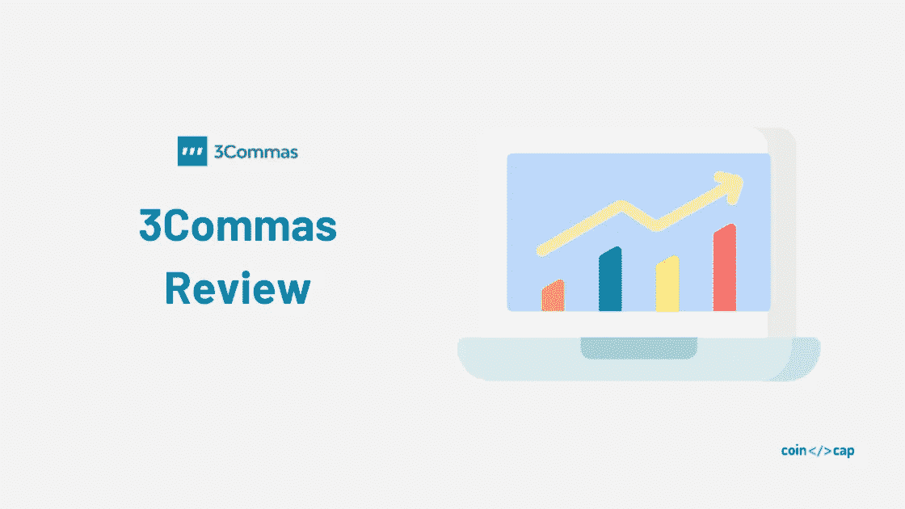
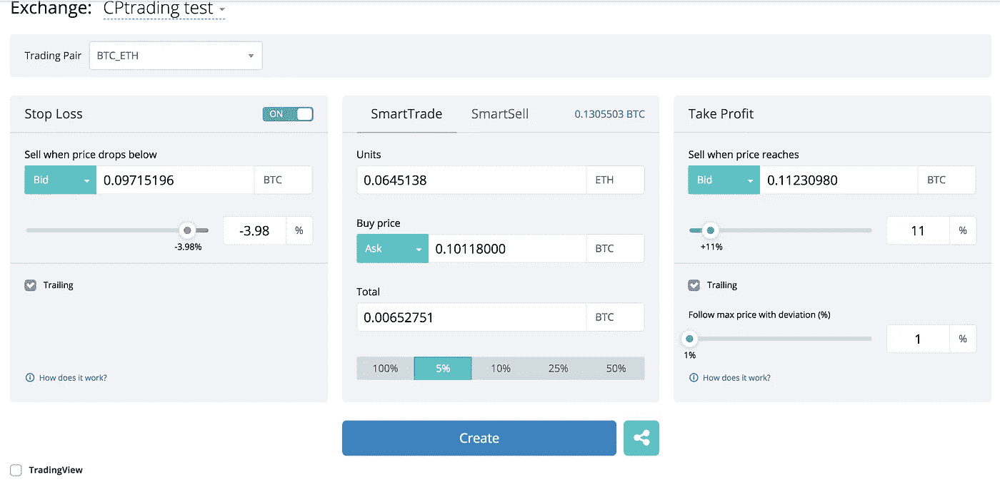
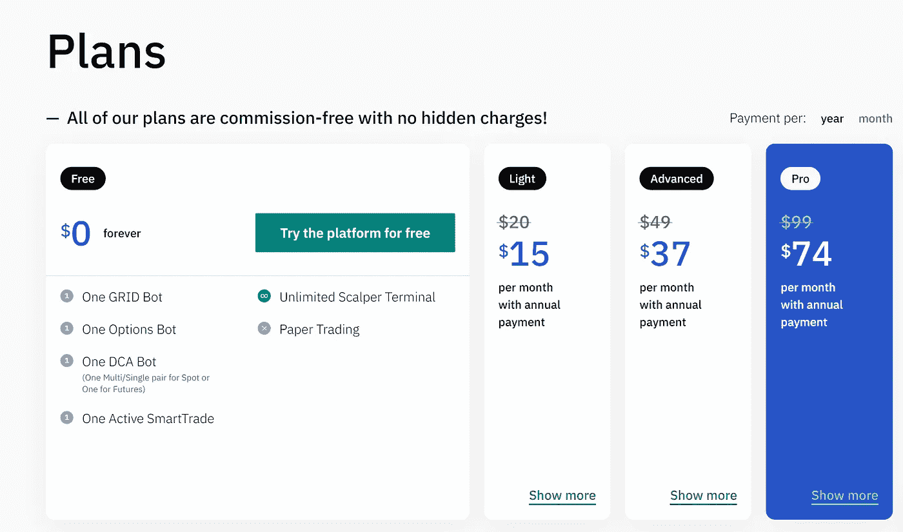

# 3Commas Review 2022 |一款出色的加密交易机器人

> 原文：<https://medium.com/coinmonks/3commas-review-an-excellent-crypto-trading-bot-2020-1313a58bec92?source=collection_archive---------0----------------------->

3 commas review

自动交易机器人为独立交易者提供了最好的价值。它们可以定制，链接到几个交易所，并可能全年 24/7 工作。在本文中，我们将回顾一下 [3commas](https://3commas.io/?c=tc252152) ，这是广受好评的[加密交易机器人服务](/coinmonks/crypto-trading-bot-c2ffce8acb2a)之一。

# 什么是 3commas？

总部位于迈阿密的 [**3commas**](https://3commas.io/?c=tc252152) 的核心是一个在线平台，面向对使用自动化机器人进行[加密货币交易](https://blog.coincodecap.com/tag/trading/)感兴趣的人。对于没有金融技术背景或没有丰富股市经验的人来说，这是可取的。

[3commas](https://3commas.io/?c=tc252152) 是一个网络托管平台，可通过任何连接互联网的设备进行访问。3commas 提供不同的交易机器人，可以执行特定的策略，如止损和做空等。

也可以使用用户界面定制独特的[交易](https://blog.coincodecap.com/tag/trading/)头寸。[交易机器人](https://blog.coincodecap.com/tag/trading-bots/)也可以被编程为在特定时间或 24 小时不间断运行。让我们开始我们的 3commas 回顾。

## 关键要点

*   更好的用户体验和初学者友好
*   支持广泛的交易策略
*   良好声誉
*   提供有竞争力的速度和安全性
*   定价从 22 美元起(可免费试用)

# 用户界面

[3commas](https://3commas.io/?c=tc252152) 平台拥有非常友好的用户界面/UX。不同策略的所有定制都可以使用滑块和标记指示器来完成。

这种体验是直观的，不需要太多以前在这方面的经验就可以做到。

# 交易策略

[3commas](https://3commas.io/?c=tc252152) 提供了无数种可能的交易策略。许多都是预先设置好的，很容易个性化，更复杂的也是可能的。

我们将把重点放在主要的几个方面，但这绝不是一个详尽的清单。

## 止损

止损是最常见的基本动作之一。在这里，用户设置损失百分比。一旦超过这个比例，机器人将出售资产。

例如，机器人以 10，000 美元的价格为 BTC 下了一个购买订单。止损设定在初始价格以下 10%。如果 BTC 的价格跌至 9000 美元，机器人会自动发出卖出指令。有了止损，用户可以免受市场剧烈和意外波动的影响。

## 跟踪止损

跟踪止损顾名思义是之前策略的更高级版本；在这种策略中，订单跟踪价格处于特定的价格(或百分比)距离。

所以，使用前面的例子，假设我们在当前价格 1000 美元处设置跟踪止损，当前价格是 10000 美元。假设[比特币](https://coincodecap.com/a-candid-explanation-of-bitcoin)价格开始上涨，达到 10500 美元；在这种情况下，卖单将被设置为 9500 美元。

如果价格开始下跌，并且在比特币价格跌破 9500 美元的情况下，该卖单将被执行。

## 获利

止盈不言自明；一旦实现了预定的收益百分比，就会执行该计划。如果 BTC 以 10，000 美元买入(获利 20%)，价格攀升至 12，000 美元，机器人卖出头寸，锁定利润。

## 跟踪获利

跟踪止盈，类似于跟踪止损，将收益纳入策略。这个机器人被设定为 10%的利润。这个选择会让你的利润达到趋势最高点的 10%。所以，如果在前面的例子中，在触及 10，500 美元后，比特币价格继续攀升，直到趋势逆转，才会清算头寸。

这些只是 3commas 提供的可能性的几个例子。其他选项包括定制货币对、交易量限制、初始交易量等等。简而言之，这是一个非常健壮且易于个性化的平台。

# 易用性

如前所述，该平台非常直观和用户友好。除此之外， [3commas](https://3commas.io/?c=tc252152) 提供了从经验丰富的用户那里复制策略的能力。此外，教育性的博客文章、教程和活跃的社区会吸引新的交易者。

# 3Commas 安全吗？

[3commas](https://3commas.io/?c=tc252152) 可以更详细地介绍他们部署的安全协议。但重要的是要记住，资金实际上并不在平台上持有，并且[交易机器人](https://blog.coincodecap.com/tag/trading-bots/)不能从你的挂钩交易所账户中提款。

[交易机器人](https://blog.coincodecap.com/tag/trading-bots/)通过 API 与交易所的账户相连，然后在相连的交易所进行自动交易。这个过程不需要用户向外部账户进行任何现金或加密转账，只需要提供由他们的交易所生成的 API 密钥。反过来，这些密钥为交易机器人提供对用户账户的受限访问，并且不授予机器人任何提款权。

关于贸易数据，服务条款含糊不清。3commas 确实会收集用户的策略和收益信息。需要澄清这些数据的个性化程度；也许是聚合的数据，但也可以是个体的。公司使用这些信息的方式需要在网站上说明。

# 3 商业计划

[3commas](https://3commas.io/?c=tc252152) 提供包月服务，但并不止于此。如果提前一年、半年或按月支付，每月费用会有所变化。最重要的是，三个计划提供了增加价格的功能。

# 速度

由于不同交换机的 API 对来自 3 个 commas 服务器的僵尸程序的访问是有限的，因此没有显著的速度优势。对不断变化的市场条件的响应速度以及下单和发送订单的速度是零售平台的标准。

需要更多关于 3commas 延迟测试的信息，所以很难做出判断。

拥有低延迟设备和更快连接的机构投资者将拥有优势。但在市场的零售方面，3commas 与竞争对手相比没有明显的劣势。

# 名声

[3commas](https://3commas.io/?c=tc252152) 是加密领域最有声望、最受推崇的交易平台之一。大多数评论网站都把它放在榜首，有近乎完美的分数和热情洋溢的评论。加密交易空间仍然年轻，这些服务相对较新，但 3commas 在当前市场中处于领先地位。

> 另请阅读:[2020 年最佳加密交易机器人](/coinmonks/whats-the-best-crypto-trading-bot-in-2020-top-8-bitcoin-trading-bot-c16adeb13317)

# 交换兼容性

目前，3commas 与 13 家交易所兼容，包括 Bitmex、Bittrex、BitFinex、币安、Bitstamp、KuCoin、Poloniex、HitBTC、Gate、比特币基地 Pro、OKEX、火币和北海巨妖。

# 3Commas 移动应用程序

无论您的计划如何，您都可以访问移动应用程序。此外，这款移动应用拥有桌面版的所有功能，因此你可以直接从智能手机上进行相同类型的交易。

这使得在任何地方检查你的交易都很方便。但手机应用运行起来不如桌面版流畅。开发者继续更新它，但是你会注意到通知和移动智能交易平台的延迟。

# 3commas 客户支持

您可以通过以下电子邮件 id 给他们写信:

支持:[支持@3commas.io](mailto:support@3commas.io)

付款信息: [sales@3commas.io](mailto:sales@3commas.io)

法律问题: [legal@3commas.io](mailto:legal@3commas.io)

关联公司: [partners@3commas.io](mailto:partners@3commas.io)

[3commas](https://coincodecap.com/go/3commas) 运行一个[电报通道](https://t.me/commas)，在此共享定期更新。他们还有一个 [Youtube 频道](https://www.youtube.com/channel/UCig8XY-gsthRgM-zyv1nx6Q/videos)，里面有很多关于我们如何使用这个平台的视频。你也可以在推特上和他们联系。

# 3 商业评论:利弊

## **优点**

您可以在一个平台上访问所有主要的加密交换。

卓越的客户服务。

提供全面的教育和学习工具。

用户友好的仪表板，包括所有功能。

## **缺点**

入职流程相当漫长。

移动应用需要迎头赶上。

在较低层次有一个贸易机器人委员会。

# 最后的想法

[3commas](https://3commas.io/?c=tc252152) 是功能最丰富、最强大的交易平台之一。易于使用的界面对于所有经验水平的用户来说都是很好的第一步。它还连接到市场上最大的交易所，跨交易所下单的能力是一个显著的特点。

这个平台应该在你的研究列表的顶端如果你正在考虑加密交易，这个平台应该在你研究列表的顶端。请在评论区告诉我们您对我们的 3commas 评论的想法。

# 常见问题

## 3Commas 安全吗？

3Commas exchange 平台经过充分加密，并具有明确的数据保护策略。

## 我多快能赚到 3Commas 的钱？

你在 3Commas 上赚钱的速度取决于你使用的策略以及你的机器人的参数设置。

**归属**

> **本文作者为** [**塞巴斯蒂安**](https://twitter.com/CryptoTerra3) **。**

> 加入 Coinmonks [电报频道](https://t.me/coincodecap)和 [Youtube 频道](https://www.youtube.com/c/coinmonks/videos)了解加密交易和投资

## 另外，阅读

*   [莱杰 vs n rave](/coinmonks/ledger-vs-ngrave-zero-7e40f0c1d694)|[莱杰 nano s vs x](/coinmonks/ledger-nano-s-vs-x-battery-hardware-price-storage-59a6663fe3b0) | [币安评论](/coinmonks/binance-review-ee10d3bf3b6e)
*   [Bybit Exchange 评论](/coinmonks/bybit-exchange-review-dbd570019b71) | [Bityard 评论](https://coincodecap.com/bityard-reivew) | [Jet-Bot 评论](https://coincodecap.com/jet-bot-review)
*   [3 commas vs crypto hopper](/coinmonks/3commas-vs-pionex-vs-cryptohopper-best-crypto-bot-6a98d2baa203)|[赚取秘密利息](/coinmonks/earn-crypto-interest-b10b810fdda3)
*   最好的比特币[硬件钱包](/coinmonks/hardware-wallets-dfa1211730c6) | [BitBox02 回顾](/coinmonks/bitbox02-review-your-swiss-bitcoin-hardware-wallet-c36c88fff29)
*   [最佳加密交易信号电报](/coinmonks/best-crypto-signals-telegram-5785cdbc4b2b) | [MoonXBT 评论](/coinmonks/moonxbt-review-6e4ab26d037)
*   如何在 Bitbns 上购买柴犬(SHIB)币？ | [购买 Floki](https://coincodecap.com/buy-floki-inu-token)
*   [CoinFLEX 评论](https://coincodecap.com/coinflex-review) | [AEX 交易所评论](https://coincodecap.com/aex-exchange-review) | [UPbit 评论](https://coincodecap.com/upbit-review)
*   [十大最佳加密货币博客](https://coincodecap.com/best-cryptocurrency-blogs) | [YouHodler 评论](https://coincodecap.com/youhodler-review)
*   [AscendEx 保证金交易](https://coincodecap.com/ascendex-margin-trading) | [Bitfinex 赌注](https://coincodecap.com/bitfinex-staking)
*   [最好的卡达诺钱包](https://coincodecap.com/best-cardano-wallets) | [Bingbon 副本交易](https://coincodecap.com/bingbon-copy-trading)
*   [印度最佳 P2P 加密交易所](https://coincodecap.com/p2p-crypto-exchanges-in-india) | [柴犬钱包](https://coincodecap.com/baby-shiba-inu-wallets)
*   [八大加密附属计划](https://coincodecap.com/crypto-affiliate-programs) | [eToro vs 比特币基地](https://coincodecap.com/etoro-vs-coinbase)
*   [最佳以太坊钱包](https://coincodecap.com/best-ethereum-wallets) | [电报上的加密货币机器人](https://coincodecap.com/telegram-crypto-bots)
*   交易杠杆代币的最佳交易所
*   [最佳加密分析或链上数据](https://coincodecap.com/blockchain-analytics) | [Bexplus 评论](https://coincodecap.com/bexplus-review)