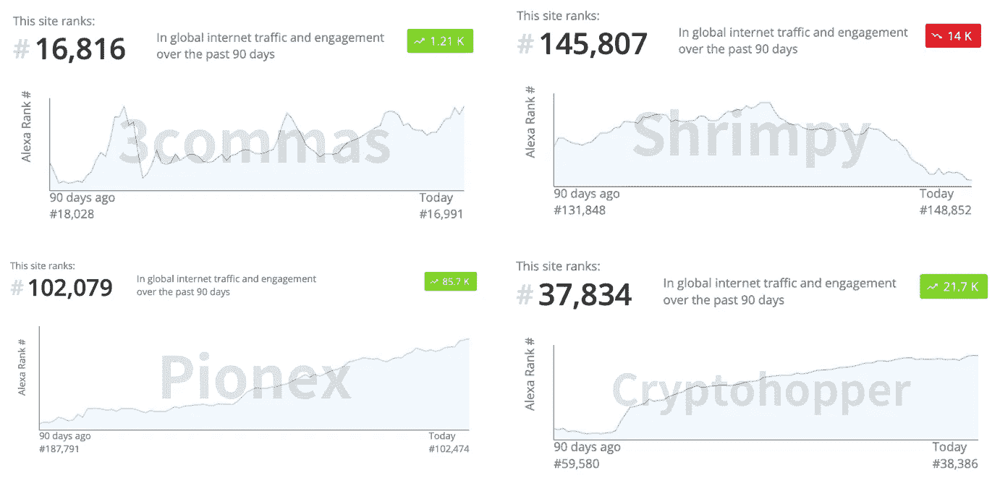
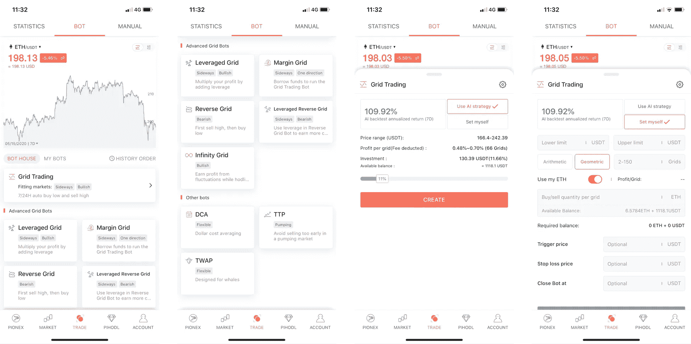
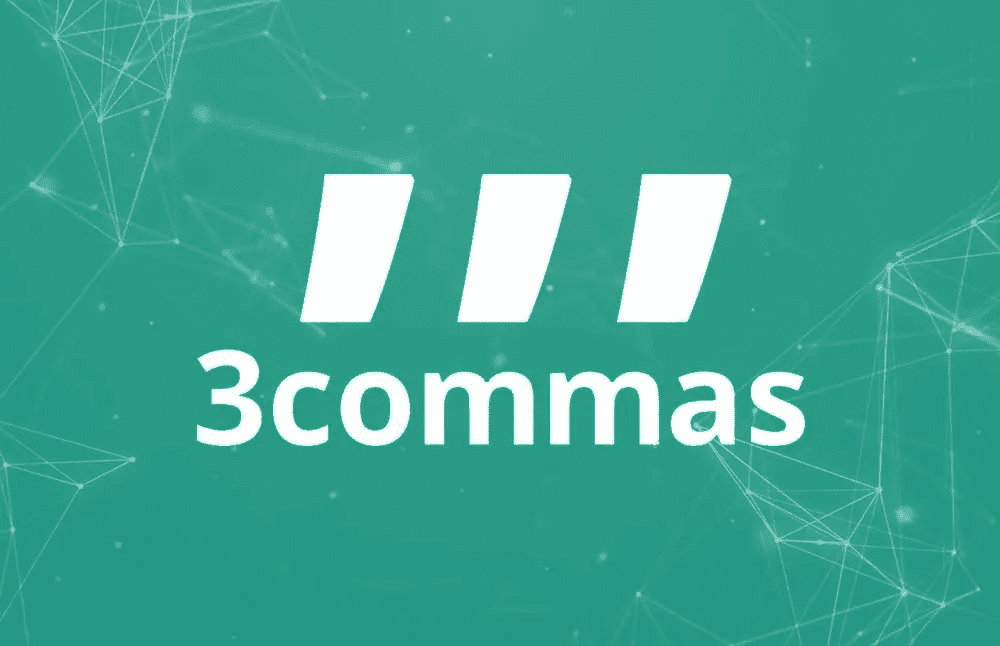
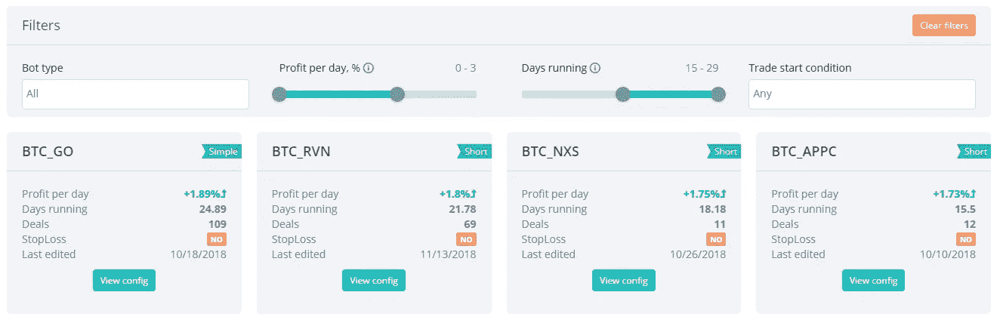
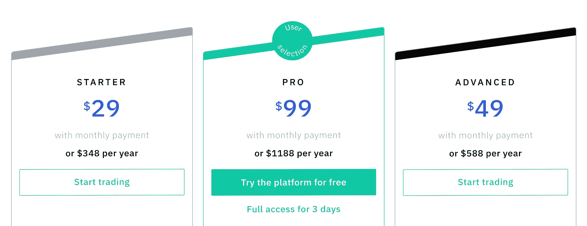
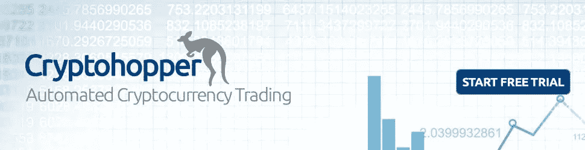
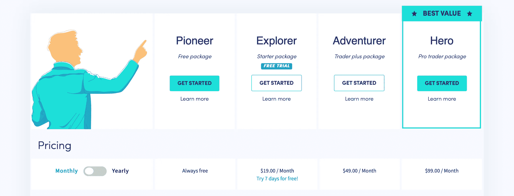
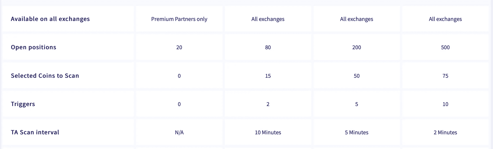

# 3Commas vs Cryptohopper vs Pionex

> 原文：<https://medium.com/coinmonks/3commas-vs-pionex-vs-cryptohopper-best-crypto-bot-6a98d2baa203?source=collection_archive---------0----------------------->

## 2021 年[最好的密码交易机器人](/coinmonks/crypto-trading-bot-c2ffce8acb2a)是哪一个？在本文中，我们比较了 3Commas vs Cryptohopper vs Pionex，看看哪一个是最好的。

密码交易机器人现在越来越受密码交易员的欢迎。市场上已经存在各种交易机器人提供商，这使得交易者很难选择从哪一个开始。在深入了解 Pionex、 [3Commas](https://3commas.io/?c=tc252152) 和 [Cryptohopper](https://www.cryptohopper.com/?atid=14576) 之前，我比较了来自 [Alexa 网站流量工具](https://www.alexa.com/siteinfo)的几个机器人服务。这是 Alexa 上的网站流量排名。

Traffic of different crypto trading bots

正如你所看到的，根据 Alexa 流量网站排名， [3Commas](https://3commas.io/?c=tc252152) 仍然是最大的一个。 [Cryptohopper](https://www.cryptohopper.com/?atid=14576) 在# 37834，而 [Pionex](https://coincodecap.com/product/pionex-or-exchange-with-trading-bot-3) 和 [Shrimpy](https://coincodecap.com/product/shrimpy-6) 在# 102079 和# 145807。在过去的 90 天里只有 Shrimpy 的流量下降了。3Commas、Cryptohopper 和 Pionex 的排名持续上升，而 Pionex 显示出巨大的潜力。

在这篇文章中，我将比较 [Pionex](https://coincodecap.com/product/pionex-or-exchange-with-trading-bot-3) 、 [3Commas](https://3commas.io/?c=tc252152) 和 [Cryptohopper](https://www.cryptohopper.com/?atid=14576) 。根据 Alexa 网站流量排名，排名前 3 的加密交易机器人。

# [Pionex](http://blog.coincodecap.com/go/pionex)

Pionex

## Pionex 是如何工作的？

[Pionex](http://blog.coincodecap.com/go/pionex) 是内置加密交易机器人的交易所。你可能会有点困惑，为什么交易所内部有交易机器人？一开始我也有这个问题。深入挖掘后，我发现它更像是一个经纪人，而不是交易所。因为它聚集了币安和火币的流动性，所以它可以专注于如何用交易工具帮助他们的用户。

要使用 [Pionex](http://blog.coincodecap.com/go/pionex) ，您需要将硬币存入其中。我对这家公司做过一些背景调查，发现它是由几家传统风险投资 1000 万美元投资的(搜索 BitUniverse，是同一个团队)。因此，这是迄今为止由值得信赖的风投支持的最有信誉的服务。

## Pionex 工具

[Pionex](https://www.pionex.com/?utm_source=coincodecap.com) 向其客户提供九个交易机器人。它简单易用，他们还为新手设置机器人提供了 AI 参数。(根据回溯测试数据)

Pionex tools

1.  **网格机器人(GRID Trading Bot)——**网格机器人是几个加密交易机器人中的后起之秀。这是一个古老而强大的交易策略，从波动的市场中获利。你所要做的就是为它设定一个范围，它会帮助你在这个范围内自动“低买高卖”。
2.  使用网格机器人时，你可能会错过价格上涨时的趋势利润。这就是无限网格脱颖而出的时刻。无限网格机器人类似于网格机器人，但没有上限。它仍然可以帮助你“24*7 低买高卖”，但与 GRID Bot 相比，这部分资金相对较少。
3.  **杠杆式网格机器人—** 将网格机器人与[加密贷款](https://coincodecap.com/category/lend-and-borrow)特性相结合，这就是杠杆式网格机器人的工作原理。整个概念还是和 GRID Bot 一样，但是有了杠杆(高达 3 倍)，你就可以用你的原理赚取更多的利润。但是！杠杆化也意味着有平仓的机会，在使用之前要注意风险。
4.  **保证金电网 Bot —** 类似于杠杆电网 Bot，但担保品不涉及保证金电网 Bot 中的电网 Bot。你也可以选择长或短，而使用保证金网格机器人。
5.  **反向电网 Bot —** 反向电网 Bot 是一个聪明的策略，用电网交易策略来增加你的报价金额。它以更高的价格卖出你的[比特币](https://blog.coincodecap.com/a-candid-explanation-of-bitcoin/)，再以更低的价格回购。
6.  **杠杆反向网格 Bot —** 将反向网格 Bot 与加密贷款功能相结合将获得杠杆反向网格 Bot。与反向网格机器人功能相同，但您可以利用杠杆赚取更多利润。不过，在使用杠杆交易时，要注意平仓的风险。
7.  **DCA Bot(美元成本平均法)——**美元成本平均法是投资密码市场的一种有用策略。您可以为您的 DCA 计划设置期限，机器人会帮助您进行 DCA，而不是手动进行。
8.  **跟踪止盈机器人—** 跟踪止盈是众所周知的策略之一。由于加密货币市场的波动性，使用 TTP 机器人进行倒票既棘手又容易。
9.  **TWAP 机器人—** 如果你是一只鲸鱼，那么你应该熟悉 TWAP 方法。它帮助你在一段时间内积累或出售你的包包。

## Pionex 的定价

**Pionex****上的交易机器人都是免费的。**是交易所，所以和其他一样收取交易费。**做市商和收单商的交易费用均为 0.05%；这是目前主要交易所中最便宜的费用。**

# [3 条消息](https://blog.coincodecap.com/go/3commas)

3Commas

## 3Commas 是如何工作的？

为了使用[3 命令](https://3commas.io/?c=tc252152)，你需要从[加密交换](https://blog.coincodecap.com/tag/crypto-exchange/)获取你的 API 密匙。以下是其支持的交易所列表。

*   币安(智能交易、投资组合、自动交易机器人)
*   比特币基地专业版(GDAX)(智能贸易)
*   智能交易，自动交易机器人
*   库币(智能交易)
*   比特邮票(智能交易)
*   Bittrex(智能交易、投资组合、自动交易机器人)
*   Poloniex(智能交易、投资组合)
*   智能交易
*   Houbi Global(智能交易、自动交易机器人)
*   Gate.io(智能贸易)
*   智能贸易
*   Bitmex.com(自动跟踪机器人)
*   北海巨妖(智能贸易)

如您所见，它们支持不同交换的不同特性。所以最好在使用前检查一下。

## 3 常用工具

3Commas

*   **SmartTrade —** SmartTrade 是 3Commas 中最受欢迎的功能。SmartTrade 功能允许您设置几个交易参数，3Commas 基于云的平台将在市场条件符合您的设置时帮助执行订单。
*   **机器人—** 使用 3Commas 自动交易机器人，一旦启动机器人，它就会执行订单。有一种新的机器人叫做网格机器人，它可以帮助你在特定地区自动低买高卖。你可以微调每个 bot 的参数，自己检查一下，在使用巨额资金之前进行测试。

## 3 种商品的定价

[3Commas](https://blog.coincodecap.com/go/3commas) 为其用户提供三种不同的订购计划。交易者可以按月订阅，也可以按年订阅，如果你打算用一年以上的话更便宜。

Monthly Payment

**月供**

所有计划都包括以下特点:

*   23 个受支持的交易所
*   多级转诊计划
*   公共 API
*   不同外汇账户的单一投资组合
*   票据交易

1.  **启动计划—** [3Commas](https://3commas.io/?c=tc252152) 启动计划每月收费 29 美元。有了这个计划，交易者可以用 3Commas 作为自己的交易终端，进行期货交易。智能交易功能允许您设置一些买卖条件。对于想尝试 3Commas 交易工具的交易者来说，这是一个好的开始。
2.  **高级计划—** 3Commas 的高级计划每月收费 49 美元。这是你自动化交易生活的开始！你可以免费使用几个交易机器人，高级计划，简单机器人，短算法，长算法，并查看和复制其他交易者的机器人！
3.  **专业计划—** 3Commas 的专业计划每月收费 99 美元。您可以访问 3Commas 上的所有功能，包括 GRID Bot、Bitmex 上的 Bot、币安期货和 Bybit。如果你是期货玩家，那么职业计划对你来说是必须的。

> 另外，请阅读我们的[3 商业评论](/coinmonks/3commas-review-an-excellent-crypto-trading-bot-2020-1313a58bec92)。

# [隐漏斗](http://blog.coincodecap.com/go/cryptohopper)

Cryptohopper

## Cryptohopper 是如何工作的？

[Cryptohopper](http://blog.coincodecap.com/go/cryptohopper) 是一个基于云的交易 bot 平台。因此，在使用它之前，有必要将您的交易所的 API 密钥与它连接。以下是其支持的交易所:

*   库科恩
*   币安
*   比特币基地专业
*   比特雷克斯
*   波洛涅克斯
*   北海巨妖
*   火币
*   Bitfinex

## 密码漏斗工具

[Cryptohopper](http://blog.coincodecap.com/go/cryptohopper) 最好的一个特性就是你可以很容易的从其他交易者那里复制交易机器人模板。Cryptohopper 更加灵活，您可以使用 TAs 调整每个订单类型。另一方面，灵活意味着对新手来说更复杂。

*   Cryptohopper 提供回溯测试、跟踪功能、止损、自动平仓、获利、做空和 DCA。这些功能中的大部分你应该已经知道它是如何工作的，但是有三个交易机器人，我想用更多的段落来说明。
*   **交易所套利—** 加密交易机器人帮助你在同一交易对的不同交易所之间套利。
*   **三角套利—** 三角套利帮助你在交易所增加一个硬币的数量。它发现了三对之间的套利机会，比如说 BTC/瑞士联邦理工学院，EOS/瑞士联邦理工学院，EOS/BTC。事情会是这样的:把 BTC 卖给 ETH，把 EOS 卖给 ETH，然后把 EOS 卖给 BTC。
*   **做市商 Bot —** 做市商 Bot 从买卖价差中获利。最好使用低流动性交易对的做市商 Bot，因为价差会更大，做市利润空间更大。

## 隐跳虫的定价

[Cryptohopper](http://blog.coincodecap.com/go/cryptohopper) 为他们的客户提供四种套餐。交易者可以按月订阅，也可以订阅年套餐，如果你打算用一年以上的话会便宜一些。

Cryptohopper pricing

> [***阅读 CoinCodeCap 上的 Cryptohopper 评论***](https://coincodecap.com/product/cryptohopper-9)

**Cryptohopper 定价**

*   **先锋包—** 可以免费使用 Cryptohopper。但功能仅限于[投资组合管理](https://coincodecap.com/category/portfolio-management)和手动交易。在这个包装中，它更像是一个交易终端。
*   **探索者包(每月 19 美元)** —探索者包中提供 7 天免费试用。TA 扫描间隔为 10 分钟，该计划让您能够管理从多达 15 个硬币中选择的 80 个位置。
*   **冒险者套装(每月 49 美元)——**冒险者套装给你管理 200 个仓位的能力，让你在 50 个不同的硬币之间交易。包裹中 TA 扫描的间隔为 5 分钟。
*   **英雄套餐(每月 99 美元)——**这是 Cryptohopper 的高级套餐，让你享受所有的功能。只能在这个套餐里使用三角套利 bot 和做市 bot。

**Cryptohopper pricing**

# [3 commas](https://blog.coincodecap.com/go/3commas)VS[Pionex](http://blog.coincodecap.com/go/pionex)

3Commas trading bot 最棒的地方在于，它可以让你设置许多不同的参数和特殊订单。所以如果你心中有自己的交易策略，那么先试试 3Commas 是个不错的主意。结合这些特殊的订单和条件，你可以建立自己的交易策略。

Pionex 免费提供交易机器人，这是相比 3Commas 的核心竞争力。Pionex 上最著名的 bot 是网格 Bot 和其他几个针对不同市场情况的网格 Bot。3Commas 的网格机器人功能每月收费 99 美元，因此如果您是为了网格机器人而来，最好使用 Pionex。Pionex 网站和手机 App 的 UI 比 3Commas 好很多。

# 皮欧尼克斯 VS [隐跳者](http://blog.coincodecap.com/go/cryptohopper)

在 Cryptohopper，有一个市场，你可以在那里复制其他用户的策略。使用 Cryptohopper 回溯测试工具，并在使用之前检查策略的性能。这有助于其用户降低交易风险。

尽管如此，Pionex 免费提供 Cryptohopper 的一些酷功能。比如 DCA 机器人。这是投资者在加密或传统市场中最常见的策略。

# 结论

如果你是加密交易机器人的新手，并愿意尝试一下，那么你应该先使用 [Pionex](http://blog.coincodecap.com/go/pionex) 或 3Commas 和 Cryptohopper 的免费试用版！没有一个机器人适合所有类型的交易者。你要做的第一件事是学习 Pionex、3Commas 和 [Cryptohopper](http://blog.coincodecap.com/go/cryptohopper) 提供的每个交易机器人的概念。每个交易机器人都有自己的实力。

第二，不要陷入“贵的更好”的误区。一个昂贵的交易机器人并不意味着你会从中赚取更多的利润；例如，如果初级套装对您来说足够了，您就没有必要购买专业套装。另一方面，便宜或免费的机器人并不意味着性能会很糟糕。

## 另外，阅读

*   最好的[密码交易机器人](/coinmonks/crypto-trading-bot-c2ffce8acb2a)
*   [3 商业评论](/coinmonks/3commas-review-an-excellent-crypto-trading-bot-2020-1313a58bec92)
*   [Pionex 审查](/coinmonks/pionex-review-exchange-with-crypto-trading-bot-1e459d0191ea)
*   [AAX 交易所评论](/coinmonks/aax-exchange-review-2021-67c5ea09330c) |推荐代码、交易费用、利弊
*   [Deribit 审查](/coinmonks/deribit-review-options-fees-apis-and-testnet-2ca16c4bbdb2) |选项、费用、API 和 Testnet
*   [FTX 密码交易所评论](/coinmonks/ftx-crypto-exchange-review-53664ac1198f)
*   [零审核](/coinmonks/ngrave-zero-review-c465cf8307fc)
*   [逐位交换审查](/coinmonks/bybit-exchange-review-dbd570019b71)
*   最好的比特币[硬件钱包](/coinmonks/the-best-cryptocurrency-hardware-wallets-of-2020-e28b1c124069?source=friends_link&sk=324dd9ff8556ab578d71e7ad7658ad7c)
*   [密码本交易平台](/coinmonks/top-10-crypto-copy-trading-platforms-for-beginners-d0c37c7d698c)
*   最佳 [monero 钱包](https://blog.coincodecap.com/best-monero-wallets)
*   [莱杰 nano s vs x](https://blog.coincodecap.com/ledger-nano-s-vs-x)
*   [bits gap vs 3 commas vs quad ency](https://blog.coincodecap.com/bitsgap-3commas-quadency)
*   最好的[加密税务软件](/coinmonks/best-crypto-tax-tool-for-my-money-72d4b430816b)
*   [最佳加密交易平台](/coinmonks/the-best-crypto-trading-platforms-in-2020-the-definitive-guide-updated-c72f8b874555)
*   最佳[加密借贷平台](/coinmonks/top-5-crypto-lending-platforms-in-2020-that-you-need-to-know-a1b675cec3fa)
*   [莱杰纳米 S vs 特雷佐 one vs 特雷佐 T vs 莱杰纳米 X](https://blog.coincodecap.com/ledger-nano-s-vs-trezor-one-ledger-nano-x-trezor-t)
*   [block fi vs Celsius](/coinmonks/blockfi-vs-celsius-vs-hodlnaut-8a1cc8c26630)vs Hodlnaut
*   Bitsgap 评论——一个轻松赚钱的加密交易机器人
*   为专业人士设计的加密交易机器人
*   [PrimeXBT 审查](/coinmonks/primexbt-review-88e0815be858) |杠杆交易、费用和交易
*   [Altrady 审查](https://blog.coincodecap.com/altrady-reivew)
*   [埃利帕尔泰坦评论](/coinmonks/ellipal-titan-review-85e9071dd029)
*   [SecuX Stone 评论](https://blog.coincodecap.com/secux-stone-hardware-wallet-review)
*   [BlockFi 评论](/coinmonks/blockfi-review-53096053c097) |从您的密码中赚取高达 8.6%的利息
*   [共同规则审查](https://blog.coincodecap.com/coinrule-review-a-perfect-trading-bot)
*   [最佳区块链分析工具](https://bitquery.io/blog/best-blockchain-analysis-tools-and-software)
*   [加密套利](/coinmonks/crypto-arbitrage-guide-how-to-make-money-as-a-beginner-62bfe5c868f6)指南:新手如何赚钱
*   最佳[加密制图工具](/coinmonks/what-are-the-best-charting-platforms-for-cryptocurrency-trading-85aade584d80)
*   了解比特币的[最佳书籍有哪些？](/coinmonks/what-are-the-best-books-to-learn-bitcoin-409aeb9aff4b)

> [直接在您的收件箱中获得最佳软件交易](/coinmonks/newsletters/coinmonks)

