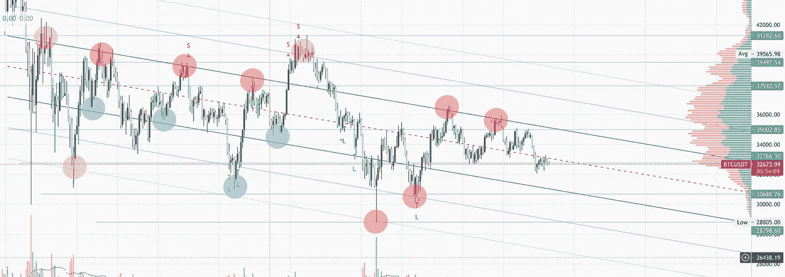
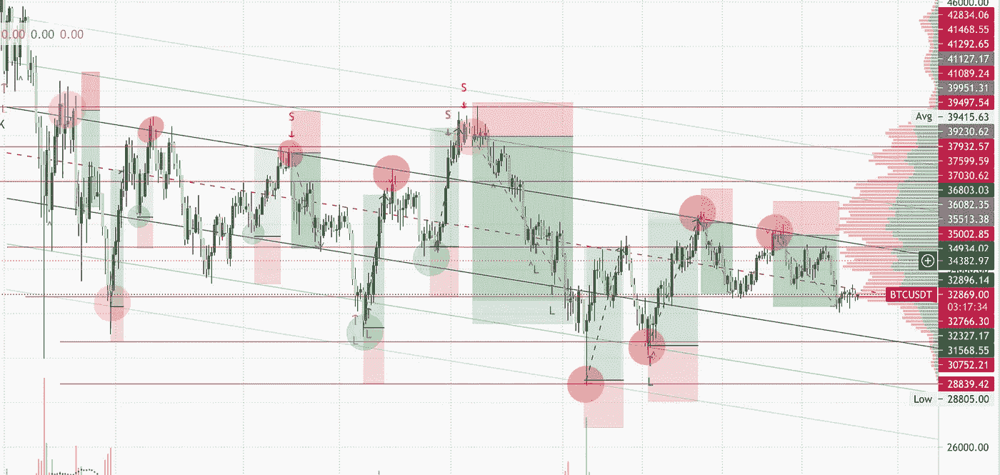
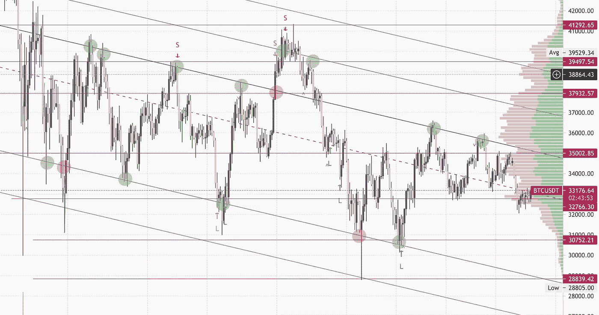
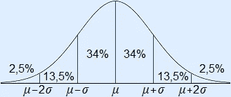

# 3x 线性回归指示器

> 原文：<https://medium.com/coinmonks/3x-linear-regression-indicator-99cefe4fc6d1?source=collection_archive---------1----------------------->

欢迎来到我的第一篇文章。上周, [Crypto 博利奇](https://medium.com/u/e47e5e8d7728?source=post_page-----99cefe4fc6d1--------------------------------)在 WWG 上发了一个帖子，给了我很多启发。我在 Twitter 上关注他，因为他有大约 200 名粉丝，我看到他使用这个渠道，我当时知道这是一个线性回归工具。

当我看到他使用 3 个线性回归指标在图表上创建一个可见的标准偏差时，我认为这是天才。均值回归的结合，嗯，太棒了。

因为我的工作是全职程序员，所以我在 TradingView 上用 PineScript 做了一些业余爱好。所以我想，为什么不从博利奇的帖子里创建一个指标呢？而且嗯，在这里:[https://www . trading view . com/script/ff v3 BNF 8-3x-Linear-Regression/](https://www.tradingview.com/script/Ffv3BNF8-3x-Linear-Regression/)

在这篇文章中，我想写下我在第一周广泛使用该指标时的第一次学习。希望在团队中创造更多的采用，并获得所有关于如何使用它的反馈和想法，或者你可能会错过什么。

如果你不熟悉标准差和均值回复，我强烈建议你在继续之前先看看是什么。

T4:天使非常重要，尤其是在我们现在所处的横向市场中。该指示器可用于显示该范围。指示器的正常设置使用最后的 *n* 收盘蜡烛线值来计算偏离线位置。玩这个可能会很有趣。例如，在写这篇文章的时候。使用 4h TF 上的最后 300 根蜡烛线，结合 S/R 线

可以很好地观察当前的价格走势。这里一个很好的关键做法是关闭指标。看看当前的范围是什么，然后打开指示器，将长度编辑为该范围(与所有情况一样，时间范围越高，数据越准确)

## 看看下面的例子( *BTC/USDT* )

设置:关闭/320°长度/偏差:1σ，2σ，3σ

BTC/USDT 4h chart with S/R lines and 3x Lin Reg

查看与我的 S/R 线交叉的线的组合来查找条目

*   **红色**:背离线完美地触及蜡烛线收盘/高点。会是一个完美的捕捉，当触及背离线时，价格会剧烈波动
*   **橙色**:近乎完美，巨大的灯芯，所以如果你有很紧的设置，你会很棒
*   **蓝色**:接近背离线，将是 DCA 头寸的绝佳机会，也许你的头寸不会全部被填满，但你仍然会有一些利润。

*那么你怎么知道下一个偏离线会是什么颜色呢？*
嗯，显然你没有。

## 那么如何使用它呢..？

这里可能有一个有趣的策略，就是围绕背离水平进行 DCA，并围绕最接近或下一条背离线的 S/R 线设置止损水平。

查看图表上绘制的多头/空头头寸

Long/Short positions based on 3x Lin Reg crossing S/R Lines

T 他的看起来很容易，是的，事后来看这样做有点不公平，因为当你使用这种方法时，你不知道在哪个偏离线上出价，你不知道未来的价格波动会有多剧烈。但是这个游戏讲的是机会，当你有最好的 EV+值的时候进入。所以如果你和我一样，喜欢计算价格到达某个点的几率，那么这个指标一定会帮到你。

还有第一个位置，可能不太容易发现，因为没有确定的范围，没有 S/R 线，没有足够的标准偏差数据。

## 那么，如何获得最佳的 EV+设置呢？

使用上面的相同图表

把背离线当作趋势线，你会有很多有用的进场点。我隐藏了 1σ底线，因为我觉得它产生的噪音比有用的信息多。

顶部的 1σ线非常受重视，只有一个条目会被剔除。但它会立即给你一个机会进入背离线以上，你可以骑到-3σ(老实说，你会疯了，这样做没有利润，但无论如何)。

-2σ线也是一条很受尊敬的线，有两个止损点，仍然有 3/5 盈利。

## **重要提示**

*   均值回归的关键概念是价格将回到均值。在这个例子中是中间的红色虚线。使用该指标**时需要注意的一件重要事情是，应该从均值的角度来看待机会计算和价格行为。例如，价格在均值时达到 1σ的概率约为 34%。那是从中庸的角度来看。我不完全确定它回归均值的可能性有多大。我不确定那是否也是~34%。**

Standard Deviation

*   止盈:**总是**当价格回到均值时止盈。均线像磁铁一样工作，应该被认为是止盈的重要水平。当价格处于均值时，根据当前定义的范围，价格达到 1σ的机会为 34%，价格达到 2σ的机会为 13.5%，3σ水平为 2.5%。
*   如前所述，止损可以设置在偏离线以上或以下的 S/R 线，或者使用以前的偏离线。

就是这样！希望这是有帮助的，如果你有任何提示给我，或建议如何改善指标。请伸出手。我是@车安谈 WWG 不和

干杯！

**披露:包含推荐链接**

## 另外，阅读

 [## 最佳免费加密交易机器人——前 16 名比特币交易机器人[2021]

### 2021 年币安、比特币基地、库币和其他密码交易所的最佳密码交易机器人。四进制，位间隙…

medium.com](/coinmonks/crypto-trading-bot-c2ffce8acb2a)