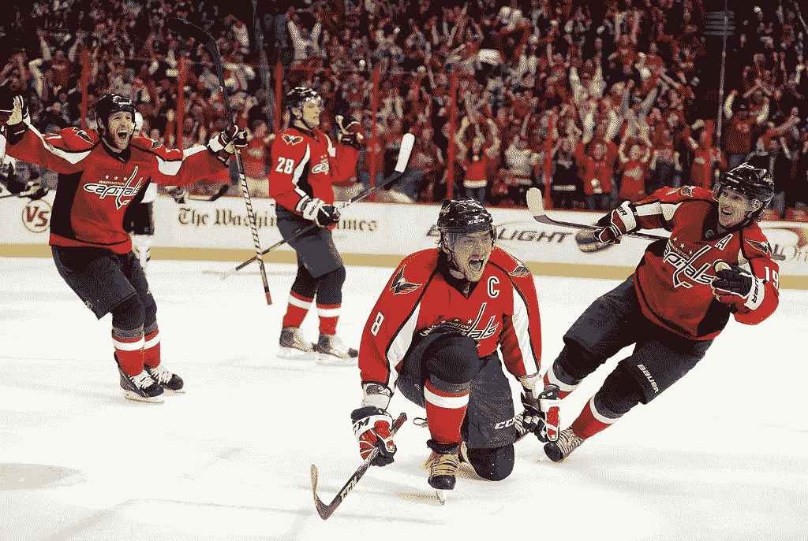
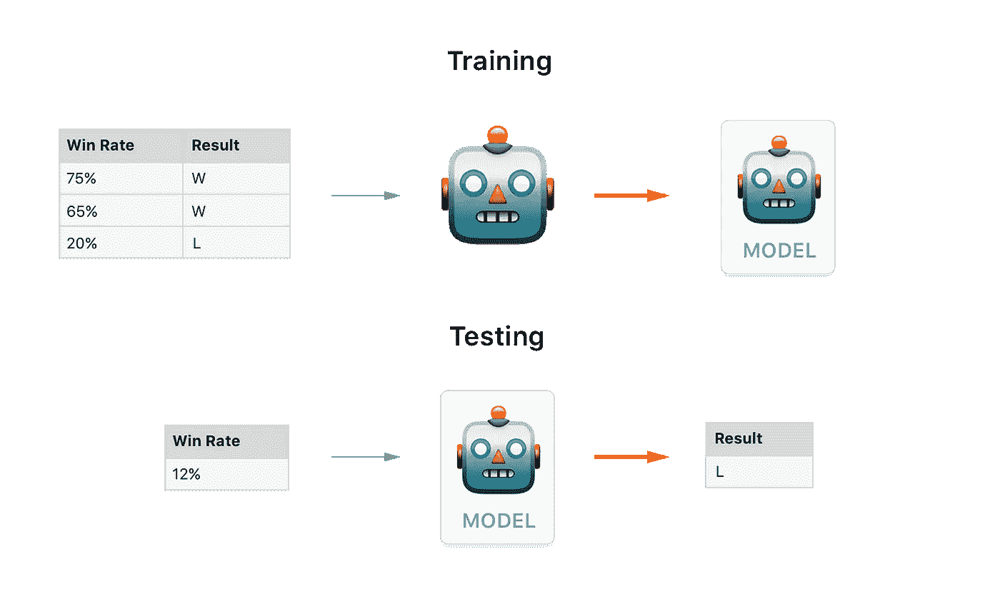
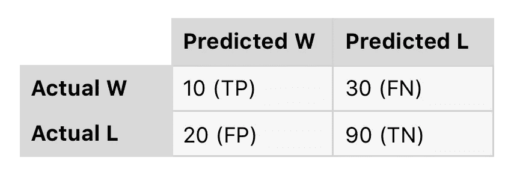
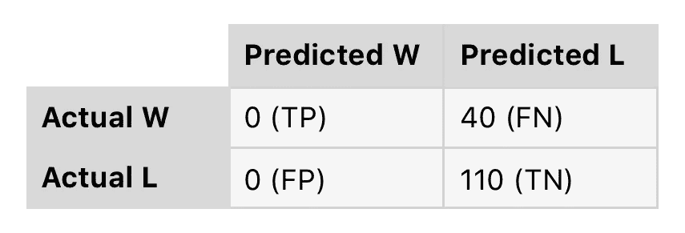
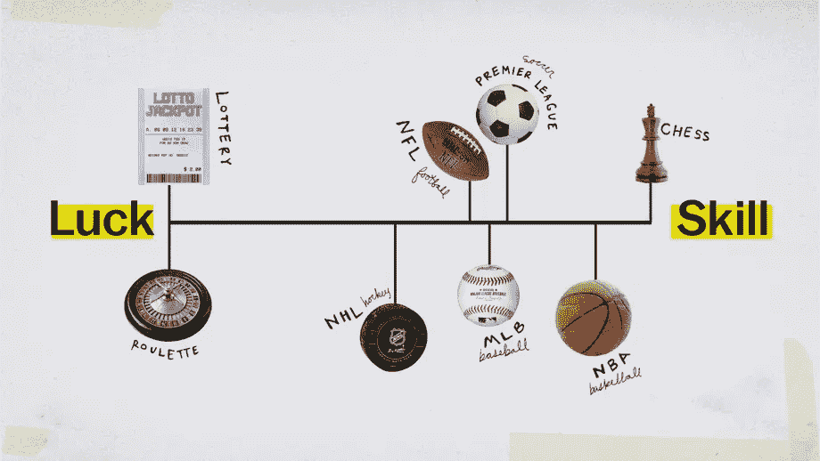
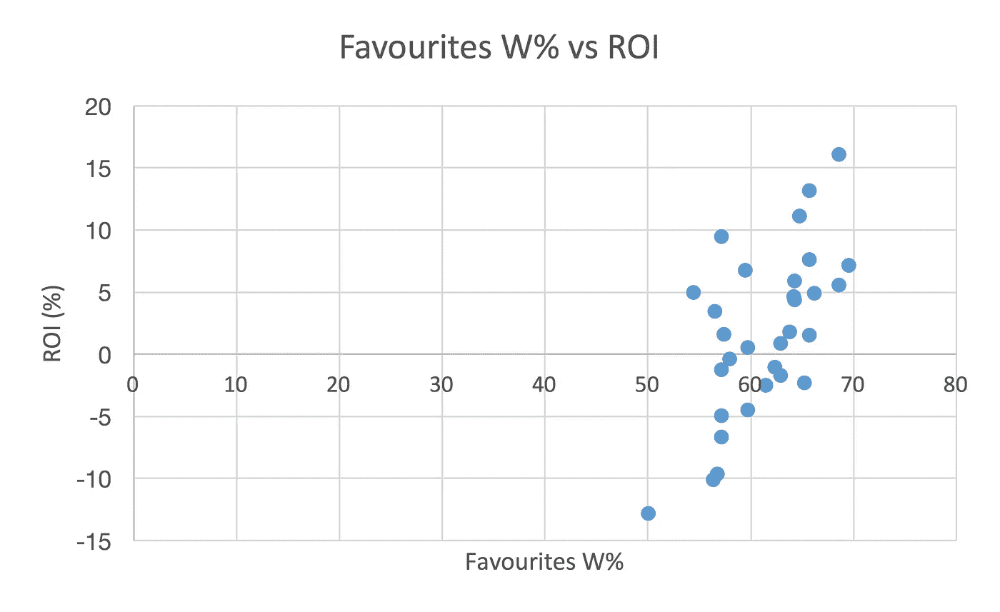
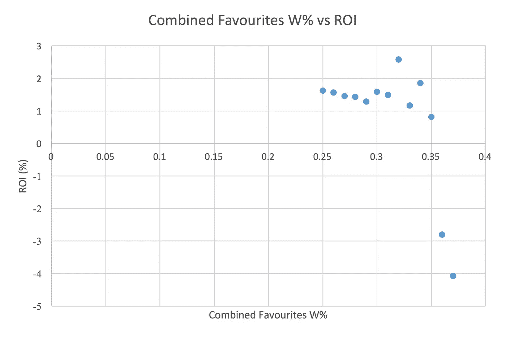
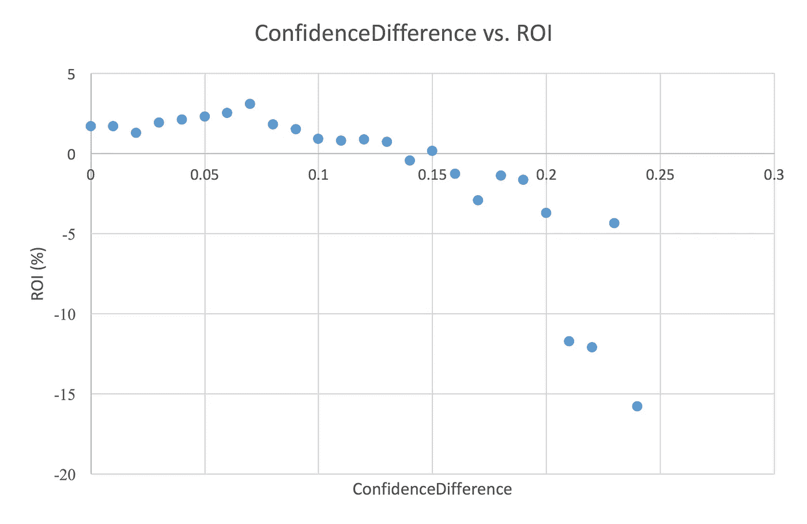

# 4718 美元——使用机器学习在 NHL 上下注

> 原文：<https://medium.com/coinmonks/4-718-using-machine-learning-to-bet-on-the-nhl-25d16649cd52?source=collection_archive---------0----------------------->

Alex Ovechkin celebrates a goal with Semin and Laich

他们说这是体育运动中最难赢得的奖杯。常规赛的 82 场艰苦的比赛。季后赛 16 胜。你需要你的西德尼·克罗斯比，你的邓肯·凯斯，还有乔纳森·奎克。你需要正确的管理，深度，勇气，甚至运气。你的球队有能力赢得今年的斯坦利杯吗？作为一个加人队的球迷，不。相反，我将期待在我的幻想池中拥有一个全新的机器学习模型。

是的，这是一段 15 分钟的阅读，但也适用于点菜。
[*跳到结果*](/p/25d16649cd52#b3c5)[*跳到投注*](/p/25d16649cd52#e7b2)[*跳到重述*](/p/25d16649cd52#5b2c)

# 我们开始吧

在这篇文章中，我将介绍我从这个项目中学到的一切，以及我实现目标的步骤。我不会在这里讨论代码，但是如果你想继续，你可以这样做，因为我的整个项目都在 [Github](https://github.com/miltonleung/Bookie) 上。

最简单的体育赌注就是猜测哪个队会赢。现在参加 NHL 比赛的每支队伍都有两种结果:赢或输。(超时损失仍算作损失。)该值成为*目标变量*或输出。我们认为对匹配结果有贡献的所有其他变量被称为*特征*，或输入。这实际上是一个监督机器学习问题的完美例子，特别是分类。工作原理是我们将已经标记的数据输入机器。机器将识别并学习关于该数据集的不同模式和属性。然后，它将使用这些知识来预测全新数据集的目标。

考虑这个简单的例子:

A very simple diagram of how classification works.

在这里，我们告诉机器一个胜率列表和它们相应的结果作为标记数据。机器进行计算，然后创建一个模型。然后我们可以输入*特征*，这是胜率，它将输出预测目标。机器学习模型的性能取决于它能够多准确地预测看不见的*特征*的目标。请注意，该模型以前从未见过 12%的胜率。

# 特征

实际上，我们需要比胜率更多的功能。在我的例子中，我选择了 16 个特性，它们是各种基本的和高级的曲棍球队统计数据。基本的曲棍球统计数据可以在曲棍球卡的背面找到，比如救球百分比和罚球次数。我使用的一些高级统计的例子是基于柯西、芬威克和 PDO。由于我们的模型的主要目标是预测 NHL 游戏，我们希望确保在每场游戏开始之前我们使用的所有功能都可用。

对于那些不熟悉的人来说，Corsi 测量的是赞成和反对的总投篮次数之间的差异(包括进球、失误和盖帽)。芬威克是科尔西的变体，但不包括盖帽。PDO 是一个球队投篮命中率和扑救率的总和，意在捕捉运气的存在。关于科尔西和芬威克作为个人表现指标的可靠性有很多争论，但既然我们是从团队的角度来谈，我们就不多说了。

当然，还有许多其他可能更好的方法来获取特性。有些人可能会试图根据个人表现的总和，甚至是推特上的情绪来预测比赛的结果。

# 获取数据，处理数据

这种方法所需的信息很容易获得。我需要做的就是用 Python 构建一个 web scraper，并调用 [NHL API](https://gitlab.com/dword4/nhlapi) 。我选择了从 2007 年到 2018 年的十个赛季收集数据，除了 2012 年到 2013 年的停摆赛季(只有常规赛，没有季后赛)。NHL.com 实际上提供了从 1917 年开始的统计数据，但当然那时的游戏非常不同，所以我坚持使用最近几年的数据。在这个时间点上，我有所有 10 个赛季的每场 NHL 比赛的赛季至今的统计数据。在训练模型之前，我使用 pandas(一个 Python 数据操作库)来做一些数据处理:

1.  我带来了相对于主队的所有特征。如果主队的分数百分比为 0.8，而客场队的分数百分比为 0.6，我将在最终数据集中使用分数百分比差异:0.2。
2.  由于样本量小，我删除了 11 月 1 日之前的所有比赛(大约是本赛季的前 12 场比赛)。想想你会如何根据球队数据预测赛季第一场比赛的结果。使用上个赛季的数据是不准确的，因为整个夏天球队的阵容和管理层都发生了变化。
3.  我标准化了所有的特征。这是常见的做法，尤其是在处理不同单元的特征时。它本质上重新调整了它们的大小，使其具有标准的正态分布。

# 机器学习

现在我们已经准备好了数据，我们可以开始进行机器学习了。首先，我们将数据集分成两部分:训练集(80%)和测试集(20%)。如前所述，训练集是我们学习属性的地方，而测试集是我们用来评估模型性能的看不见的数据集。

# 分类算法

现在，有许多不同的算法用于分类问题。在这种情况下，我根据以下算法对其进行了训练，以查看哪种算法的性能最佳:

逻辑回归:65.47%
**支持向量分类:67.22%**
XGBoost: 65.69%

每个分类算法旁边的百分比值是 F1 分数。F1 分数实际上是一个比仅仅使用准确性更好的衡量标准，因为它平衡了准确性和召回率。事实上，光是准确性就足以让人产生误解。考虑下面的例子(或者如果这不是你的事情，跳过前面！):这是一个混淆矩阵。它基本上总结了二元分类问题的所有可能情况。

Confusion Matrix Example I

在这种情况下，准确性将是所有正确猜测的游戏的总和除以所有游戏(TP + TN) / (TP + TN + FP + FN)，这将是 66%。

如果我们替换掉当前的分类器，使用一个一直预测 L 的分类器会怎么样。

Confusion Matrix Example II

现在我们的准确率是 73%！这是怎么回事？这实际上被称为准确性悖论。这是一个很好的方式来说明，如果不考虑精确度(在所有预测 W 的次数中，它是实际 W 的频率)和回忆(在所有实际 W 的次数中，它是实际 W 的频率),仅仅使用精确度会产生误导。

# 现在怎么办？

因此 SVC 产生了最好的结果，F1 分数为 67.22%，现在呢？如果猜的人不是冰球迷，并且完全是随机的，那么 67%明显比猜的好。但是，这比一个真正的冰球迷的猜测更好吗？或者只是一个能接触到赛季排名的人？为此，我们求助于那些从第一场 NHL 比赛开始就一直试图猜测哪支球队会赢的人，博彩公司！

Robert De Niro as Sam “Ace” Rothstein, a brilliant bookie (Hulton Archive/Getty Images)

# 维加斯

赌注登记经纪人是接受和支付赌注的人。你可能还记得赌场的德尼罗，他是维加斯的庄家。现在这种情况大多发生在网上，你可能听说过 Bet365 和 Pinnacle 这样的网站。嗯，我们可以看看历史上提供的赔率，看看维加斯认为哪些球队最受欢迎，哪些球队不被看好，然后将我们的结果与他们的结果进行比较。

出于本文的目的，我们将只使用最新赛季(2017 年 11 月-2018 年 4 月)的预测结果，该赛季的 F1 得分为 69.94%，准确率为 59.30%(正确预测了 644 / 1086 场比赛)。同样，Pinnacle 取得了 69.97%的 F1 分数和 60.95%的准确率(662 / 1086 场比赛预测正确)。看起来我们的模型比 Pinnacle 更擅长猜测。事实上，我们只差 18 场比赛！这并不意味着我们总是选择和拉斯维加斯一样的赢家，这种情况只发生了 84.84%。

当我得知拉斯维加斯的预测不能超过 61%时，我很惊讶，因为他们可能比我使用了更多的数据。所以我决定深入调查一下。我将维加斯提供的 2007 年至 2018 年的所有赔率与实际结果相结合，发现其准确率仅为 58.41%。如果拉斯维加斯是一个基准，显示哪个队是最受欢迎的，哪个队是受欢迎的，这意味着 41.59%的 NHL 比赛是冷门胜利！

实际上有一个关于这个的 Vox 视频,讲的是与其他团队运动相比，曲棍球是多么不可预测。该视频详细介绍了迈克尔·莫布森的研究。他将曲棍球中运气的大量存在归因于比赛样本量小、比赛中得分机会少以及所有球员之间冰上时间的平均分配。他们在视频中用的例子是，希尼·克罗斯比每场比赛只打 20 分钟，而勒布朗·詹姆斯打了 37 分钟。

Michael Mauboussin’s skill-luck diagram (Vox)

# 打赌

根据我们所知，如果我们上赛季每场比赛都下注，我们会赚多少？我们可以从 Pinnacle 提供的历史赔率中找到答案，但首先我们必须了解金钱线赌注是如何运作的。这是最简单的赌注之一，目标是预测哪个队会赢。一般都是这样表现的。

> 圣何塞鲨鱼队🦈(-160) vs 洛杉矶国王👑 (+140)

减号表示哪个队最受欢迎。为了赢得赌鲨鱼赢的$100，你需要赌$160。另一方面，在国王队身上下注 100 美元会得到 140 美元。如果你手动计算基于赔率的比赛结果的概率，你会注意到它加起来不到 1，这就是拉斯维加斯采取它的削减。💸够简单吗？

我们假设每场比赛都押 100 美元。我们会怎么做？我们会赚 1609.04 美元！不错吧？不幸的是，它的投资是 108，600 美元(1086 场比赛)。这仅仅是 1.48%的投资回报率。我们每晚对最受欢迎的股票下注会稍微好一点，收益为 2，420.40 美元，投资回报率为 2.22%。

我们能用这个赚钱吗？根据上个赛季，我们当然可以。但不是很多。我对此做了进一步的研究，并开始思考我每次下注的金额。以之前的赔率为例，如果我对鲨鱼队下注正确，我会赚 62.50 美元。然而，如果我对国王队下注正确，我会赚 140 美元。由于我们的模型 84.18%的时间预测热门球队，而 62%的时间是正确的，我们大多数正确的预测应该来自猜测热门球队。因此，我们每次下注只赚这么少似乎没有道理。

相反，我改变了下注策略，如果正确，我会不惜一切代价赌 100 美元。例如，我会在鲨鱼队赚 160 美元，在国王队赚 71.42 美元。这样的话，我会把更多的赌注压在最受欢迎的人身上，而不是被看好的人身上。结果是利润从 1，609.04 美元增加到 2891.30 美元，投资回报率从 1.48%增加到 1.81%。

# 选择性投注

现在，2%还不错，但也不是很好。我们之前使用的例子还假设我们对每一场比赛(11 月 1 日之后)都下注，这不是一个好策略。在这一节，我将探讨在特定情况下选择性下注的有效性。

## 按团队

基于团队下注似乎是一件很自然的事情。即使我掌握了每支球队的所有数据，我也会更放心、更自信地押注于我熟悉的球队。以下是 31 支队伍的最终投注结果。这也恰好是根据常规赛排名排序的。

所有团队的平均投资回报率约为 1.74%，但有趣的衡量标准不是平均值，而是范围(最大值和最小值)。如果我们选择蒙特利尔加拿大人队在过去的一年下注，我们可能会获得 16%的回报。但如果我们选择了洛杉矶国王队，我们将失去近 13%。如果你注意到联盟中最好和最差球队的投资回报率，你会发现他们都产生非常积极的回报。另一方面，排名第 12 到第 26 位的球队都是负收益。同样，由于我们的模型被训练来预测更好的球队获胜，结果我们的投资回报率与最受欢迎的球队获胜的频率适度相关。相关系数为 0.63。

Bet Based on Teams Performance

为了让我们赚钱，球队不一定要比他们的对手好，他们只需要坚持不懈地比赛。胜利越少，曲棍球比赛可能越无聊，但我们会赚更多的钱。看一看收益为正的前 11 个团队肯定会表明做得好确实有帮助。在没有事后诸葛亮的情况下，我回到了来自[NHL.com](https://www.nhl.com/news/nhl-power-rankings-super-16-preseason/c-291544360)的这篇权力排名文章，写于 2017 年 10 月 3 日，赛季第一场比赛开始的前一天。在文章中列出的前十二个团队中，有六个是不正确的。最引人注目的是埃德蒙顿油工队和芝加哥黑鹰队，从我找到的每一篇体育出版物的文章来看，它们都下降了近 20 个百分点。我仍然不认为这使得团队有选择地下注成为一种不偏不倚的策略。正如我们从拉斯维加斯黄金骑士队奇迹般的赛季中所看到的那样，沮丧是会发生的，但它们不会在一夜之间发生。如果我们看看 2018 年 1 月 1 日赛季中途的积分榜，最终只有三支球队跌出了前十的位置。

## 按照时间（计算、查找等）

还记得我们讨论过因为缺少样本量而放弃 11 月 1 日之前的所有游戏吗？它也适用于以后的季节吗？

除了 11 月份 52.97%的准确率之外，这张图表中的一切看起来都很标准，这证明了大样本量真的很重要。除此之外，一月份所有比赛中有 47%以冷门获胜告终。不幸的是，在 2007 -2018 赛季运行相同的脚本后，这只是过去一年的异常现象。

## 热门获胜的频率

我们已经发现投资回报率与最受欢迎的人获胜的频率相关，所以我决定将它作为一个特征添加进来，并重新训练这个模型。它在 F1 成绩上仅提高了名义上的 0.2%。所以这个模型并没有变得更加精确，但是也许我们可以有选择地在不太可能出现意外胜利的游戏上下注。x 轴上的值是通过每支球队参与热门球队获胜的比赛的频率的倍数计算的。如果大热门在鲨鱼队比赛的 50%时间里获胜，在国王队比赛的 60%时间里获胜，组合大热门 W% (CFW%)将是 0.3。

Bets Based on Combined Favourites

需要注意的重要一点是，如果我们选择性地押注 CFW%大于 0.32 的游戏，我们将获得 2.58%的收益率，这是迄今为止我们看到的最高收益率！然而，你可能会注意到图中最右边的两个点也有最大的负收益。这可以用样本量的缺乏来解释。只有 100 场比赛的 CFW%值大于 0.35，而 932 场比赛的%值为 0.32。

## 通过分类器的置信度

每当分类器进行预测时，它也提供它在该预测中的置信度。我们可以选择性地对分类器比某个阈值更有信心的游戏下注。这是结果。置信度差异(CD)通过两个类别的预测之间的置信度差异来计算。如果分类器对猜测 A 队会赢有 50%的把握，对猜测 B 队会赢有 50%的把握，那就一点都不确定。通过取差，我们只看它非常确定的游戏。

Betting Based on Confidence Difference

这里记录的最高投资回报率是当一个人选择性地押注于 CD 大于 0.07 的游戏时，CD 为 3.07%，甚至高于之前的策略。同样，收益小于-10%的最右边的值是使用小于 40 场游戏的样本量的结果。

## 通过偏好获胜的频率和分类器的置信度

如果我们把前面两种策略结合起来会怎么样？通过选择 CFW%大于 0.32 且 CD 大于 0.07(上一节中的最佳值)的游戏，我们实际上看到了 4.05%的高投资回报率。总的来说，我们将从 116，392.22 美元中获得 4，718.52 美元。我最初相当怀疑，因为这只是一个赛季的测试数据，我们可能会犯过度拟合的错误，所以我使用相同的策略来看看它在过去三个赛季中会如何。使用完全相同的值 0.32 和 0.07，我会得到 2.16%，这几乎是一半，但它仍然始终是积极的。在过去三个赛季中，CFW%和 CD 的最佳值分别为 0.36 和 0.07，投资回报率为 6.53%。然而，在 2017-2018 赛季，这只会是 0.03%的投资回报率。

# 概述

这里有一个摘要，这样你就不用再读一遍了。

1.  我建立了一个 F1 得分为 67.22%的模型，距离 Pinnacle 博彩网站的准确性还差 18 场比赛。
2.  在 NHL 过去的十个赛季中(2007-2018)，失败者赢得 41.59%的时间。因此，联盟是非常不可预测的。
3.  ❌每次下注固定为 100 美元。
    ✅下注，每次下注 100 美元(对热门下注更多，对弱势下注更少)。
4.  押注于表现最稳定的球队是有效的。始终意味着不那么令人沮丧的胜利。
5.  我们的模型在 11 月份不太准确，因为此时样本量较小。
6.  当我们只在不太可能出现意外胜利的游戏上下注时，我们会赚更多的钱。
7.  当我们只在我们的模型更有信心的游戏上下注时，我们会赚更多的钱。
8.  当我们在前面两个条件下下注时，我们赚的钱最多，去年是 4.05%。

# 下一步是什么？

我认为这是尝试预测 NHL 比赛的一个很好的开始。然而，在改进它方面还有许多工作要做。我使用的几乎所有特征都与团队表现直接相关，这就是为什么预测结果与在赌博网站上对最喜欢的团队下注非常相似。诸如伤病、连胜、背靠背比赛的球队、艰难的赛程、士气、线路化学、首发守门员、竞技场和[天气](http://www.madduxsports.com/library/nhl/weather-impacts-indoor-nhl-games.html)等因素都会影响比赛的结果，但在这个项目中没有考虑这些因素。如上所述，未来项目的一个有趣选择是使用聚合的个人表现数据、twitter 情绪，甚至探索季后赛。

## **我会下这篇文章中列出的赌注吗？**

*在我回答之前，我应该提一下，我不是曲棍球、统计学、机器学习或赌博方面的专家。由于这篇文章是回顾性的，可能会有一定的偏差。提到的所有赌注都是假设的，但使用的所有数据都是真实的，来自 NHL 或*[*sportsbook review*](https://www.sportsbookreview.com/betting-odds/)*。如果你选择赌博，请负责任地进行，并确保在你居住的地方赌博是合法的。*

现在，我能够确定影响每场 NHL 比赛的因素，并有统计数据支持它，我比如果我没有追求这个项目更有信心下这些赌注。毫无疑问，如果我决定在即将到来的赛季中为了乐趣而下注，我会记住本文中列出的策略。

在从事这个项目并注意到联盟的不可预测性时，我认为创建一个模型来辅助现场下注(在比赛期间下注)可能会更好。我还没有证据，但卷土重来肯定比令人沮丧的胜利更罕见(41.59%的时候)，对吗？此外，我可能会考虑为运气不太重要的运动创建一个模型。

仅此而已。谢谢你读到这里。如果你选择下注，祝你好运，加油加人队加油！🏒

> [直接在您的收件箱中获得最佳软件交易](https://coincodecap.com/?utm_source=coinmonks)

