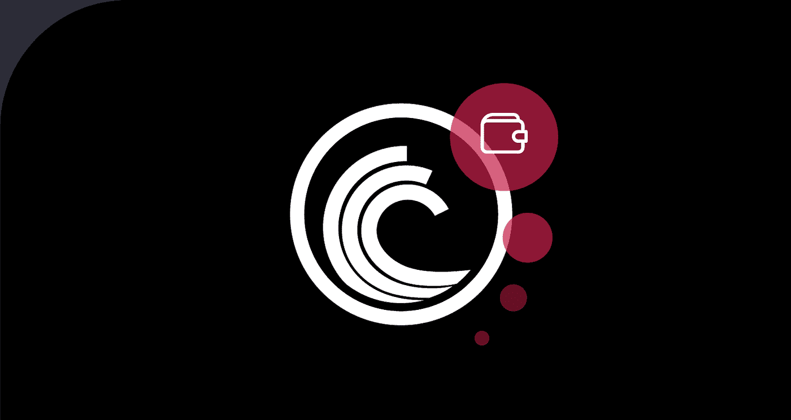
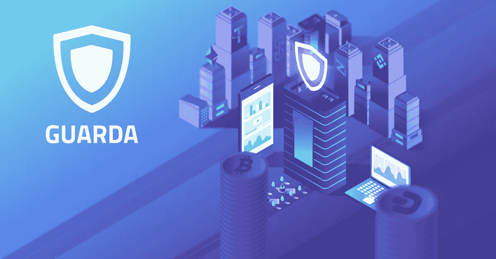
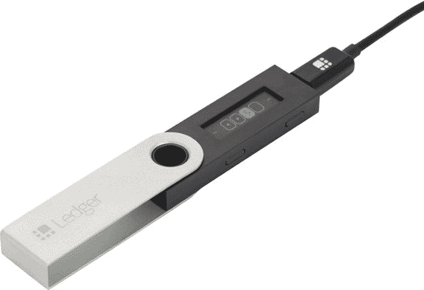
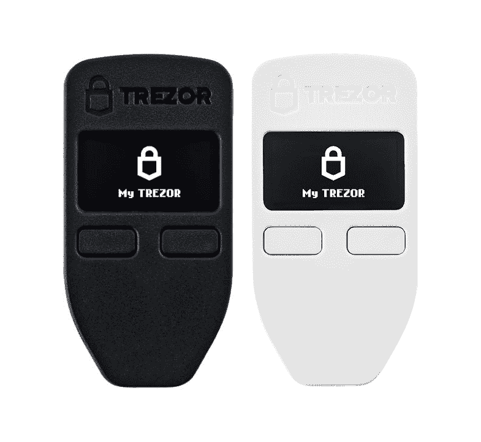

# 2021 年 4 款最佳 BitTorrent 钱包

> 原文：<https://medium.com/coinmonks/4-best-bittorrent-wallets-in-2021-e0ddfe0d6e58?source=collection_archive---------2----------------------->

自 2021 年初以来，BitTorrent token 增长了近 900%，许多加密投资者正在评估 BTT 的潜力，并将其添加到他们的投资组合中。BitTorrent 的另一个吸引人的特点是，TRON 每个月都会向所有 TRX 持有者进行一次 BTT 空投，并将一直持续到 2025 年。

如果你正在考虑购买 BTT，这篇文章将帮助你找到最符合你需求的钱包。如果你正在寻找一个购买 BitTorrent 令牌的地方，请查看一下 [ChangeNOW](https://changenow.io/?from=btc&to=btt) 上的费率——这是一种即时加密交换服务，在这里你可以购买拥有 200 多种加密资产的 BTT 令牌，无需注册。

 [## 2021 年 6 大最佳硬件钱包|顶级加密硬件钱包[更新]

### 最好的加密货币硬件钱包是绝对必要的。我们将在 NGRAVE、Ledger Nano X 和…

medium.com](/coinmonks/the-best-cryptocurrency-hardware-wallets-of-2020-e28b1c124069) 

# 热门钱包

# [TronLink](https://www.tronlink.org/)

TronLink 原名 TronWallet，是一个面向 TRON 生态系统的社区开发的开源钱包。是 TRON 创始人 Justin Sun 官方推荐的。TronLink 可用于主要的移动操作系统，并作为 Chrome 浏览器的扩展。

如果您想购买其他基于 TRON 的令牌或参与 TRON 生态系统，请使用 TronLink。它允许存储 TRX、TRC-10(包括 BTT)和 TRC-20 令牌。BitTorrent airdrops 是完全支持的，并且不需要最低数量的 TRX。要获得额外的 BTT，你不必冻结你的 TRX。为了赌注创(你也可以在这里做)，冻结你的硬币是必要的。

# [Guarda 钱包](https://guarda.com/)

与 TronLink 不同，Guarda Wallet 支持 45 种不同的区块链，因此您可以在那里存储您的比特币、以太坊、BitTorrent 和数百种其他硬币和代币。用内置的兑换工具互相交换，并购买新的代币，包括 BTT，就在钱包里。Guarda 有手机版、桌面版和浏览器版。支持团队全天候为您解决任何问题。

自 2020 年以来，Guarda Wallet 支持 BTT 空投计划:每月 11 日，您的余额中每 1 TRX 可累积 0.11 BTT。只需在钱包中放入至少 100 个创币，就可以通过 BTT 获得被动收入。

# 冰冷的钱包

热钱包之所以如此命名，是因为你的私人密钥存储在一个与互联网相连的设备上。冷钱包的主要部分是硬件钱包，是一种类似闪存驱动器的设备，可以离线存储您的密钥，使它们更加安全。

# [莱杰纳米斯](https://shop.ledger.com/products/ledger-nano-s)

Ledger Nano S 支持 BitTorrent 以及一千多种其他资产。购买后(目前价格为 59 美元，全球发货)，在你的电脑或手机上安装官方 GUI，用 USB 线(电脑)或蓝牙(手机)连接你的账本。莱杰还支持 BTT 空投和创赌注

# [特雷佐一号](https://shop.trezor.io/product/trezor-one-white)

Trezor 是另一个冷钱包，确保您的硬币最大限度的安全。和 Ledger 一样，你不需要它来接收你的硬币——只需要发送。Trezor One 的价格也是 59 美元，支持同样多的资产。通常，当他们的加密组合不断增长时，用户更喜欢冷钱包，他们希望以所有可能的方式保护他们的硬币——所以考虑将你的 Trezor 和账本存放在保险箱中，如果你容易丢失小东西，请特别小心。

感谢您的阅读！我们希望本指南能让您更清楚地了解 BTT 的存放位置。请随时访问 [ChangeNOW](https://changenow.io/?from=btc&to=btt) ，查看我们提供的购买 BitTorrent 代币的利率。关于 TRON 钱包的更多信息，请访问[本文](https://changenow-io.medium.com/choosing-the-best-tron-wallet-9a6be59cb487):我们正在讨论另一个社区开发的 Klever 钱包，并带来了 TRON 官方推荐的钱包列表。你也可以把你的 BTT 储存在所有这些里面。

## 也阅读

*   [埃利帕尔泰坦评论](/coinmonks/ellipal-titan-review-85e9071dd029)
*   [总账 vs 平均](https://blog.coincodecap.com/ngrave-vs-ledger)
*   [SecuX STONE 五金钱包回顾](https://blog.coincodecap.com/secux-stone-hardware-wallet-review)
*   [莱杰纳米 S vs 莱杰纳米 X](https://blog.coincodecap.com/ledger-nano-s-vs-x)
*   [n 零审核](/coinmonks/ngrave-zero-review-c465cf8307fc)
*   [n 存款与总账](https://blog.coincodecap.com/ngrave-vs-ledger)
*   [埃利帕尔泰坦评论](/coinmonks/ellipal-titan-review-85e9071dd029)
*   [莱杰纳米 S vs X](/coinmonks/ledger-nano-s-vs-x-battery-hardware-price-storage-59a6663fe3b0)