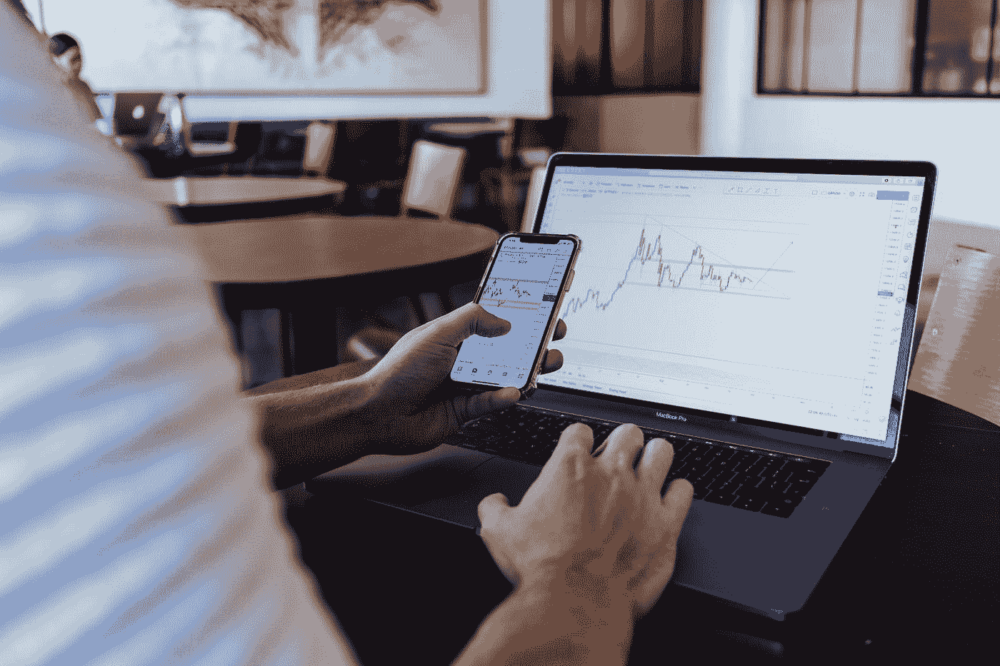

# 今天成为更好的期权交易者的 4 个简单步骤。第二部分

> 原文：<https://medium.com/coinmonks/4-easy-steps-to-become-a-better-options-trader-today-part-2-cdf3de7e5d08?source=collection_archive---------2----------------------->

## 成为更好的交易者的 4 部分系列。

Photo by [Jason Briscoe](https://unsplash.com/@jsnbrsc?utm_source=medium&utm_medium=referral) on [Unsplash](https://unsplash.com?utm_source=medium&utm_medium=referral)

# 你将学到什么

在这个 4 部分系列的结尾，你将拥有一个你可以每天使用的交易框架，这将使你成为一个更好、更有纪律的期权交易者。

第一部分可以在这里找到。

Photo by [Abby Savage](https://unsplash.com/@abbysavagecreative?utm_source=medium&utm_medium=referral) on [Unsplash](https://unsplash.com?utm_source=medium&utm_medium=referral)

# 第二步。记录你所有的交易

如果你回顾过去一年的所有交易，你能诚实地说出你为什么做这些交易吗？如果答案是否定的，作为一名交易者，你打算如何提高自己，从以前的行为中吸取教训？

答案很简单。作为一个交易者，记录你的交易有很多好处。首先，理解你为什么做某些交易是观察你的交易模式的第一步。你是根据研究、新闻事件进行交易，还是根据你在脸书看到的帖子进行交易？了解你是如何做出交易决定的，可以突出缺乏一致的交易系统，帮助引导你走向对你的交易目标有意义的交易哲学。为了变得更好，你必须知道你在做什么。这就是为什么运动员在比赛后看自己的电影，以了解他们如何在未来类似的情况下提高。

同样的事情也可以为你做；观察你的最佳交易，了解你做什么才能赢。尽可能详细地描述你到达那里的过程，然后冲洗并重复。这可能意味着坚持一个具体的百分比来获利，或者在一定的损失下退出交易。你不会完全知道你是否正在采取这些步骤，除非你致力于记录，这是致力于你的成功。

> 我的经纪人记录了我所有的交易！

Photo by [Waldemar Brandt](https://unsplash.com/@waldemarbrandt67w?utm_source=medium&utm_medium=referral) on [Unsplash](https://unsplash.com?utm_source=medium&utm_medium=referral)

这是非常正确的。你的经纪人会记录你的所有交易，并允许你随时查看。问题是，有了这些日志，你就没有了交易中人的方面的背景。当然，你可以看到你买了多少，卖了多少；然而，你能看到你进入和存在这个行业时的感觉吗？例如，你是否在阅读了《脸书邮报》关于柯达为何如此伟大以及看涨期权有多便宜的报道后，购买了柯达的看涨期权？这张交易彩票让你兴奋了吗？作为一个成功的交易者，我们想去除情绪，在寻找、执行和学习交易时变得机械。交易日志为我们做到了这一点。除此之外，在你结束交易后，如果不是所有的交易平台，大部分交易平台会把你最后的交易从仪表盘上删除。这使得你很容易掉入你经常掉入的陷阱。

# 那么我如何记录我的交易呢？

Photo by [Thought Catalog](https://unsplash.com/@thoughtcatalog?utm_source=medium&utm_medium=referral) on [Unsplash](https://unsplash.com?utm_source=medium&utm_medium=referral)

理想情况下，您的日志应该包含以下内容

*   你为什么要交易？
*   你从哪里了解到这个行业的？
*   你坚持你的交易计划了吗？
*   交易时你有什么感觉？前任，焦虑，自信，紧张？
*   你对这个行业现有策略是什么？
*   关于交易的交易记录。例如，价格，日期，罢工…

如果你是一名期权卖方，当你从交易板打开价差或裸看跌期权时，像 [Tiblio](http://tiblio.com) 这样的解决方案可以帮助记录你的交易。

Tiblio Trade Log

正如我们从上图中看到的，有一个总结行给出了你卖出的所有差价和裸卖权的顶级细节。让你快速了解你每天是怎么做的。交易日志还显示了开仓和平仓的头寸，以及每笔交易的盈利。每一行都有一个细节按钮，允许你进一步查看你所做的每一笔交易的信息。有了这些信息，你可以快速浏览并问自己，如果我需要调整的话，根据我的历史来提高我的胜率。实时查看数据消除了你可能只关注输赢的偏见，从而不会给你一个对现实的准确看法。

# 结论

记录你所有的交易，对你的交易系统和目标诚实。通过问自己诚实的问题，尽力消除交易中的情绪。对于期权差价，使用像 [Tiblio](http://tiblio.com/) 这样的系统作为你交易系统的一部分，帮助你记录你的交易，并给出你交易现实的统计数据。

# 下次

在下一期，我们将讨论自动交易决策的价值，以及如何让你成为更好的交易者。

## 放弃

交易有很高的风险。过去的结果并不代表未来的回报。我对你的交易和投资结果不承担任何责任。期权差价、策略、专栏、文章和所有其他功能的列表仅用于教育目的，不应被视为投资建议。股票观察的信息来源可靠，但我们不保证其完整性或准确性，也不保证使用该信息的任何结果。您对股票观察的使用完全由您自己承担风险，评估信息的准确性、完整性和有用性是您的唯一责任。您必须评估与您的经纪人进行的任何交易的风险，并就本文提及的任何证券或策略做出自己的独立决定。我不是财务顾问，也不提供财务建议。

## 另外，阅读

*   最好的[密码交易机器人](/coinmonks/crypto-trading-bot-c2ffce8acb2a)
*   [密码本交易平台](/coinmonks/top-10-crypto-copy-trading-platforms-for-beginners-d0c37c7d698c)
*   最好的[加密税务软件](/coinmonks/best-crypto-tax-tool-for-my-money-72d4b430816b)
*   [最佳加密交易平台](/coinmonks/the-best-crypto-trading-platforms-in-2020-the-definitive-guide-updated-c72f8b874555)
*   最佳[密码借贷平台](/coinmonks/top-5-crypto-lending-platforms-in-2020-that-you-need-to-know-a1b675cec3fa)
*   [最佳区块链分析工具](https://bitquery.io/blog/best-blockchain-analysis-tools-and-software)
*   [加密套利](/coinmonks/crypto-arbitrage-guide-how-to-make-money-as-a-beginner-62bfe5c868f6)指南:新手如何赚钱
*   最佳[加密制图工具](/coinmonks/what-are-the-best-charting-platforms-for-cryptocurrency-trading-85aade584d80)
*   [莱杰 vs 特雷佐](/coinmonks/ledger-vs-trezor-best-hardware-wallet-to-secure-cryptocurrency-22c7a3fd391e)
*   了解比特币最好的[书籍有哪些？](/coinmonks/what-are-the-best-books-to-learn-bitcoin-409aeb9aff4b)
*   [3 商业评论](/coinmonks/3commas-review-an-excellent-crypto-trading-bot-2020-1313a58bec92)
*   [AAX 交易所评论](/coinmonks/aax-exchange-review-2021-67c5ea09330c) |推荐代码、交易费用、利弊
*   [德里比特评论](/coinmonks/deribit-review-options-fees-apis-and-testnet-2ca16c4bbdb2) |选项、费用、API 和测试网
*   [FTX 密码交易所评论](/coinmonks/ftx-crypto-exchange-review-53664ac1198f)
*   [n 零审核](/coinmonks/ngrave-zero-review-c465cf8307fc)
*   [Bybit 交换评论](/coinmonks/bybit-exchange-review-dbd570019b71)
*   [3Commas vs Cryptohopper](/coinmonks/cryptohopper-vs-3commas-vs-shrimpy-a2c16095b8fe)
*   最好的比特币[硬件钱包](/coinmonks/the-best-cryptocurrency-hardware-wallets-of-2020-e28b1c124069?source=friends_link&sk=324dd9ff8556ab578d71e7ad7658ad7c)
*   最佳 [monero 钱包](https://blog.coincodecap.com/best-monero-wallets)
*   [莱杰纳诺 s vs x](https://blog.coincodecap.com/ledger-nano-s-vs-x)
*   [bits gap vs 3 commas vs quad ency](https://blog.coincodecap.com/bitsgap-3commas-quadency)
*   [莱杰纳米 S vs 特雷佐 one vs 特雷佐 T vs 莱杰纳米 X](https://blog.coincodecap.com/ledger-nano-s-vs-trezor-one-ledger-nano-x-trezor-t)
*   [block fi vs Celsius](/coinmonks/blockfi-vs-celsius-vs-hodlnaut-8a1cc8c26630)vs Hodlnaut
*   [Bitsgap 评论](/coinmonks/bitsgap-review-a-crypto-trading-bot-that-makes-easy-money-a5d88a336df2)——一个轻松赚钱的加密交易机器人
*   为专业人士设计的加密交易机器人
*   [PrimeXBT 审查](/coinmonks/primexbt-review-88e0815be858) |杠杆交易、费用和交易
*   [埃利帕尔泰坦评论](/coinmonks/ellipal-titan-review-85e9071dd029)
*   [SecuX Stone 评论](https://blog.coincodecap.com/secux-stone-hardware-wallet-review)
*   [BlockFi 评论](/coinmonks/blockfi-review-53096053c097) |从您的密码中赚取高达 8.6%的利息