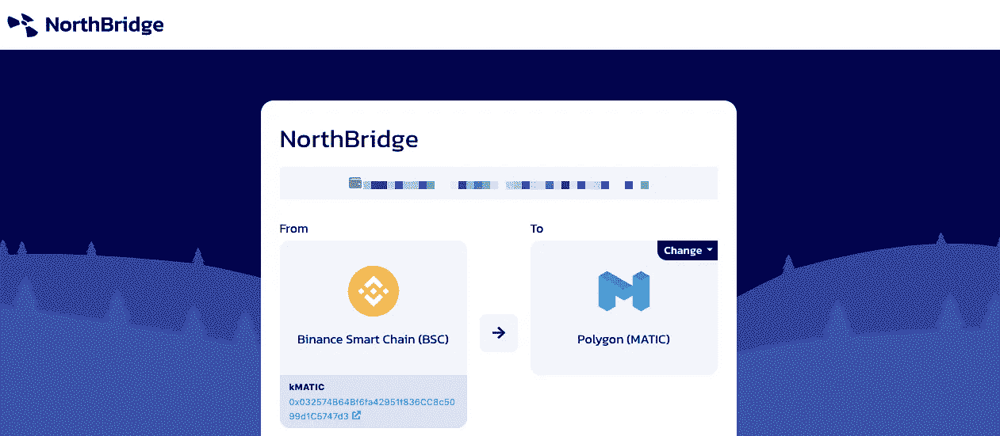
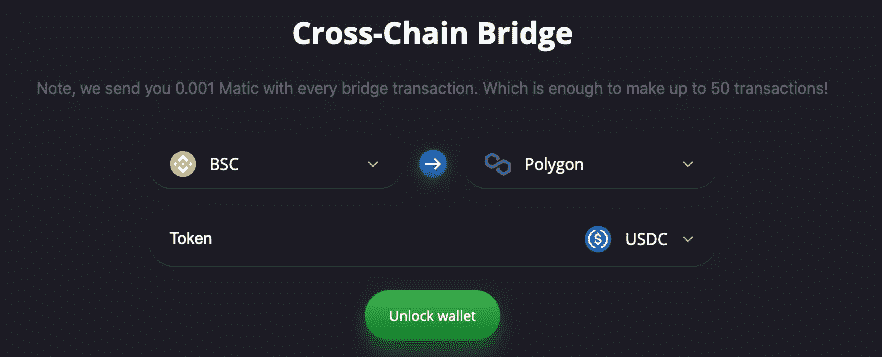
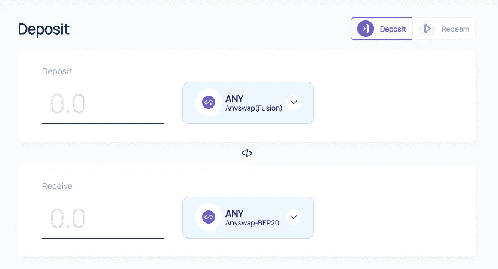
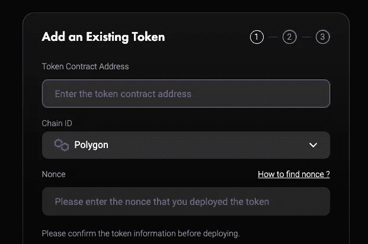

# 4 高流动性多边形桥

> 原文：<https://medium.com/coinmonks/4-high-liquidity-polygon-bridge-2fb2c445549f?source=collection_archive---------0----------------------->

## Polygon 实际上是一个第二层扩展解决方案，其主要目标是向以太坊平台传送大规模适应。Polygon 以其多链生态系统为以太坊带来了第二层可扩展性。它极大地提高了 Matic 网络的整体效率和工作方式。主要目标是创建越来越多的可伸缩性解决方案。

Photo by [Cody Hiscox](https://unsplash.com/@codyhiscox?utm_source=medium&utm_medium=referral) on [Unsplash](https://unsplash.com?utm_source=medium&utm_medium=referral)

流动性桥梁是分散式桥梁平台开始应用时需要做的第一件事。它有助于在进行交易时保持风险水平。

在这里，我们将介绍五大流动性多边形桥梁服务，它们在流动性方面提供的服务和功能都是一流的。

# 北桥

[NorthBridge](http://northbridge.link/) 是跨链桥接工具，帮助您通过区块链网络发送令牌。它支持币安智能链、多边形(MATIC)和 BITKUB。北桥旨在解决流动性耗尽的问题。

在北桥，他们通过创建一个产量农场来解决这个问题，这样其他农民就可以帮助提供流动性并获得一部分互换费。

# Evodefi

[EvoDefi](https://bridge.evodefi.com/?token=USDC?ref=EwxAPVlE0puZWJnnxporIpPO9vEbJaC5OQ) 是一个基于 BSC 和 Polygon 的产量农场平台，允许用户通过升级 NFT 来提高他们的农业效率。它采用了一种独特的功能，称为基于价格的演进令牌发射方法。这种应用的方法将使它能够保持和稳定其本地令牌的价格。这是第一个引入强有力的通货紧缩机制的农场。它使我们能够用 EVOdefi 桥在 BSC &多边形之间传送 GENX、USDC & ETH。

EvoDefo 似乎也迁移到了 v2，这是一种多边形网络技术。这样，他们可以跟踪新的农场/金库。现在，他们在下拉框中提供了两个选项(v2)。他们仍然提供 v1 选项，这样用户仍然可以看到他们是否有任何需要迁移的资产。

 [## 🧬 Evodefi -币安智能链的下一代产量农场。

### 第一个稳定的进化农场，每块硬币弹性发射。通过产量创收农业、熔、贸易…

bridge.evodefi.com](https://bridge.evodefi.com/?token=USDC?ref=EwxAPVlE0puZWJnnxporIpPO9vEbJaC5OQ) 

## 任意交换

Anyswap 是一个分散的跨链交换协议应用程序，运行在 [Fusion](http://fusion.org/) 、[币安智能链](https://www.binance.org/en/smartChain)、[以太坊](https://ethereum.org/)和 [Fantom](https://fantom.foundation/) 区块链上。它在异构的第 1 层平台之间架起了资产的桥梁，并促进了跨链交换。这款分散式应用基于融合 DCRM 技术，利用自动定价和流动性系统的力量。它提供了一个分散的跨链桥，使用户能够以分散的方式将任何硬币存入协议和薄荷包装的令牌。

它使用户能够使用跨链交换功能立即从一个硬币交换到另一个硬币。它提供程序化的定价和流动性，以便流动性提供者可以将流动性添加到互换对中或从中提取。

 [## AnySwap -交叉链索引

### 编辑描述

任意交换](https://anyswap.exchange/bridge) 

## 链锯

ChainSwap 是一个分散的跨链资产桥&所有智能链的应用程序中心。它使 DeFi 项目能够在区块链之间无缝衔接。它的主要组件是资产、应用程序、代理和中介链。它旨在创建一个适用于多个跨链互换环境的多链和多资产解决方案。

它为跨链应用提供了链之间的单一连接。中间链支持跨链功能。这将使已部署的项目能够利用所有底层链的访问能力。

 [## 链锯

### 跨链资产交换支持多个链，具有流动性桥和铸造和燃烧桥

exchange.chainswap.com](https://exchange.chainswap.com/deploy) 

## 也阅读

 [## 最佳免费加密交易机器人——前 16 名比特币交易机器人[2021]

### 2021 年币安、比特币基地、库币和其他密码交易所的最佳密码交易机器人。四进制，位间隙…

medium.com](/coinmonks/crypto-trading-bot-c2ffce8acb2a)  [## 最佳 6 个加密交易信号电报通道

### 这是乏味的找到正确的加密交易信号提供商。因此，在本文中，我们将讨论最好的…

medium.com](/coinmonks/best-crypto-signals-telegram-5785cdbc4b2b)  [## BlockFi 评论 2021 —通过您的加密获得 8.6%的利率

### 让你的密码发挥作用，获得比特币和其他加密货币的最佳利率

medium.com](/coinmonks/blockfi-review-53096053c097) 

> 加入 [Coinmonks 电报频道](https://t.me/coincodecap)，了解加密交易和投资

## 另外，阅读

*   [什么是融资融券交易](https://blog.coincodecap.com/margin-trading) | [成本平均法](https://blog.coincodecap.com/dca)
*   [BigONE 交易所点评](/coinmonks/bigone-exchange-review-64705d85a1d4) | [电网交易 Bot](https://blog.coincodecap.com/grid-trading)
*   [3 商业评论](/coinmonks/3commas-review-an-excellent-crypto-trading-bot-2020-1313a58bec92) | [Pionex 评论](/coinmonks/pionex-review-exchange-with-crypto-trading-bot-1e459d0191ea) | [Coinrule 评论](/coinmonks/coinrule-review-2021-a-beginner-friendly-crypto-trading-bot-daf0504848ba)
*   [莱杰 vs n rave](/coinmonks/ledger-vs-ngrave-zero-7e40f0c1d694)|[莱杰 nano s vs x](/coinmonks/ledger-nano-s-vs-x-battery-hardware-price-storage-59a6663fe3b0) | [币安评论](/coinmonks/binance-review-ee10d3bf3b6e)
*   [by bit Exchange Review](/coinmonks/bybit-exchange-review-dbd570019b71)|[bit yard Review](/coinmonks/bityard-review-7d104239be35)|[coin spot Review](https://blog.coincodecap.com/coinspot-review)
*   [3 commas vs crypto hopper](/coinmonks/3commas-vs-pionex-vs-cryptohopper-best-crypto-bot-6a98d2baa203)|[赚取加密利息](/coinmonks/earn-crypto-interest-b10b810fdda3)
*   最好的比特币[硬件钱包](/coinmonks/the-best-cryptocurrency-hardware-wallets-of-2020-e28b1c124069?source=friends_link&sk=324dd9ff8556ab578d71e7ad7658ad7c) | [BitBox02 回顾](/coinmonks/bitbox02-review-your-swiss-bitcoin-hardware-wallet-c36c88fff29)
*   [BlockFi vs 摄氏度](/coinmonks/blockfi-vs-celsius-vs-hodlnaut-8a1cc8c26630) | [Hodlnaut 审核](/coinmonks/hodlnaut-review-best-way-to-hodl-is-to-earn-interest-on-your-bitcoin-6658a8c19edf) | [KuCoin 审核](https://blog.coincodecap.com/kucoin-review)
*   [Bitsgap 审查](/coinmonks/bitsgap-review-a-crypto-trading-bot-that-makes-easy-money-a5d88a336df2) | [Quadency 审查](/coinmonks/quadency-review-a-crypto-trading-automation-platform-3068eaa374e1) | [Bitbns 审查](/coinmonks/bitbns-review-38256a07e161)
*   [密码本交易平台](/coinmonks/top-10-crypto-copy-trading-platforms-for-beginners-d0c37c7d698c) | [Coinmama 评论](/coinmonks/coinmama-review-ace5641bde6e)
*   [印度的加密交易所](/coinmonks/bitcoin-exchange-in-india-7f1fe79715c9) | [比特币储蓄账户](/coinmonks/bitcoin-savings-account-e65b13f92451)
*   [CoinDCX 点评](/coinmonks/coindcx-review-8444db3621a2) | [加密保证金交易交易所](https://blog.coincodecap.com/crypto-margin-trading-exchanges)
*   [CoinLoan 评论](/coinmonks/coinloan-review-18128b9badc4) | [YouHodler 评论](/coinmonks/youhodler-4-easy-ways-to-make-money-98969b9689f2) | [BlockFi 评论](/coinmonks/blockfi-review-53096053c097)
*   最好的[加密税务软件](/coinmonks/best-crypto-tax-tool-for-my-money-72d4b430816b) | [CoinTracking 评论](/coinmonks/cointracking-review-a-reliable-cryptocurrency-tax-software-5114e3eb5737)
*   [Stackedinvest 评论](https://blog.coincodecap.com/stackedinvest-review) | [北海巨妖评论](/coinmonks/kraken-review-6165fc1056ac) | [期货交易机器人](/coinmonks/futures-trading-bots-5a282ccee3f5)
*   最佳[加密借贷平台](/coinmonks/top-5-crypto-lending-platforms-in-2020-that-you-need-to-know-a1b675cec3fa) | [杠杆代币](/coinmonks/leveraged-token-3f5257808b22)
*   最佳[加密制图工具](/coinmonks/what-are-the-best-charting-platforms-for-cryptocurrency-trading-85aade584d80) | [最佳加密交易所](/coinmonks/crypto-exchange-dd2f9d6f3769)
*   [比特币基地机器人](/coinmonks/coinbase-bots-ac6359e897f3) | [俱吠罗评论](/coinmonks/coinswitch-kuber-review-1a8dc5c7a739)
*   [如何在印度购买比特币？](/coinmonks/buy-bitcoin-in-india-feb50ddfef94) | [瓦济克斯审查](/coinmonks/wazirx-review-5c811b074f5b)
*   [CryptoHopper 替代品](/coinmonks/cryptohopper-alternatives-d67287b16d27) | [HitBTC 评论](/coinmonks/hitbtc-review-c5143c5d53c2) | [Kucoin 交易机器人](/coinmonks/kucoin-trading-bot-automate-your-trades-8cf0ca2138e0)
*   [WazirX vs CoinDCX vs bit bns](/coinmonks/wazirx-vs-coindcx-vs-bitbns-149f4f19a2f1)|[block fi vs coin loan vs Nexo](/coinmonks/blockfi-vs-coinloan-vs-nexo-cb624635230d)
*   [本地比特币审核](/coinmonks/localbitcoins-review-6cc001c6ed56) | [加密货币储蓄账户](https://blog.coincodecap.com/cryptocurrency-savings-accounts)
*   [比特币基地评论](/coinmonks/coinbase-review-6ef4e0f56064) | [德里比特评论](/coinmonks/deribit-review-options-fees-apis-and-testnet-2ca16c4bbdb2) | [FTX 评论](/coinmonks/ftx-crypto-exchange-review-53664ac1198f) | [StealthEX 评论](/coinmonks/stealthex-review-396c67309988)
*   [n 平均零点评审](/coinmonks/ngrave-zero-review-c465cf8307fc) | [Phemex 评审](/coinmonks/phemex-review-4cfba0b49e28) | [PrimeXBT 评审](/coinmonks/primexbt-review-88e0815be858)
*   最佳[区块链分析](https://bitquery.io/blog/best-blockchain-analysis-tools-and-software)工具| [赚比特币](/coinmonks/earn-bitcoin-6e8bd3c592d9) | [Swapzone 评论](/coinmonks/swapzone-review-crypto-exchange-data-aggregator-e0ad78e55ed7)
*   [加密套利](/coinmonks/crypto-arbitrage-guide-how-to-make-money-as-a-beginner-62bfe5c868f6)指南| [如何做空比特币](/coinmonks/how-to-short-bitcoin-568a2d0b4ae5) | [Prokey 回顾](/coinmonks/prokey-review-26611173c13c)
*   [币安交易机器人](/coinmonks/binance-trading-bots-d0d57bb62c4c) | [OKEx 审查](/coinmonks/okex-review-6b369304110f) | [Atani 审查](https://blog.coincodecap.com/atani-review)
*   [最佳加密交易信号电报](/coinmonks/best-crypto-signals-telegram-5785cdbc4b2b) | [MoonXBT 评论](/coinmonks/moonxbt-review-6e4ab26d037)
*   [Godex.io 审核](/coinmonks/godex-io-review-7366086519fb) | [邀请审核](/coinmonks/invity-review-70f3030c0502) | [BitForex 审核](/coinmonks/bitforex-review-c4bb28d9e271)