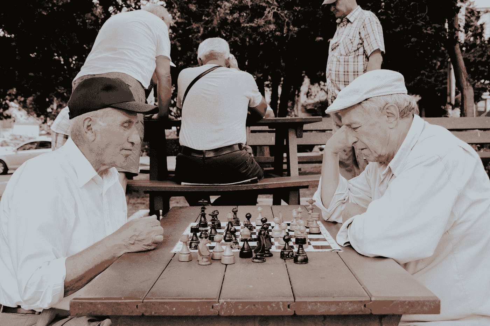

# 波尔卡多特中让我震惊的 4 个博弈论实例

> 原文：<https://medium.com/coinmonks/4-instances-of-game-theory-in-polkadot-that-blew-me-away-33610cf433f2?source=collection_archive---------1----------------------->

## 波尔卡多特为什么值得关注

Photo by [Vlad Sargu](https://unsplash.com/@vladsargu?utm_source=medium&utm_medium=referral) on [Unsplash](https://unsplash.com?utm_source=medium&utm_medium=referral)

第一次偶然发现 Polkadot 的时候，我觉得不值得关注。但是有一天，无聊到无事可做，我开始深入了解这个项目。我读了白皮书，看了 youtube 视频，还看了维基百科。我对这项技术及其背后的愿景印象深刻。但是…