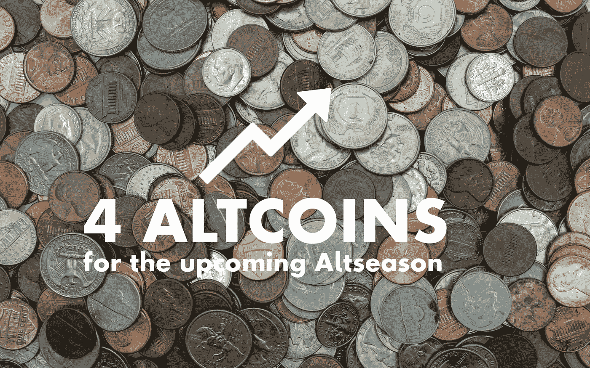

# 即将到来的牛市 4 个有前途的替代硬币

> 原文：<https://medium.com/coinmonks/4-promising-altcoins-for-the-upcoming-bull-run-7465b0aa1ab9?source=collection_archive---------2----------------------->

ALTSEASON?!??!?!?!???!?!? — Photo by [Michael Longmire](https://unsplash.com/@f7photo?utm_source=unsplash&utm_medium=referral&utm_content=creditCopyText) on [Unsplash](https://unsplash.com/s/photos/coins?utm_source=unsplash&utm_medium=referral&utm_content=creditCopyText), edited by the author

**许多代用币目前都在经历两位数甚至三位数百分比的增长**。分析师和交易员已经在期待一个新的“替代硬币季节”——换句话说，在牛市中的一个阶段，除了[比特币](/coinmonks/bitcoin-vs-bitcoin-cash-what-should-you-buy-16a809e83349)之外的替代加密货币经历**高于平均水平的增长**。例如，全职交易员米歇尔·范·德·波普评论道: